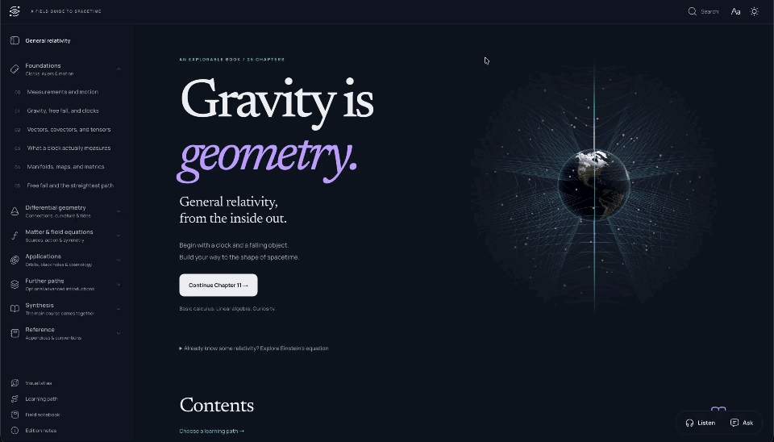

[](https://neovand.github.io/general-relativity/)

# General Relativity, From the Inside Out

**An explorable textbook with interactive laboratories and an AI companion you can talk to.**

Start with a moving cart and a clock. Work toward curved spacetime, black holes,
and the expanding universe. Along the way, change an experiment, follow a
derivation, or ask a question about the passage in front of you.

**[Read the book →](https://neovand.github.io/general-relativity/)** ·
[Choose a learning path](https://neovand.github.io/general-relativity/course-map.html) ·
[Browse the visual atlas](https://neovand.github.io/general-relativity/figure-atlas.html)

## SvelteKit rebuild

The new reader lives in [`app/`](app/README.md), alongside the original app.
It includes a floating study companion, a compact continuous-audio player,
TypeScript state and provider layers, and the existing book and laboratories.

```sh
npm ci
npm --prefix app ci
npm run dev:v2
```

Open http://127.0.0.1:5173/chapter-0.html. See the [rebuild guide](app/README.md)
for architecture, tests, and the remaining laboratory migration boundary.
The published site still uses the original build until a separate cutover.

## Learn by changing something

The laboratories connect mathematical quantities to things you can manipulate
and measure. Move a point, rotate a surface, change a flow, or compare two
observers—and follow the corresponding changes in the diagram and readouts.

| Explore | Try this |
| --- | --- |
| [Motion and energy](https://neovand.github.io/general-relativity/chapter-0.html#spring-energy-exchange) | Follow a cart and spring as energy moves between kinetic and potential forms. |
| [Polar coordinates](https://neovand.github.io/general-relativity/chapter-4.html#polar-coordinates) | Locate the same point with two coordinate systems; see how an angular step becomes a physical distance. |
| [Vector fields](https://neovand.github.io/general-relativity/chapter-6.html#vector-field-comparison) | Compare neighboring arrows and separate a change in the field from a change in the coordinate basis. |
| [Parallel transport](https://neovand.github.io/general-relativity/chapter-7.html#parallel-transport-lab) | Carry an arrow around a plane, a rolled sheet, and a sphere. Compare its starting and returning directions. |
| [Energy, momentum, and stress](https://neovand.github.io/general-relativity/chapter-11.html#particle-momentum-lab) | Measure particle crossings, discover pressure without bulk motion, and explore how fluid layers exchange momentum. |
| [Stellar structure](https://neovand.github.io/general-relativity/chapter-17.html#lab-star) | Build a spherical model star outward from its center and investigate its mass and radius. |
| [Cosmological distances](https://neovand.github.io/general-relativity/chapter-19.html#lab-distances) | Change the expansion parameters and compare what different distance measurements mean. |

The reader also includes worked exercises, prerequisite links, checkpoints,
light and dark themes, and a local field notebook. Save observations with
experiment settings, export your notes, and return to a saved configuration.
**Reading, laboratories, and the notebook work without API keys.**

## Read, listen, and talk it through

The study companion stays with you as you move between chapters. Its context
includes the current passage, nearby explanations, and supported experiments’
actual settings.

- **Speech-to-speech (S2S) AI tutoring.** Have a live voice conversation through
  OpenAI Realtime. Ask about the diagram you are exploring or the step you are
  reading. The voice assistant can consult the text tutor for physics
  explanations, find relevant passages, and navigate to and highlight them.
- **Text-to-speech (TTS) narration.** ElevenLabs reads chapters and selected
  passages with synchronized word highlighting and spoken captions. Equations
  and figures have dedicated verbal explanations. Inspect or edit those
  explanations, choose a voice, adjust playback speed, and replay cached audio.
- **A shared listening experience.** Pause narration to ask a question, then
  resume where you left off within the session. Chapter navigation preserves
  the audio player and active voice conversation. A typed tutor is available too.

### Connect your own accounts

1. Open **Listen** or **Ask**, then **Connections**.
2. Add your OpenAI key for tutoring and generated spoken explanations. Add an
   ElevenLabs key and choose a narrator for TTS.
3. Start listening, type a question, or start a voice conversation.

On desktop, playback stays in the navbar. Hold **⌘ + Shift + Space** (macOS) or
**Ctrl + Shift + Space** to pause and ask about the exact moment you were hearing.
Release to send; ask to continue to resume that reading. You can change or disable
the shortcut in **Connections**.

Provider requests use your own accounts and their usage limits. Keys stay in
tab-scoped browser storage by default; remembering them on the device is
optional. Requests go directly to the providers, with no shared application
key or project backend. AI-generated explanations can be inspected and revised;
they are distinct from the authored book text.

See the [study companion guide](docs/study-companion.md) for setup, key storage,
narration behavior, and the voice-to-narrator handoff.

## From foundations to advanced GR

The HTML book contains **25 chapters and five appendices**. Its intended entry
point is basic calculus and linear algebra, with preparation in mechanics and
multivariable calculus developed along the way.

The main sequence covers measurements and motion, special relativity, tensors,
manifolds, connections, curvature, stress–energy, Einstein’s equation,
Lagrangian and Hamiltonian mechanics, observational tests, black holes,
gravitational waves, and cosmology. Further chapters explore initial data and
numerical relativity, differential forms, focusing and thermodynamics, and
gravity as an effective theory. The appendices provide exercises, reference
material, a glossary, further reading, and index practice.

You can follow the book in order or use the
[core, geometry, and black-hole learning routes](https://neovand.github.io/general-relativity/course-map.html).

**The project is under active development.** The aim is a self-contained route
from the prerequisites to advanced GR. Some teaching gaps and visualizations
remain, including the stationary-action redesign, exterior-calculus visuals,
and a fuller treatment of Penrose diagrams. The
[completion ledger](docs/implementation-progress.md) records what has shipped
and what still needs work.

## Run locally

Use **Node.js 24** and **Python 3.12 or later**. The HTML edition needs no TeX
installation and no API keys to build.

```sh
git clone https://github.com/NeoVand/general-relativity.git
cd general-relativity
npm ci
npm run build
npm run serve
```

Open **[localhost:4173](http://localhost:4173/)**. Generated files go into `site/`,
which is excluded from Git. After changing the manuscript or reader code,
`npm run build:app` rebuilds only the Svelte reader after changes in `src/` (typically under a second). `npm run build:reader` rebuilds the book and reading index using existing figures. Use the full build when changing generated figures, then refresh the browser.

### How it is built

The book is static HTML with a **Svelte 5 + Vite** reading companion.
**Three.js** powers the spatial experiments; SVG and canvas support the other
visuals. **KaTeX** renders book equations with MathML, and **MathJax** typesets
mathematical labels in generated SVG figures. Fonts and reading assets are
served with the book. The main text remains readable without JavaScript.

| Location | Purpose |
| --- | --- |
| [book.md](book.md) | Canonical manuscript. |
| [content/](content/) | Chapter guides, learning routes, worked lessons, exercises, and figure math. |
| [web/](web/) | Laboratory models, interactive scenes, reading styles, and browser behavior. |
| [src/](src/) | Svelte reader, AI tutor, voice transport, narration, and local storage. |
| [scripts/](scripts/) | Site generation, reproducible figures, and verification. |
| [assets/](assets/) | Figures, fonts, imagery, and third-party notices. |
| [docs/](docs/) | Architecture, scientific and visual reviews, and development plans. |

### Check your changes

With the local server running, these commands cover the main reader and voice
integration checks:

```sh
npm test
npm run check
npx playwright install chromium
npm run test:browser
npm run test:figures
npm run test:study
```

Individual lab suites include `npm run test:mechanics`,
`npm run test:parallel-transport`, `npm run test:particle-flow`, and
`npm run test:fluid-shear`. Reports and screenshots are written to `qa/`.
Voice tests mock the provider boundary; evaluating live speech quality requires
connected provider accounts.

Run `npm run check` and `npm run test:all` locally before pushing. These checks cover mathematical calibration, rendered equations, links, figure labels, responsive layouts, keyboard controls, saved-state recovery, and narration. The [GitHub Actions workflow](.github/workflows/pages.yml) builds and publishes successful `main` builds to GitHub Pages without repeating the browser test suite. Human scientific and teaching review remains essential.

## Help make the book better

A useful issue can be as small as “this symbol appears before it is explained.”
For a teaching problem, include the chapter, passage, and missing step. For a
visual bug, include the lab, control settings, theme, and screen size.
[Open an issue](https://github.com/NeoVand/general-relativity/issues) or propose
a focused pull request.

When adding a laboratory, develop its explanation alongside the visual. State
the model, units, and assumptions; check the calculation independently; and
inspect labels and controls in both themes and at narrow and wide widths.
The [design system](docs/design-system.md) and
[visual-development plan](docs/visual-development-plan-2026-09-09.md) describe
the intended direction.

## Credits and edition notes

Parts of the voice and narration integration are adapted from Voicebook, with
its [MIT license preserved](vendor/voicebook/LICENSE). See the
[bundled software and font notices](assets/vendor-notices.md) and
[edition credits](content/credits.md) for other dependencies, imagery, and
visualization sources.

The LaTeX sources and PDF under `dist/` belong to an earlier print edition.
They have not been updated with the current revisions. **The HTML book is the
current reading edition.**
