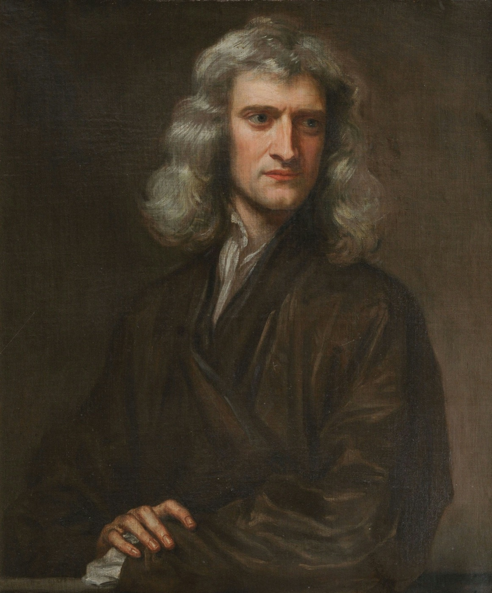
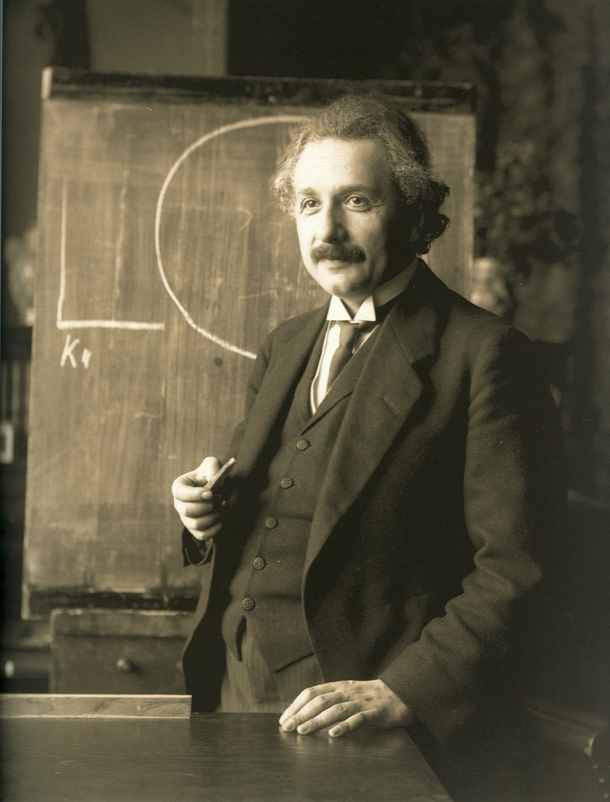
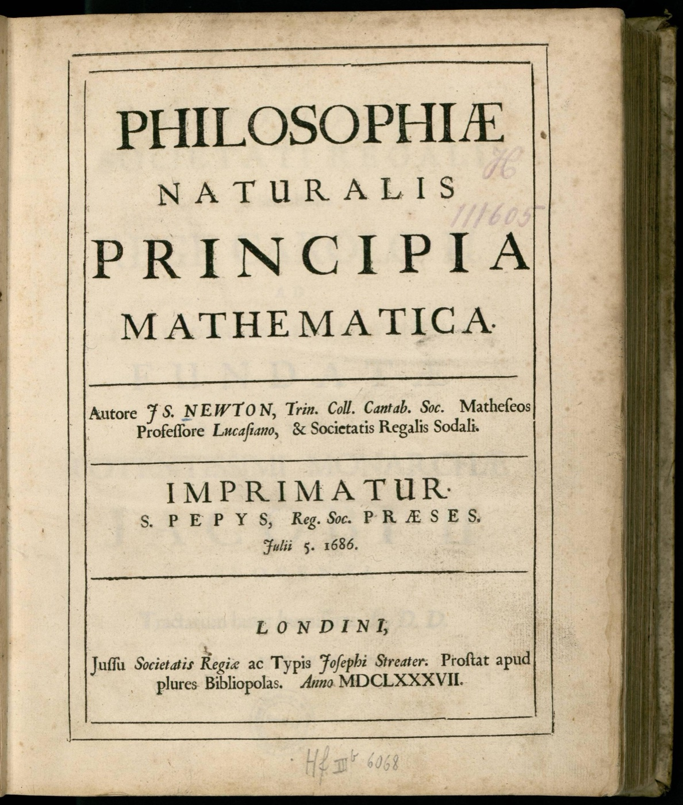
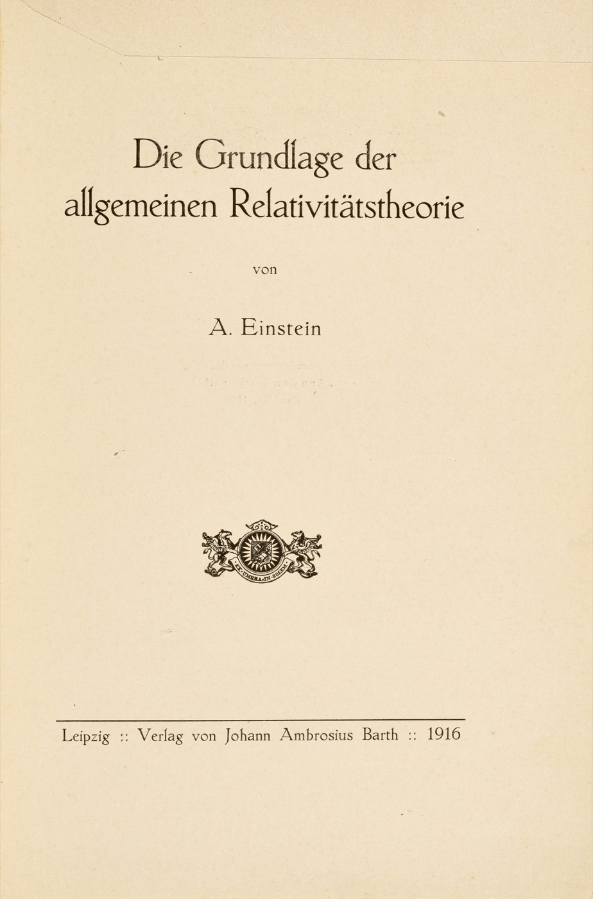

# General Relativity, From the Inside Out

### A guided expedition from clocks and vectors to the Einstein–Hilbert action, black holes, and the modern theory of spacetime

**For a reader with basic calculus and linear algebra.** Chapter 0 builds the needed mechanics, partial derivatives, differential equations, and flux accounting. You do not need a prior course in physics or relativity. Everything specifically geometric—manifolds, covectors, connections, covariant derivatives, curvature, and metric variations—is developed here. Some later sections introduce graduate-level ideas, but the conceptual staircase remains visible.

The destination is this equation:

$$
\boxed{R_{\mu\nu}-\frac12 Rg_{\mu\nu}+\Lambda g_{\mu\nu}
=\frac{8\pi G_N}{c^4}T_{\mu\nu}.}
$$

The goal is much more interesting than memorizing it. By the end, you should be able to explain why ordinary derivatives need repairing, what a connection actually compares, how curvature survives a change of coordinates, what pressure has to do with gravity, why the coefficient of $Rg_{\mu\nu}$ is exactly $-1/2$, and how a single action produces the entire field equation.

You should also be able to recognize several seductive mistakes before they recognize you.

## How to travel through this book

Read with a pencil and occasionally stop before the next displayed equation. Predict its indices, its dimensions, or its sign. Understanding is much easier to counterfeit while reading than while predicting.

Begin with Chapter 0 if mechanics or multivariable calculus is unfamiliar. Use its five checks to decide which refreshers you need. The recommended course runs through Chapters 0–19 and finishes with Chapter 24. Chapters 20–23 are optional deeper trails; their introductions explain the physical questions and identify additional mathematical or quantum input. Chapter 24 is the main course's synthesis, not an optional prerequisite for those trails.

| Route | Read | What it builds |
|---|---|---|
| The main course | Chapters 0–19, then 24; add 20–23 when their questions interest you | A connected foundation, applications, and a final metric-to-measurement calculation |
| The equation route | Chapter 0's checks, then Chapters 1–15 and 24 | The meaning of every term and the action derivation; Chapter 1 supplies the motivation |
| The applications route | Chapters 0–12, then 15–19 and 24; return to 13–14 for the full action derivation | Clocks, tides, matter, black holes, waves, and cosmology with their tensor and curvature prerequisites intact |

For the applications route, the opening action argument in §15.2 may be read as a preview; §15.4's symmetry and conserved-current calculation is the immediate tool for later applications. A shorter tour through Chapters 1, 3–5, and 16–19 can give you the physical questions, but it skips mathematical dependencies. Treat that as a preview, not as a promise that every displayed calculation will already be within reach.

Do some exercises while the corresponding ideas are fresh rather than saving all of Appendix A for the end. After Chapter 2, try A.1; after Chapter 4, A.2; after Chapter 7, A.4 and A.6; after Chapter 10, A.9. Each problem asks you to use an operation, which is a stronger check than recognizing its finished formula.

**Analogies are scaffolding.** A good analogy reveals a relationship. It does not provide a license to import every feature of the familiar object. When we use a rubber sheet, an accountant, a map, a neighboring laboratory, or a rotating compass, we will say where the comparison breaks.

**“Derive” has several meanings.** We can derive a consequence from assumptions, derive an equation from a chosen action, or motivate why that action is a good low-energy model. These are different accomplishments. General relativity is not forced on us by pure logic or by the equivalence principle alone. Its assumptions must meet experiment.

**About the sources.** The explanations, analogies, and worked calculations are written as an independent tutorial. Links identify historical evidence, research results, and places to pursue particular ideas; the book is not a paraphrase of a single textbook. The final reading guide distinguishes foundational notes from original research. Exact contemporary parameter estimates and speculative claims are deliberately unnecessary to the main argument.

## Conventions: the treaty that prevents a thousand sign wars

Different excellent books use different signs. A disagreement in notation need not be a disagreement about nature. This book keeps the following treaty throughout.

| Symbol or convention | Meaning |
|---|---|
| Metric signature | $(-,+,+,+)$ |
| Coordinates | $x^\mu=(ct,x,y,z)$ when using standard SI component formulas; special charts explicitly say when they use $t$ |
| Indices | Greek $\mu,\nu,\ldots=0,1,2,3$; spatial Latin $i,j,\ldots=1,2,3$ |
| Summation | A repeated upper–lower pair is summed unless stated otherwise |
| $g_{\mu\nu}$ and $g^{\mu\nu}$ | Metric matrix and its inverse, not componentwise reciprocals |
| $g$ | $\det(g_{\mu\nu})$, negative for a nondegenerate Lorentzian metric in four dimensions |
| $G_N$ | Newton's gravitational constant |
| $G_{\mu\nu}$ | Einstein tensor, $R_{\mu\nu}-\tfrac12Rg_{\mu\nu}$ |
| $\epsilon$ | Rest-frame energy density, in joules per cubic metre |
| $\rho$ | Mass-equivalent density $\epsilon/c^2$, when that notation is used |
| $p$ | Pressure; it has the same dimensions as energy density |
| $u^\mu$ | Four-velocity $dx^\mu/d\tau$, with $u^\mu u_\mu=-c^2$ |
| $\Lambda$ | Cosmological constant, with dimensions inverse length squared |
| Natural units | A section using $c=1$ says so; powers of $c$ return for physical numerical results |

Our curvature convention is

$$
R^\rho{}_{\sigma\mu\nu}
=\partial_\mu\Gamma^\rho{}_{\nu\sigma}
-\partial_\nu\Gamma^\rho{}_{\mu\sigma}
+\Gamma^\rho{}_{\mu\lambda}\Gamma^\lambda{}_{\nu\sigma}
-\Gamma^\rho{}_{\nu\lambda}\Gamma^\lambda{}_{\mu\sigma},
$$

with

$$
[\nabla_\mu,\nabla_\nu]V^\rho
=R^\rho{}_{\sigma\mu\nu}V^\sigma,
\qquad
R_{\mu\nu}=R^\rho{}_{\mu\rho\nu}.
$$

Do not attempt to digest this on arrival. It is here so that later calculations have a definite address. With these conventions, a round two-sphere has positive scalar curvature.

The physical point-particle action is $S=-mc^2\int d\tau$. In coordinates with $x^0=ct$, our gravitational action is

$$
S_{\mathrm{EH}}=
\frac{c^3}{16\pi G_N}
\int d^4x\,\sqrt{-g}\,(R-2\Lambda),
$$

and the stress tensor is normalized by

$$
\delta S_m=-\frac{1}{2c}\int d^4x\,\sqrt{-g}\,
T_{\mu\nu}\,\delta g^{\mu\nu}.
$$

The action is called **Einstein–Hilbert**, after Einstein and David Hilbert. The determinant, inverse-metric variation, boundary terms, and factors of $c$ will all get their own explanations.

A final units trap: angular coordinates are dimensionless. In $ds^2=dr^2+r^2d\theta^2$, $g_{\theta\theta}=r^2$ has dimensions of length squared. It is the whole line element that must have the correct units, not every coordinate component separately.

## Contents

- [0. Before spacetime: the tools you already almost know](#chapter-0)
- [1. The scandal: gravity changes the measuring equipment](#chapter-1)
- [2. The mathematical survival kit: objects, components, and the art of changing your mind without changing the universe](#chapter-2)
- [3. Special relativity: learning what a clock is actually measuring](#chapter-3)
- [4. Spacetime as a manifold: maps, rulers, and the geometry beneath them](#chapter-4)
- [5. Free fall, the equivalence principle, and the worldline action](#chapter-5)
- [6. Differentiation when your measuring axes will not sit still](#chapter-6)
- [7. The connection: how neighboring laboratories compare directions](#chapter-7)
- [8. Curvature: what remains after the coordinate excuses run out](#chapter-8)
- [9. Ricci, Weyl, and Einstein: different questions asked of curvature](#chapter-9)
- [10. Tides: how to measure curvature without seeing spacetime from outside](#chapter-10)
- [11. Energy, momentum, and stress: what gravity listens to](#chapter-11)
- [12. Einstein's equation: every symbol earns its place](#chapter-12)
- [13. Variational calculus: learning to ask a whole history a question](#chapter-13)
- [14. The Einstein–Hilbert action, taken apart completely](#chapter-14)
- [15. Symmetry, conservation, vacuum energy, and the limits of slogans](#chapter-15)
- [16. Turning geometry into experiments: clocks, light, and Mercury](#chapter-16)
- [17. Black holes: when the causal structure becomes the main character](#chapter-17)
- [18. Gravitational waves: curvature can carry a message](#chapter-18)
- [19. Cosmology: Einstein's equation for the large-scale universe](#chapter-19)
- [20. Making spacetime run: initial data, constraints, and numerical relativity](#chapter-20)
- [21. A local laboratory at every point: tetrads, forms, and the gauge viewpoint](#chapter-21)
- [22. When geodesics crowd together: focusing, singularities, and black-hole thermodynamics](#chapter-22)
- [23. Einstein's equation as a low-energy masterpiece: effective theory and the frontier](#chapter-23)
- [24. Bringing the whole machine together](#chapter-24)
- [Appendix A. Thirty exercises that turn recognition into understanding](#appendix-a)
- [Appendix B. A working reference sheet](#appendix-b)
- [Appendix C. A plain-language glossary](#appendix-c)
- [Appendix D. Where to go next](#appendix-d)
- [Appendix E. Index practice and three extra calculations](#appendix-e)

---

## 0. Before spacetime: the tools you already almost know

You need basic calculus and linear algebra to begin this book. You do not need a prior course in mechanics, special relativity, differential geometry, or variational calculus. We will build the missing bridges. Later chapters reach research-level questions; understanding their physical point comes before mastering their machinery.

Here is the central question. **If a falling astronaut feels no gravity, what can a second falling astronaut measure that the first one cannot?** Their changing separation. Gravity has a locally removable part and a tidal part that survives. The book turns that observation into a theory of clocks, trajectories, and spacetime.

### 0.1 A derivative is a local prediction

Suppose a position is $x(t)=3t^2$, with $x$ in metres and $t$ in seconds. Its velocity is $v(t)=dx/dt=6t$, and its acceleration is $a(t)=d^2x/dt^2=6$. At $t=2$, the velocity is $12\,\mathrm{m/s}$. That means a small extra time $\Delta t$ changes the position by approximately $12\Delta t$ metres. A derivative predicts a small change, not a whole future.

Taylor's formula makes that prediction systematic:

$$
x(t+\Delta t)=x(t)+v(t)\Delta t+\frac12 a(t)(\Delta t)^2+\cdots.
$$

The dots stand for terms of higher order in the small increment. For this quadratic example the displayed expression is exact. For a general smooth function it is an approximation whose omitted terms shrink as the increment shrinks.

The same idea will explain local flatness. Near an event, we can simplify a metric's value and first derivatives by changing coordinates. Terms quadratic in distance still carry curvature. “Locally flat” is a statement about the order of the approximation.

### 0.2 Partial derivatives: change one input at a time

A temperature $f(x,y)=x^2+3y$ has two inputs. Its partial derivative $\partial_x f=2x$ asks how it changes if you move in $x$ while holding $y$ fixed. Its other partial derivative is $\partial_y f=3$. The symbol $\partial$ is the familiar derivative with an instruction about what to hold fixed.

If a path supplies $x=x(s)$ and $y=y(s)$, both inputs can change. The chain rule says

$$
\frac{df}{ds}=\frac{\partial f}{\partial x}\frac{dx}{ds}
+\frac{\partial f}{\partial y}\frac{dy}{ds}.
$$

Try $x=s$, $y=s^2$. Direct substitution gives $f=4s^2$, so $df/ds=8s$. The chain rule gives $(2s)(1)+(3)(2s)=8s$ too. Nothing new was hiding in the notation.

In four coordinates we abbreviate this as $df/ds=(\partial_\mu f)(dx^\mu/ds)$, summing over $\mu=0,1,2,3$. An index here is a label, not an exponent. Chapter 2 develops why this notation is more than shorthand.

### 0.3 An integral adds local measurements

Distance along a path is built by adding tiny distances. A clock does something analogous: it adds tiny amounts of its own elapsed time. In flat spacetime the result will be

$$
\tau=\int_{t_1}^{t_2}\sqrt{1-\frac{v(t)^2}{c^2}}\,dt.
$$

For now, read this as a recipe. At each time, calculate a clock-rate factor, multiply by the tiny time step, and add. The constant $c$ is the speed of light. If $v=0$ throughout, the square root is one and $\tau=t_2-t_1$. Chapter 3 derives the recipe and explains why it changes when the path changes.

An integral over a region works the same way. To add mass, sum density times a tiny physical volume: $M=\int\rho\,dV$. Coordinate rectangles do not always have equal physical size. In polar coordinates a cell has area approximately $(dr)(r\,d\theta)$, so $dA=r\,dr\,d\theta$. The extra $r$ is measuring geometry, not adding matter.

### 0.4 A differential equation needs a starting story

The equation $d^2x/dt^2=-g$ tells you the acceleration of a falling object in a uniform Newtonian field. Integrate once and then again:

$$
v(t)=v_0-gt,\qquad x(t)=x_0+v_0t-\frac12gt^2.
$$

The two constants have physical meanings: starting position $x_0$ and starting velocity $v_0$. The equation alone does not tell you whether the object was dropped, thrown up, or thrown down. A second-order equation normally needs two initial data per unknown function.

Einstein's equation is also a differential equation, now for the metric throughout spacetime. Not every proposed set of initial data is allowed: some equations are constraints. Chapter 20 explains this carefully. Keep the simpler lesson now: **a law plus starting data produces a prediction.**

### 0.5 The mechanics we will use

Momentum in slow-motion mechanics is $\mathbf p=m\mathbf v$. Force changes momentum: $\mathbf F=d\mathbf p/dt$. For constant mass this is $\mathbf F=m\mathbf a$. A force is an interaction such as a floor pushing on your shoes. Coordinate acceleration is a change in position labels; later we will distinguish it from acceleration measured by an instrument.

For a slow particle, kinetic energy is $K=mv^2/2$. Near Earth, gravitational potential energy can be written $U=mgh$, choosing zero at $h=0$. Throw a ball upward: kinetic energy decreases while potential energy increases. Ignoring air resistance, their sum remains constant.

More generally write $U=m\Phi$, where $\Phi$ is potential energy per unit mass. Outside a spherical mass $M$,

$$
\Phi(r)=-\frac{G_NM}{r},\qquad
\mathbf a=-\boldsymbol\nabla\Phi.
$$

The gradient $\boldsymbol\nabla\Phi$ is the vector of partial derivatives in Cartesian coordinates. It points toward fastest increase of $\Phi$; the minus sign makes falling objects accelerate toward decreasing potential. Differentiating gives inward acceleration of magnitude $G_NM/r^2$. Here $G_N$ is Newton's gravitational constant. This is a low-speed, weak-field description; we use it as a calibration for the relativistic theory.

Pressure is force per area. Imagine a gas repeatedly hitting a wall: each collision transfers momentum. More collisions or harder collisions mean more pressure. This makes pressure a **flow of momentum**, which explains why it belongs in the same tensor as energy. Chapter 11 supplies the precise units and entries.

### 0.6 Matrices measure pairs of arrows

You already know a dot product. For $v=(2,1)$ and $w=(1,3)$, the Euclidean result is $v\cdot w=5$. Insert a symmetric matrix between the row and column:

$$
g(v,w)=v^{\mathsf T}
\begin{pmatrix}1&0\\0&4\end{pmatrix}w
=(2)(1)+4(1)(3)=14.
$$

The matrix specifies a new measuring rule. In particular $g(v,v)=8$ is the squared length of $v$ under that rule. A metric is this kind of pair-measuring operation, supplied at every point. In spacetime the matrix has one negative direction. We will learn why that minus sign distinguishes clocks from rulers.

The inverse matrix undoes the original linear map. It is not obtained by taking the reciprocal of every entry. For example,

$$
\begin{pmatrix}2&1\\1&2\end{pmatrix}^{-1}
=\frac13\begin{pmatrix}2&-1\\-1&2\end{pmatrix}.
$$

Multiply them to check that the diagonal entries become one and the off-diagonal entries zero. This is precisely the operation denoted by $g^{\mu\nu}$ later.

### 0.7 Flux and divergence, with a box before a theorem

A field $\mathbf J$ can describe how much stuff crosses unit area per unit time. Its flux through a small surface is the normal component of $\mathbf J$ times that area. To find net outflow from a box, subtract inflow through one face from outflow through the opposite face, then add the three directions.

In a box of width $\Delta x$, the $x$ contribution is approximately $(\partial_x J^x)\Delta x\Delta y\Delta z$. Dividing total outflow by the box volume gives

$$
\boldsymbol\nabla\cdot\mathbf J
=\partial_xJ^x+\partial_yJ^y+\partial_zJ^z.
$$

This is **divergence**. Positive divergence means net outflow per volume. Conservation then reads $\partial_t\rho+\boldsymbol\nabla\cdot\mathbf J=0$: if more leaves than arrives, the amount inside falls. The divergence theorem adds this accounting over many little boxes; flows across shared internal faces cancel, leaving only the outer boundary. Curved geometry changes the volume factors, not this accounting idea.

### 0.8 Approximation is a skill, not an apology

For a small dimensionless $q$,

$$
\sqrt{1+q}\simeq1+\frac q2,\qquad
\frac{1}{1-q}\simeq1+q,\qquad e^q\simeq1+q.
$$

Each discards terms beginning at order $q^2$. For $q=0.01$, those terms are on the scale of $10^{-4}$, though the coefficient depends on the function. We will always identify what is small: $v/c$, $G_NM/(rc^2)$, a wave amplitude, or a short distance compared with a curvature scale. “Small” without a ratio is not a usable approximation.

Check dimensions before arithmetic. An equation for acceleration must have units of length/time squared on both sides. You can add energy density to pressure, because both have units $\mathrm{J/m^3}$. You cannot add mass density to pressure without the appropriate $c^2$. A dimension check often catches a mistake before a page of algebra does.

### 0.9 Your first five-minute check

Try these before revealing the answers. They test the actual prerequisites, not whether you remember physics vocabulary.

1. If $x(t)=2t^3$, what are its velocity and acceleration?

$v=6t^2$ and $a=12t$. If $t$ is in seconds and $x$ in metres, the coefficient 2 carries units $\mathrm{m/s^3}$.

2. For $f(x,y)=xy^2$, what is $df/ds$ along $x=s$, $y=2s$?

Substitution gives $f=4s^3$, so $df/ds=12s^2$. The chain rule gives $y^2(1)+2xy(2)=4s^2+8s^2$, the same result.

3. Why is a polar cell wider when it is farther from the origin?

The same angle $d\theta$ subtends arc length $r\,d\theta$. A cell's area is therefore $r\,dr\,d\theta$. Changing labels has not curved the plane.

4. Does specifying acceleration specify a unique trajectory?

No. You also need initial position and velocity. Dropping and throwing can obey the same acceleration law.

5. What is the first-order approximation to $\sqrt{1-v^2/c^2}$?

$1-v^2/(2c^2)$, when $v^2/c^2\ll1$. The expansion parameter is $v^2/c^2$, not a speed with units.

If a check was unfamiliar, revisit that one section. You do not need perfect fluency to start. Chapter 1 introduces the physical puzzle; Chapter 2 teaches the index language with explicit examples; Chapter 3 builds special relativity. The rest grows from those three foundations.

## 1. The scandal: gravity changes the measuring equipment

### 1.1 What a theory of gravity must explain

Imagine two spacecraft drifting side by side toward Earth with their engines off. Inside either craft, a released pen floats. The accelerometer reads zero. Nobody feels a downward force.

Yet the separation between the spacecraft changes. If they are side by side at the same altitude, their trajectories aim toward the same center and tend to converge. If one is directly above the other, the lower one accelerates toward Earth more strongly in the Newtonian description, and their radial separation tends to grow.

Something gravitational remains after both crews have removed the experience of weight.

That “something” is the first clue to spacetime curvature. **The most revealing local gravitational experiment compares neighboring free-fall trajectories.** A single freely falling laboratory can erase the connection coefficients at an event by choosing suitable coordinates. A family of laboratories can detect tidal effects that no coordinate change removes.

Now imagine standing on the ground. Your accelerometer reads approximately $9.8\,\mathrm{m/s^2}$. In relativistic language, the ground is preventing your natural free-fall motion. The electromagnetic forces holding the floor together push upward on you.

Your everyday intuition says the person standing still is unaccelerated and the falling person accelerates. An accelerometer says the opposite, because it measures **proper acceleration**: departure from inertial free fall, rather than the second derivative of a chosen coordinate.

This does not make Newtonian physics foolish. Near Earth's surface, Newtonian coordinates are extremely useful. It means “acceleration” has more than one meaning, and a good theory must specify which one an instrument reads.

> **First trap door:** “Gravity disappears in free fall” means the locally removable inertial–gravitational effects disappear to first order. Tidal curvature generally remains. A falling laboratory is not a universe-sized eraser.

### 1.2 The weak spot in the old division of labor

In elementary mechanics, space and time provide an arena. A particle has a trajectory through that arena. Forces change its motion. Rulers and clocks are assumed to provide the arena's fixed geometry.

Special relativity already complicates this arrangement: different observers split spacetime into “space” and “time” differently, and elapsed time depends on a worldline. But the flat spacetime metric is still prescribed.

General relativity takes the next step. The metric becomes a dynamical field.

A metric tells us the interval between infinitesimally separated events:

$$
ds^2=g_{\mu\nu}(x)\,dx^\mu dx^\nu.
$$

For a massive object's timelike trajectory, it determines the time on a clock carried with that object:

$$
d\tau^2=-\frac{ds^2}{c^2}.
$$

It also determines which directions are null, and therefore the local light cones. Those cones organize which events can influence which other events.

So when the metric becomes dynamical, gravity changes more than paths through an arena. It changes the physical structure used to assign lengths, times, and causal relations.

Think of a board game whose pieces influence the ruler used to measure each move and the clocks used to time each turn. The analogy captures mutual dependence. Its limitation is that real spacetime is not an elastic tabletop inside a larger room. The metric is an intrinsic field; an outside embedding is optional mathematical visualization, not required physics.

### 1.3 What the Einstein equation actually connects

The equation relates two tensor fields at each event.

The right-hand side describes **energy density, momentum density, energy flux, and stress**. Matter includes fields: electromagnetic radiation contributes even though photons have no rest mass. Pressure contributes because it is momentum transport.

The left-hand side describes a specific contraction of spacetime curvature, plus the cosmological constant term. It contains the metric and its derivatives. Once written in a coordinate chart, the equation becomes coupled nonlinear partial differential equations for the metric components.

But “the matter at a point determines the curvature at that point” needs an important repair. The stress tensor determines the **Ricci part** of curvature through the equation. It does not fix the entire Riemann tensor point by point. Free gravitational degrees of freedom, encoded in the Weyl part in four dimensions, depend on initial and boundary information and can propagate through vacuum.

This is why black-hole exteriors and gravitational waves can have $T_{\mu\nu}=0$ while remaining gravitationally interesting.

A useful comparison is electromagnetism. Source-free Maxwell equations allow electromagnetic waves. They do not say “no charges here, therefore no electromagnetic field here.” Vacuum Einstein equations deserve the same courtesy.

> **Second trap door:** For $\Lambda=0$, vacuum implies $R_{\mu\nu}=0$, not $R^\rho{}_{\sigma\mu\nu}=0$. “Ricci-flat” and “flat” are different statements.

### 1.4 Two questions that must not be merged

There are two separate jobs:

1. Given a spacetime metric, determine how clocks, light, and freely falling bodies behave.
2. Determine which metric is produced by matter and gravitational initial data.

The first is largely geometry plus the coupling of matter to that geometry. The second is gravitational dynamics.

The geodesic equation addresses the first job for suitable test bodies. The Einstein equation addresses the second. The Einstein–Hilbert action packages the second into a variational principle.

There is also a third, easily forgotten job: determine how the matter itself evolves. A fluid needs an equation of state and fluid equations. Electromagnetism needs Maxwell's equations. A scalar field needs its field equation. The stress tensor is not usually a freely prescribed movie that can ignore the geometry it lives in.

A self-consistent solution is a joint history of geometry and matter.

This is more like solving an ecosystem than painting scenery behind an actor. The actor changes the scenery; the scenery changes the actor's possible movements; both must obey their evolution equations.

### 1.5 Why the rubber sheet is both useful and dangerous

The standard image is a heavy ball dimpling a rubber sheet while smaller balls roll around it.

It can help you imagine a geometry that differs from a plane. Beyond that, the image acquires several debts:

- The sheet bends into an outside dimension, while intrinsic curvature needs no such dimension.
- The balls roll because ordinary gravity pulls them downward, so the picture uses gravity to explain gravity.
- The picture shows curved space at an instant. General relativity concerns spacetime; changes in clock rates are indispensable.
- A visual dip does not tell you whether the relevant spacetime curvature is positive, negative, vacuum, or matter-sourced.

Use the sheet for one idea: distances need not obey Euclidean rules. Then retire it before it starts teaching unauthorized physics.

A better everyday starting point is a network of clocks exchanging light signals and free-fall laboratories comparing relative acceleration. Clocks and light are actual measurement procedures. A rubber universe suspended over a basement is not.

### 1.6 A little history, without the lightning-bolt mythology

Einstein's route to general relativity was a prolonged attempt to reconcile physical constraints. Recovering Newtonian gravity, making sense of accelerated motion, and preserving an appropriate energy–momentum balance all mattered. Einstein and Marcel Grossmann developed a metric approach in their 1913 *Entwurf* theory, but the final field equations came only after substantial revision. Historical work on Einstein's notebooks shows that candidate equations close to the successful theory had already appeared in his earlier calculations. [Janssen and Renn, *Untying the Knot*](https://www.mpiwg-berlin.mpg.de/Preprints/P264.PDF).

This is an encouraging story for a learner. Failure to understand an equation's physical interpretation can be a deeper obstacle than failure to write down the equation. A symbol can be correct while the story you attach to it is wrong.

Einstein presented the final field equations on 25 November 1915, after several November communications refining his theory. The recognizable modern action formulation is associated with Einstein and Hilbert's work in this period. For the documented development and the distinction between a compact retrospective explanation and the actual path of discovery, see the historical analysis based on Einstein's calculations and correspondence. [Norton, *How Einstein Found His Field Equations: 1912–1915*](https://online.ucpress.edu/hsns/article/14/2/253/47626/How-Einstein-Found-His-Field-Equations-1912-1915).

The surrounding mathematics was a collective inheritance: non-Euclidean and intrinsic geometry, tensor calculus, curvature, and eventually a clearer language of connections and parallel transport. Learning GR does not require reenacting the order in which these tools were historically discovered. We can use the completed toolkit and explain what problem each tool solves.

That is our modern approach: begin with operational measurements and geometric objects, distinguish coordinate freedom from physical freedom, derive dynamics from an action while stating its assumptions, and understand GR as both a classical theory and the leading part of a low-energy description.

### 1.7 What “understanding the equation” will eventually mean

When you first see $R_{\mu\nu}-\tfrac12 Rg_{\mu\nu}$, it may look as though someone took an already difficult object and subtracted a second difficult object to ensure job security.

By chapter 14, the two pieces will have distinct origins:

- Varying the curvature scalar produces a Ricci-tensor contribution, plus a boundary term.
- Varying the spacetime volume measure produces the $-\tfrac12 Rg_{\mu\nu}$ contribution.

The geometry's own differential identity then ensures that this combination has vanishing covariant divergence. Matter's local energy–momentum balance fits that identity.

The coefficient $8\pi G_N/c^4$ will not be decorative. Matching the weak-field limit to Newton's Poisson equation fixes it. The factor of two comes from trace reversal; the $4\pi$ comes from the familiar three-dimensional inverse-square-field normalization; the powers of $c$ reconcile relativistic energy density with curvature.

And $\Lambda$ will not be merely a late footnote about cosmology. A constant scalar term is allowed in the action, and its variation produces exactly $\Lambda g_{\mu\nu}$.

The equation will become a compressed record of several ideas you have actually earned.

### 1.8 A promise and a discipline

We will repeatedly ask four questions:

**What object is this?** A scalar, vector, covector, tensor, connection coefficient, density, or coordinate choice?

**What comparison does it perform?** Between directions at one event, fields at neighboring events, nearby free-fall trajectories, or entire spacetime histories?

**What would an observer measure?** Proper time, acceleration, frequency, energy, relative displacement, or a coordinate-dependent intermediate quantity?

**Under which assumptions is the statement true?** Vacuum or matter? Local or global? Weak field or exact? Classical or semiclassical? A point particle or an extended spinning body?

Those questions are the real prerequisites. The calculus will follow them.

### 1.9 The historical route was not a straight line

The order in this book is designed for learning. Discovery followed a much less direct route. Keep these two stories separate: a clean derivation tells us how ideas fit together now; a historical account asks what the people involved actually knew then.

<figure><figcaption>Isaac Newton, painted by Godfrey Kneller in 1689. Public domain. <a href="https://commons.wikimedia.org/wiki/File:Portrait_of_Sir_Isaac_Newton,_1689.jpg">Source and provenance</a>.</figcaption></figure>
<figure><figcaption>Albert Einstein in 1921, photographed by Ferdinand Schmutzer. Public domain. <a href="https://commons.wikimedia.org/wiki/File:Einstein_1921_by_F_Schmutzer.jpg">Source and provenance</a>.</figcaption></figure>

**1687: one law for terrestrial and celestial motion.** Newton's *Principia* brought the motion of falling bodies and planets into the same mathematical account. His gravity was enormously successful. Its instantaneous interaction and the unexplained proportionality of inertial and gravitational mass later became productive questions, not reasons to dismiss its achievements.

**1905–1908: clocks and geometry become inseparable.** Einstein's special relativity replaced universal simultaneity with a consistent account of measurements by moving observers. Minkowski organized the theory geometrically in four-dimensional spacetime. That did not yet make the geometry dynamical.

**1907: free fall becomes the clue.** Einstein recognized the special status of a freely falling observer. The equivalence principle suggested a link between acceleration, gravitational clock shifts, and gravity. It did not by itself supply the final field equation.

**1912–1913: mathematical collaboration and a wrong turn.** Marcel Grossmann helped Einstein bring differential geometry into the problem. Their *Entwurf* theory had a metric description but restricted field equations. Recovering Newtonian gravity, interpreting coordinate conditions, and deciding what general covariance meant were entangled difficulties. The route was not “notice curvature, write the answer.”

**November 1915: revision in public.** Einstein presented successive communications on November 4, 11, 18, and 25. The November 18 calculation explained Mercury's anomalous perihelion advance. The November 25 paper gave the final field equations. Hilbert was developing an action-based approach in the same period. The surviving documents matter more than a simple race narrative; a paper's submission date and the content of its later printed version are different evidence. [Einstein's November 25 paper](https://de.wikisource.org/wiki/Die_Feldgleichungen_der_Gravitation), [Norton's historical analysis](https://sites.pitt.edu/~jdnorton/papers/Einstein_field_eqn_1-4.pdf).

<figure><figcaption>The 1687 <em>Principia</em> title page. This is an original historical publication, not a modern typeset facsimile. <a href="https://commons.wikimedia.org/wiki/File:Newton_-_Principia_(1687),_title,_p._5,_color.jpg">Public-domain source</a>.</figcaption></figure>
<figure><figcaption>Einstein's 1916 exposition, separate-edition title page. This is not the November 1915 paper or a handwritten manuscript. <a href="https://commons.wikimedia.org/wiki/File:Einstein_Die_Grundlage_der_allgemeinen_Relativit%C3%A4tstheorie_Sonderdruck_1916_Titel.jpg">Public-domain source</a>.</figcaption></figure>

**After the field equation: interpretation remained hard.** Schwarzschild's spherical solution, expanding cosmological models, rotating black holes, gravitational radiation, and singularity theorems exposed consequences that were not obvious from the equation. Observations eventually made these subjects experimentally accessible. Chapter 18 follows one concrete landmark: the first direct gravitational-wave detection in 2015, reported in 2016. Chapter 19 explains what an expanding solution means before asking what data favor it.

The historical lesson is useful while studying. Getting stuck on coordinate meaning or a missing factor is part of the subject. The right response is a controlled example and a consistency check—not the assumption that the whole theory should have been obvious.

### 1.10 A falling grid: give the picture its time dimension

Imagine a fleet of tiny laboratories falling toward Earth from every direction. Draw a line between each laboratory and its neighbors. Advance time. The lines bend, the grid moves inward, and the shape of each cell changes. You have made time visible by allowing the picture to move.

What is falling? The laboratories. The grid is a way to keep track of them. Earth does not consume space, and the geometry need not change with time. A stationary spacetime can contain a moving family of freely falling observers, just as a fixed globe can contain ants walking toward the north pole.

In the opening interactive picture we choose a particularly simple family, called **rain observers**. Each one has fallen radially from rest infinitely far away. By the time it reaches the displayed region it is already moving. This is different from an apple held above the ground and then released: that apple has a different initial velocity and follows a different member of the full family of possible free-fall trajectories.

In the coordinates used for the animation, the radial speed of a rain observer is

$$
\frac{dr}{dt}=-\sqrt{\frac{2GM}{r}}.
$$

Here $r$ is distance from Earth's center, $M$ is Earth's mass, and $G$ is Newton's gravitational constant. The minus sign says that distance is decreasing. The denominator inside the square root says that the inward speed grows as the observer approaches Earth. This familiar-looking escape-speed formula is also exact for these particular observers in the exterior Schwarzschild rain coordinates; it is not a formula for every possible velocity or every coordinate system.

Now compare two observers. If they lie along the same outward radial line, the nearer one falls faster, increasing their radial separation. If they lie side by side at the same radius, their inward paths converge, decreasing their sideways separation. A tiny cell stretches one way and squeezes in the other two directions. Chapter 10 will turn this observation into a measurement of curvature.

There are two safeguards for the picture. First, the connecting lines at a given instant are not themselves geodesics: the laboratories' **worldlines through spacetime** are geodesics. Second, bending the lines of a coordinate drawing is easy even in flat space. The physical evidence for curvature is the relative acceleration of nearby freely falling laboratories, not the appearance of a mesh.

The [ScienceClic visualization by Alessandro Roussel](https://www.youtube.com/watch?v=wrwgIjBUYVc) motivates this moving-grid intuition. Our implementation uses the precise [river model developed by Hamilton and Lisle](https://arxiv.org/abs/gr-qc/0411060). Its motion runs faster than real time, and it stops following observers at Earth's surface. The animation shows an established, continuous flow: older, already-deformed reference grids fill the view from the first frame, while new ones enter from a boundary beyond its edges. There is no flat starting state or global replay. New lines mark additional falling observers entering the scene; they do not mean new space is being created.

---

## 2. The mathematical survival kit: objects, components, and the art of changing your mind without changing the universe

### 2.1 A vector is not its spreadsheet

Imagine a drone receiving the instruction “move three meters east and four meters north.” Rotate the map on its screen. The command's two displayed numbers change, but the intended displacement does not. If the drone changes its destination because you rotated a map, you have found a software bug, not a new law of mechanics.

General relativity elevates this ordinary distinction into an organizing principle: **physical objects and relationships must survive changes in the labels used to describe them.** Coordinates are an interface. They are not the world.

In a vector space, choose a basis $\{e_1,e_2\}$. A vector $V$ is represented by

$$
V=V^1e_1+V^2e_2=V^ie_i.
$$

The $V^i$ are components. The $e_i$ are basis vectors. Together they specify the vector. Either set by itself is insufficient: “three” is not a displacement until we know three of what, in which direction.

The final expression uses **Einstein summation**: an index occurring once upstairs and once downstairs is summed. Here the range is the two directions of our example. In spacetime, Greek indices run over $0,1,2,3$; spatial Latin indices normally run over $1,2,3$.

Suppose a new basis uses twice as long a first basis vector:

$$
e'_1=2e_1,\qquad e'_2=e_2.
$$

Then

$$
V=3e_1+4e_2=\frac32e'_1+4e'_2.
$$

The first component halves because the measuring stick doubled. Components and basis changes compensate. This is the small mechanical fact underneath the intimidating word *contravariant*.

There are also two different operations that diagrams sometimes blur. A **passive** transformation changes the description of the same vector. An **active** transformation changes the vector while keeping the descriptive machinery fixed. Rotating the map and rotating the drone's actual flight direction are different experiments, even if the corresponding matrix calculations resemble each other.

### 2.2 Linear maps: the machine behind a matrix

A map $A$ is linear when

$$
A(aV+bW)=aA(V)+bA(W).
$$

It respects addition and scaling. A spring's force law in its linear regime, a small deformation, and a rotation are familiar examples. In a chosen basis,

$$
(AV)^i=A^i{}_jV^j.
$$

The lower $j$ consumes the input component; the upper $i$ identifies the output component. A matrix is the table of numbers representing this map in specified input and output bases.

The identity map has components

$$
\delta^i{}_j=
\begin{cases}
1&i=j,\\
0&i\ne j.
\end{cases}
$$

Thus $\delta^i{}_jV^j=V^i$. This is not merely notation for “make two letters the same.” It is the component representation of a geometric operation: do nothing.

An important distinction will matter later. A two-index object can represent a linear map, a bilinear measurement, or something else depending on the positions and meanings of its indices. “It is a $4\times4$ matrix” does not specify which kind of geometric object it represents. A seating chart and a multiplication table can have the same dimensions without having interchangeable jobs.

### 2.3 Covectors: questions you can ask a vector

A **covector** is a linear function that takes a vector and returns a number. Denote one by $\omega$:

$$
\omega(V)\in\mathbb R.
$$

If a vector is a possible infinitesimal move, a covector can be a question such as “how much does temperature change under that move?” Its output depends on the move, and linearity means that doubling a sufficiently small move doubles the first-order response.

For every basis $e_i$, there is a **dual basis** $\theta^i$ defined by

$$
\theta^i(e_j)=\delta^i{}_j.
$$

The covector $\theta^1$ extracts the first component; $\theta^2$ extracts the second. Write

$$
\omega=\omega_i\theta^i.
$$

Then

$$
\omega(V)=\omega_iV^i.
$$

This pairing needs no metric, no angles, and no idea of distance. It is built into the relationship between a vector space and its dual.

Return to $e'_1=2e_1$. The new extractor must be $\theta'^1=\theta^1/2$ so that $\theta'^1(e'_1)=1$. Consequently $\omega'_1=2\omega_1$. A vector's first component halves; a covector's first component doubles; their product stays the same:

$$
\omega'_1V'^1=(2\omega_1)(V^1/2)=\omega_1V^1.
$$

This is why covectors carry lower indices. Their components change oppositely to vector components. The difference is operational, not typographical.

> **Gotcha: a gradient begins life as a covector.** The differential $df$ tells you the directional change of a scalar field. Turning it into an arrow called $\operatorname{grad}f$ requires a metric. In ordinary Cartesian calculus, the Euclidean metric makes this conversion numerically invisible, which is how it gets away with hiding for years.

### 2.4 The chain rule already knows tensor calculus

Let $x^\mu$ and $x'^\alpha$ label the same events. An infinitesimal displacement transforms by the chain rule:

$$
dx'^\alpha=\frac{\partial x'^\alpha}{\partial x^\mu}\,dx^\mu.
$$

Define the Jacobian and its inverse,

$$
J^\alpha{}_{\mu}=\frac{\partial x'^\alpha}{\partial x^\mu},
\qquad
K^\mu{}_{\alpha}=\frac{\partial x^\mu}{\partial x'^\alpha}.
$$

Their product satisfies $K^\mu{}_{\alpha}J^\alpha{}_{\nu}=\delta^\mu{}_{\nu}$. This follows by differentiating the identity obtained by composing a coordinate change with its inverse.

Vectors transform like tangent displacements:

$$
V'^\alpha=J^\alpha{}_{\mu}V^\mu.
$$

Now differentiate a scalar field $f$. A scalar has a single value at an event; its two coordinate representations obey $f'(x')=f(x)$. The chain rule gives

$$
\partial'_\alpha f'
=\frac{\partial x^\mu}{\partial x'^\alpha}\partial_\mu f
=K^\mu{}_{\alpha}\partial_\mu f,
\qquad
\partial_\mu\equiv\frac{\partial}{\partial x^\mu}.
$$

That is the covector transformation law. In particular,

$$
df=(\partial_\mu f)dx^\mu,
\qquad
df(V)=V^\mu\partial_\mu f
$$

is independent of the coordinates. The symbol $dx^\mu$ has two closely related uses: as a component of an infinitesimal displacement and as the coordinate covector that extracts a vector's $\mu$ component. The context tells you which use is intended.

The Jacobian can depend on position. This is harmless for a vector at one event, but it causes trouble when differentiating a vector field: a derivative can hit the Jacobian as well as the vector components. Chapter 6 will turn that apparently minor nuisance into the reason we need a connection.

### 2.5 Tensors are multilinear relationships

A bilinear object $B$ takes two vectors and returns a scalar:

$$
B(V,W)=B_{\mu\nu}V^\mu W^\nu.
$$

It is linear in each input separately. Requiring the output to be unchanged by relabeling determines how its components transform:

$$
B'_{\alpha\beta}
=K^\mu{}_{\alpha}K^\nu{}_{\beta}B_{\mu\nu}.
$$

There is one inverse Jacobian for each lower index. An upper index gets a forward Jacobian. For example,

$$
A'^\alpha{}_{\beta}
=J^\alpha{}_{\mu}K^\nu{}_{\beta}A^\mu{}_{\nu}.
$$

A tensor of type $(r,s)$ has $r$ upper and $s$ lower indices. Abstractly, it is a multilinear object with the corresponding vector and covector slots. The word “rank” is often used for $r+s$, but beware: **tensor rank in that sense is not matrix rank**, which counts independent image directions of a linear map.

One way to build tensors is the tensor product. If $\omega$ and $\eta$ are covectors,

$$
(\omega\otimes\eta)(V,W)=\omega(V)\eta(W).
$$

The two inputs remain separate. This is a richer object than one scalar $\omega(V)$. The symbol $\otimes$ is an instruction to preserve independent slots rather than multiply everything into a single number prematurely.

**Contraction** pairs an upper and a lower index and sums them. A linear map has the trace

$$
A^\mu{}_{\mu}.
$$

Its value does not depend on the basis. For the identity in four dimensions, $\delta^\mu{}_{\mu}=4$. Contracting changes the tensor's type: one upper and one lower slot disappear.

The index language supplies excellent error detection:

| Expression | Meaning or problem |
|---|---|
| $V^\mu\omega_\mu$ | Scalar contraction; legal. |
| $A^\mu{}_{\nu}V^\nu=W^\mu$ | Vector equation; the free index $\mu$ agrees. |
| $A^\mu{}_{\nu}=B^\mu{}_{\rho}$ | Malformed unless another operation is supplied; the free indices disagree. |
| $V^\mu W^\mu$ | Not a valid Einstein contraction under our convention; two upper indices need a metric. |
| $A^\mu{}_{\nu}B^\nu{}_{\rho}C^\rho{}_{\mu}$ | Scalar formed from a closed sequence of contractions. |

Dummy indices are replaceable labels: $V^\mu\omega_\mu=V^\alpha\omega_\alpha$. Free indices are the outputs of the expression and must match across an equation. An index should not occur three times in a single product under ordinary Einstein notation.

Symmetrization and antisymmetrization will be useful:

$$
B_{(\mu\nu)}=\frac12(B_{\mu\nu}+B_{\nu\mu}),
\qquad
B_{[\mu\nu]}=\frac12(B_{\mu\nu}-B_{\nu\mu}).
$$

Their sum reconstructs $B_{\mu\nu}$. The factor $1/2$ ensures that symmetrizing an already symmetric tensor does not double it.

### 2.6 Derivatives, approximations, and a brief glimpse of forms

For a smooth scalar,

$$
f(x+\delta x)
=f(x)+\partial_\mu f\,\delta x^\mu
+\frac12\partial_\mu\partial_\nu f\,\delta x^\mu\delta x^\nu
+\cdots.
$$

The first derivative measures the local slope. The second measures how that slope changes. Later, first metric derivatives will describe coordinate-dependent gravitational acceleration, while a particular combination of second derivatives and products of first derivatives will describe curvature. The qualification “a particular combination” matters: a second derivative alone is not automatically a tensor.

A perturbative statement such as $F=F_0+\varepsilon F_1+O(\varepsilon^2)$ says that discarded terms are at least quadratic in a specified small parameter, in the regime under discussion. Always ask what is small. A metric perturbation being small in convenient coordinates does not mean every derivative of it is small; a low-amplitude wave can oscillate rapidly.

One short preview of differential forms will prevent future alarm. An antisymmetric covariant tensor is called a differential form. A one-form is a covector field; a two-form has two antisymmetric slots. The wedge product satisfies

$$
(dx\wedge dy)(V,W)=V^xW^y-V^yW^x.
$$

This computes oriented coordinate area. Exchange the two input vectors and its sign flips. Two parallel inputs give zero. Forms are naturally suited to integrating along curves, over surfaces, and through higher-dimensional regions. Chapter 21 will use them to express geometry with surprisingly few symbols.

You do not need to memorize an entire branch of mathematics before proceeding. Carry three questions: **What object is this? What inputs does it consume? How do its components change when I relabel the situation?** These questions are more valuable than being able to pronounce “contravariant” without hesitation. For a formal development of the tangent-space and dual-space machinery, see [David Tong's differential-geometry chapter](https://davidtong.org/pdfs/teaching/general-relativity/gr2.pdf).

## 3. Special relativity: learning what a clock is actually measuring

### 3.1 Events, not photographs

An event is something localized in space and time: a flash, a detector click, two particles meeting. In an inertial coordinate system, label it

$$
x^\mu=(ct,x,y,z).
$$

Writing $x^0=ct$ makes all four coordinates have length units in this chart. It does not turn time into ordinary space. The difference lives in the metric's sign.

An inertial frame is an ideal network of mutually stationary rulers and synchronized clocks in flat spacetime, with no acceleration or rotation of the network. “The time of a distant event” is the reading assigned by this network, not the time at which light from that event reaches your eye. Relativity of simultaneity remains after light-travel delays have been accounted for.

Einstein's 1905 construction combined the equivalence of inertial frames for the laws of physics with the invariant vacuum speed of light. The original paper makes the operational treatment of clocks central to the theory. It is useful to meet that emphasis directly in [Einstein's 1905 paper, in English translation](https://sites.pitt.edu/~jdnorton/teaching/Einstein_graduate/pdfs/Einstein_STR_1905_English.pdf).

### 3.2 Deriving a Lorentz boost without pulling a rabbit from a matrix

Let frame $S'$ move at speed $v$ in the positive $x$ direction relative to $S$. Their origins coincide at $t=t'=0$. We restrict attention to $t,x$ and assume spatial homogeneity, time homogeneity, standard clock synchronization, and matching units. These assumptions make the transformation between inertial coordinates linear.

The moving origin obeys $x=vt$ and must have $x'=0$, so

$$
x'=A(x-vt)
$$

for some factor $A$ depending on $v$. Write the most general linear time transformation as $t'=B t+C x$.

Now send light to the right, so $x=ct$ and $x'=ct'$. Substitution gives

$$
A(c-v)=c(B+Cc).
$$

Send light to the left, so $x=-ct$ and $x'=-ct'$. This gives

$$
A(c+v)=c(B-Cc).
$$

Add the equations: $2Ac=2cB$, hence $B=A$. Subtract them: $-2Av=2c^2C$, hence $C=-Av/c^2$. Therefore

$$
x'=A(x-vt),
\qquad
t'=A\left(t-\frac{vx}{c^2}\right).
$$

We have not guessed that time must mix with space. The two light directions forced it.

Reciprocity and isotropy imply that the inverse transformation has the same factor with $v$ replaced by $-v$. Substituting the transformations into their inverse must return $x$, which yields

$$
A^2\left(1-\frac{v^2}{c^2}\right)=1.
$$

Choose the positive root continuously connected to $A=1$ at $v=0$:

$$
\boxed{\gamma=\frac1{\sqrt{1-v^2/c^2}},\qquad
x'=\gamma(x-vt),\qquad
t'=\gamma\left(t-\frac{vx}{c^2}\right).}
$$

For this standard boost, $y'=y$ and $z'=z$. The $vx/c^2$ term is the great conceptual disruption. Two events with $\Delta t=0$ but different $x$ generally have

$$
\Delta t'=-\gamma\frac{v\Delta x}{c^2}\ne0.
$$

An observer's “now” is a slice through spacetime selected by their state of motion. It is not a layer of cosmic frosting already spread across the universe.

The everyday limit is sensible. If $v/c\ll1$, then $\gamma\approx1$ and $vx/c^2$ becomes negligible for ordinary distances and timing precision. We recover the Galilean approximation $x'\approx x-vt$, $t'\approx t$.

### 3.3 The interval: the quantity that refuses to change

Insert the Lorentz formulas into $-c^2dt'^2+dx'^2$. Expanding both squares produces cross terms $+2v\,dt\,dx$ and $-2v\,dt\,dx$, which cancel. The remaining factor $\gamma^2(1-v^2/c^2)$ equals one. Thus

$$
ds^2=-c^2dt^2+dx^2+dy^2+dz^2
=\eta_{\mu\nu}dx^\mu dx^\nu,
$$

where

$$
\eta_{\mu\nu}=\operatorname{diag}(-1,1,1,1).
$$

All inertial frames assign the same interval. They disagree about its division into temporal and spatial components.

A useful analogy is an ordinary rotation: different observers assign different horizontal and vertical components to a rod while agreeing on its length. A Lorentz boost similarly changes temporal and spatial components while preserving a quadratic form. **The limitation is crucial:** the spacetime quadratic form has a minus sign. It is not Euclidean distance in disguise. Nonzero vectors can have zero norm, and the geometry distinguishes three causal types.

| Separation or tangent | Interval sign | Physical significance |
|---|---|---|
| Timelike | $ds^2<0$ | A sufficiently small displacement can lie on a massive observer's worldline. |
| Null | $ds^2=0$ | A nonzero displacement tangent to a vacuum light ray in geometric optics. |
| Spacelike | $ds^2>0$ | No causal signal can connect sufficiently nearby events with that displacement. |

In Minkowski space these classifications also apply directly to finite differences between two events. In curved spacetime the metric initially classifies tangent directions; global causal relationships require examining actual curves.

The null directions form a **light cone** at each event. The future cone contains directions in which physical observers and signals can proceed. Proper Lorentz transformations preserving time orientation do not turn a future timelike direction into a past direction. The temporal order of spacelike-separated events can change between inertial frames; the causal order of connected events cannot.

Rapidity makes the rotation analogy mathematically exact in its appropriate sense. Define $\chi$ by

$$
\tanh\chi=\frac vc,\qquad
\cosh\chi=\gamma,\qquad
\sinh\chi=\gamma\frac vc.
$$

Then

$$
\begin{pmatrix}ct'\\x'\end{pmatrix}
=
\begin{pmatrix}\cosh\chi&-\sinh\chi\\-\sinh\chi&\cosh\chi\end{pmatrix}
\begin{pmatrix}ct\\x\end{pmatrix}.
$$

Collinear boost rapidities add. Velocities consequently combine as

$$
v_{\rm combined}=\frac{v_1+v_2}{1+v_1v_2/c^2}.
$$

Two successive boosts of $0.8c$ give $1.6c/1.64\approx0.976c$, not $1.6c$. The speed limit is encoded in the geometry of composition.

### 3.4 Proper time: your life is a line integral

Along a timelike worldline, define

$$
d\tau=\frac{\sqrt{-ds^2}}c
=dt\sqrt{1-\frac{\mathbf v^2}{c^2}}.
$$

The proper time $\tau$ is what an ideal clock carried along that worldline measures. “Ideal” means the clock measures this geometric quantity without appreciable changes from its construction, acceleration-induced damage, temperature, or other environmental effects.

For constant speed,

$$
\Delta\tau=\frac{\Delta t}{\gamma}.
$$

At $v=0.8c$, $\gamma=5/3$. Five years of inertial-frame coordinate time correspond to three years on the moving clock. Both numbers are legitimate measurements of specified quantities. There is no contradiction to be resolved by identifying which clock is secretly defective.

For variable speed,

$$
\tau=\int_{t_A}^{t_B}\sqrt{1-\frac{\mathbf v(t)^2}{c^2}}\,dt.
$$

This is a functional of the path. Two clocks can start together, follow different worldlines, reunite, and display different accumulated times. Their disagreement at reunion is an invariant local comparison.

In flat spacetime, choose the inertial frame in which two timelike-separated reunion events occur at the same spatial position. The clock at rest between them accumulates $\Delta t$. Every other future-directed timelike path has an integrand at most one, so it accumulates no more. The inertial path maximizes proper time between those events.

That last sentence often causes a double take. A straight Euclidean path minimizes length. A straight timelike Minkowski path maximizes elapsed time. The minus sign is not decorative.

### 3.5 The twins: acceleration explains the asymmetry, geometry computes the age

One twin remains inertial. The other travels outward at $0.8c$ for five years of the first twin's time and returns at the same speed for another five years, idealizing the turnaround as brief. At reunion,

$$
\tau_{\rm home}=10\ \text{years},
\qquad
\tau_{\rm traveler}=2\times5\sqrt{1-0.8^2}=6\ \text{years}.
$$

The traveler does not remain in one inertial frame for the whole experiment, so the histories are not symmetric. But “acceleration makes clocks run slowly” is an unreliable explanation. In the ideal clock formula, elapsed time is obtained from the worldline's tangent, not from an extra direct acceleration term.

The turnaround makes it possible for the traveler to switch between outward and inward inertial segments and reunite. One can make that turnaround brief without making the age difference disappear. Conversely, two differently accelerated clocks can be arranged to accumulate equal proper time. **Acceleration identifies an asymmetry in this experiment; the proper-time integral gives the answer.**

Special relativity can handle accelerated observers perfectly well. What it lacks is general curved spacetime dynamics. “Acceleration requires general relativity” confuses a choice of observer with a property of spacetime.

### 3.6 Four-velocity and four-momentum

For a massive particle,

$$
u^\mu\equiv\frac{dx^\mu}{d\tau}
=\gamma(c,\mathbf v).
$$

Its norm follows immediately:

$$
\eta_{\mu\nu}u^\mu u^\nu
=\gamma^2(-c^2+\mathbf v^2)=-c^2.
$$

The spatial velocity can vary; the four-velocity's norm cannot. With constant rest mass $m$, define four-momentum

$$
p^\mu=mu^\mu=\left(\frac Ec,\mathbf p\right),
\qquad
E=\gamma mc^2,
\qquad
\mathbf p=\gamma m\mathbf v.
$$

Its invariant norm is

$$
p_\mu p^\mu=-m^2c^2,
$$

or, after expanding,

$$
\boxed{E^2=\mathbf p^2c^2+m^2c^4.}
$$

The familiar $E=mc^2$ is the special case of zero spatial momentum in the particle's rest frame. At small speed, the binomial expansion $\gamma=1+\frac12v^2/c^2+O(v^4/c^4)$ gives

$$
E=mc^2+\frac12mv^2+O(mv^4/c^2).
$$

Newtonian kinetic energy appears as the first correction to rest energy.

For a photon, $m=0$ and $E=c|\mathbf p|$. A photon has no rest frame and no proper-time four-velocity. Its four-momentum still exists and is null. Dividing a photon's displacement by its proper time would divide by zero; that is not a profound alternative definition of motion.

> **Gotcha: system mass is not the sum of constituent rest masses.** Consider two photons, each of energy $E_\gamma$, traveling in opposite directions. Total momentum is zero and total energy is $2E_\gamma$, so the system has invariant mass $M=2E_\gamma/c^2$. Every constituent is massless. The system is not. Internal motion, radiation, and binding energy all matter when accounting for mass-energy.

### 3.7 Energy is a measurement made by an observer

Let an observer have four-velocity $U^\mu$, with $U_\mu U^\mu=-c^2$. The energy that observer measures for a particle with four-momentum $p^\mu$ is

$$
\boxed{E_{(U)}=-p_\mu U^\mu.}
$$

Check the units and sign in the observer's rest frame: $U^\mu=(c,0,0,0)$ and $p_0=-E/c$, so $-p_\mu U^\mu=E$. The formula is not an assertion that energy is invariant between observers. It says the energy measured by a **specified** observer is a scalar under coordinate changes. Change the observer $U$, and the scalar's value can change.

For a massive particle, define the relative Lorentz factor

$$
\gamma_{\rm rel}=-\frac{u_\mu U^\mu}{c^2}.
$$

Then $E_{(U)}=\gamma_{\rm rel}mc^2$. Decompose the momentum into the observer's temporal and spatial parts:

$$
p^\mu=\frac{E_{(U)}}{c^2}U^\mu+p_\perp^\mu,
\qquad
U_\mu p_\perp^\mu=0.
$$

The orthogonality condition defines the observer's instantaneous three-dimensional rest space. It does not require a global universal simultaneity surface.

For a photon moving in the $+x$ direction, take $p^\mu=(E/c,E/c,0,0)$ and an observer chasing it with $U^\mu=\gamma(c,v,0,0)$. The energy measured by that observer is

$$
E_{(U)}=\gamma E(1-v/c)
=E\sqrt{\frac{1-v/c}{1+v/c}}.
$$

The photon is redshifted. Its local speed remains $c$. Chasing light changes the measured frequency, not the vacuum speed of light in the chasing observer's local inertial frame.

This observer-projection viewpoint will later make the stress-energy tensor intelligible. “Energy density” is not just a number floating in spacetime; it means energy density measured by some local observer.

### 3.8 Proper acceleration: what an accelerometer knows

In inertial Minkowski coordinates, define four-acceleration

$$
a^\mu=\frac{du^\mu}{d\tau}.
$$

Differentiate $u_\mu u^\mu=-c^2$. Because the Minkowski metric is constant,

$$
2u_\mu a^\mu=0.
$$

Four-acceleration is orthogonal to four-velocity. In the instantaneous rest frame, $u^\mu=(c,0,0,0)$, so $a^0=0$ and $a^\mu$ is purely spatial. Its magnitude

$$
\alpha=\sqrt{a_\mu a^\mu}
$$

is the **proper acceleration**, measured by an ideal accelerometer. There is no square-root sign crisis: a vector orthogonal to a timelike vector is spacelike or zero.

In curved spacetime, or even in noninertial coordinates on flat spacetime, $du^\mu/d\tau$ alone is not the correct vector acceleration. We will replace it by a covariant derivative. That replacement is exactly what will let us say, precisely rather than poetically, that a falling apple is unaccelerated while the floor beneath you is accelerating.

## 4. Spacetime as a manifold: maps, rulers, and the geometry beneath them

### 4.1 A manifold is a place where local coordinates work

The surface of Earth can be mapped in neighborhoods, even though no single ordinary flat map represents the entire surface smoothly and one-to-one without exclusions or identification rules. A **smooth manifold** formalizes that pattern: near every point, there are $n$ real coordinates, and overlapping coordinate descriptions are related by smooth invertible transformations.

A coordinate **chart** is a map

$$
x:U\subset M\longrightarrow x(U)\subset\mathbb R^n
$$

from an open region of the manifold to an open region of ordinary coordinate space. It is one-to-one and onto that coordinate region, and both it and its inverse are continuous. This last condition matters: nearby points must correspond to nearby coordinate values, and nearby coordinate values must bring us back to nearby points.

Here is the small piece of topology behind that sentence. An **open set** contains a neighborhood around each of its points. On a surface, those neighborhoods are measured within the surface; they need not contain a three-dimensional ball. A map is **continuous** if the preimage of every open set is open. The preimage of a region means all starting points sent into that region. This definition makes precise the idea that a map has no jumps, even before we have chosen a distance formula. It does not yet require a derivative: $f(x)=|x|$ is continuous but has a corner at zero.

An **atlas** is a collection of charts covering the manifold. If charts $x$ and $y$ overlap, the **transition map**

$$
y\circ x^{-1}:x(U\cap V)\longrightarrow y(U\cap V)
$$

takes one coordinate list to the other for the very same point. The inverse $x^{-1}$ first finds the point; $y$ then reads its other labels. A smooth atlas requires these transitions and their inverses to have continuous derivatives of every order on their domains. Thus ordinary multivariable calculus gives consistent answers across chart boundaries. Here, as throughout the book, **smooth** means this all-orders condition. Particular physical problems can work with weaker differentiability, but must say how much they require.

The usual manifold definition also requires **Hausdorff separation**—distinct points have disjoint neighborhoods—and **second countability**—a countable family of open sets can generate all open sets by unions. These conditions exclude some misleading local-coordinate examples. Our sphere and spacetime examples satisfy them; we will not need their general existence theorems for the calculations below.

**A complete two-chart example.** Describe the unit sphere temporarily by $X^2+Y^2+Z^2=1$ in ordinary three-dimensional space. Capital letters are only a convenient construction aid. The surface itself has two independent coordinates. Let $N=(0,0,1)$ and $S=(0,0,-1)$ be its poles.

On the sphere with $N$ removed, use the chart

$$
(u,v)=\left(\frac{X}{1-Z},\frac{Y}{1-Z}\right).
$$

Every finite pair $(u,v)$ corresponds to exactly one point of that patch. To see this without trusting a picture, put $s=u^2+v^2$ and write the inverse:

$$
(X,Y,Z)=\left(\frac{2u}{1+s},\frac{2v}{1+s},\frac{s-1}{1+s}\right).
$$

The squared components sum to one, and substituting them back into the chart returns $u$ and $v$. The denominator $1+s$ never vanishes. The north pole is approached only as the coordinate radius becomes unbounded; the south pole is the perfectly ordinary coordinate pair $(0,0)$.

The second chart removes $S$ instead:

$$
(p,q)=\left(\frac{X}{1+Z},\frac{Y}{1+Z}\right).
$$

It covers the missing north pole, where $(p,q)=(0,0)$. On the overlap, substitute the first chart's inverse into the second chart. Since $1+Z=2s/(1+s)$, the transition is

$$
(p,q)=\left(\frac{u}{u^2+v^2},\frac{v}{u^2+v^2}\right),
\qquad (u,v)\ne(0,0).
$$

The excluded origin represents $S$, which is outside the second chart. It is not a defect in a transition that its formula fails outside its domain. Applying the same formula to $(p,q)$ returns $(u,v)$, so the transition has a smooth inverse everywhere on the overlap. Its Jacobian has determinant

$$
\det\frac{\partial(p,q)}{\partial(u,v)}
=-\frac{1}{(u^2+v^2)^2}\ne0.
$$

The minus sign reverses the orientation of these coordinate lists; the nonzero value says no infinitesimal direction has been collapsed. Two overlapping charts therefore cover the whole sphere, even though neither chart does so alone. We have constructed an atlas, not yet supplied an intrinsic metric or calculated curvature.

As a numerical check, the first coordinates $(u,v)=(2,1)$ locate $(X,Y,Z)=(2/3,1/3,2/3)$ and give second coordinates $(p,q)=(2/5,1/5)$. Those are two addresses for one point. Chapter 2's Jacobian rule tells us how a tangent's components change between them; §4.3 will make the tangent itself precise.

The manifold specifies which events exist and how their neighborhoods fit together. It does **not** yet specify distances, angles, light cones, clocks, or gravitational dynamics. Those require further structure.

A rubber glove and a steel glove can have the same underlying organization of points while having different physical distances between them. Think of the manifold as the arrangement and the metric as the measuring instructions. The analogy is limited: a spacetime metric is Lorentzian and includes causal structure, not merely elastic stretching of spatial material.

There is no requirement that four-dimensional spacetime be embedded in some physical five-dimensional room. Intrinsic geometry works without an external vantage point. If you ask “what is spacetime curved into?”, the theory is entitled to answer: that extra place is not needed to formulate the question we actually measure.

### 4.2 Coordinate singularities are not automatically broken physics

On the Euclidean plane,

$$
x=r\cos\theta,\qquad y=r\sin\theta.
$$

At $r=0$, every value of $\theta$ labels the same point. Polar coordinates fail there. The plane does not acquire a physical puncture just because our coordinate system loses its manners.

Likewise, longitude fails to distinguish directions at a sphere's poles. One can use another chart near a pole. The original labels were inadequate; the geometry is regular.

This distinction becomes consequential around black holes. A metric component blowing up or vanishing might indicate a chart boundary, a poor coordinate choice, or a physical singularity. The component alone does not decide. We must inspect quantities and structures that survive coordinate changes, and sometimes the extendibility of the spacetime itself.

Another subtlety: an event's coordinate tuple $x^\mu$ is generally **not** a vector. Under a nonlinear coordinate change, coordinates transform nonlinearly. Tangent vectors transform with the Jacobian. In flat affine coordinates, differences of position tuples happen to behave as vectors, which can conceal the distinction.

### 4.3 Tangent vectors live at events

Take a curve through an event $p$, written $x^\mu(\lambda)$. Its tangent components are

$$
V^\mu=\left.\frac{dx^\mu}{d\lambda}\right|_p.
$$

A geometrically clean definition asks what this tangent does to any smooth scalar field $f$:

$$
V[f]=\left.\frac{d}{d\lambda}f(x(\lambda))\right|_p
=V^\mu\partial_\mu f\big|_p.
$$

The vector is a directional derivative operator. This is not an abstraction designed to remove the arrow from physics. It tells you exactly how to detect the arrow: put scalar fields in its way and measure their directional changes.

The operator satisfies linearity and the product rule,

$$
V[af+bg]=aV[f]+bV[g],
\qquad
V[fg]=V[f]g(p)+f(p)V[g].
$$

All tangent vectors at $p$ form the tangent space $T_pM$. A coordinate basis is

$$
e_\mu=\partial_\mu\big|_p,
\qquad
V=V^\mu e_\mu.
$$

Its dual basis is $dx^\mu|_p$, with $dx^\mu(e_\nu)=\delta^\mu{}_{\nu}$.

Now the problem that motivates the next part of the book becomes unavoidable. A vector at $p$ belongs to $T_pM$; a vector at a neighboring event $q$ belongs to $T_qM$. They are elements of different vector spaces. Subtracting them requires a rule for comparing those spaces.

On a flat Cartesian grid, an obvious translation rule is already operating in the background. On a general manifold there is no preferred rule supplied by the manifold alone. A **connection** will provide the missing comparison procedure. It is geometry's answer to “before we compare these measurements, are the instruments aligned?”

### 4.4 The metric is a local measuring operation

At every event, the metric takes two tangent vectors and returns a scalar:

$$
g(V,W)=g_{\mu\nu}V^\mu W^\nu.
$$

It is symmetric,

$$
g_{\mu\nu}=g_{\nu\mu},
$$

and nondegenerate: no nonzero vector is orthogonal to every vector. In GR it has Lorentzian signature $(-,+,+,+)$. At a point, there is a basis in which its components are $\eta_{\mu\nu}$, with one negative and three positive eigenvalue directions. The number of positive and negative directions cannot be changed by a nonsingular real basis transformation.

Nondegenerate does **not** mean $g(V,V)$ is nonzero for every nonzero $V$. Null vectors have $g(V,V)=0$, but a nonzero null vector still has nonzero pairing with some other vectors. A metric with light cones is not a singular matrix.

The line element

$$
ds^2=g_{\mu\nu}(x)dx^\mu dx^\nu
$$

encodes the local geometry. For a timelike worldline, $d\tau=\sqrt{-ds^2}/c$. For a spacelike curve, its length is obtained from $\int\sqrt{ds^2}$. Defining a finite spatial distance between distant observers requires a specified spacelike slice or measurement protocol; the metric does not hand everyone the same universal “distance right now.”

The metric also defines the light cone by $g(V,V)=0$. Thus it is simultaneously a ruler, a clock specification, and a causal organizer. “Gravity changes distances” describes only part of its job.

In four dimensions, a symmetric $4\times4$ metric has $4(4+1)/2=10$ independent components. Those are ten functions in a coordinate description, **not ten independent propagating gravitational modes**. Coordinate freedom and the structure of the field equations will substantially change that counting.

### 4.5 A complete metric calculation in flat polar coordinates

Differentiate the polar transformation:

$$
dx=\cos\theta\,dr-r\sin\theta\,d\theta,
\qquad
dy=\sin\theta\,dr+r\cos\theta\,d\theta.
$$

Square and add. The mixed terms cancel, and $\sin^2\theta+\cos^2\theta=1$ gives

$$
d\ell^2=dx^2+dy^2=dr^2+r^2d\theta^2.
$$

Therefore the spatial metric is

$$
(g_{ij})=
\begin{pmatrix}1&0\\0&r^2\end{pmatrix}.
$$

The coefficient $r^2$ is necessary because one radian of angular change spans a longer arc farther from the origin. It is not evidence of curved space. We obtained the metric from the flat Euclidean plane by changing labels.

Units deserve attention. If $r$ is measured in meters and $\theta$ is dimensionless, $g_{rr}$ is dimensionless but $g_{\theta\theta}$ has units of square meters. It is the full line element that must have consistent units. The statement “the metric is dimensionless” is only true in suitable coordinate conventions.

Off-diagonal terms also have a simple meaning. On the same plane, choose oblique coordinates with position

$$
\mathbf r(q^1,q^2)=q^1\hat{\mathbf x}
+q^2(\hat{\mathbf x}+\hat{\mathbf y}).
$$

Then

$$
d\ell^2=(dq^1)^2+2dq^1dq^2+2(dq^2)^2,
\qquad
(g_{ij})=\begin{pmatrix}1&1\\1&2\end{pmatrix}.
$$

The cross term tells you the coordinate basis directions are not orthogonal. Its coefficient is $2g_{12}$ because the Einstein sum includes both $g_{12}dq^1dq^2$ and $g_{21}dq^2dq^1$.

### 4.6 Inverse metrics and raising or lowering indices

The inverse metric is defined by

$$
g^{\mu\alpha}g_{\alpha\nu}=\delta^\mu{}_{\nu}.
$$

It is the matrix inverse, not component-by-component reciprocation except when the metric is diagonal. For our oblique metric,

$$
(g^{ij})=\begin{pmatrix}2&-1\\-1&1\end{pmatrix}.
$$

Multiplying the two matrices verifies the identity directly.

The metric converts a vector into a covector:

$$
V_\mu=g_{\mu\nu}V^\nu.
$$

The new covector asks another vector $W$ the question $V_\mu W^\mu=g(V,W)$. The inverse conversion is

$$
\omega^\mu=g^{\mu\nu}\omega_\nu.
$$

For the oblique example, $V^i=(1,2)$ gives $V_i=(3,5)$, and

$$
g(V,V)=V_iV^i=3\cdot1+5\cdot2=13.
$$

The corresponding ordinary Cartesian vector is $3\hat{\mathbf x}+2\hat{\mathbf y}$, whose Euclidean norm squared is indeed $9+4=13$. Raising and lowering has translated between two different kinds of object while preserving a precise relationship; it has not preserved every numerical component.

In inertial spacetime coordinates,

$$
V^\mu=(V^0,V^1,V^2,V^3)
\quad\Longrightarrow\quad
V_\mu=(-V^0,V^1,V^2,V^3).
$$

For example, $u_0=-\gamma c$ while $u^0=\gamma c$. This minus sign is responsible for many apparently mysterious signs in energy formulas.

The gradient distinction from Chapter 2 now resolves:

$$
(df)_\mu=\partial_\mu f,
\qquad
(\operatorname{grad}f)^\mu=g^{\mu\nu}\partial_\nu f.
$$

The differential was available before the metric. The gradient vector was not. In Lorentzian geometry it is also unsafe to carry over every Euclidean slogan about a gradient “pointing uphill most steeply,” because the unit-vector set and norm structure are different.

### 4.7 Determinants tell integration how much room there is

On a plane, a narrow polar cell has physical area approximately $dr\times r\,d\theta$, so

$$
dA=r\,dr\,d\theta=\sqrt{\det g_{ij}}\,dr\,d\theta.
$$

In general, the metric determinant measures the squared volume scaling of the coordinate basis. Let

$$
g\equiv\det(g_{\mu\nu}).
$$

With Lorentzian signature $(-,+,+,+)$, $g<0$ in every regular coordinate chart. The invariant spacetime volume measure is

$$
\boxed{dV_4=\sqrt{-g}\,d^4x.}
$$

Why exactly this factor? Under $x\mapsto x'$, the covariant metric transforms as a matrix according to

$$
g'=K^{\mathsf T}gK,
\qquad
\det(g')=(\det K)^2\det(g),
$$

where the first equation uses $g$ for the metric matrix and the second its determinant. Thus the square root picks up $|\det K|$. Meanwhile $d^4x'=|\det J|d^4x$, and $K=J^{-1}$. The factors cancel:

$$
\sqrt{-g'}\,d^4x'=\sqrt{-g}\,d^4x.
$$

An oriented volume **form** additionally tracks the sign of orientation using a wedge product. The positive integration measure above uses absolute Jacobians. These are compatible viewpoints, but changing orientation is where their notation must be handled carefully. A formal treatment is available in [Tong's discussion of the metric volume form](https://davidtong.org/pdfs/teaching/general-relativity/gr3.pdf).

For flat spacetime in spherical spatial coordinates $(x^0,r,\theta,\phi)=(ct,r,\theta,\phi)$,

$$
ds^2=-(dx^0)^2+dr^2+r^2d\theta^2+r^2\sin^2\theta\,d\phi^2,
$$

so

$$
g=-r^4\sin^2\theta,
\qquad
dV_4=c\,dt\,r^2\sin\theta\,dr\,d\theta\,d\phi.
$$

The familiar spherical Jacobian was the metric determinant in civilian clothes. The vanishing determinant at $r=0$ or at a polar axis signals failure of this chart there; it does not mean the regular Minkowski metric becomes physically degenerate.

### 4.8 Intrinsic curvature, extrinsic bending, and laboratory frames

A sheet can be rolled into a cylinder without stretching it. Distances and angles measured within a sufficiently small patch are unchanged, so its intrinsic curvature is zero. Its embedding in three-dimensional space is visibly bent. A sphere cannot be produced from a flat sheet without stretching or cutting, and its intrinsic geometry differs from a plane's.

Intrinsic curvature concerns measurements available to inhabitants of the geometry. Extrinsic curvature concerns how a chosen submanifold sits inside a larger geometry. Both ideas occur in relativity: spacetime has intrinsic curvature, and a spatial slice can have extrinsic curvature within spacetime. They are different objects answering different questions.

Coordinate basis vectors need not be unit length or orthogonal. A physical laboratory instead likes an **orthonormal frame** $e_{\hat a}$ satisfying

$$
g(e_{\hat a},e_{\hat b})=\eta_{\hat a\hat b}.
$$

Hats here label laboratory directions. For an observer of four-velocity $U$, choose $e_{\hat0}=U/c$. The other three frame vectors specify their instantaneous spatial axes.

On the polar plane, an orthonormal frame is

$$
e_{\hat r}=\partial_r,
\qquad
e_{\hat\theta}=\frac1r\partial_\theta.
$$

Thus $V^{\hat r}=V^r$ and $V^{\hat\theta}=rV^\theta$. The physical tangential component includes the conversion from angle to arc length.

There is a subtle distinction between making the metric's components constant in a **frame** and finding **coordinates** in which they are constant throughout a neighborhood. The first is possible locally for a smooth Lorentzian metric. The second would make the neighborhood flat. A varying orthonormal frame generally cannot be the coordinate basis of one coordinate system; its axes can turn relative to one another from point to point. The connection keeps track of that turning.

At any ordinary event of a smooth spacetime, one can choose locally inertial coordinates with

$$
g_{\mu\nu}(p)=\eta_{\mu\nu},
\qquad
\partial_\rho g_{\mu\nu}(p)=0.
$$

This is stronger than merely choosing an orthonormal basis at the point, but it does not generally remove second-order departures from flatness. It is the mathematical doorway to the equivalence principle.

## 5. Free fall, the equivalence principle, and the worldline action

### 5.1 Ask the accelerometer, not the window

Standing on the ground, you assign yourself constant spatial coordinates. A dropped ball's coordinates accelerate downward. Everyday language calls you unaccelerated and the ball accelerated.

Now ask an accelerometer. Yours reads approximately the local gravitational acceleration because the floor pushes upward on you. An ideal accelerometer falling with the ball reads zero, ignoring air resistance and finite-size effects. Its case and internal proof mass follow free fall together, so the proof mass does not deflect relative to the case.

GR organizes its local inertial physics around that second distinction. **Free fall is zero proper acceleration.** Remaining at a fixed altitude near Earth requires a nongravitational force.

This does not make Newton's description useless or make gravity imaginary. It distinguishes a coordinate acceleration from a physical acceleration measured along a worldline. Later, tidal effects will reveal gravitational structure even when every individual accelerometer reads zero.

### 5.2 What the equivalence principle says—and what it does not buy you

In Newtonian notation, allow an inertial mass $m_{\rm I}$ and a passive gravitational mass $m_{\rm G}$:

$$
m_{\rm I}\frac{d^2\mathbf x}{dt^2}=-m_{\rm G}\boldsymbol\nabla\Phi.
$$

Universality of free fall says the ratio $m_{\rm G}/m_{\rm I}$ is independent of a sufficiently small test body's composition and internal constitution, under the appropriate idealizations. A universal proportionality can be absorbed into the definition of the gravitational coupling, leaving $m_{\rm G}=m_{\rm I}$. Bodies with the same initial position and velocity then follow the same trajectory.

The **Einstein equivalence principle** extends the idea to local nongravitational physics: freely falling laboratories obey special relativity locally, and local nongravitational experiments do not acquire different laws merely from the laboratory's velocity or location. The **strong equivalence principle** extends the scope to gravitational experiments and self-gravitating bodies. The distinctions and their experimental roles are carefully organized in [Clifford Will's review of tests of gravitation](https://arxiv.org/abs/1403.7377).

Three qualifications make these statements stronger intellectually rather than weaker rhetorically.

First, *local* matters. In freely falling coordinates the metric can be Minkowskian and its first derivatives zero at an event. Curvature can still produce measurable effects across a finite laboratory or after a finite time. Making the laboratory smaller suppresses such effects; it does not declare curvature nonexistent.

Second, ideal test-body motion neglects the body's own gravitational backreaction and finite-size structure. Spinning extended bodies, bodies with multipole moments, and objects subject to self-force corrections require more elaborate motion laws. The geodesic approximation has a domain of validity.

Third, the equivalence principle does not uniquely imply Einstein's field equation. Multiple theories can use a metric, respect the local free-fall picture, and supply different dynamics for that metric. We have learned how the local measuring system behaves; we have not yet derived what creates the gravitational field.

### 5.3 An accelerating laboratory can have a varying metric in flat spacetime

This worked example prevents a persistent misconception: gravitational-looking clock rates do not by themselves establish curvature.

Start in flat spacetime with inertial coordinates $(T,X,Y,Z)$. Introduce an accelerating chart $(t,X,Y,z)$ through

$$
cT=\left(\frac{c^2}{a}+z\right)\sinh\left(\frac{at}{c}\right),
$$

$$
Z=\left(\frac{c^2}{a}+z\right)\cosh\left(\frac{at}{c}\right)-\frac{c^2}{a},
$$

with $a>0$ and $z>-c^2/a$. These are Rindler coordinates on a region of Minkowski spacetime. We are explicitly using $t$, rather than $ct$, as the time coordinate in this chart.

Differentiate these equations and substitute into $-c^2dT^2+dZ^2+dX^2+dY^2$. The mixed $dt\,dz$ terms cancel, and $\cosh^2-\sinh^2=1$ leaves

$$
ds^2=-\left(1+\frac{az}{c^2}\right)^2c^2dt^2
+dz^2+dX^2+dY^2.
$$

A clock at fixed $z,X,Y$ measures

$$
d\tau=\left(1+\frac{az}{c^2}\right)dt.
$$

Stationary clocks at different heights in this accelerating chart accumulate different proper times per coordinate time. Yet spacetime is exactly flat: we constructed the metric by changing coordinates in Minkowski space.

The observer at $z=0$ has constant proper acceleration $a$. Differentiating the other fixed-$z$ hyperbolic worldlines gives proper acceleration

$$
\alpha(z)=\frac{a}{1+az/c^2}.
$$

An extended array that maintains these fixed separations does not have identical proper acceleration at every height. Relativity puts restrictions on the notion of an accelerating rigid elevator.

This example is also a warning against identifying “nonconstant metric,” “clock-rate difference,” and “spacetime curvature.” They are not equivalent statements. One must calculate curvature or measure tidal geometry. For a complementary derivation of these accelerating coordinates, see [Tong's treatment of the equivalence principle and Rindler motion](https://davidtong.org/pdfs/teaching/general-relativity/gr1.pdf).

### 5.4 Why a worldline action is the right next move

In Newtonian mechanics, a free particle moves along a straight line at constant speed. In spacetime, the invariant version is that its worldline has stationary proper time between fixed endpoint events.

For a structureless massive test particle, the standard minimally coupled action is

$$
\boxed{S_{\rm particle}=-mc^2\int d\tau.}
$$

The action has units of energy times time. The prefactor and sign ensure that its slow-motion limit gives the usual positive kinetic-energy term. The fixed overall factor does not affect the free trajectory for $m\ne0$.

Why this form? Proper time is a scalar quantity attached to the path, and the integral is unchanged if we relabel points along that path. With no additional internal structure or higher-derivative couplings, it is the simplest local relativistic free-particle action. This is a physical modeling choice with extraordinary success, not a logical proof that every conceivable body in every conceivable gravitational theory must have this exact action.

“Stationary” means the first-order change in the action vanishes under sufficiently small endpoint-preserving deformations of the path. It does not mean the particle tries every route, predicts the future, and selects the best review score. A stationary-action statement is a compact way to encode local differential equations.

For timelike geodesics, sufficiently short segments locally maximize proper time. Over long segments, conjugate points or global geometry can spoil the maximizing property. The field equation will not turn “extremum” into “global minimum” by force of enthusiasm.

### 5.5 Deriving the geodesic equation, one operation at a time

Choose an arbitrary increasing parameter $\lambda$ along a timelike path. A dot in this subsection means $d/d\lambda$. Define

$$
\ell=\sqrt{-g_{\mu\nu}(x)\dot x^\mu\dot x^\nu},
\qquad
d\tau=\frac{\ell}{c}\,d\lambda.
$$

Then $S_{\rm particle}=-mc\int\ell\,d\lambda$. Because the nonzero constant $-mc$ does not change the stationary paths, vary $I=\int\ell\,d\lambda$ instead.

Perturb the curve by

$$
x^\mu(\lambda)\longrightarrow x^\mu(\lambda)+s\,\eta^\mu(\lambda),
$$

where $s$ is a small number and $\eta^\mu$ vanishes at both endpoints. We take the derivative with respect to $s$ at $s=0$ and denote it by $\delta$.

Two things change: the metric is sampled at a slightly different point, and the tangent to the path changes. Specifically,

$$
\delta g_{\mu\nu}=\partial_\rho g_{\mu\nu}\,\eta^\rho,
\qquad
\delta\dot x^\mu=\dot\eta^\mu.
$$

Differentiate the square root using $\delta\sqrt{Q}=\delta Q/(2\sqrt Q)$. Metric symmetry combines the two tangent variations into one term:

$$
\delta\ell
=-\frac{1}{2\ell}\partial_\rho g_{\mu\nu}\,
\dot x^\mu\dot x^\nu\eta^\rho
-\frac{g_{\rho\nu}\dot x^\nu}{\ell}\dot\eta^\rho.
$$

The variation contains a derivative of the arbitrary deformation $\eta$. Integration by parts transfers that derivative onto its coefficient:

$$
\delta I
=\left[-\frac{g_{\rho\nu}\dot x^\nu}{\ell}\eta^\rho\right]_{A}^{B}
+\int d\lambda\left[
\frac{d}{d\lambda}\left(\frac{g_{\rho\nu}\dot x^\nu}{\ell}\right)
-\frac{1}{2\ell}\partial_\rho g_{\mu\nu}\dot x^\mu\dot x^\nu
\right]\eta^\rho.
$$

The boundary term vanishes because the endpoint events are fixed. Inside the interval, each $\eta^\rho$ can be chosen freely. The only way the integral can vanish for every such deformation is for its coefficient to vanish:

$$
\frac{d}{d\lambda}\left(\frac{g_{\rho\nu}\dot x^\nu}{\ell}\right)
-\frac{1}{2\ell}\partial_\rho g_{\mu\nu}\dot x^\mu\dot x^\nu=0.
$$

That is already the Euler–Lagrange equation in expanded form. Multiply by $\ell$ and apply the product rule:

$$
g_{\rho\nu}\ddot x^\nu
+\partial_\mu g_{\rho\nu}\dot x^\mu\dot x^\nu
-\frac12\partial_\rho g_{\mu\nu}\dot x^\mu\dot x^\nu
-\frac{\dot\ell}{\ell}g_{\rho\nu}\dot x^\nu=0.
$$

The product $\dot x^\mu\dot x^\nu$ is symmetric in $\mu,\nu$. Therefore the second term is unchanged if we replace its coefficient by its symmetrized version:

$$
\partial_\mu g_{\rho\nu}\dot x^\mu\dot x^\nu
=\frac12\left(\partial_\mu g_{\rho\nu}
+\partial_\nu g_{\rho\mu}\right)\dot x^\mu\dot x^\nu.
$$

Multiply by $g^{\alpha\rho}$ to remove the metric in front of $\ddot x^\nu$. The combination of metric derivatives that emerges is denoted

$$
\Gamma^\alpha{}_{\mu\nu}
\equiv\frac12g^{\alpha\rho}
\left(\partial_\mu g_{\rho\nu}
+\partial_\nu g_{\rho\mu}
-\partial_\rho g_{\mu\nu}\right).
$$

These are the Christoffel symbols of the Levi-Civita connection. For now they are the coefficients our variation has produced. Chapter 7 will explain their geometric origin and why they transform differently from tensor components.

Our result is

$$
\ddot x^\alpha+\Gamma^\alpha{}_{\mu\nu}\dot x^\mu\dot x^\nu
=\frac{d\ln\ell}{d\lambda}\dot x^\alpha.
$$

If we choose $\lambda=\tau$, then $\ell=c$, so its derivative vanishes. We obtain

$$
\boxed{\frac{d^2x^\alpha}{d\tau^2}
+\Gamma^\alpha{}_{\mu\nu}
\frac{dx^\mu}{d\tau}\frac{dx^\nu}{d\tau}=0.}
$$

This is the timelike geodesic equation. It contains an ordinary coordinate acceleration plus a correction describing how the local coordinate basis and geometry change along the path. The whole combination is the covariant acceleration, which is zero in free fall.

Notice what disappeared: the test particle's mass. That is the universality of free fall appearing in the variational description.

### 5.6 Affine parameters: the route and the speed of the pen

A curve is a route through spacetime. A parameter determines how quickly your mathematical pen moves along that route. These are not the same information.

The geodesic equation with zero right-hand side chooses an **affine parameter**. For a timelike geodesic, proper time is affine, and so is

$$
\lambda=A\tau+B
$$

for constants $A\ne0$ and $B$. An increasing parameter uses $A>0$. A general nonlinear relabeling introduces a term parallel to the tangent, as the preceding derivation showed. Such a term changes the rate at which the pen traverses the curve; it does not by itself bend the route away from a geodesic.

One-dimensional flat-space example: the straight line $x(s)=s$ has $d^2x/ds^2=0$. Relabel it using $s=e^\lambda$. Now $x(\lambda)=e^\lambda$ and $d^2x/d\lambda^2=dx/d\lambda\ne0$. The line did not become geometrically curved. Its parameter became nonaffine.

The same issue occurs if coordinate time $t$ is used to parameterize a relativistic geodesic. In a general spacetime it need not be affine, so one must transform the equation correctly rather than replace every $\tau$ by $t$ and hope. These parameter subtleties and the null case are discussed in [Sean Carroll's notes, in the geodesics section](https://arxiv.org/pdf/gr-qc/9712019).

### 5.7 Null curves: zero clock time does not mean zero geometry

For a light ray, $ds^2=0$ and $d\tau=0$. Proper time cannot parameterize the path. We therefore use an affine parameter $\lambda$ and write

$$
k^\mu=\frac{dx^\mu}{d\lambda},
\qquad
g_{\mu\nu}k^\mu k^\nu=0,
$$

with

$$
\frac{dk^\mu}{d\lambda}
+\Gamma^\mu{}_{\alpha\beta}k^\alpha k^\beta=0.
$$

This governs vacuum light rays in the geometric-optics approximation to Maxwell theory. A wave of finite wavelength has more structure than one infinitely thin ray, and light in material media requires a different propagation analysis.

For a null geodesic, changing the affine scale changes $k^\mu$ without changing the route. The ray's geometry alone therefore does not fix a photon's energy. To identify the tangent with a physically normalized wave-vector or momentum, supply frequency or energy data from an observer.

Simply putting $m=0$ into $-mc^2\int d\tau$ makes the action vanish and yields no equation. A correct variational shortcut is the quadratic functional

$$
I_2=\frac12\int g_{\mu\nu}\dot x^\mu\dot x^\nu\,d\lambda.
$$

Varying over unrestricted nearby paths with fixed endpoints gives the affine geodesic equation. Nullness is then selected by a null initial tangent and is preserved along the resulting geodesic. **Do not restrict the entire family of varied curves to have identically zero integrand first** and then expect varying zero to provide dynamics.

A more systematic massless action introduces an auxiliary one-dimensional field $e(\lambda)$:

$$
I_0=\frac12\int e^{-1}g_{\mu\nu}\dot x^\mu\dot x^\nu\,d\lambda.
$$

Varying $e$ imposes the null condition. Varying $x$ gives

$$
\ddot x^\mu+\Gamma^\mu{}_{\alpha\beta}\dot x^\alpha\dot x^\beta
=\frac{\dot e}{e}\dot x^\mu.
$$

A reparameterization can make $e$ constant, producing an affine parameter. This small example previews a broad modern theme: an auxiliary field can enforce a constraint without introducing an extra physical propagating degree of freedom.

Finally, there is no “photon's perspective” in the sense of a valid inertial rest frame. The vanishing proper time of a null curve is a statement about Lorentzian geometry, not a license to assign consciousness or an ordinary clock to a frame traveling at $c$.

### 5.8 Check that the action remembers Newton

Chapter 12 will relate the weak gravitational field to the Newtonian potential. Preview its slowly varying, weak-field result in a suitable nearly Cartesian chart:

$$
ds^2\simeq-\left(1+\frac{2\Phi}{c^2}\right)c^2dt^2+d\mathbf x^2,
$$

where $|\Phi|/c^2\ll1$, particle speeds obey $v^2/c^2\ll1$, and spatial-metric corrections affect the calculation below only at higher combined order. The potential $\Phi$ has units of velocity squared; for a localized spherical mass, $\Phi=-G_NM/r$ when its zero is chosen at infinity.

The clock rate along a slow timelike path is

$$
\frac{d\tau}{dt}
\simeq\sqrt{1+\frac{2\Phi}{c^2}-\frac{v^2}{c^2}}
\simeq1+\frac{\Phi}{c^2}-\frac{v^2}{2c^2}.
$$

Insert this into the particle action:

$$
S_{\rm particle}
\simeq\int dt\left[-mc^2+\frac12mv^2-m\Phi\right].
$$

For fixed endpoint times, the constant rest-energy term does not affect the path variation. The remaining Lagrangian is exactly the Newtonian expression $L=K-U$. Its Euler–Lagrange equation is

$$
m\frac{d^2\mathbf x}{dt^2}=-m\boldsymbol\nabla\Phi.
$$

The relativistic action has combined what Newton separated into kinetic and potential terms. This is not a derivation of the gravitational field equation: we supplied the appropriate weak-field metric as a preview. It is a consistency check that, given that metric, the relativistic motion law has the expected limit.

One should also resist the slogan “objects fall toward slower time” as a universal replacement for GR. It can convey part of slow motion in a static weak field. It does not contain spatial curvature, frame dragging, null propagation in full generality, or the behavior of time-dependent geometries.

### 5.9 Tides: the gravity a falling laboratory cannot remove

Take two nearby freely falling particles in Newtonian gravity, separated by $\xi^i$. Their individual accelerations are approximately $a^i=-\delta^{ij}\partial_j\Phi$. Subtract their equations and Taylor-expand the acceleration of the second particle about the first:

$$
\frac{d^2\xi^i}{dt^2}
=-\delta^{ik}\partial_k\partial_j\Phi\,\xi^j
+O(|\boldsymbol\xi|^2).
$$

The gradient of $\Phi$ controls the common acceleration. Its Hessian, the matrix of second derivatives, controls the relative acceleration. A falling frame can cancel the former at its origin; it cannot generally cancel the latter throughout its neighborhood.

For $\Phi=-G_NM/r$,

$$
\frac{d\Phi}{dr}=\frac{G_NM}{r^2},
\qquad
\frac{d^2\Phi}{dr^2}=-\frac{2G_NM}{r^3}.
$$

Two radially separated falling particles therefore have relative radial acceleration

$$
\frac{d^2\xi^{\hat r}}{dt^2}
\simeq\frac{2G_NM}{r^3}\xi^{\hat r}.
$$

They stretch apart radially because the lower one falls more strongly. Neighboring side-by-side particles instead converge toward the central mass. A cloud of freely falling beads changes shape even though each bead's ideal accelerometer reads zero.

This supplies an operational distinction:

| Question | Instrument or comparison | Geometric quantity to come |
|---|---|---|
| Am I being pushed away from free fall? | One ideal accelerometer | Proper acceleration of my worldline |
| How do these coordinate components change along my path? | A coordinate description and comparison rule | Connection coefficients |
| Do neighboring free-fall trajectories converge, diverge, or shear? | A finite arrangement of freely falling bodies | Spacetime curvature |

The next chapters build the language needed to express the last row without borrowing a preferred Newtonian frame. The connection will tell us how to compare directions. Curvature will tell us why those comparisons can fail to fit together around a loop. Einstein's equation will then say how that geometry is related to matter, energy, momentum, and stress.

## 6. Differentiation when your measuring axes will not sit still

### 6.1 The crime: an innocent derivative produces a coordinate-dependent answer

Imagine an ant walking across a flat dinner plate. At each location, a mischievous waiter draws a new pair of coordinate arrows, rotated relative to the previous pair. A vector that points toward the kitchen everywhere acquires changing components in these arrows. If the ant differentiates only those components, it announces that the vector field is turning. The kitchen, understandably, denies everything.

This is already a problem in flat space. Curvature makes the problem deeper, but does not create it. Coordinates can change their scale and orientation from point to point even on a perfectly ordinary plane.

Let a vector field have components $V^\alpha$ in coordinates $x^\mu$. Under new coordinates $x'^\alpha(x)$, define the Jacobian and its inverse by

$$
J^\alpha{}_{\beta}=\frac{\partial x'^\alpha}{\partial x^\beta},
\qquad
K^\nu{}_{\mu}=\frac{\partial x^\nu}{\partial x'^\mu}.
$$

Then $V'^\alpha=J^\alpha{}_{\beta}V^\beta$. Apply the chain rule and the ordinary product rule:

$$
\partial'_\mu V'^\alpha
=
K^\nu{}_{\mu}J^\alpha{}_{\beta}\partial_\nu V^\beta
+
K^\nu{}_{\mu}(\partial_\nu J^\alpha{}_{\beta})V^\beta.
$$

The first term is exactly how a tensor with one upper and one lower index should transform. The second term is the trouble: it involves derivatives of the coordinate transformation itself. A tensor transformation changes the description of an object using the Jacobian at the point; it does not need second derivatives of the map.

Notice when the trouble disappears. A Cartesian rotation or a Lorentz transformation has a constant Jacobian, so the extra term vanishes. This is why ordinary component differentiation worked so comfortably in introductory mechanics and special relativity. Those courses usually handed you unusually well-behaved rulers.

The solution is to differentiate the geometric vector, accounting for the changing local basis. We call the resulting operation the **covariant derivative**.

### 6.2 What a derivative must be able to compare

There is a subtlety even before the algebra. A vector at event $p$ belongs to $T_pM$, the tangent space at $p$. A vector at a neighboring event $q$ belongs to $T_qM$. These are different vector spaces. Subtracting their component lists does not, by itself, define a geometric subtraction.

Think of two bank balances reported in currencies whose exchange rate changes between branches. Subtracting the printed numbers is possible; assigning an invariant meaning to the answer requires a comparison rule. Here the rule is a **connection**. The analogy is limited: a spacetime connection can mix directions, and comparisons generally depend on the path taken. There is no universal currency conversion table for separated tangent spaces.

In a coordinate basis $e_\nu=\partial/\partial x^\nu$, define connection coefficients by

$$
\nabla_\mu e_\nu=\Gamma^\rho{}_{\mu\nu}e_\rho.
$$

This does not mean that ordinary subtraction of basis vectors at different points was secretly available. The symbol $\nabla$ specifies the comparison rule that makes such a derivative meaningful.

Apply the product rule to $V=V^\nu e_\nu$:

$$
\begin{aligned}
\nabla_\mu V
&=\partial_\mu V^\nu\,e_\nu+V^\nu\nabla_\mu e_\nu\\
&=\left(\partial_\mu V^\rho+\Gamma^\rho{}_{\mu\nu}V^\nu\right)e_\rho.
\end{aligned}
$$

Therefore

$$
\boxed{\nabla_\mu V^\rho
=\partial_\mu V^\rho+\Gamma^\rho{}_{\mu\nu}V^\nu.}
$$

The first term measures changing components. The second corrects for the comparison of local bases. Neither term separately has to be a tensor; their sum does.

The derivative index $\mu$ is a lower index because differentiation asks for a direction as its input. If $X^\mu$ specifies that direction, then $\nabla_XV=X^\mu\nabla_\mu V$ is a vector. Before choosing $X$, $\nabla V$ is a tensor with an extra covector slot waiting to receive it.

### 6.3 Why covectors acquire a minus sign

A covector $\omega_\nu$ eats a vector and produces a scalar:

$$
f=\omega_\nu V^\nu.
$$

A scalar has no moving basis indices to correct, so $\nabla_\mu f=\partial_\mu f$. We also require a derivative to obey the product rule and respect contractions:

$$
\partial_\mu(\omega_\nu V^\nu)
=(\nabla_\mu\omega_\nu)V^\nu
+\omega_\nu\nabla_\mu V^\nu.
$$

Substitute the vector derivative. The final term contributes $+\omega_\nu\Gamma^\nu{}_{\mu\lambda}V^\lambda$. There is no corresponding connection term in the ordinary derivative of the scalar on the left. The covector derivative must cancel it, for every possible vector. Thus

$$
\boxed{\nabla_\mu\omega_\nu
=\partial_\mu\omega_\nu-\Gamma^\lambda{}_{\mu\nu}\omega_\lambda.}
$$

The minus sign is not a mnemonic imposed by an unfriendly textbook. It is the price of preserving the scalar pairing. Vectors and covectors change in mutually compensating ways.

For a general tensor, every upper index gets a plus correction and every lower index gets a minus correction. For example,

$$
\begin{aligned}
\nabla_\mu T^{\alpha\beta}{}_{\gamma}
={}&\partial_\mu T^{\alpha\beta}{}_{\gamma}
+\Gamma^\alpha{}_{\mu\lambda}T^{\lambda\beta}{}_{\gamma}
+\Gamma^\beta{}_{\mu\lambda}T^{\alpha\lambda}{}_{\gamma}\\
&-\Gamma^\lambda{}_{\mu\gamma}T^{\alpha\beta}{}_{\lambda}.
\end{aligned}
$$

Each correction replaces exactly one index with a summed index. Every term retains the same free indices $\mu,\alpha,\beta,\gamma$. This is an excellent way to catch mistakes before they breed.

Respecting contractions means, for example,

$$
\nabla_\mu(T^\alpha{}_{\alpha})
=(\nabla_\mu T)^\alpha{}_{\alpha}.
$$

The two connection corrections cancel after a dummy-index relabeling. However, **raising an index is an additional operation involving the metric**. Commuting differentiation with raising and lowering requires metric compatibility, $\nabla g=0$, which we will derive into the story shortly. Compatibility with vector–covector contraction and compatibility with the metric are related ideas, but are not identical assumptions.

### 6.4 The scalar trap: one derivative is easy; two derivatives are not

For a scalar field $f$,

$$
\nabla_\mu f=\partial_\mu f.
$$

It is tempting to conclude that every derivative of a scalar is ordinary differentiation. The trap is that the first derivative is now a **covector**. Differentiating that covector gives

$$
\boxed{\nabla_\mu\nabla_\nu f
=\partial_\mu\partial_\nu f
-\Gamma^\lambda{}_{\mu\nu}\partial_\lambda f.}
$$

This is the covariant Hessian. With a torsion-free connection, it is symmetric in $\mu,\nu$. Ordinary second partial derivatives are symmetric too, but generally fail to transform as a tensor. Symmetry alone is not a certificate of geometric respectability.

There is one useful special case. At a critical point, where $\partial_\lambda f=0$, the correction vanishes. The Hessian computed there with ordinary second derivatives has a coordinate-independent meaning as a bilinear form. This is why classifying a stationary point as a maximum, minimum, or saddle can be done intrinsically despite using coordinate derivatives.

A related distinction: $df$, with components $\partial_\mu f$, is a covector defined without a metric. The **gradient vector** is

$$
(\operatorname{grad}f)^\mu=g^{\mu\nu}\partial_\nu f,
$$

and does require a metric. In Euclidean space these objects are often merged into one mental image. In spacetime, raising a time index even changes a sign in an orthonormal frame. The distinction earns its keep.

### 6.5 Divergence and the hidden accounting of physical volume

Using the Levi-Civita connection introduced in the next chapter, the divergence of a vector is

$$
\nabla_\mu V^\mu
=\partial_\mu V^\mu+\Gamma^\mu{}_{\mu\nu}V^\nu.
$$

The trace of the connection simplifies dramatically:

$$
\Gamma^\mu{}_{\mu\nu}
=\frac12g^{\alpha\beta}\partial_\nu g_{\alpha\beta}
=\partial_\nu\ln\sqrt{-g},
\qquad g=\det(g_{\alpha\beta}).
$$

The last step uses a matrix identity. For an invertible matrix $A$, an infinitesimal change satisfies $\delta\ln|\det A|=\operatorname{tr}(A^{-1}\delta A)$. Apply this to the metric, then take half because of the square root. In a Lorentzian chart with our signature, $g<0$.

Combining the two terms by the product rule gives

$$
\boxed{\nabla_\mu V^\mu
=\frac{1}{\sqrt{-g}}\partial_\mu\left(\sqrt{-g}\,V^\mu\right).}
$$

Why should the determinant appear? A coordinate box of side lengths $dx^\mu$ represents physical four-volume $\sqrt{-g}\,d^4x$. A flow can have changing coordinate components merely because the coordinate boxes expand or shrink. Divergence measures net outflow per physical volume, so it must include that change in the measuring boxes.

In an $n$-dimensional Riemannian space, replace $\sqrt{-g}$ by $\sqrt{g}$; the general expression uses $\sqrt{|g|}$. The idea is the same.

Applying divergence to the gradient of a scalar yields the curved-spacetime wave operator:

$$
\boxed{\Box f
=\nabla_\mu\nabla^\mu f
=\frac{1}{\sqrt{-g}}\partial_\mu
\left(\sqrt{-g}\,g^{\mu\nu}\partial_\nu f\right).}
$$

In Cartesian Minkowski coordinates with $x^0=ct$, this becomes $-c^{-2}\partial_t^2f+\partial_x^2f+\partial_y^2f+\partial_z^2f$. The ordinary wave equation was already a geometric equation; its familiar coordinates hid the machinery.

One warning will matter for stress-energy: a rank-two tensor has another index to correct. In particular,

$$
\nabla_\mu T^{\mu\nu}
=\frac{1}{\sqrt{-g}}\partial_\mu
\left(\sqrt{-g}\,T^{\mu\nu}\right)
+\Gamma^\nu{}_{\mu\lambda}T^{\mu\lambda}.
$$

Leaving off the last term does not create a clever conservation law. It creates an incorrect equation.

## 7. The connection: how neighboring laboratories compare directions

### 7.1 Parallel transport is an instruction, not a picture

Take a curve $x^\mu(\lambda)$ and a vector $V^\mu(\lambda)$ attached to its points. The covariant derivative along the curve is

$$
\frac{DV^\mu}{d\lambda}
=\frac{dV^\mu}{d\lambda}
+\Gamma^\mu{}_{\alpha\beta}
\frac{dx^\alpha}{d\lambda}V^\beta.
$$

We say $V$ is **parallel transported** when this derivative vanishes:

$$
\frac{DV^\mu}{d\lambda}=0.
$$

Given an initial vector and a smooth specified path, this is a linear first-order differential equation with a locally unique solution. Parallel transport is therefore an operational prescription: solve this equation while moving along the path.

If the transported vector is the tangent to the path itself, the prescription becomes

$$
\frac{D}{d\lambda}\frac{dx^\mu}{d\lambda}=0,
$$

which is the affinely parameterized geodesic equation. A geodesic transports its own direction. This supplies a precise meaning of “as straight as possible” that does not require drawing the curve inside a larger space.

A freely falling, torque-free gyroscope provides a physical way to think about parallel transport of orientation along a timelike geodesic. An accelerated observer needs a related rule, Fermi–Walker transport, if the goal is a nonrotating frame. Simply saying “a gyroscope always follows the connection” skips the effect of the observer's acceleration.

### 7.2 Two requirements that select ordinary GR's connection

A manifold can carry many connections. Standard metric GR chooses the **Levi-Civita connection**, characterized by two conditions.

First, **metric compatibility**:

$$
\nabla_\lambda g_{\mu\nu}=0.
$$

This says the connection preserves the metric's inner products. If $V$ and $W$ are parallel transported along the same curve, the product rule gives

$$
\frac{d}{d\lambda}g(V,W)
=(\nabla_{\dot x}g)(V,W)
+g(\nabla_{\dot x}V,W)+g(V,\nabla_{\dot x}W)=0.
$$

Thus their lengths and mutual inner product remain fixed under transport. In Lorentzian geometry, causal character is preserved too: timelike vectors remain timelike, and null vectors remain null.

The condition does **not** say $\partial_\lambda g_{\mu\nu}=0$ everywhere. Metric components may vary because the coordinates vary. Compatibility says the connection accounts for that variation consistently.

Second, **zero torsion**. For vector fields $X,Y$, torsion is

$$
\mathcal T(X,Y)=\nabla_XY-\nabla_YX-[X,Y],
$$

where $[X,Y]$ is their Lie bracket. The subtraction removes the failure of the vector fields themselves to form commuting coordinate directions. In a coordinate basis, $[\partial_\mu,\partial_\nu]=0$, so

$$
\mathcal T^\rho{}_{\mu\nu}
=\Gamma^\rho{}_{\mu\nu}-\Gamma^\rho{}_{\nu\mu}.
$$

Torsion-free therefore means symmetry of the lower two connection indices **in a coordinate basis**. In a noncoordinate frame, noncommuting basis vectors contribute to torsion too. Forgetting that qualification becomes painful when tetrads appear later.

An intuitive distinction is useful. Curvature concerns a mismatch in transported orientation around a loop. Torsion concerns a different infinitesimal closure defect associated with transporting directions to build a parallelogram. Neither is “how twisty a coordinate grid looks.” Torsion-free is a structural choice of ordinary GR, not a mathematical necessity for all theories of gravity.

### 7.3 Deriving the Christoffel symbols instead of receiving them as a curse

Expand metric compatibility:

$$
\partial_\mu g_{\nu\sigma}
=g_{\lambda\sigma}\Gamma^\lambda{}_{\mu\nu}
+g_{\nu\lambda}\Gamma^\lambda{}_{\mu\sigma}.
$$

There are two connection terms because the metric has two lower indices. Now write the same statement with the indices permuted:

$$
\begin{aligned}
\partial_\nu g_{\mu\sigma}
&=g_{\lambda\sigma}\Gamma^\lambda{}_{\nu\mu}
+g_{\mu\lambda}\Gamma^\lambda{}_{\nu\sigma},\\
\partial_\sigma g_{\mu\nu}
&=g_{\lambda\nu}\Gamma^\lambda{}_{\sigma\mu}
+g_{\mu\lambda}\Gamma^\lambda{}_{\sigma\nu}.
\end{aligned}
$$

Add the first two equations and subtract the third. Why this particular maneuver? We want to isolate the connection with lower indices $\mu\nu$. The unwanted terms pair off because torsion-free symmetry lets us exchange the lower two indices of $\Gamma$:

$$
\partial_\mu g_{\nu\sigma}
+\partial_\nu g_{\mu\sigma}
-\partial_\sigma g_{\mu\nu}
=2g_{\sigma\lambda}\Gamma^\lambda{}_{\mu\nu}.
$$

The inverse metric removes $g_{\sigma\lambda}$. Multiply by $\tfrac12g^{\rho\sigma}$:

$$
\boxed{
\Gamma^\rho{}_{\mu\nu}
=\frac12g^{\rho\sigma}
\left(
\partial_\mu g_{\nu\sigma}
+\partial_\nu g_{\mu\sigma}
-\partial_\sigma g_{\mu\nu}
\right).
}
$$

This proves uniqueness: any torsion-free, metric-compatible connection must have these coefficients. Existence follows by checking the formula: it is symmetric in $\mu\nu$, substitution gives $\nabla g=0$, and the chain rule supplies the connection transformation law below. There is exactly one such connection for every smooth nondegenerate metric.

The formula is a three-term balancing act. Two terms measure changes in the metric along the directions we are comparing; the third prevents counting the same metric variation twice in the wrong slot. It is less mysterious when remembered as the solution of three linear equations.

Metric compatibility also gives $\nabla_\lambda g^{\mu\nu}=0$. Differentiate $g^{\mu\alpha}g_{\alpha\nu}=\delta^\mu{}_{\nu}$, use the product rule and $\nabla g=0$, and multiply by the inverse metric. Raising and lowering indices now commute with covariant differentiation.

### 7.4 Why a connection is geometric but its coefficients are not a tensor

Under a coordinate change,

$$
\boxed{
\begin{aligned}
\Gamma'^\alpha{}_{\mu\nu}
={}&\frac{\partial x'^\alpha}{\partial x^\rho}
\frac{\partial x^\sigma}{\partial x'^\mu}
\frac{\partial x^\lambda}{\partial x'^\nu}
\Gamma^\rho{}_{\sigma\lambda}\\
&+\frac{\partial x'^\alpha}{\partial x^\rho}
\frac{\partial^2x^\rho}{\partial x'^\mu\partial x'^\nu}.
\end{aligned}}
$$

The first line resembles the transformation of a $(1,2)$ tensor. The second line is the essential extra term.

You can derive it directly from $e'_\nu=(\partial x^\lambda/\partial x'^\nu)e_\lambda$. Apply $\nabla_{e'_\mu}$ and use the product rule. One contribution differentiates the old basis through the old connection; the other differentiates the coordinate-dependent coefficient multiplying that basis. Express the result in the primed basis. These are exactly the two lines above.

The inhomogeneous term cancels the unwanted second derivatives in $\partial'_\mu V'^\alpha$. A connection's coefficients are non-tensorial for a very good reason: they must repair a non-tensorial partial derivative.

A tensor that vanishes in one coordinate system at a point vanishes in every coordinate system there. Connection coefficients can vanish at a point in one system and be nonzero in another. They therefore cannot themselves be a tensor measuring gravitational curvature.

Nevertheless, the **difference of two connections** is a tensor. If $A^\rho{}_{\mu\nu}=\Gamma^\rho{}_{\mu\nu}-\widetilde\Gamma^\rho{}_{\mu\nu}$, the second-derivative terms cancel under transformation. This fact underlies comparisons between a background connection and a perturbed connection. Also, $\delta\Gamma$ in a metric variation is tensorial when comparing connections on the same manifold with the same coordinate identification. That observation will become useful in the action derivation.

For additional derivations of connections and their relation to transport, see [Sean Carroll's university lecture notes, “Curvature”](https://ned.ipac.caltech.edu/level5/March01/Carroll3/Carroll3.html). The calculations here use the conventions stated in this book.

### 7.5 A complete flat-space laboratory: polar coordinates

Let us make the distinction between connection and curvature impossible to forget. Work on an ordinary Euclidean plane away from the origin, with

$$
x=r\cos\theta,\qquad y=r\sin\theta,
$$

and

$$
ds^2=dr^2+r^2d\theta^2.
$$

Thus $g_{rr}=1$, $g_{\theta\theta}=r^2$, and $g^{\theta\theta}=r^{-2}$. An angular coordinate is dimensionless, so $g_{\theta\theta}$ has units of length squared. Metric components need not all have the same units when their coordinates do not.

Only one metric derivative is nonzero: $\partial_rg_{\theta\theta}=2r$. The Christoffel formula gives

$$
\Gamma^r{}_{\theta\theta}=-r,
\qquad
\Gamma^\theta{}_{r\theta}
=\Gamma^\theta{}_{\theta r}=\frac1r,
$$

with every other coefficient zero.

These values have simple origins. Moving around a circle changes the radial direction, while the angular coordinate basis vector $\partial_\theta$ has length $r$. Its scale changes when you move radially. The connection records both effects.

**Experiment 1: a vector that is actually constant.** Take $V=\partial_x$, a unit vector pointing in the same Cartesian direction everywhere. Its polar components are

$$
V^r=\cos\theta,
\qquad
V^\theta=-\frac{\sin\theta}{r}.
$$

The ordinary derivatives are not all zero. But the covariant derivatives are:

$$
\begin{aligned}
\nabla_rV^r&=0,\\
\nabla_\theta V^r
&=-\sin\theta+(-r)\left(-\frac{\sin\theta}{r}\right)=0,\\
\nabla_rV^\theta
&=\frac{\sin\theta}{r^2}
+\frac1r\left(-\frac{\sin\theta}{r}\right)=0,\\
\nabla_\theta V^\theta
&=-\frac{\cos\theta}{r}+\frac1r\cos\theta=0.
\end{aligned}
$$

The connection has successfully acquitted the kitchen-pointing vector.

**Experiment 2: compatibility with a visibly changing metric.** Although $\partial_rg_{\theta\theta}=2r$,

$$
\nabla_rg_{\theta\theta}
=2r-2\Gamma^\theta{}_{r\theta}g_{\theta\theta}
=2r-2\frac1r r^2=0.
$$

There is no contradiction between nonconstant metric components and a covariantly constant metric.

**Experiment 3: a straight line with coordinate acceleration.** The geodesic equations are

$$
\ddot r-r\dot\theta^2=0,
\qquad
\ddot\theta+\frac{2\dot r\dot\theta}{r}=0,
$$

where dots mean differentiation with respect to an affine parameter. The second equation says $d(r^2\dot\theta)/d\lambda=0$.

Now describe the Cartesian straight line $x=v\lambda$, $y=b$, with $b>0$. Then

$$
r=\sqrt{v^2\lambda^2+b^2},
\qquad
\dot\theta=-\frac{bv}{r^2},
\qquad
\ddot r=\frac{v^2b^2}{r^3}=r\dot\theta^2.
$$

Its radial coordinate accelerates even though the path is perfectly straight. The $r\dot\theta^2$ term is the coordinate accounting needed to express zero geometric acceleration. A nonzero $d^2x^\mu/d\lambda^2$ is not, by itself, a physical acceleration measurement.

**Experiment 4: transporting around a full circle.** Along $r=r_0$, parallel transport obeys

$$
\frac{dV^r}{d\theta}=r_0V^\theta,
\qquad
\frac{d(r_0V^\theta)}{d\theta}=-V^r.
$$

These are the equations for a rotating pair of components. The vector remains fixed in Cartesian space while the polar basis rotates underneath it. After $2\pi$, the components return to their initial values. The loop causes no net geometric rotation.

**Experiment 5: the familiar polar Laplacian.** Since $\sqrt{g}=r$,

$$
\nabla_aV^a
=\frac1r\partial_r(rV^r)+\partial_\theta V^\theta,
$$

where $a$ here ranges over the two coordinates. The physical angular component in a unit-length basis is $V^{\hat\theta}=rV^\theta$. Replacing $V^\theta$ by $V^{\hat\theta}/r$ gives the familiar angular divergence term $r^{-1}\partial_\theta V^{\hat\theta}$.

Likewise,

$$
\Delta f
=\frac1r\partial_r(r\partial_rf)
+\frac1{r^2}\partial_\theta^2f.
$$

The additional terms in undergraduate vector calculus are connection effects. They were differential geometry wearing a cheaper jacket.

We have nonzero Christoffel symbols, changing basis components, and coordinate acceleration, all in flat space. The final experiment—checking the curvature itself—belongs to the next chapter.

## 8. Curvature: what remains after the coordinate excuses run out

### 8.1 Two differentiations enter; their order matters

For an ordinary smooth scalar in ordinary coordinates, mixed partial derivatives commute:

$$
\partial_\mu\partial_\nu f=\partial_\nu\partial_\mu f.
$$

But a vector transported and compared through changing tangent spaces contains extra structure. Differentiating first in one direction and then another need not give the same answer as reversing the order.

Using the torsion-free Levi-Civita connection, define curvature by

$$
\boxed{[\nabla_\mu,\nabla_\nu]V^\rho
=R^\rho{}_{\sigma\mu\nu}V^\sigma.}
$$

The brackets denote a commutator: the first operation order minus the reverse. The placement of indices encodes the roles. The final pair $\mu,\nu$ identifies the two differentiation directions; $\sigma$ receives the original vector; $\rho$ labels the output vector.

Let us derive the components. Because $\nabla_\nu V^\rho$ has both an upper index and a lower index,

$$
\begin{aligned}
\nabla_\mu\nabla_\nu V^\rho
={}&\partial_\mu\left(\partial_\nu V^\rho
+\Gamma^\rho{}_{\nu\sigma}V^\sigma\right)\\
&+\Gamma^\rho{}_{\mu\lambda}
\left(\partial_\nu V^\lambda
+\Gamma^\lambda{}_{\nu\sigma}V^\sigma\right)\\
&-\Gamma^\lambda{}_{\mu\nu}
\left(\partial_\lambda V^\rho
+\Gamma^\rho{}_{\lambda\sigma}V^\sigma\right).
\end{aligned}
$$

The last line is the commonly forgotten correction for the derivative index $\nu$. Swap $\mu$ and $\nu$, then subtract.

The ordinary second derivatives cancel because mixed partials commute. The final line cancels because $\Gamma^\lambda{}_{\mu\nu}$ is symmetric. The terms containing first derivatives of $V$ also cancel in pairs. What survives is proportional to $V$ itself, with no derivatives of $V$ remaining:

$$
\boxed{
R^\rho{}_{\sigma\mu\nu}
=\partial_\mu\Gamma^\rho{}_{\nu\sigma}
-\partial_\nu\Gamma^\rho{}_{\mu\sigma}
+\Gamma^\rho{}_{\mu\lambda}\Gamma^\lambda{}_{\nu\sigma}
-\Gamma^\rho{}_{\nu\lambda}\Gamma^\lambda{}_{\mu\sigma}.
}
$$

That cancellation is conceptually important. The mismatch depends on the vector's value at the event, not on how you happened to extend it into a vector field around the event. Curvature is a local multilinear geometric object: a tensor.

The derivative terms measure variation of the connection; the quadratic terms account for successive changes of basis acting on each other. Schematically,

$$
R\sim\partial\Gamma+\Gamma\Gamma
\sim g^{-1}\partial^2g+g^{-2}(\partial g)^2,
$$

where the schematic final expression suppresses index contractions. The nonlinear term is not decorative. In polar coordinates it is precisely what will cancel the apparent curvature from the derivative term.

### 8.2 Curvature as a machine with three vector inputs

A coordinate-free version makes the structure cleaner:

$$
R(X,Y)Z
=\nabla_X\nabla_YZ-\nabla_Y\nabla_XZ-\nabla_{[X,Y]}Z.
$$

Why subtract the Lie-bracket term? If $X$ and $Y$ themselves do not commute, their flows reach slightly different points when taken in opposite orders. We must remove that displacement effect before interpreting the remaining mismatch as curvature. In a coordinate basis the bracket vanishes, giving the component formula above.

You can picture $R$ as a machine. Feed it two directions defining a tiny parallelogram and a vector to carry around that parallelogram. It returns the infinitesimal change associated with the loop. The machine is linear in each of its three inputs at the point.

For a covector the curvature acts with the opposite sign:

$$
[\nabla_\mu,\nabla_\nu]\omega_\rho
=-R^\sigma{}_{\rho\mu\nu}\omega_\sigma.
$$

For a tensor, one curvature term acts on each index, with the same upper-plus/lower-minus pattern as covariant differentiation. The scalar pairing is again the consistency check.

### 8.3 Holonomy: geometry remembers your route

Transport a vector around a small coordinate parallelogram. Let $a^\mu$ and $b^\mu$ be the small side displacements, and traverse the sides in the order $+a,+b,-a,-b$. With our curvature convention and the transport equation $dV=-\Gamma_\mu V\,dx^\mu$, the returned vector satisfies

$$
\Delta V^\rho
=-R^\rho{}_{\sigma\mu\nu}V^\sigma a^\mu b^\nu
+O(\ell^3),
$$

where all side lengths scale with a small parameter $\ell$. Reverse the loop and the leading sign reverses. Defining the difference by subtracting the two open-path results in the opposite order also reverses it. These orientation choices explain many apparent sign disagreements in pictures of holonomy.

The net transformation obtained around a closed loop is called **holonomy**. Because the initial and final vectors live in the same tangent space, their mismatch is a genuine comparison. There is no need to argue about how to compare vectors at different endpoints.

A sphere provides a delightful demonstration. Follow a geodesic triangle from the equator to the north pole, down to another point on the equator, then back along the equator. Parallel transport can return a vector rotated relative to its starting direction. For a simple spherical geodesic triangle on a sphere of radius $a$, the signed rotation equals its oriented area divided by $a^2$, modulo $2\pi$ and with a chosen orientation convention. Its angular excess—the sum of its interior angles minus $\pi$—gives the corresponding area ratio. A final arrow cannot distinguish angles separated by a full turn, so an unrestricted area ratio should not be called the smallest rotation magnitude. An octant has three right angles and produces an unambiguous rotation magnitude $\pi/2$.

This is not an argument that vectors are secretly mechanical arrows sliding through ambient three-dimensional space. Parallel transport on an embedded sphere can be visualized by requiring no tangential turning; the normal part of the ambient change is allowed. The intrinsic definition is the connection equation. No embedding is required.

A local/global caution: zero curvature makes sufficiently small contractible loops have trivial holonomy. A flat connection on a space with nontrivial topology can still have nontrivial holonomy around noncontractible loops. Local geometry and global topology are different chapters in the universe's accounting system.

### 8.4 The polar-plane verdict

Using the polar connection from Chapter 7, calculate

$$
\begin{aligned}
R^r{}_{\theta r\theta}
&=\partial_r\Gamma^r{}_{\theta\theta}
-\partial_\theta\Gamma^r{}_{r\theta}
+\Gamma^r{}_{r\lambda}\Gamma^\lambda{}_{\theta\theta}
-\Gamma^r{}_{\theta\lambda}\Gamma^\lambda{}_{r\theta}\\
&=-1-0+0-(-r)(1/r)\\
&=0.
\end{aligned}
$$

In two dimensions the Riemann symmetries leave only one independent curvature component, so this establishes that the plane is flat wherever the polar chart is valid. The apparent singularity at $r=0$ is a failure of the chart; Cartesian coordinates cover the origin smoothly.

Omitting the $\Gamma\Gamma$ terms would have declared the dinner plate curved. The nonlinear terms have just saved lunch.

### 8.5 Symmetries that turn 256 entries into 20

Lower the first index with the metric:

$$
R_{\rho\sigma\mu\nu}=g_{\rho\lambda}R^\lambda{}_{\sigma\mu\nu}.
$$

For the Levi-Civita connection,

$$
\begin{aligned}
R_{\rho\sigma\mu\nu}&=-R_{\sigma\rho\mu\nu},\\
R_{\rho\sigma\mu\nu}&=-R_{\rho\sigma\nu\mu},\\
R_{\rho\sigma\mu\nu}&=R_{\mu\nu\rho\sigma},\\
R_{\rho\sigma\mu\nu}
+R_{\rho\mu\nu\sigma}
+R_{\rho\nu\sigma\mu}&=0.
\end{aligned}
$$

The second symmetry follows immediately from exchanging the differentiation order. The first reflects metric compatibility: an infinitesimal parallel-transport transformation preserves inner products, so its generator is antisymmetric after lowering the output index. The cyclic identity, often called the algebraic or first Bianchi identity, depends on the torsion-free condition. At a point where $\Gamma=0$, its terms cancel directly using the symmetry of the lower connection indices. Together these properties imply the pair-exchange symmetry.

In four dimensions an antisymmetric pair has six possibilities. Treating each index pair as one label, the pair symmetries make curvature a symmetric $6\times6$ array: 21 components. The algebraic Bianchi identity removes one independent component, leaving 20.

Twenty is a count of algebraically independent curvature components at an event. It is **not** a count of propagating gravitational degrees of freedom. Field equations, constraints, and coordinate freedom enter that separate question; vacuum GR in four dimensions has two local gravitational wave polarizations.

### 8.6 A sphere computed from its own measurements

Now take the round two-sphere of radius $a$, with intrinsic line element

$$
ds^2=a^2d\theta^2+a^2\sin^2\theta\,d\phi^2.
$$

The nonzero connection coefficients are

$$
\Gamma^\theta{}_{\phi\phi}=-\sin\theta\cos\theta,
\qquad
\Gamma^\phi{}_{\theta\phi}
=\Gamma^\phi{}_{\phi\theta}=\cot\theta.
$$

The calculation resembles the plane's polar calculation, but the circumference scale is $a\sin\theta$, not a linear radial distance. That nonlinear relation is where real curvature enters.

Compute one component:

$$
\begin{aligned}
R^\theta{}_{\phi\theta\phi}
&=\partial_\theta(-\sin\theta\cos\theta)
-\Gamma^\theta{}_{\phi\phi}\Gamma^\phi{}_{\theta\phi}\\
&=(\sin^2\theta-\cos^2\theta)+\cos^2\theta\\
&=\sin^2\theta.
\end{aligned}
$$

Thus

$$
R_{\theta\phi\theta\phi}=a^2\sin^2\theta.
$$

This component has units of length squared because all its slots refer to angular coordinate vectors. In a unit orthonormal basis the corresponding component is $1/a^2$. The invariant Gaussian curvature is

$$
K=\frac{R_{\theta\phi\theta\phi}}
{g_{\theta\theta}g_{\phi\phi}-g_{\theta\phi}^2}
=\frac1{a^2}.
$$

The Ricci tensor and scalar, whose general definitions we discuss next, are

$$
R_{\theta\theta}=1,
\qquad R_{\phi\phi}=\sin^2\theta,
\qquad R=\frac2{a^2}>0.
$$

This also fixes our sign convention operationally: a round sphere has positive scalar curvature. Some books reverse the sign of the Riemann tensor. Equations borrowed from them must be translated consistently, especially geodesic deviation and the Einstein equation.

An inhabitant of the sphere need not see its embedding. Draw a circle of geodesic radius $s$ around a point. Its circumference is

$$
C(s)=2\pi a\sin(s/a)
=2\pi s\left(1-\frac{s^2}{6a^2}+\cdots\right).
$$

It is shorter than the Euclidean prediction. Curvature can be discovered with intrinsic distance measurements alone.

A cylinder illustrates the opposite lesson. A sheet can be rolled into a cylinder without locally stretching it. Its embedding looks bent, but its intrinsic metric is locally flat. **Extrinsic bending** describes the relation to an ambient space; **intrinsic curvature** describes the metric geometry experienced by inhabitants. Spacetime curvature does not demand an invisible higher-dimensional room into which spacetime bends.

## 9. Ricci, Weyl, and Einstein: different questions asked of curvature

### 9.1 A contraction is a deliberate loss of information

The Riemann tensor is richly directional. Einstein's equation uses a particular contraction of it, the Ricci tensor:

$$
\boxed{R_{\mu\nu}=R^\rho{}_{\mu\rho\nu}.}
$$

This identifies the output index with one curvature-direction index and sums. It is a trace of a curvature map. Because of the Riemann symmetries, $R_{\mu\nu}=R_{\nu\mu}$.

Contract again to obtain the Ricci scalar:

$$
\boxed{R=g^{\mu\nu}R_{\mu\nu}.}
$$

A trace combines directional information into an aggregate. Consider a matrix with eigenvalues $2,-1,-1$. Its trace vanishes, but the matrix is very much present: it stretches one direction and compresses two others. A vanishing Ricci scalar is even less informative than a vanishing Ricci tensor, and a vanishing Ricci tensor is less informative than a vanishing Riemann tensor.

The hierarchy is

$$
R_{\rho\sigma\mu\nu}=0
\ \Longrightarrow\ R_{\mu\nu}=0
\ \Longrightarrow\ R=0,
$$

with neither reverse implication valid in general four-dimensional spacetime.

This is crucial for understanding gravity in empty space. For $\Lambda=0$, the vacuum Einstein equation gives $R_{\mu\nu}=0$. A black hole exterior can still have large tidal curvature, and gravitational waves can still propagate through vacuum. Ricci-flat does not mean Riemann-flat.

### 9.2 Ricci curvature as a directional average of tidal effects

Choose a freely falling observer with unit orthonormal frame and $e_{\hat0}=u/c$. The spatial tidal matrix is

$$
\mathcal E_{ij}=R_{\hat i\hat0\hat j\hat0}.
$$

It is symmetric. The next chapter derives the measurable relative acceleration it produces:

$$
\frac{d^2\xi^{\hat i}}{d\tau^2}
=-c^2\mathcal E^i{}_{j}\xi^{\hat j}.
$$

The trace of this matrix is

$$
\delta^{ij}\mathcal E_{ij}=R_{\hat0\hat0}
=\frac1{c^2}R_{\mu\nu}u^\mu u^\nu.
$$

Thus Ricci curvature evaluated on the observer's time direction measures the sum of the three principal tidal effects. One direction can stretch while another compresses; the trace tells you the aggregate.

To turn that into a volume statement, release an infinitesimal ball of freely falling particles initially at rest relative to one another in the observer's frame. If its initial volume is $\mathcal V_0$, then initially

$$
\frac{\ddot{\mathcal V}}{\mathcal V}
=-R_{\mu\nu}u^\mu u^\nu,
$$

and, for a short proper-time interval,

$$
\frac{\mathcal V(\Delta\tau)}{\mathcal V_0}
=1-\frac12R_{\mu\nu}u^\mu u^\nu(\Delta\tau)^2
+O((\Delta\tau)^3).
$$

Why the trace? At first, each principal edge changes by its own small fractional amount. Multiplying the three edge lengths, the leading fractional volume change is the sum of those changes. Products of the small changes enter at higher order.

The initial conditions matter. A cloud already expanding, shearing, or rotating has additional contributions to its volume evolution. The Raychaudhuri equation later gives the exact infinitesimal bookkeeping. “Ricci controls volume” refers to a precisely defined curvature contribution, not a claim that every cloud's volume is determined by Ricci alone.

### 9.3 Extracting the trace-free remainder: the Weyl tensor

In four dimensions the Riemann tensor can be decomposed as

$$
\boxed{
\begin{aligned}
R_{\rho\sigma\mu\nu}
={}&C_{\rho\sigma\mu\nu}\\
&+\frac12\left(
 g_{\rho\mu}R_{\sigma\nu}
-g_{\rho\nu}R_{\sigma\mu}
-g_{\sigma\mu}R_{\rho\nu}
+g_{\sigma\nu}R_{\rho\mu}
\right)\\
&-\frac{R}{6}\left(
 g_{\rho\mu}g_{\sigma\nu}
-g_{\rho\nu}g_{\sigma\mu}
\right).
\end{aligned}}
$$

The tensor $C_{\rho\sigma\mu\nu}$ is the **Weyl tensor**. It has the Riemann symmetries and every metric trace vanishes. It is the curvature information left after removing Ricci's traces.

The factors $1/2$ and $1/6$ can be derived rather than memorized. Write the four-term Ricci combination in parentheses as $Q_{\rho\sigma\mu\nu}$ and the two-term metric combination as $P_{\rho\sigma\mu\nu}$. Suppose

$$
R_{\rho\sigma\mu\nu}
=C_{\rho\sigma\mu\nu}+A Q_{\rho\sigma\mu\nu}
+B R P_{\rho\sigma\mu\nu}.
$$

Contract the first and third indices. In $n$ dimensions,

$$
\begin{aligned}
g^{\rho\mu}Q_{\rho\sigma\mu\nu}
&=(n-2)R_{\sigma\nu}+g_{\sigma\nu}R,\\
g^{\rho\mu}P_{\rho\sigma\mu\nu}
&=(n-1)g_{\sigma\nu}.
\end{aligned}
$$

The Weyl contribution must vanish under this contraction, and the left side must equal $R_{\sigma\nu}$. Therefore $A(n-2)=1$ and $A+B(n-1)=0$. With $n=4$, $A=1/2$ and $B=-1/6$. The coefficients are forced by trace removal.

At an event in four dimensions, Ricci carries ten independent components and Weyl carries the remaining ten. Again, this is algebraic information, not ten freely propagating fields.

Weyl curvature is often described as “shape-changing curvature.” Its contribution to the tidal matrix is trace-free, so it produces no leading initial volume acceleration for the initially comoving ball just described. It can stretch a sphere into an ellipsoid while preserving volume to that leading order.

Two qualifications prevent this useful slogan from becoming misleading:

- Ricci curvature can also contribute to anisotropic distortion; it is not generally a purely isotropic squeeze. The Weyl/Ricci split is a decomposition of the full spacetime curvature, while “shape versus volume” refers to a chosen observer's spatial tidal problem.
- Weyl-induced shear can subsequently affect volume evolution. A Ricci-flat cloud is not guaranteed to maintain its initial volume forever. Trace-free initial acceleration is weaker than an exact volume-preservation theorem.

When $R_{\mu\nu}=0$, the whole Riemann tensor equals Weyl. This is the curvature of vacuum tidal fields and vacuum gravitational waves. If $\Lambda\ne0$, vacuum instead has $R_{\mu\nu}=\Lambda g_{\mu\nu}$, and the Ricci part need not vanish.

There is also a useful conformal interpretation. Under $g_{\mu\nu}\mapsto\Omega^2g_{\mu\nu}$ with smooth positive $\Omega$, the mixed-index Weyl tensor $C^\rho{}_{\sigma\mu\nu}$ is unchanged. The all-lowered tensor acquires the metric's factor $\Omega^2$. In four dimensions, vanishing Weyl curvature throughout a suitable neighborhood characterizes local conformal flatness. This is stronger than a statement at one isolated event. For further treatment of the Weyl decomposition and conformal geometry, see [David Tong's general relativity notes](https://davidtong.org/pdfs/teaching/general-relativity/gr.pdf).

### 9.4 Bianchi identities: why the curvature components cannot vary independently

A metric can vary from point to point, but the resulting curvature is not an arbitrary tensor field with 20 freely assignable functions. Because it comes from a connection, it obeys a differential identity:

$$
\boxed{
\nabla_\lambda R^\rho{}_{\sigma\mu\nu}
+\nabla_\mu R^\rho{}_{\sigma\nu\lambda}
+\nabla_\nu R^\rho{}_{\sigma\lambda\mu}=0.
}
$$

This is the **differential or second Bianchi identity**. It is an identity of Levi-Civita geometry, before Einstein's equation or any matter model is introduced.

Here is a local proof that shows why it exists. At an arbitrary point choose normal coordinates so that $\Gamma=0$ there. At that point $\nabla R=\partial R$. Differentiating $R=\partial\Gamma-\partial\Gamma+\Gamma\Gamma-\Gamma\Gamma$ gives second derivatives of $\Gamma$; the derivatives of its quadratic products contain an undifferentiated $\Gamma$ and vanish at the point. Add the three cyclic terms. Every second derivative appears twice with opposite sign, so commutation of ordinary mixed partial derivatives makes the sum zero.

The expression is tensorial, so if it vanishes in normal coordinates it vanishes in every chart at that point. The point was arbitrary, so the identity holds throughout the smooth region. Choosing clever coordinates is a proof technique, not a restriction on the geometry.

Geometrically, the identity says the infinitesimal loop rotations surrounding a tiny three-dimensional box fit together consistently. Algebraically, it is related to the Jacobi identity for covariant-derivative commutators. Curvature is the failure of pairwise commutation, but those failures themselves must satisfy a consistency relation.

### 9.5 Contracting Bianchi until Einstein's tensor appears

Contracting the differential identity once gives

$$
\nabla_\rho R^\rho{}_{\sigma\mu\nu}
=\nabla_\mu R_{\sigma\nu}
-\nabla_\nu R_{\sigma\mu}.
$$

Now contract with $g^{\sigma\nu}$. Compatibility allows the metric to move through the derivative. The left side becomes $\nabla_\rho R^\rho{}_{\mu}$; the right side becomes $\nabla_\mu R-\nabla_\nu R^\nu{}_{\mu}$. Thus

$$
\nabla_\rho R^\rho{}_{\mu}
=\nabla_\mu R-\nabla_\nu R^\nu{}_{\mu}.
$$

The two Ricci-divergence expressions differ only by the name of their summed index. Bring them together:

$$
\boxed{\nabla^\mu R_{\mu\nu}=\frac12\nabla_\nu R.}
$$

This tells us exactly how to repair the Ricci tensor's divergence. Define

$$
\boxed{G_{\mu\nu}=R_{\mu\nu}-\frac12Rg_{\mu\nu}.}
$$

Then

$$
\begin{aligned}
\nabla^\mu G_{\mu\nu}
&=\nabla^\mu R_{\mu\nu}
-\frac12(\nabla^\mu R)g_{\mu\nu}
-\frac12R\nabla^\mu g_{\mu\nu}\\
&=\frac12\nabla_\nu R-\frac12\nabla_\nu R-0\\
&=0.
\end{aligned}
$$

The coefficient $1/2$ is now motivated by a geometric consistency requirement. It is not an arbitrary decoration between Ricci and the metric.

**Divergence-free does not mean covariantly constant.** The identity is $\nabla^\mu G_{\mu\nu}=0$, involving a contraction. It does not say $\nabla_\lambda G_{\mu\nu}=0$ for every choice of indices. A fluid can have zero net outflow from each small region while still varying across the room; similarly, divergence-free geometry can vary.

The result prepares the field equation. A consistent geometric left side can be matched to a covariantly conserved stress-energy tensor on the right. A constant multiple of $g_{\mu\nu}$ is also divergence-free, allowing the cosmological term $\Lambda g_{\mu\nu}$. Geometry alone has not yet fixed the physical coupling, matter content, or the theory's full action. Those are the next stage.

### 9.6 A dimensional gotcha with a lesson

For the two-sphere we found $R_{ab}=a^{-2}g_{ab}$ and $R=2/a^2$. Consequently,

$$
G_{ab}=R_{ab}-\frac12Rg_{ab}=0
$$

for that intrinsically curved surface. In fact, the Einstein tensor vanishes identically for every two-dimensional metric.

This is not a counterexample to the usefulness of Einstein's equation in four dimensions. It shows that a tensor's information content depends on dimension. In two dimensions all intrinsic curvature is summarized by one scalar, and the Einstein combination cancels it. In three dimensions Weyl vanishes identically and Ricci determines the full Riemann tensor. Four dimensions are the first in which a nonzero Weyl tensor carries local curvature information independent of Ricci.

## 10. Tides: how to measure curvature without seeing spacetime from outside

### 10.1 One falling astronaut is not enough

An ideal accelerometer carried by a freely falling point particle reads zero. This is true in Minkowski space and beside a black hole, provided the particle follows a geodesic and is treated as an ideal test body.

Release a **collection** of particles, however, and their separations can accelerate. Near a gravitating body, one part of the collection may be pulled into a different geodesic than another. A sufficiently extended astronaut cannot follow every nearby geodesic simultaneously while maintaining an unchanged shape. Internal stresses arise because the body resists that relative motion.

A single accelerometer measures proper acceleration, the departure of its worldline from geodesic motion. A gravity gradiometer compares nearby free motions and measures tidal curvature. Confusing those two instruments is the source of a remarkable amount of popular-relativity confusion.

The governing equation is geodesic deviation, also called the Jacobi equation. We will derive it using only concepts already assembled.

### 10.2 Organize the experiment as a family of worldlines

Consider a smooth local family of timelike geodesics

$$
x^\mu=x^\mu(\tau,s),
$$

where $\tau$ is proper time along each geodesic and $s$ labels neighboring geodesics. Work in a region where the family defines a smooth local congruence. Define

$$
u^\mu=\frac{\partial x^\mu}{\partial\tau},
\qquad
\xi^\mu=\frac{\partial x^\mu}{\partial s}.
$$

The first vector moves along one worldline. The second moves across the family at fixed $\tau$. More precisely, $\xi^\mu ds$ describes an infinitesimal connecting displacement. A finite separation between distant events does not automatically define a unique tangent vector; the family and the infinitesimal limit supply the meaning here.

Because $\tau$ and $s$ are commuting parameters,

$$
[u,\xi]=0.
$$

With zero torsion, the definition of torsion therefore gives

$$
\nabla_u\xi=\nabla_\xi u.
$$

Read this as a statement about the same smoothly labeled grid of paths. The rate at which the separation changes along a trajectory equals the change in velocity across neighboring trajectories. It is the curved-space version of exchanging $\partial_\tau\partial_sx$ with $\partial_s\partial_\tau x$.

Proper-time parameterization gives $u^\mu u_\mu=-c^2$. Geodesic motion gives

$$
\nabla_u u=0.
$$

These assumptions have different jobs: normalization makes $\tau$ a physical clock reading; affine geodesic motion removes a tangential reparameterization term from the acceleration equation.

### 10.3 Deriving geodesic deviation, with every cancellation visible

The covariant relative acceleration is

$$
\frac{D^2\xi}{d\tau^2}=\nabla_u\nabla_u\xi.
$$

Replace the inner derivative using $\nabla_u\xi=\nabla_\xi u$:

$$
\frac{D^2\xi}{d\tau^2}=\nabla_u\nabla_\xi u.
$$

Now use the definition of curvature to interchange the two derivatives:

$$
\nabla_u\nabla_\xi u
=\nabla_\xi\nabla_u u+R(u,\xi)u+\nabla_{[u,\xi]}u.
$$

The first term vanishes because every worldline in the family is geodesic. The final term vanishes because the parameters commute. We are left with

$$
\frac{D^2\xi}{d\tau^2}=R(u,\xi)u.
$$

In components, this is $R^\mu{}_{\alpha\beta\nu}u^\alpha u^\beta\xi^\nu$. Use antisymmetry in the last pair to place the separation index before the final velocity index:

$$
\boxed{
\frac{D^2\xi^\mu}{d\tau^2}
=-R^\mu{}_{\alpha\nu\beta}
 u^\alpha\xi^\nu u^\beta.
}
$$

The minus sign follows from the stated curvature convention and this index ordering. It is not an independently adjustable physical sign.

The equation is exact for a Jacobi field generated by an infinitesimal variation of geodesics. Using it for particles separated by a finite distance is a linear approximation in their separation. Higher-order separation effects involve additional geometric information, including curvature variation. The same geometric derivation works for null geodesics with an affine parameter, but a null worldline has no proper-time parameter or timelike rest frame.

To interpret $\xi$ as spatial separation for the reference observer, choose it initially orthogonal to $u$. This orthogonality persists:

$$
\begin{aligned}
\frac{d}{d\tau}(u\cdot\xi)
&=u\cdot\nabla_u\xi\\
&=u\cdot\nabla_\xi u\\
&=\frac12\nabla_\xi(u\cdot u)=0.
\end{aligned}
$$

The first equality uses geodesic motion; the last uses the equal normalization of the family. This is why the separation can consistently be discussed in the reference observer's instantaneous rest space.

### 10.4 Put an instrument frame on the reference geodesic

Choose a parallel-transported orthonormal frame along the reference trajectory, with $e_{\hat0}=u/c$. In this frame $u^{\hat0}=c$, $u^{\hat i}=0$, and the frame itself has zero covariant rate of change along the trajectory. Covariant differentiation of vector components along it becomes ordinary differentiation.

The spatial deviation equation reduces to

$$
\boxed{
\frac{d^2\xi^{\hat i}}{d\tau^2}
=-c^2R^{\hat i}{}_{\hat0\hat j\hat0}\xi^{\hat j}.
}
$$

The matrix $c^2R_{\hat i\hat0\hat j\hat0}$ has units of inverse time squared. Its eigenvectors identify the principal tidal directions. With our sign convention, a positive eigenvalue produces relative acceleration toward the reference trajectory in that direction; a negative eigenvalue produces relative acceleration away.

This matrix is an observer-dependent projection of the invariant Riemann tensor. Another observer with a different four-velocity can obtain a different tidal matrix. That does not make the effect a coordinate illusion: they are physically different observers performing different local experiments. A complete reconstruction of curvature requires enough independent relative-motion measurements, not merely one three-dimensional tidal matrix.

### 10.5 The Newtonian limit checks both the meaning and the sign

Let $\Phi$ be a weak, slowly varying Newtonian potential. For this calculation use $x^0=ct$ and retain leading weak-field terms:

$$
g_{00}\simeq-\left(1+\frac{2\Phi}{c^2}\right),
\qquad g_{0i}\simeq0.
$$

The spatial inverse metric can be replaced by $\delta^{ij}$ at this order in the particular expression we need. For an approximately static field,

$$
\Gamma^i{}_{00}
\simeq-\frac12\delta^{ij}\partial_jg_{00}
=\frac1{c^2}\partial^i\Phi.
$$

Therefore

$$
R^i{}_{0j0}
\simeq\partial_j\Gamma^i{}_{00}
=\frac1{c^2}\partial_j\partial^i\Phi.
$$

Time-derivative terms have been neglected by the static approximation, and products of weak-field connection coefficients are higher order. With $u^0\simeq c$ and slow reference motion, geodesic deviation gives

$$
\boxed{
\ddot\xi^i\simeq
-\partial_j\partial^i\Phi\,\xi^j.
}
$$

This is precisely Newtonian relative acceleration. If a nearby particle is at $\mathbf x+\boldsymbol\xi$, subtract its acceleration from the reference equation by Taylor expanding:

$$
a^i(\mathbf x+\boldsymbol\xi)-a^i(\mathbf x)
=-\partial^i\Phi(\mathbf x+\boldsymbol\xi)
+\partial^i\Phi(\mathbf x)
\simeq-\partial_j\partial^i\Phi\,\xi^j.
$$

The common acceleration disappears. Only the spatial gradient of acceleration remains. This is the mathematical content of the elevator argument: free fall removes a shared gravitational acceleration locally; it does not remove differences in gravitational acceleration across a finite laboratory.

For a point mass outside its source,

$$
\Phi=-\frac{G_NM}{r},
\qquad
\partial_i\partial_j\Phi
=\frac{G_NM}{r^3}(\delta_{ij}-3n_in_j),
\qquad n_i=\frac{x_i}{r}.
$$

The Hessian has radial eigenvalue $-2G_NM/r^3$ and two tangential eigenvalues $+G_NM/r^3$. The actual relative accelerations carry the minus sign:

$$
\ddot\xi_{\rm radial}
=\frac{2G_NM}{r^3}\xi_{\rm radial},
\qquad
\ddot\xi_{\rm tangential}
=-\frac{G_NM}{r^3}\xi_{\rm tangential}.
$$

A falling cloud stretches radially and squeezes sideways. The eigenvalues of the acceleration map add to zero outside the source. This is the Newtonian shadow of vacuum Ricci-flatness, while the nonzero trace-free tidal field is the shadow of Weyl curvature.

The eigenvalue ratio $2:-1:-1$ is worth keeping. It is the geometric reason that the phrase “spaghettification” has more physics in it than its culinary dignity suggests.

### 10.6 What normal coordinates can erase—and what they cannot

At any regular event $p$, choose Riemann normal coordinates with an orthonormal basis at the origin. Then

$$
g_{\mu\nu}(p)=\eta_{\mu\nu},
\qquad
\partial_\alpha g_{\mu\nu}(p)=0,
\qquad
\Gamma^\rho{}_{\mu\nu}(p)=0.
$$

The connection transformation law explains why this is possible: second derivatives of the coordinate transformation can cancel the connection coefficients at the chosen event. The geometric construction is to label nearby events by the initial tangent vectors of geodesics launched from $p$, using the exponential map. It works in a sufficiently small normal neighborhood, before the geodesic-labeling construction becomes ambiguous.

But the derivatives of $\Gamma$ generally survive. The metric expansion is

$$
\boxed{
g_{\mu\nu}(X)
=\eta_{\mu\nu}
-\frac13R_{\mu\alpha\nu\beta}(p)X^\alpha X^\beta
+O(|X|^3).
}
$$

The metric is Minkowskian through first order in displacement, while curvature enters at second order. This is the precise limitation of a local inertial frame. Making the connection vanish at one point does not make all second derivatives of the metric vanish there, and does not make the surrounding neighborhood flat.

Riemann normal coordinates make the geodesics launched from the origin straight coordinate rays. They do not make every geodesic in the neighborhood a straight coordinate line. If they did, they would have erased curvature rather than merely chosen convenient labels.

For a moving freely falling laboratory, **Fermi normal coordinates** extend the construction along a reference timelike geodesic. Parallel transport a nonrotating orthonormal frame along it, then use short spacelike geodesics orthogonal to the reference worldline to label nearby events. Locally, the metric is Minkowskian and its first derivatives vanish on the entire reference geodesic, while transverse second-order terms contain curvature. This construction and its quadratic expansion are developed in [Manasse and Misner's original Fermi-coordinate paper](https://doi.org/10.1063/1.1724316).

For example, with $X^0=c\tau$ and spatial distances $X^i$,

$$
g_{00}
=-1-R_{\hat0\hat i\hat0\hat j}(\tau)X^iX^j
+O(|\mathbf X|^3).
$$

At the reference worldline, the time coordinate is the observer's clock and the first-order gravitational terms are absent. Away from it, a quadratic tidal potential remains. The coefficient differs from the Riemann-normal expansion because these are different coordinate constructions, one centered on an event and the other on a worldline.

If the laboratory accelerates, its comoving nonrotating coordinates acquire acceleration terms already at first order in distance. A rocket can keep itself fixed in its own coordinates, but it cannot make its accelerometer reading disappear by relabeling events.

The size of an approximately inertial laboratory is controlled by quantities such as $|R_{\hat a\hat b\hat c\hat d}|L^2\ll1$, together with sufficiently small curvature-variation effects across the region. A nominal curvature radius alone is not enough if the curvature changes rapidly. “Local” is a controlled approximation, not a magic word granting permission to neglect every inconvenient term.

### 10.7 Scalar invariants are powerful, but spacetime has a loophole

Coordinates can become singular while geometry remains regular. To distinguish a coordinate problem from a physical curvature problem, form scalars such as

$$
R,
\qquad
R_{\mu\nu}R^{\mu\nu},
\qquad
\mathcal K=R_{\rho\sigma\mu\nu}R^{\rho\sigma\mu\nu}.
$$

The last is the Kretschmann scalar. In Schwarzschild spacetime,

$$
\mathcal K=\frac{48G_N^2M^2}{c^4r^6}.
$$

It stays finite at $r=2G_NM/c^2$ and diverges as $r\to0$. This helps show why the standard Schwarzschild-coordinate problem at the horizon is removable, while the central curvature divergence is not. Establishing smooth extension through a horizon still requires regular coordinates; finiteness of one scalar by itself is not an extension theorem.

Now the deeper gotcha: **even all polynomial scalar curvature invariants can vanish while the Riemann tensor is nonzero**. Lorentzian contractions are not positive sums of squares. A nonzero null vector already demonstrates the basic logic: its norm can be zero without the vector being zero.

Here is an exact four-dimensional example. Let $U,V$ be null coordinates and take

$$
ds^2=-2\,dU\,dV+dx^2+dy^2+H(U,x,y)\,dU^2,
$$

where

$$
H=A(U)(x^2-y^2)+2B(U)xy.
$$

Its curvature includes

$$
R_{UiUj}=-\frac12\partial_i\partial_jH,
\qquad i,j\in\{x,y\},
$$

so it is nonzero whenever the profiles $A$ or $B$ are nonzero. Yet

$$
R_{UU}=-\frac12(\partial_x^2H+\partial_y^2H)=0,
$$

and the other Ricci components vanish: this is a vacuum plane gravitational wave.

Why does $\mathcal K$ vanish too? Every nonzero curvature component has lower $U$ indices, but the inverse metric has $g^{UU}=0$. Raising a $U$ slot pairs it with a $V$ slot, and there are no corresponding nonzero curvature components containing $V$. The full contraction therefore vanishes even though the tidal tensor does not. These plane waves belong to the class of geometries with vanishing scalar polynomial invariants; the broader classification is given by [Pravda, Pravdova, Coley, and Milson](https://arxiv.org/abs/gr-qc/0209024).

A vanishing scalar is a statement about that scalar. It is not a permission slip to replace the tensor by zero. For difficult spacetime classification or singularity questions, curvature components in physically or geometrically specified frames, covariant derivatives, geodesic behavior, and extension properties may all matter.

### 10.8 The chain of ideas you now own

You can now move through the geometric core without treating any symbol as a ceremonial object:

| Object | What it lets you ask | What it does not imply by itself |
|---|---|---|
| $g_{\mu\nu}$ | What are intervals, inner products, and causal directions? | Changing components do not by themselves prove curvature. |
| $\Gamma^\rho{}_{\mu\nu}$ | How does this connection compare neighboring directions in this chart? | Nonzero coefficients do not prove a curved geometry. |
| $R^\rho{}_{\sigma\mu\nu}$ | How does transport depend on route, and how do free paths deviate? | Twenty algebraic components do not mean twenty propagating modes. |
| $R_{\mu\nu}$ | What directional traces of curvature survive contraction? | Zero Ricci does not rule out vacuum tides. |
| $R$ | What fully contracted curvature remains? | Zero scalar curvature does not mean flatness. |
| $C_{\rho\sigma\mu\nu}$ | What trace-free curvature remains after Ricci is removed? | Trace-free initial tides do not preserve a cloud's volume forever. |
| $G_{\mu\nu}$ | Which Ricci combination has identically zero covariant divergence? | Zero divergence is not constancy in every direction. |

The next step is physical rather than merely geometrical: identify the tensor that describes matter's energy, momentum, and stresses, then find the dynamical equation and action that relate it to the geometry you have just learned to measure.

### 10.9 How much curvature is outside your window?

An enormous-looking number of indices can hide a very small measurable effect. Outside a spherical Earth, the radial relative acceleration of two nearby freely falling particles separated by $\ell$ is approximately

$$
\Delta a_r\simeq \frac{2G_NM_\oplus}{R_\oplus^3}\ell.
$$

Use $G_NM_\oplus=3.9860\times10^{14}\,\mathrm{m^3/s^2}$ and $R_\oplus=6.371\times10^6\,\mathrm m$. For $\ell=1\,\mathrm m$, this gives $\Delta a_r\simeq3.08\times10^{-6}\,\mathrm{m/s^2}$. It is a few millionths of a metre per second squared, not the approximately $9.8\,\mathrm{m/s^2}$ of a supported laboratory's accelerometer.

In an orthonormal frame, the magnitude of the corresponding radial curvature component is

$$
\mathcal K=\frac{2G_NM_\oplus}{c^2R_\oplus^3}
\simeq3.43\times10^{-23}\,\mathrm{m^{-2}}.
$$

The associated scale $\mathcal K^{-1/2}\simeq1.71\times10^{11}\,\mathrm m$ is about 1.14 astronomical units. This is a scale constructed from one component, not a literal circle into which four-dimensional spacetime bends. Notice the units: restoring $c^2$ gives a relative acceleration **per unit separation**, and multiplying by $\ell$ gives the acceleration difference. Curvature by itself does not determine the weight of one supported object.

Here is a second useful conversion. Earth's geometrized mass is $G_NM_\oplus/c^2\simeq4.44\,\mathrm{mm}$, and its Schwarzschild radius is twice that, about $8.87\,\mathrm{mm}$. These are compactness scales. Earth is not a black hole: its actual radius is hundreds of millions of times larger.

### 10.10 Why twenty curvature numbers survive local flattening

Chapter 8 counted curvature components using tensor symmetries. There is a second useful perspective: compare the metric's Taylor coefficients with the coordinate freedom that can change them. This is a count that supports the normal-coordinate construction, not a substitute for its existence proof.

At an event, a symmetric four-by-four metric has ten independent entries. A linear coordinate transformation has sixteen coefficients. Once it puts the metric into Minkowski form, six continuous freedoms remain: three spatial rotations and three boosts. The first derivatives of the metric then have $4\times10=40$ entries. The quadratic part of a coordinate transformation also has $4\times10=40$ coefficients, symmetric in its two lower coordinate labels; normal coordinates use this freedom to eliminate those first derivatives.

At the next order, the second derivatives have $10\times10=100$ entries. The cubic coordinate change has four choices of output component and twenty symmetric triples of input labels, giving $4\times20=80$ coefficients. The twenty triples are counted by combinations with repetition: $\binom{4+3-1}{3}=20$. The remaining $100-80=20$ independent combinations are precisely the curvature information that cannot be eliminated at the event.

This count explains the hierarchy: the metric's values supply local measuring units, its first derivatives can be simplified away at one event, and curvature survives in the quadratic spatial variation. It does not say that there are twenty propagating gravitational polarizations. Chapter 20 counts dynamical initial data and reaches a different answer to a different question.

## 11. Energy, momentum, and stress: what gravity listens to

Geometry has acquired a vocabulary. It can describe clocks, freely falling trajectories, and tidal stretching. But it has not yet acquired a law telling it which geometry to adopt. We now need the other protagonist: matter, including radiation and nongravitational fields.

A useful first surprise is that gravity does not ask matter for a single number called “how much stuff?” It asks for a tensor. Energy can move; moving energy carries momentum; momentum itself can flow. A source description that ignores those flows would disagree with itself as soon as two observers passed each other.

### 11.1 A tensor is a shipping manifest for energy and momentum

Start in a tiny laboratory with orthonormal axes, using $x^{\hat 0}=ct$. Hats distinguish physically calibrated local axes from arbitrary coordinate axes. Let

- $\epsilon$ be energy per volume, in $\mathrm{J/m^3}$;
- $S_i$ be energy flux, in $\mathrm{J/(m^2\,s)}$;
- $\pi_i$ be momentum per volume, in $\mathrm{kg/(m^2\,s)}$;
- $\Pi_{ij}$ be the flux of $j$-momentum through a surface normal to direction $i$, in $\mathrm{N/m^2}$.

The stress–energy tensor packages these quantities as

$$
T^{\hat\mu\hat\nu}=
\begin{pmatrix}
\epsilon & c\pi_x & c\pi_y & c\pi_z\\
S_x/c & \Pi_{xx} & \Pi_{xy} & \Pi_{xz}\\
S_y/c & \Pi_{yx} & \Pi_{yy} & \Pi_{yz}\\
S_z/c & \Pi_{zx} & \Pi_{zy} & \Pi_{zz}
\end{pmatrix}.
$$

Every entry has energy-density units. In this display, the second index identifies which energy–momentum component is being tracked; the first identifies the direction through which it flows. The time row records what is present in a spatial volume. The spatial rows record transport through its faces.

For the symmetric stress tensor appearing in ordinary metric general relativity,

$$
T^{\mu\nu}=T^{\nu\mu},
\qquad
\boxed{\mathbf S=c^2\boldsymbol\pi.}
$$

This is a local relationship between energy flow and momentum density. It is one of the most useful ways to recognize that energy and momentum belong to one relativistic object. A beam of light has momentum because it transports energy; a moving lump of matter does too.

Check the packaging by taking a divergence in an inertial Cartesian laboratory:

$$
\partial_\mu T^{\mu\nu}=0.
$$

Set $\nu=0$. Since $\partial_0=c^{-1}\partial_t$,

$$
\frac1c\frac{\partial\epsilon}{\partial t}
+\partial_i\left(\frac{S_i}{c}\right)=0,
$$

or

$$
\boxed{\frac{\partial\epsilon}{\partial t}+\boldsymbol\nabla\cdot\mathbf S=0.}
$$

Energy disappearing from a little box must flow through its faces. Now set $\nu=j$:

$$
\boxed{\frac{\partial\pi_j}{\partial t}+\partial_i\Pi_{ij}=0.}
$$

That is the momentum balance law. A pressure gradient changes a fluid's momentum because one face receives a different momentum flux from the opposite face. The tensor is four conservation equations sharing one filing system.

**Gotcha: a coordinate component is not automatically a meter reading.** In spherical coordinates, $T^{\theta\theta}$ is not a pressure read directly from a gauge aligned with an angular ruler. The coordinate basis has its own normalization. Physical readings come from contraction with an observer's orthonormal frame.

**Another gotcha: index position changes signs.** In an orthonormal frame with signature $(-,+,+,+)$, lowering a single time index changes its sign. Thus a fluid at rest has

$$
T^{\hat\mu\hat\nu}=\operatorname{diag}(\epsilon,p,p,p),
\qquad
T^{\hat\mu}{}_{\hat\nu}=\operatorname{diag}(-\epsilon,p,p,p).
$$

The energy has not become negative. You changed the kind of tensor components you were looking at.

### 11.2 Energy belongs to an observer; the tensor belongs to everyone

A particle's energy depends on who measures it. So does a field's energy density. The covariant object is $T_{\mu\nu}$; “energy density” is one observer's projection of it.

Let an observer have four-velocity $w^\mu$, with $w_\mu w^\mu=-c^2$, and define the dimensionless unit timelike vector

$$
n^\mu=\frac{w^\mu}{c},\qquad n_\mu n^\mu=-1.
$$

The observer's spatial projector is

$$
H^\mu{}_{\nu}=\delta^\mu{}_{\nu}+n^\mu n_\nu.
$$

Why the plus sign? Apply it to $n^\nu$:

$$
H^\mu{}_{\nu}n^\nu=n^\mu+n^\mu(-1)=0.
$$

It removes the time direction, leaving precisely the observer's local three-dimensional rest space. The observer measures

$$
\epsilon_{(n)}=T_{\mu\nu}n^\mu n^\nu,
$$

$$
j^\mu=-H^\mu{}_{\alpha}T^{\alpha\beta}n_\beta,
\qquad
P^{\mu\nu}=H^\mu{}_{\alpha}H^\nu{}_{\beta}T^{\alpha\beta}.
$$

Here $j^\mu$ is spatial and has energy-density units: the physical energy-flux vector is $c j^\mu$, and momentum density is $j^\mu/c$. The tensor $P^{\mu\nu}$ is the spatial stress seen by that observer. Together they reconstruct the whole tensor:

$$
\boxed{
T^{\mu\nu}=\epsilon_{(n)}n^\mu n^\nu
+n^\mu j^\nu+j^\mu n^\nu+P^{\mu\nu}.
}
$$

This is an unusually productive way to think about a tensor: choose your local time direction, and it decomposes into familiar laboratory quantities. Change observer, and the pieces reshuffle while the underlying tensor remains the same.

The analogy is slicing a loaf at different angles. The slices look different because your slicing procedure changed. Its limitation is that Lorentz transformations mix time and space with a hyperbolic geometry, so an ordinary Euclidean loaf does not reproduce the quantitative transformation law. It is a reminder about observer-dependent decomposition, not a model of spacetime.

Some matter admits a local rest frame with zero energy flux. A single beam of light does not: catching up with the beam would require a timelike observer to become null. Never assume that every stress tensor can be put into a perfect-fluid rest-frame form.

### 11.3 Dust: a crowd that refuses to interact

“Dust” in relativity means an idealized collection of particles with negligible pressure and random velocity dispersion. It can represent cold matter on suitable scales; it does not mean that the universe has neglected its housekeeping.

In the common rest frame of a small dust element, only the energy-density component is nonzero. If its four-velocity is $u^\mu$, the covariant expression reproducing this is

$$
\boxed{
T^{\mu\nu}_{\rm dust}=\frac{\epsilon}{c^2}u^\mu u^\nu
=\rho u^\mu u^\nu,
\qquad \rho=\frac{\epsilon}{c^2}.
}
$$

In the rest frame $u^{\hat\mu}=(c,0,0,0)$, so $T^{\hat0\hat0}=\rho c^2=\epsilon$. A moving observer sees energy flux and spatial momentum flux automatically, because $u^i$ is then nonzero.

The curved-spacetime conservation equation is

$$
0=\nabla_\mu T^{\mu\nu}
=u^\nu\nabla_\mu(\rho u^\mu)
+\rho u^\mu\nabla_\mu u^\nu.
$$

Contract this with $u_\nu$. The second term vanishes because

$$
u_\nu\nabla_\mu u^\nu=\frac12\nabla_\mu(u_\nu u^\nu)=0.
$$

The first term therefore gives

$$
\nabla_\mu(\rho u^\mu)=0.
$$

Insert that result back into the uncontracted equation. Wherever $\rho\ne0$,

$$
u^\mu\nabla_\mu u^\nu=0.
$$

The same conservation law has produced both continuity of dust mass and geodesic motion. Geometry and matter dynamics fit together; geodesic motion is not an unrelated ornament attached to the field equations.

The qualification matters. Charged matter exchanging momentum with an electromagnetic field need not have a separately conserved matter stress tensor. A pressured fluid accelerates because neighboring fluid elements push it. Extended spinning bodies can have curvature-dependent corrections to simple geodesic motion. Dust is a controlled idealization, not a universal description of matter.

### 11.4 Perfect fluids, derived from isotropy

A perfect fluid has no heat flux, viscosity, or preferred spatial direction in its local rest frame. Rotational symmetry therefore requires its spatial stress to be $p\delta^{ij}$.

Let

$$
H^{\mu\nu}=g^{\mu\nu}+\frac{u^\mu u^\nu}{c^2}
$$

be the projector onto the fluid's rest space. Its energy contribution must be $\epsilon u^\mu u^\nu/c^2$; its isotropic spatial stress must be $pH^{\mu\nu}$. Adding them gives

$$
\boxed{
T^{\mu\nu}=(\epsilon+p)\frac{u^\mu u^\nu}{c^2}
+p g^{\mu\nu}.
}
$$

This derivation explains the apparently mysterious $\epsilon+p$. Pressure initially entered as a purely spatial stress. Expressing “spatial” covariantly requires a projector containing $u^\mu u^\nu$, so pressure also joins the coefficient of the velocity term.

For an observer moving at relative speed $v$ with respect to the fluid,

$$
\epsilon_{\rm measured}=(\epsilon+p)\gamma^2-p,
\qquad
\gamma=\frac{1}{\sqrt{1-v^2/c^2}}.
$$

This follows by contracting $T_{\mu\nu}$ with the observer's unit time vector and using $u\cdot w=-c^2\gamma$. Even the energy density measured by a moving observer knows about pressure.

Projecting $\nabla_\mu T^{\mu\nu}=0$ parallel to $u_\nu$ gives

$$
\boxed{
u^\mu\nabla_\mu\epsilon+(\epsilon+p)\theta=0,
\qquad \theta=\nabla_\mu u^\mu.}
$$

Here $\theta$ measures fractional expansion of a small comoving volume. Write its proper volume as $V$ so that $dV/d\tau=\theta V$. Multiplying the equation by $V$ yields

$$
\frac{d(\epsilon V)}{d\tau}=-p\frac{dV}{d\tau}.
$$

It is the familiar pressure–volume work law, now embedded in relativistic geometry.

Projecting perpendicular to $u^\mu$ instead gives

$$
\boxed{
\frac{\epsilon+p}{c^2}a^\alpha
=-H^{\alpha\mu}\nabla_\mu p,
\qquad a^\alpha=u^\mu\nabla_\mu u^\alpha.
}
$$

The pressure gradient supplies the force density; $(\epsilon+p)/c^2$ supplies the relativistic inertial coefficient. In a cold, slow fluid, $p\ll\epsilon\simeq\rho c^2$, recovering $\rho\mathbf a=-\boldsymbol\nabla p$ locally.

**Stress-sign trap.** Relativity's $T^{ij}$ is momentum flux. Some engineering conventions define Cauchy stress as positive in tension, giving a stationary fluid the mechanical stress $-p\delta^{ij}$. The sign difference is bookkeeping, not a disagreement about which way a pressurized piston moves.

### 11.5 Pressure gravitates—and the photon box is not a mass-doubling machine

The field equation developed next implies, in an orthonormal frame comoving with an isotropic fluid,

$$
R_{\hat0\hat0}
=\frac{4\pi G_N}{c^4}(\epsilon+3p)-\Lambda.
$$

The factor $3p$ is the sum of the stresses in three spatial directions. It describes a particular Ricci-curvature projection relevant to focusing timelike geodesics. It is not a universal instruction to replace all mass densities everywhere by $(\epsilon+3p)/c^2$.

For isotropic radiation, $p=\epsilon/3$. One can see why: a photon carries momentum $E/c$, and its momentum crossing a surface brings another directional factor. Isotropy gives the average $\langle\cos^2\theta\rangle=1/3$. Hence each diagonal momentum flux is one third of the energy density.

Now comes the trap: $\epsilon+3p=2\epsilon$. Does putting photons into a box make their gravitational mass twice $E/c^2$?

The missing member of that calculation is the box. Radiation pushes outward; walls develop stresses to hold it in. An isolated static system must include its supports in its total stress tensor. Wall tensions compensate the extra integrated radiation-pressure contribution in the regime of negligible internal self-gravity. This is the resolution studied explicitly by [Misner and Putnam in “Active Gravitational Mass”](https://link.aps.org/doi/10.1103/PhysRev.116.1045).

We can expose the mechanism with a short independent calculation. For a localized stationary system in approximately flat spacetime, total momentum conservation says

$$
\partial_kT^{kj}=0.
$$

Multiply by $x^i$ and use the product rule:

$$
\partial_k(x^iT^{kj})=T^{ij}.
$$

Integrate over all space. If the complete system's stresses decay sufficiently fast, the surface term vanishes, leaving

$$
\int T^{ij}\,d^3x=0.
$$

The positive pressure stresses of the contents cannot be the whole story: other stresses must balance their integral. Consequently the leading static weak-field mass contribution

$$
\frac1{c^2}\int\left(T^{00}+\sum_iT^{ii}\right)d^3x
$$

reduces to total energy divided by $c^2$ for the complete system under these assumptions. If you supply additional energy $E$ without otherwise changing the total energy accounting, the leading mass increase is $E/c^2$. Gravitational binding corrections require the appropriate relativistic total-energy definition.

The lesson is sharper than “pressure does not really gravitate.” It does. The lesson is: **do not compute the gravity of a mechanically incomplete system and mistake the answer for the gravity of the complete one.**

### 11.6 Two field examples: scalar waves and electromagnetism

For this scalar-field subsection only, use natural units $c=\hbar=1$. A canonically normalized real scalar field has Lagrangian

$$
\mathcal L_\phi=-\frac12g^{\mu\nu}\partial_\mu\phi\partial_\nu\phi-V(\phi).
$$

In four dimensions, $\phi$ has mass dimension one; $V$ and $T_{\mu\nu}$ have mass dimension four. The sign of the kinetic term is chosen for signature $(-,+,+,+)$, so time-dependent excitations carry positive kinetic energy.

The metric-variation method of Chapter 13 gives

$$
T_{\mu\nu}^{(\phi)}
=\partial_\mu\phi\partial_\nu\phi
-g_{\mu\nu}\left[\frac12(\partial\phi)^2+V(\phi)\right],
$$

where $(\partial\phi)^2=g^{\alpha\beta}\partial_\alpha\phi\partial_\beta\phi$. In a local inertial frame,

$$
\epsilon_\phi=\frac12\dot\phi^2+\frac12|\boldsymbol\nabla\phi|^2+V.
$$

Time variation, spatial gradients, and potential energy all contribute. For a homogeneous field in its comoving frame,

$$
p_\phi=\frac12\dot\phi^2-V.
$$

Kinetic energy gives positive pressure; potential energy gives negative pressure. This prepares the intuition for scalar-field cosmology without requiring a field to be imagined as a literal fluid of tiny balls.

**Return to SI units and $x^0=ct$.** For electromagnetism choose

$$
F_{0i}=-\frac{E_i}{c},\qquad F_{ij}=\varepsilon_{ijk}B_k,
$$

in a local orthonormal frame. Here $\varepsilon_{ijk}$ is the three-dimensional antisymmetric symbol, unrelated to energy density $\epsilon$. The electromagnetic Lagrangian energy density and stress tensor are

$$
\mathcal L_{\rm EM}=-\frac1{4\mu_0}F_{\alpha\beta}F^{\alpha\beta},
$$

$$
\boxed{
T_{\mu\nu}^{\rm EM}
=\frac1{\mu_0}\left(
F_{\mu\alpha}F_\nu{}^\alpha
-\frac14g_{\mu\nu}F_{\alpha\beta}F^{\alpha\beta}
\right).
}
$$

These conventions produce

$$
\epsilon_{\rm EM}=
\frac{\epsilon_0E^2}{2}+\frac{B^2}{2\mu_0},
\qquad
\mathbf S=\frac1{\mu_0}\mathbf E\times\mathbf B,
\qquad
\epsilon_0\mu_0c^2=1.
$$

You recognize the energy density and Poynting vector from electromagnetism. The same tensor includes electric and magnetic stresses, so a magnetic field can affect geometry even in a region containing no material particles.

Its classical trace in four spacetime dimensions vanishes:

$$
T^\mu{}_{\mu}=0.
$$

Contract the displayed tensor: the first term gives $F_{\mu\alpha}F^{\mu\alpha}$, and the second gives $4\times\frac14$ times that same quantity. They cancel. Zero trace does not mean zero energy, zero stress, or zero gravitational influence.

## 12. Einstein's equation: every symbol earns its place

We can now put the two protagonists into one equation:

$$
\boxed{
\underbrace{R_{\mu\nu}-\frac12R g_{\mu\nu}}_{G_{\mu\nu}}
+\Lambda g_{\mu\nu}
=\frac{8\pi G_N}{c^4}T_{\mu\nu}.
}
$$

It is a local differential equation for the spacetime metric, coupled to the equations governing matter. It does not say that geometry is a decorative picture pasted over Newtonian gravity. The metric determines clocks, distances, causal cones, and free-fall trajectories, and this equation governs that metric.

### 12.1 Reading the equation without mysticism

| Symbol | What it is | What job it does |
|---|---|---|
| $g_{\mu\nu}$ | Lorentzian metric | Defines intervals, causal structure, contractions, and the Levi-Civita connection |
| $R_{\mu\nu}$ | Ricci curvature | Records a contraction of tidal curvature |
| $R=g^{\mu\nu}R_{\mu\nu}$ | Scalar curvature | Supplies the curvature trace |
| $G_{\mu\nu}$ | Einstein tensor | Combines Ricci curvature and its trace into an identically divergence-free tensor |
| $\Lambda$ | Cosmological constant | Adds a permitted curvature scale even without ordinary matter |
| $T_{\mu\nu}$ | Nongravitational stress–energy | Supplies energy, momentum, flux, and stress |
| $G_N$ | Newton's gravitational constant | Calibrates the strength of gravity using the Newtonian limit |
| $c$ | Speed of light | Relates temporal and spatial units and energy to mass |
| $\mu,\nu$ | Free tensor indices | Specify which pair of directions is being compared |

In local axes with all coordinates measured in length, curvature components have units $\mathrm{m^{-2}}$ and $T_{\mu\nu}$ has units $\mathrm{J/m^3}$. Since

$$
\left[\frac{G_N}{c^4}\right]=\mathrm{m/J},
$$

the right-hand side has curvature units. In angular or differently normalized coordinates, individual component units follow their coordinate bases; the tensor equation remains dimensionally consistent.

The equation is nonlinear. The inverse metric appears in contractions; the connection contains $g^{-1}\partial g$; curvature contains $\partial\Gamma+\Gamma\Gamma$. The object being solved for helps define the differential operator acting on itself.

An orchestra analogy is useful: the musicians affect the acoustics, and the acoustics affect what the musicians hear. Its limitation is that spacetime is not an external concert hall with a separate mechanical material; the metric is the gravitational field itself.

### 12.2 Why subtract half the trace?

The contracted Bianchi identity derived in Chapter 9 is

$$
\nabla^\mu R_{\mu\nu}=\frac12\nabla_\nu R.
$$

Suppose we seek a particularly simple symmetric curvature tensor of the form

$$
A R_{\mu\nu}+B Rg_{\mu\nu}+C g_{\mu\nu},
$$

with constant coefficients. Metric compatibility gives $\nabla g=0$, so its divergence is

$$
\left(\frac A2+B\right)\nabla_\nu R.
$$

To make this vanish for arbitrary metrics, choose $B=-A/2$. Rescale the overall equation to set $A=1$. The surviving combination is

$$
G_{\mu\nu}+\Lambda g_{\mu\nu}.
$$

The factor $1/2$ is therefore a geometric compatibility requirement within this ansatz. It is not a lucky fit to Mercury's orbit.

This does **not** establish that “the equivalence principle uniquely proves Einstein's equation.” We selected a metric theory with a particular low-derivative curvature structure. More general curvature actions, extra fields, independent connections, or other assumptions can change the dynamics while retaining coordinate covariance. The equivalence principle guides the local relation between matter and geometry; it does not provide every dynamical postulate by itself.

The action principle in Chapter 14 will supply a second route to precisely the same trace subtraction. Seeing the coefficient arise from both the Bianchi identity and the variation of volume is one of the satisfying internal checks of the theory.

### 12.3 Trace reversal: the most useful algebraic rearrangement

Define

$$
\kappa=\frac{8\pi G_N}{c^4},\qquad
T=g^{\mu\nu}T_{\mu\nu}.
$$

Contract Einstein's equation with $g^{\mu\nu}$. In four dimensions $g^{\mu\nu}g_{\mu\nu}=4$, so

$$
R-\frac12R(4)+4\Lambda=\kappa T.
$$

Thus

$$
\boxed{R=4\Lambda-\kappa T.}
$$

Substitute this back into the original equation:

$$
\boxed{
R_{\mu\nu}=\kappa\left(T_{\mu\nu}-\frac12Tg_{\mu\nu}\right)
+\Lambda g_{\mu\nu}.
}
$$

This is the **trace-reversed form**. It is mathematically equivalent in four dimensions, but often much easier to use. For a perfect fluid, $T=-\epsilon+3p$. Therefore

$$
R_{\hat0\hat0}
=\kappa\left[\epsilon+\frac12(-\epsilon+3p)\right]-\Lambda
=\frac\kappa2(\epsilon+3p)-\Lambda,
$$

which explains the pressure result from Chapter 11.

If $T_{\mu\nu}=0$ and $\Lambda=0$, then $R_{\mu\nu}=0$. This does not force the entire Riemann tensor to vanish: Weyl curvature can remain. Black-hole exteriors and gravitational waves make excellent use of that permission.

If $T=0$ but $T_{\mu\nu}\ne0$, then $R=4\Lambda$ while Ricci curvature still responds to matter. An electromagnetic field is the standard counterexample to the false statement “zero scalar curvature means empty, flat spacetime.”

The coefficient changes with dimension. In $d>2$ dimensions,

$$
R_{\mu\nu}=\kappa\left(T_{\mu\nu}-\frac{T}{d-2}g_{\mu\nu}\right)
+\frac{2\Lambda}{d-2}g_{\mu\nu}.
$$

The four-dimensional $1/2$ in trace reversal is dimension dependent. The $1/2$ in the definition of the Einstein tensor is not.

### 12.4 Deriving the Newtonian limit, including the factor of two

We still owe an explanation of $8\pi G_N/c^4$. Temporarily write an unknown coupling $\kappa$ on the right-hand side.

Assume a weak, nearly static field, slow matter and test particles, negligible pressure compared with rest energy, and a region where coordinates are approximately Minkowskian. Let $\Phi$ denote the ordinary Newtonian gravitational potential, with dimensions of velocity squared.

First establish what $\Phi$ has to do with the metric. For a slow particle, the spatial geodesic equation is dominated by its two temporal velocities:

$$
\frac{d^2x^i}{dt^2}\simeq-c^2\Gamma^i{}_{00}.
$$

This follows from the proper-time equation using $dt/d\tau\simeq1$ at leading order. Terms involving spatial velocities and the associated nonaffine corrections in $t$ are higher order in this limit.

With $g_{0i}$ negligible and time derivatives negligible,

$$
\Gamma^i{}_{00}\simeq-\frac12\delta^{ij}\partial_jg_{00}.
$$

To reproduce Newton's $d^2x^i/dt^2=-\partial_i\Phi$, we require

$$
\boxed{g_{00}\simeq-\left(1+\frac{2\Phi}{c^2}\right).}
$$

This step is kinematical: it identifies the Newtonian potential through the behavior of slow free fall. It has not yet used Einstein's field equation.

Next calculate $R_{00}$. With our curvature convention,

$$
R_{00}
=\partial_\rho\Gamma^\rho{}_{00}
-\partial_0\Gamma^\rho{}_{\rho0}
+\Gamma^\rho{}_{\rho\lambda}\Gamma^\lambda{}_{00}
-\Gamma^\rho{}_{0\lambda}\Gamma^\lambda{}_{\rho0}.
$$

Staticity removes the time-derivative term; weakness lets us discard products of first-order connections. What remains is

$$
R_{00}\simeq\partial_i\Gamma^i{}_{00}
=\frac{\boldsymbol\nabla^2\Phi}{c^2}.
$$

For slow, pressureless matter,

$$
T_{00}\simeq\rho c^2,
\qquad
T\simeq-\rho c^2,
\qquad
 g_{00}\simeq-1.
$$

The trace-reversed source is consequently

$$
T_{00}-\frac12Tg_{00}
\simeq\rho c^2-\frac12\rho c^2
=\frac12\rho c^2.
$$

Setting $\Lambda=0$ for the local matching calculation,

$$
\frac{\boldsymbol\nabla^2\Phi}{c^2}
=\frac\kappa2\rho c^2.
$$

Newtonian gravity requires Poisson's equation

$$
\boldsymbol\nabla^2\Phi=4\pi G_N\rho.
$$

Comparing coefficients yields

$$
\boxed{\kappa=\frac{8\pi G_N}{c^4}.}
$$

The $4\pi$ is the familiar three-dimensional Gauss-law normalization: a spherical surface has area $4\pi r^2$. The additional factor of two came from trace reversal. The powers of $c$ came from relating temporal curvature to acceleration and energy density to mass density. No number in the coefficient arrived by ceremonial decree.

Keeping the cosmological constant gives, in this same static weak-field approximation,

$$
\boldsymbol\nabla^2\Phi=4\pi G_N\rho-\Lambda c^2.
$$

For example, a local vacuum solution includes $\Phi_\Lambda=-\Lambda c^2r^2/6$. Its acceleration is $-\boldsymbol\nabla\Phi_\Lambda=+\Lambda c^2\mathbf r/3$: positive $\Lambda$ produces an outward contribution in this approximation. This is not a Newtonian description valid across an arbitrary cosmological spacetime.

### 12.5 A calculation trap that catches experienced students

For slow-particle acceleration, knowing $g_{00}$ is enough at leading order. For computing $G_{00}$, it is not.

In the Newtonian regime of general relativity with negligible anisotropic stress and suitable boundary conditions, a useful weak-field chart has

$$
ds^2\simeq
-\left(1+\frac{2\Phi}{c^2}\right)c^2dt^2
+\left(1-\frac{2\Phi}{c^2}\right)\delta_{ij}dx^i dx^j.
$$

The spatial metric is perturbed too. Writing $\varphi=\Phi/c^2$, a first-order calculation gives

$$
R_{00}\simeq\boldsymbol\nabla^2\varphi,
\quad
R_{ij}\simeq\delta_{ij}\boldsymbol\nabla^2\varphi,
\quad
R\simeq2\boldsymbol\nabla^2\varphi,
$$

so

$$
G_{00}\simeq2\boldsymbol\nabla^2\varphi.
$$

If you perturb only $g_{00}$ while artificially keeping the spatial metric exactly Euclidean, your first-order $G_{00}$ actually vanishes for a static perturbation. That ansatz can identify Newtonian accelerations but is not the complete weak-field solution sourced by ordinary matter.

The larger lesson is methodological: **an approximation adequate for one observable can be inadequate for another equation.** Trace reversal made the coupling derivation especially clean because $R_{00}$ could be evaluated directly from the temporal perturbation at this order.

### 12.6 Ten components, with structure

A symmetric four-by-four tensor has ten independent components. Einstein's equation supplies ten component equations, but the Bianchi identity imposes four differential relations among the geometric expressions. Four coordinate functions are also gauge choices. The resulting initial-value system contains constraint equations as well as evolution equations; Chapter 20 will unpack it.

This is why “solve ten independent wave equations for ten metric components” is the wrong computational picture. It is also why inserting an arbitrary, nonconserved $T_{\mu\nu}$ generally fails: geometry's identities require the matter equations and sources to fit together.

Finally, $T_{\mu\nu}$ here does not contain a universal local gravitational stress tensor added by hand. Gravitational self-interaction is already present in the nonlinear left-hand side. We will return to the important distinction between that fact and the existence of physically meaningful gravitational-wave energy or total mass.

### 12.7 Why the coupling has units of inverse force

Curvature in an orthonormal frame has units $\mathrm{m^{-2}}$. Energy density has units $\mathrm{J/m^3}=\mathrm{N/m^2}$. To turn the latter into the former, the coupling must have units $\mathrm{N^{-1}}$:

$$
\left[\frac{G_N}{c^4}\right]
=\frac{\mathrm{m^3\,kg^{-1}\,s^{-2}}}{\mathrm{m^4\,s^{-4}}}
=\mathrm{N^{-1}}.
$$

Using $G_N\simeq6.67430\times10^{-11}\,\mathrm{m^3\,kg^{-1}\,s^{-2}}$ gives $c^4/(8\pi G_N)\simeq4.82\times10^{42}\,\mathrm N$. Multiplying curvature by this factor produces the energy-density scale on the other side of Einstein's equation.

This enormous conversion factor motivates the analogy that spacetime is “stiff.” It is not an elastic material modulus, and the inverse coupling is not itself a curvature or an energy density. Nor does this dimensional argument establish a universal maximum-force theorem. Its job is to check the equation's units and make the smallness of the coupling tangible.

## 13. Variational calculus: learning to ask a whole history a question

An equation of motion tells you how a system evolves. An action assigns a number to an entire candidate history. The physical history makes that number stationary under appropriate small changes.

For gravity, the “history” includes the geometry of spacetime itself. We are about to vary the rulers and clocks, not merely move a particle between them.

### 13.1 From an ordinary derivative to a variation

For an ordinary function $f(x)$, a stationary point satisfies $df/dx=0$. Change $x$ by a small amount, and the first-order change in $f$ vanishes.

For mechanics, consider a candidate trajectory $q(t)$ and its action

$$
S[q]=\int_{t_1}^{t_2}L(q,\dot q,t)\,dt.
$$

A functional such as $S[q]$ eats a function and returns a number. To differentiate it, introduce a one-parameter family of nearby histories,

$$
q_\lambda(t)=q(t)+\lambda\eta(t),
\qquad
\eta(t_1)=\eta(t_2)=0.
$$

The function $\eta(t)$ describes a proposed wiggle, and $\lambda$ controls its size. Define

$$
\delta S=\left.\frac{d}{d\lambda}S[q_\lambda]\right|_{\lambda=0}.
$$

The endpoints are held fixed because we are comparing histories connecting the same endpoint data. Other physical questions can require other boundary conditions; they must be specified rather than guessed.

Differentiate inside the integral using the chain rule:

$$
\delta S=\int_{t_1}^{t_2}
\left(\frac{\partial L}{\partial q}\eta
+\frac{\partial L}{\partial\dot q}\dot\eta\right)dt.
$$

We want every term proportional to the arbitrary wiggle $\eta$, not its derivative. Integration by parts moves a time derivative away from the wiggle:

$$
\delta S=
\left[\frac{\partial L}{\partial\dot q}\eta\right]_{t_1}^{t_2}
+\int_{t_1}^{t_2}
\left[
\frac{\partial L}{\partial q}
-\frac{d}{dt}\frac{\partial L}{\partial\dot q}
\right]\eta\,dt.
$$

The boundary term vanishes by the endpoint condition. Since $\eta$ can be chosen to have support in any small interior interval, the coefficient must vanish pointwise:

$$
\boxed{
\frac{d}{dt}\frac{\partial L}{\partial\dot q}
-\frac{\partial L}{\partial q}=0.
}
$$

That last inference is the fundamental lemma of the calculus of variations. If a continuous coefficient were positive somewhere, we could choose a positive wiggle supported there and make the integral nonzero. The same argument excludes a negative coefficient. “For every wiggle” is an immensely powerful demand.

For $L=\frac12m\dot q^2-V(q)$, the result is

$$
m\ddot q=-V'(q).
$$

Newton's equation has emerged from a statement about a complete history.

### 13.2 Stationary does not mean minimal

The phrase “least action” is dangerously memorable. A stationary value can be a minimum, a maximum, or a saddle. The variation above only tests the first-order change.

For a harmonic oscillator, $L=\frac12m\dot q^2-\frac12m\omega^2q^2$. About a solution, the quadratic change in action is

$$
\Delta S=\frac{m\lambda^2}{2}
\int_{t_1}^{t_2}(\dot\eta^2-\omega^2\eta^2)\,dt.
$$

Let $T=t_2-t_1$ and choose $\eta=\sin[\pi(t-t_1)/T]$. Then

$$
\Delta S=\frac{m\lambda^2T}{4}
\left(\frac{\pi^2}{T^2}-\omega^2\right).
$$

For a sufficiently long interval, this variation decreases the action. Higher-frequency wiggles can increase it. The physical path is then a saddle, not a minimum.

Nor does the action principle require the universe to preview every future and run an optimization contest. It is a compact mathematical formulation equivalent to local differential equations under the stated assumptions. It becomes especially useful when symmetries and coupled fields make guessing the equations difficult.

### 13.3 Fields: a degree of freedom at every point

For a scalar field in curved spacetime, use an SI Lagrangian energy density $\mathcal L$ and write

$$
S_\phi=\frac1c\int d^4x\,\sqrt{-g}\,
\mathcal L(\phi,\nabla_\mu\phi,g^{\mu\nu}).
$$

The $1/c$ compensates for $dx^0=c\,dt$, so the action has units of energy times time. While varying $\phi$, hold the metric fixed. Define

$$
P^\mu=\frac{\partial\mathcal L}{\partial(\nabla_\mu\phi)}.
$$

Since $\phi$ is a scalar, $\nabla_\mu\phi=\partial_\mu\phi$, and

$$
\delta S_\phi=\frac1c\int\sqrt{-g}
\left[\frac{\partial\mathcal L}{\partial\phi}\delta\phi
+P^\mu\nabla_\mu\delta\phi\right]d^4x.
$$

The covariant product rule gives

$$
P^\mu\nabla_\mu\delta\phi
=\nabla_\mu(P^\mu\delta\phi)-(\nabla_\mu P^\mu)\delta\phi.
$$

The divergence becomes a boundary integral. For a compactly supported variation, or appropriate fixed boundary data, it vanishes. The field equation is

$$
\boxed{
\frac{\partial\mathcal L}{\partial\phi}-\nabla_\mu P^\mu=0.
}
$$

In the natural-unit scalar example of Chapter 11, $P^\mu=-\nabla^\mu\phi$ and $\partial\mathcal L/\partial\phi=-V'(\phi)$, giving

$$
\Box\phi-V'(\phi)=0,
\qquad
\Box=\nabla_\mu\nabla^\mu.
$$

For $V=\frac12m^2\phi^2$ in units $c=\hbar=1$, this is the Klein–Gordon equation. In a local inertial frame $\Box=-\partial_t^2+\boldsymbol\nabla^2$ at the point, with these units and signature.

**Derivative trap.** The variation $\delta$ commutes with coordinate partial derivatives when comparing fields at the same coordinates. It does not blindly commute with a covariant derivative when the metric is varied. For a vector,

$$
\delta(\nabla_\mu V^\nu)
=\nabla_\mu\delta V^\nu
+\delta\Gamma^\nu{}_{\mu\rho}V^\rho.
$$

The connection is part of what changes. Forgetting this term would remove the central difficulty of gravity by accidentally deleting it.

### 13.4 Varying the inverse metric: prove the minus sign once

The covariant and inverse metrics are not independent fields. They obey

$$
g^{\mu\alpha}g_{\alpha\nu}=\delta^\mu{}_{\nu}.
$$

Vary this product:

$$
(\delta g^{\mu\alpha})g_{\alpha\nu}
+g^{\mu\alpha}\delta g_{\alpha\nu}=0.
$$

Multiply by $g^{\nu\beta}$ to isolate the inverse-metric variation:

$$
\boxed{
\delta g^{\mu\beta}
=-g^{\mu\alpha}g^{\beta\nu}\delta g_{\alpha\nu}.
}
$$

Equivalently,

$$
\boxed{
\delta g_{\mu\nu}
=-g_{\mu\alpha}g_{\nu\beta}\delta g^{\alpha\beta}.
}
$$

The matrix identity underneath is $\delta(M^{-1})=-M^{-1}(\delta M)M^{-1}$. Enlarging a positive eigenvalue of a matrix shrinks the corresponding inverse eigenvalue, which makes the minus sign intuitive. The identity itself holds for every invertible matrix, including Lorentzian metrics.

A common notation hazard is to define $k_{\mu\nu}=\delta g_{\mu\nu}$ and then raise its indices. The raised tensor $k^{\mu\nu}=g^{\mu\alpha}g^{\nu\beta}k_{\alpha\beta}$ satisfies

$$
k^{\mu\nu}=-\delta g^{\mu\nu}.
$$

“Raise the metric perturbation” and “vary the inverse metric” differ by a minus sign. This tiny distinction has ruined many otherwise pleasant afternoons.

### 13.5 Why the volume element varies

A spacetime region's invariant volume is not simply its coordinate volume. It is

$$
dV_4=\sqrt{-g}\,d^4x,
\qquad g=\det(g_{\mu\nu}).
$$

For signature $(-,+,+,+)$ the determinant is negative in any real nonsingular coordinate chart, hence the real positive square root of $-g$.

To vary it, first recall Jacobi's determinant identity:

$$
\delta\det M=(\det M)\operatorname{tr}(M^{-1}\delta M).
$$

Here is a short derivation. Factor

$$
\det(M+\lambda\delta M)=\det M\,
\det(I+\lambda M^{-1}\delta M).
$$

To first order, the determinant of $I+\lambda A$ is $1+\lambda\operatorname{tr}A$. In the determinant expansion, a term with exactly one perturbation contributes only when it occupies a diagonal position; off-diagonal contributions need at least two perturbations. Differentiating at $\lambda=0$ gives the identity.

Apply it to the metric:

$$
\delta g=g\,g^{\mu\nu}\delta g_{\mu\nu}.
$$

The square-root chain rule then gives

$$
\boxed{
\delta\sqrt{-g}
=\frac12\sqrt{-g}\,g^{\mu\nu}\delta g_{\mu\nu}
=-\frac12\sqrt{-g}\,g_{\mu\nu}\delta g^{\mu\nu}.
}
$$

The final minus sign comes from inverse-metric variation. It does not mean the Lorentzian volume element is imaginary or negative.

Geometrically, the trace measures the infinitesimal fractional change of a volume. A trace-free metric deformation can change a little region's shape without changing its volume to first order. In gravity, both curvature and the volume used to integrate that curvature change under variation. Ignoring the second effect would lose the $-\frac12Rg_{\mu\nu}$ term in Einstein's equation.

### 13.6 The stress tensor as the response to changing geometry

A precise definition of the matter stress tensor, with our SI action convention, is

$$
\boxed{
\delta S_m=-\frac1{2c}\int d^4x\,\sqrt{-g}\,
T_{\mu\nu}\,\delta g^{\mu\nu},
}
$$

when the matter fields themselves are held fixed and appropriate integrations by parts have been performed. Equivalently,

$$
T_{\mu\nu}=-\frac{2c}{\sqrt{-g}}
\frac{\delta S_m}{\delta g^{\mu\nu}}.
$$

A functional derivative is defined by its role in the integral giving the first variation. It is the continuum analogue of the coefficients $\partial f/\partial x_i$ in $\delta f=\sum_i(\partial f/\partial x_i)\delta x_i$.

Metric variations are symmetric. In particular,

$$
\frac{\partial g^{\alpha\beta}}{\partial g^{\mu\nu}}
=\delta^\alpha{}_{(\mu}\delta^\beta{}_{\nu)}
=\frac12\left(
\delta^\alpha{}_{\mu}\delta^\beta{}_{\nu}
+\delta^\alpha{}_{\nu}\delta^\beta{}_{\mu}
\right).
$$

There are ten independent variations, and the resulting metric stress tensor is symmetric. If one instead varies $g_{\mu\nu}$, the definition becomes

$$
\delta S_m=+\frac1{2c}\int\sqrt{-g}\,
T^{\mu\nu}\delta g_{\mu\nu}\,d^4x.
$$

Changing metric variables changes the sign convention in the variation formula, not the physical stress tensor.

For a matter Lagrangian with no derivatives of the metric, the determinant identity immediately yields

$$
\boxed{
T_{\mu\nu}=-2\frac{\partial\mathcal L_m}{\partial g^{\mu\nu}}
+g_{\mu\nu}\mathcal L_m.
}
$$

Apply this in natural units to the scalar Lagrangian. Its explicit metric derivative is $-\frac12\partial_\mu\phi\partial_\nu\phi$. The first term in $T_{\mu\nu}$ becomes $\partial_\mu\phi\partial_\nu\phi$, and the volume variation supplies $g_{\mu\nu}\mathcal L_\phi$, reproducing Chapter 11's tensor.

For the electromagnetic example, return to SI units and hold the covariant potential $A_\mu$ fixed. Then $F_{\mu\nu}$ is fixed under the metric variation, but its raised components are not. Write its contraction as

$$
F_{\alpha\beta}F^{\alpha\beta}
=g^{\alpha\rho}g^{\beta\sigma}F_{\alpha\beta}F_{\rho\sigma}.
$$

The two inverse metrics each contribute a variation. Antisymmetry of $F$ and renaming dummy indices show that the two contributions are equal:

$$
\delta(F_{\alpha\beta}F^{\alpha\beta})
=2F_{\mu\alpha}F_\nu{}^\alpha\delta g^{\mu\nu}.
$$

Thus the explicit metric derivative of $\mathcal L_{\rm EM}$ gives the $F_{\mu\alpha}F_\nu{}^\alpha/\mu_0$ term in its stress tensor, and the volume variation gives the $-g_{\mu\nu}F^2/(4\mu_0)$ term. Even when the field components held fixed do not change, the metric changes how they are contracted into a physical energy density.

The physical interpretation is beautiful: **stress–energy measures how the matter action responds when its spacetime measuring apparatus is changed.** Spatial deformations reveal stress; temporal deformations reveal energy; mixed deformations reveal momentum and energy flow. The familiar idea of stress as a response to strain has become a spacetime statement.

For matter actions containing curvature or metric derivatives, use the full functional definition rather than the short partial-derivative formula. Likewise, a fluid's energy density depends on proper volume and other constrained variables. Treating it as a metric-independent number during a naive variation will generally produce the wrong fluid stress tensor.

## 14. The Einstein–Hilbert action, taken apart completely

The name is **Einstein–Hilbert**, after David Hilbert. We now have enough tools to derive the field equation without hiding its central steps behind “after some algebra.”

Our dynamical variable will be the inverse metric $g^{\mu\nu}$. The connection is its Levi-Civita connection, not an independent field in this derivation. Matter fields are collectively denoted $\psi$.

### 14.1 Choosing an action and checking what is assumed

Take

$$
\boxed{
S[g,\psi]=
\frac{c^3}{16\pi G_N}
\int_{\mathcal M}d^4x\,\sqrt{-g}\,(R-2\Lambda)
+S_m[g,\psi]+S_{\rm boundary}.
}
$$

Why this structure? An action should not depend on arbitrary coordinate labels, so integrate a scalar using invariant volume. A constant scalar gives a cosmological term. The simplest nontrivial scalar built from a metric and its curvature at two-derivative order is $R$.

This is a choice of theory with substantial motivation, not a proof that other terms are forbidden. Scalars such as $R^2$ and $R_{\mu\nu}R^{\mu\nu}$ are also coordinate invariant; Chapter 23 explains why a modern effective theory expects higher-order terms. Here we derive the dynamics of the Einstein–Hilbert choice.

The coefficient is already calibrated by the Newtonian limit. With $x^0=ct$,

$$
\left[\frac{c^3}{G_N}\right]=\mathrm{kg/s},
\qquad
\left[\int d^4x\sqrt{-g}\,R\right]=\mathrm{m^2},
$$

so $S$ has units $\mathrm{kg\,m^2/s}=\mathrm{J\,s}$. Under an actual coordinate change from $x^0=ct$ to $t$, the invariant action keeps its $c^3$ prefactor: the transformed metric has $g_{tt}=c^2g_{00}$ and its determinant contributes $\sqrt{-g_{(t)}}=c\sqrt{-g_{(x^0)}}$. Some presentations factor that $c$ out of the determinant and write a $c^4$ prefactor with a reduced determinant convention. These are consistent bookkeeping choices. Do not transplant their prefactor into our $x^0=ct$ formula.

The symbol $S_{\rm boundary}$ is not decorative. For deriving the local bulk equations, we may initially choose variations supported strictly inside the region. For a finite-region variational problem that fixes the boundary geometry, an additional boundary action will be required.

### 14.2 First split: curvature changes, volume changes

Write $A=c^3/(16\pi G_N)$ and vary the gravitational bulk term:

$$
\delta S_g=A\int d^4x\left[
\sqrt{-g}\,\delta R+(R-2\Lambda)\delta\sqrt{-g}
\right].
$$

Here $\Lambda$ is a fixed parameter, so $\delta\Lambda=0$. Since $R=g^{\mu\nu}R_{\mu\nu}$, the product rule gives

$$
\delta R=R_{\mu\nu}\delta g^{\mu\nu}
+g^{\mu\nu}\delta R_{\mu\nu}.
$$

The first term comes from changing the inverse metric used to take the trace. The second comes from changing curvature itself. Substituting the volume identity,

$$
\delta S_g=A\int\sqrt{-g}\left[
\left(R_{\mu\nu}-\frac12Rg_{\mu\nu}+\Lambda g_{\mu\nu}\right)
\delta g^{\mu\nu}
+g^{\mu\nu}\delta R_{\mu\nu}
\right]d^4x.
$$

Most of Einstein's equation is already visible. The trace subtraction came from volume variation, and $+\Lambda g_{\mu\nu}$ came from multiplying $-2\Lambda$ by the $-1/2$ in that same variation. All that remains is to understand the last term honestly.

### 14.3 How a changing metric changes the connection

Set

$$
k_{\mu\nu}=\delta g_{\mu\nu},
\qquad k=g^{\mu\nu}k_{\mu\nu}.
$$

Metric compatibility says $\nabla_\lambda g_{\mu\nu}=0$. Varying it gives

$$
\nabla_\lambda k_{\mu\nu}
=\delta\Gamma^\rho{}_{\lambda\mu}g_{\rho\nu}
+\delta\Gamma^\rho{}_{\lambda\nu}g_{\mu\rho}.
$$

We have used the fact that varying the covariant derivative also varies its two connection terms. Now write the analogous equations with cyclic permutations of the indices. Add the versions with derivative indices $\mu$ and $\nu$, and subtract the version with derivative index $\sigma$. Symmetry of the lower two connection indices makes the unwanted terms cancel. The result is

$$
\boxed{
\delta\Gamma^\rho{}_{\mu\nu}
=\frac12g^{\rho\sigma}
\left(
\nabla_\mu k_{\nu\sigma}
+\nabla_\nu k_{\mu\sigma}
-\nabla_\sigma k_{\mu\nu}
\right).
}
$$

It resembles the Christoffel formula, but ordinary derivatives have become covariant derivatives of the metric variation.

Why is this a tensor, when a connection is not? Two connections transform with the same inhomogeneous coordinate term, so their difference transforms tensorially. $\delta\Gamma$ is an infinitesimal difference of connections. You are allowed to take its covariant derivative as a genuine $(1,2)$ tensor.

**Useful warning:** this statement compares two connections using the same coordinate identification of the underlying manifold. A separate coordinate transformation is a different operation, even though both can be written with small parameters.

### 14.4 The Palatini identity: curvature variation becomes a derivative

Start with our Ricci convention:

$$
R_{\mu\nu}
=\partial_\rho\Gamma^\rho{}_{\nu\mu}
-\partial_\nu\Gamma^\rho{}_{\rho\mu}
+\Gamma^\rho{}_{\rho\lambda}\Gamma^\lambda{}_{\nu\mu}
-\Gamma^\rho{}_{\nu\lambda}\Gamma^\lambda{}_{\rho\mu}.
$$

Vary every connection. The first two terms give derivatives of $\delta\Gamma$; the product terms each give two terms containing one $\Gamma$ and one $\delta\Gamma$. Those product terms are exactly the connection corrections required to turn the derivatives into covariant derivatives:

$$
\boxed{
\delta R_{\mu\nu}
=\nabla_\rho\delta\Gamma^\rho{}_{\nu\mu}
-\nabla_\nu\delta\Gamma^\rho{}_{\rho\mu}.
}
$$

This is the **Palatini identity**. A clean way to verify the algebra is to choose normal coordinates for the unvaried metric at one point. There $\Gamma=0$, all the product-variation terms vanish at that point, and the identity reduces to the obvious variation of the two derivative terms. Both sides are tensors, so equality established that way holds in every chart. Normal coordinates simplify a tensor calculation; they do not make curvature vanish.

Contract with $g^{\mu\nu}$. Because $\nabla g=0$, the inverse metric moves through the derivatives:

$$
g^{\mu\nu}\delta R_{\mu\nu}=\nabla_\rho V^\rho,
$$

where

$$
\boxed{
V^\rho=g^{\mu\nu}\delta\Gamma^\rho{}_{\mu\nu}
-g^{\rho\mu}\delta\Gamma^\nu{}_{\nu\mu}.
}
$$

Substitute the connection variation to make its content more explicit:

$$
V^\rho=\nabla_\mu k^{\mu\rho}-\nabla^\rho k.
$$

If $q^{\mu\nu}=\delta g^{\mu\nu}$ and $q=g_{\mu\nu}q^{\mu\nu}$, then $k^{\mu\nu}=-q^{\mu\nu}$ and $k=-q$, so equivalently

$$
\boxed{V^\rho=\nabla^\rho q-\nabla_\mu q^{\mu\rho}.}
$$

This is the key structural result. The remaining variation of curvature contributes a total divergence, rather than an additional bulk field equation.

The Einstein–Hilbert integrand contains second derivatives of the metric. Nevertheless its bulk Euler–Lagrange equations contain only second derivatives, not generic fourth derivatives: this special linear-curvature structure sends the dangerous variation terms to the boundary. Curvature-squared actions do not generally share that simplification.

### 14.5 Put the pieces together

We have established

$$
\delta S_g=A\int_{\mathcal M}\sqrt{-g}
(G_{\mu\nu}+\Lambda g_{\mu\nu})\delta g^{\mu\nu}\,d^4x
+A\int_{\mathcal M}\sqrt{-g}\,\nabla_\rho V^\rho\,d^4x.
$$

For a variation supported inside the region, the second integral vanishes by the divergence theorem. Add the matter variation:

$$
\delta S_m=-\frac1{2c}\int_{\mathcal M}\sqrt{-g}\,
T_{\mu\nu}\delta g^{\mu\nu}\,d^4x.
$$

Therefore

$$
\delta S=
\int_{\mathcal M}\sqrt{-g}
\left[
\frac{c^3}{16\pi G_N}(G_{\mu\nu}+\Lambda g_{\mu\nu})
-\frac1{2c}T_{\mu\nu}
\right]\delta g^{\mu\nu}\,d^4x.
$$

The ten symmetric metric variations can be chosen arbitrarily in the interior, so their coefficient vanishes:

$$
\frac{c^3}{16\pi G_N}(G_{\mu\nu}+\Lambda g_{\mu\nu})
=\frac1{2c}T_{\mu\nu}.
$$

Multiply by $16\pi G_N/c^3$:

$$
\boxed{
G_{\mu\nu}+\Lambda g_{\mu\nu}
=\frac{8\pi G_N}{c^4}T_{\mu\nu}.
}
$$

The geometry and matter equations arise by independent variations of the metric and matter fields. When varying the metric to derive this equation, matter fields are held fixed as field variables; when varying matter, the metric is held fixed. A physical solution must satisfy both resulting sets of equations.

We have now derived the field equation in words as well as symbols: change the metric, account for the changed trace of curvature, account for the changed spacetime volume, separate a divergence from the curvature variation, measure the matter response by its stress tensor, and require the total first-order response to vanish.

### 14.6 Why “the boundary term vanishes” is not always a legal sentence

In mechanics with a first-derivative Lagrangian, fixing $\delta q=0$ at the endpoints kills the integration-by-parts boundary term. Here $V^\rho$ contains derivatives of $\delta g$. Fixing the metric on a boundary does not fix its normal derivative there.

The one-dimensional analogy is a function satisfying $f(0)=0$ while $f'(0)$ is completely arbitrary. The function can meet the wall at any slope. A fixed boundary metric likewise does not prevent its variation from changing immediately away from the boundary.

There are two different legitimate problems:

1. To derive **local bulk equations**, use compactly supported variations. No boundary term survives.
2. To define a **finite-region Dirichlet variational principle**, fix the induced boundary geometry and add a term cancelling normal derivatives of its variation.

The second problem is solved, for smooth non-null boundaries, by the Gibbons–Hawking–York term.

### 14.7 Induced geometry and the Gibbons–Hawking–York term

Let $n^\mu$ be the outward-directed unit normal to a smooth boundary segment. Set

$$
s=n_\mu n^\mu=\begin{cases}
+1,&\text{spacelike normal, timelike boundary},\\
-1,&\text{timelike normal, spacelike boundary}.
\end{cases}
$$

We use $s$ for this sign so it cannot be confused with energy density $\epsilon$. The tensor projecting tangent to the boundary is

$$
h_{\mu\nu}=g_{\mu\nu}-s n_\mu n_\nu.
$$

In boundary coordinates $y^a$ with tangent vectors $e_a^\mu=\partial x^\mu/\partial y^a$, the induced metric is

$$
h_{ab}=g_{\mu\nu}e_a^\mu e_b^\nu.
$$

It measures distances and, for a timelike boundary, times along the boundary. Its determinant gives the surface measure $\sqrt{|h|}\,d^3y$.

The extrinsic curvature is

$$
K_{ab}=e_a^\mu e_b^\nu\nabla_\mu n_\nu,
\qquad K=h^{ab}K_{ab}.
$$

It describes how the normal changes as one moves along the boundary: how the boundary bends within spacetime. This differs from its intrinsic curvature. A cylindrical surface, for example, can have nonzero extrinsic curvature even while its two-dimensional intrinsic geometry is locally flat.

With this definition of $K$ and outward normals, the appropriate term is

$$
\boxed{
S_{\rm GHY}=\frac{c^3}{8\pi G_N}
\int_{\partial\mathcal M}s\sqrt{|h|}\,K\,d^3y.
}
$$

Sum over boundary segments when needed. The Lorentzian divergence theorem in these conventions uses

$$
d\Sigma_\mu=s n_\mu\sqrt{|h|}\,d^3y,
$$

so the Einstein–Hilbert boundary variation is $A\int s\sqrt{|h|}n_\rho V^\rho d^3y$. Defining $K$ with an overall minus sign, or choosing different normal orientations, changes the displayed boundary-action signs. Always compare definitions before comparing formulas.

We can see the cancellation explicitly. Near a non-null boundary choose Gaussian normal coordinates with outward normal coordinate $r$:

$$
ds^2=s\,dr^2+h_{ab}(r,y)dy^a dy^b,
\qquad n=\partial_r,
\qquad K_{ab}=\frac12\partial_rh_{ab}.
$$

For variations preserving this coordinate form near the boundary, with $\delta h_{ab}=0$ on the boundary itself,

$$
\delta K=\frac12h^{ab}\partial_r\delta h_{ab},
\qquad
n_\rho V^\rho=-h^{ab}\partial_r\delta h_{ab}=-2\delta K.
$$

Thus

$$
\delta S_{g,\rm boundary}
=-2A\int s\sqrt{|h|}\,\delta K\,d^3y,
$$

whereas, because fixed $h_{ab}$ also means $\delta\sqrt{|h|}=0$ there,

$$
\delta S_{\rm GHY}
=+2A\int s\sqrt{|h|}\,\delta K\,d^3y.
$$

They cancel. This local coordinate check isolates precisely the normal-derivative terms that made the original variation problematic.

More generally, for a smooth non-null boundary, the remaining metric boundary variation takes the form

$$
A\int_{\partial\mathcal M}s\sqrt{|h|}
(K_{ab}-Kh_{ab})\delta h^{ab}\,d^3y,
$$

up to boundary-of-boundary contributions and the specified boundary conventions. It vanishes when the induced metric is fixed. The boundary action makes the chosen variational problem well posed; it does not change Einstein's bulk field equation.

There are deliberate limits to this formula. Corners and joints generally require extra terms. Null boundaries have no unit normal and a degenerate induced metric, so the displayed GHY formula cannot simply be applied to them. Their boundary and joint terms require additional choices, including the normalization or parametrization of null generators. A detailed primary treatment is [Lehner, Myers, Poisson, and Sorkin, “Gravitational action with null boundaries”](https://arxiv.org/abs/1609.00207).

### 14.8 Palatini identity versus Palatini variation

The **Palatini identity** used above is an identity for the variation of curvature. We used it while the connection was determined by the metric.

The **Palatini formulation** changes the variational problem: it treats the metric and a connection $\widetilde\Gamma$ as independent variables. For the Einstein–Hilbert action, in dimension greater than two, assuming a torsion-free independent connection and matter that does not couple to it, the connection equation implies

$$
\widetilde\nabla_\lambda\bigl(\sqrt{-g}\,g^{\mu\nu}\bigr)=0,
$$

after the relevant traced equations are combined. Here $\widetilde\nabla$ acts on a tensor density of weight one, including the connection term appropriate to that density weight. Under these assumptions its solution is the Levi-Civita connection, and the metric equation reproduces general relativity.

The equivalence depends on the assumptions. Changing the curvature action or allowing matter to couple directly to the independent connection can change the result. Allowing torsion also requires a separate analysis. “We used the Palatini identity” does not mean “we made the connection an independent dynamical variable.”

## 15. Symmetry, conservation, vacuum energy, and the limits of slogans

We have reached the equation, but understanding it requires knowing what follows from its structure. Why is stress–energy conserved? What kind of conservation is that? Does the universe have one total energy? And why does an apparently harmless constant in a matter Lagrangian suddenly matter to gravity?

These are places where the most memorable slogans are often one assumption shorter than the truth.

### 15.1 Diffeomorphisms: moving the mathematical description coherently

A **smooth map** $F:M\to N$ takes points of one manifold to points of another. “Smooth” means that its coordinate expression has continuous derivatives of every order in overlapping charts. Section 4.1's transition rules ensure this property does not depend on which compatible charts we choose. A **diffeomorphism** is a smooth map with a smooth inverse. It preserves the smooth structure; it need not preserve a chosen metric's distances. A diffeomorphism that does preserve the metric is an **isometry**.

Before using a map on an entire field, work out what it does to one arrow. A curve $x^\mu(\lambda)$ has tangent $V^\mu$ at a point $p$. Its image curve has coordinates $y^a(\lambda)=F^a(x(\lambda))$. The chain rule gives

$$
(F_*V)^a\big|_{F(p)}
=\left.\frac{\partial F^a}{\partial x^\mu}\right|_p V^\mu\big|_p.
$$

This is the **pushforward**: apply the map to the curve, then take its tangent. The Jacobian carries the tangent from $T_pM$ to $T_{F(p)}N$. An arbitrary smooth map can squash a direction to zero; a diffeomorphism cannot, because its inverse Jacobian undoes the operation. The formula resembles a coordinate transformation, but the interpretation can differ: a chart transition relabels the same point, whereas a map of the manifold may send a point elsewhere.

A covector is a measuring question, so it travels in the opposite direction. If $\omega$ measures vectors at $F(p)$, define a question at $p$ by first pushing a vector forward and then asking $\omega$:

$$
(F^*\omega)_p(V)=\omega_{F(p)}(F_*V),
\qquad
(F^*\omega)_\mu(p)
=\omega_a(F(p))\frac{\partial F^a}{\partial x^\mu}\bigg|_p.
$$

This is the **pullback**. It brings a measuring rule back to the starting point. The star placement keeps track of the direction: $F_*$ carries tangents forward, while $F^*$ brings covectors back. These constructions use the smooth map and the chain rule; no metric or parallel-transport connection is required.

For a scalar field, pullback is just composition, $F^*f=f\circ F$. For a metric it applies the same measuring procedure to both vector inputs:

$$
(F^*g)_p(V,W)=g_{F(p)}(F_*V,F_*W).
$$

Now make the map into a continuous motion. A **flow** $F_s$ follows the integral curves of a vector field $\xi$: each starting point moves with coordinate velocity $\xi^\mu$. For a sufficiently small parameter interval, the motion can be reversed, so these maps are local diffeomorphisms. At first order,

$$
F_s^\mu(x)=x^\mu+s\,\xi^\mu(x)+O(s^2),
\qquad F_0(x)=x.
$$

To compare a field before and after that motion, pull it back to the same starting points before subtracting. Its **Lie derivative** is the first-order change:

$$
\mathcal L_\xi f
=\left.\frac{d}{ds}F_s^*f\right|_{s=0},
\qquad
\mathcal L_\xi g
=\left.\frac{d}{ds}F_s^*g\right|_{s=0}.
$$

For a one-dimensional check, take $F_s(x)=e^sx$ and $f(x)=x^2$. Then $F_s^*f=e^{2s}x^2$, so $\mathcal L_\xi f=2x^2$, with $\xi=x\,\partial_x$. For the ordinary line metric $g=dx\otimes dx$, the map multiplies each vector input by $e^s$, hence $F_s^*g=e^{2s}g$ and $\mathcal L_\xi g=2g$. Dilation is a diffeomorphism but not an isometry of that fixed metric. This example contains the whole comparison rule without any curved-spacetime algebra.

For a general metric, differentiating its pullback gives three terms: one for moving to a new field value, and one for changing each vector input:

$$
(\mathcal L_\xi g)_{\mu\nu}
=\xi^\rho\partial_\rho g_{\mu\nu}
+g_{\rho\nu}\partial_\mu\xi^\rho
+g_{\mu\rho}\partial_\nu\xi^\rho.
$$

Using the metric-compatible, torsion-free connection combines them into the compact expression below. The Lie derivative is not the covariant derivative $\nabla_\xi$: the latter uses the connection's parallel-comparison rule, while the former compares through the specified flow. The distinction will matter again when Chapter 20 describes moving spatial coordinates.

For the metric,

$$
\delta_\xi g_{\mu\nu}=\mathcal L_\xi g_{\mu\nu}
=\nabla_\mu\xi_\nu+\nabla_\nu\xi_\mu.
$$

For the inverse metric,

$$
\delta_\xi g^{\mu\nu}
=-\nabla^\mu\xi^\nu-\nabla^\nu\xi^\mu.
$$

For a scalar field,

$$
\delta_\xi\phi=\mathcal L_\xi\phi=\xi^\mu\partial_\mu\phi.
$$

The sign convention here uses the pullback generated by $\xi$. One can formulate passive coordinate changes with the opposite infinitesimal sign; all terms must be changed consistently.

The essential idea is that the geometry and matter fields are transformed together. Changing only the matter field while leaving geometry fixed is generally a physical alteration, not the gauge redundancy being discussed.

A relabeling analogy is helpful. If every street sign, map, address, and navigation instruction is translated coherently, the journey is unchanged. Translating only the street signs while leaving the navigation instructions untouched creates a different experience. The analogy's limitation is that diffeomorphisms act on smooth fields and their locations, not merely written names; in gravity the distinction between gauge transformations and physical boundary symmetries also depends on boundary conditions.

### 15.2 Noether's theorem has a local-gauge version

In mechanics, a continuous global symmetry produces a conserved quantity. Diffeomorphism invariance has an arbitrary spacetime-dependent vector field as its generator. This local freedom leads to differential identities among equations of motion—an instance of Noether's second theorem.

First consider the matter action. Assume its matter fields satisfy their equations of motion, so their first-order action variation vanishes apart from boundary terms. Choose $\xi^\mu$ with compact support to remove the boundary terms. Diffeomorphism invariance and the stress-tensor definition give

$$
0=\delta_\xi S_m
=-\frac1{2c}\int\sqrt{-g}\,T_{\mu\nu}\delta_\xi g^{\mu\nu}\,d^4x.
$$

Insert the inverse-metric Lie derivative. Symmetry of $T_{\mu\nu}$ makes its two terms equal:

$$
0=\frac1c\int\sqrt{-g}\,T^{\mu\nu}\nabla_\mu\xi_\nu\,d^4x.
$$

Integrate by parts:

$$
0=-\frac1c\int\sqrt{-g}\,(\nabla_\mu T^{\mu\nu})\xi_\nu\,d^4x.
$$

Since the interior vector field $\xi_\nu$ was arbitrary,

$$
\boxed{\nabla_\mu T^{\mu\nu}=0.}
$$

This derivation used the matter equations, but not Einstein's equation. Matter on a prescribed curved background can satisfy this conservation law if its action and equations have the stated covariance and no unaccounted external exchanges.

The phrase **on shell** means that the relevant equations of motion are satisfied. **Off shell** means we consider arbitrary field configurations. Conservation of the matter stress tensor is generally an on-shell statement. For the canonical scalar field in natural units, the more informative off-shell identity is

$$
\nabla_\mu T^{\mu\nu}
=(\Box\phi-V'(\phi))\nabla^\nu\phi.
$$

You can check it directly by differentiating the scalar stress tensor, using the product rule and commuting derivatives on a scalar. Its divergence vanishes once the scalar equation holds. Conversely, stress conservation alone need not imply every matter equation: if $\nabla^\nu\phi$ vanishes, that product can be zero without enforcing the scalar equation.

Apply the same diffeomorphism argument to the gravitational action. Its metric variation is proportional to $G_{\mu\nu}+\Lambda g_{\mu\nu}$. Because this is a pure geometric symmetry, the resulting identity

$$
\nabla^\mu(G_{\mu\nu}+\Lambda g_{\mu\nu})=0
$$

holds off shell for constant $\Lambda$. It is the contracted Bianchi identity in variational clothing. Einstein's equation joins an identically compatible geometric tensor to a matter tensor conserved when matter evolves consistently.

This is not circular reasoning. One route derives a geometric identity from curvature; another derives matter conservation from matter dynamics; the action explains why the two structures can be coupled.

### 15.3 Local conservation is not automatically a global energy account

Expand the covariant divergence:

$$
0=\nabla_\mu T^{\mu\nu}
=\frac1{\sqrt{-g}}\partial_\mu(\sqrt{-g}\,T^{\mu\nu})
+\Gamma^\nu{}_{\mu\lambda}T^{\mu\lambda}.
$$

For a vector current $J^\mu$, there is no last free-index connection term:

$$
\nabla_\mu J^\mu
=\frac1{\sqrt{-g}}\partial_\mu(\sqrt{-g}J^\mu).
$$

That difference matters. A divergence-free vector current can be integrated using the divergence theorem to obtain a scalar charge balance. A stress tensor still carries a free vector index, and vectors at different points cannot generally be added without specifying how their frames are related. Curvature makes that comparison path dependent.

A useful mixed-index version is

$$
\boxed{
\frac1{\sqrt{-g}}\partial_\mu(\sqrt{-g}\,T^\mu{}_{\nu})
=\frac12T^{\alpha\beta}\partial_\nu g_{\alpha\beta}.
}
$$

It follows by expanding the covariant derivative and using symmetry of $T^{\alpha\beta}$. If the metric depends on the time coordinate, the corresponding coordinate energy equation has a geometric term on its right-hand side. It is not generally the ordinary flat-spacetime continuity equation for one global energy.

In a sufficiently small freely falling laboratory, the connection vanishes at a chosen event and the law reduces there to the familiar local conservation equations. Across a finite curved region, comparing different local laboratories is part of the problem.

Think of keeping accounts in currencies whose conversion depends on both place and route. Each office can keep perfectly consistent local accounts, yet adding their bare numerical balances is meaningless without a conversion prescription. The limitation is that the geometry is exact and deterministic; no financial uncertainty or exchange-market mechanism is being asserted.

### 15.4 A Killing vector supplies the missing comparison rule

A Killing vector satisfies

$$
\nabla_{(\mu}\xi_{\nu)}=0,
\qquad\text{equivalently}\qquad
\mathcal L_\xi g_{\mu\nu}=0.
$$

It generates a symmetry of the metric itself. For a symmetric conserved stress tensor define

$$
J^\mu=-T^{\mu\nu}\xi_\nu.
$$

Its divergence is

$$
\nabla_\mu J^\mu
=-(\nabla_\mu T^{\mu\nu})\xi_\nu
-T^{\mu\nu}\nabla_\mu\xi_\nu.
$$

The first term vanishes by matter conservation. Since $T^{\mu\nu}$ is symmetric, only the symmetric part of $\nabla_\mu\xi_\nu$ contributes to the second term. The Killing equation kills it. Therefore

$$
\boxed{\nabla_\mu J^\mu=0.}
$$

A timelike Killing vector supplies an energy symmetry; a rotational Killing vector supplies angular-momentum symmetry. The same construction works for the corresponding charges, with their conventional normalizations.

To make the energy case concrete, normalize a timelike $\xi^\mu$ so its components are dimensionless and it approaches a unit time direction in an appropriate asymptotically flat region. On a spacelike hypersurface $\Sigma$ with future-directed unit normal $n^\mu$, define the matter Killing energy

$$
\boxed{
E_\xi=\int_\Sigma T_{\mu\nu}n^\mu\xi^\nu\,dV_\Sigma.
}
$$

In Minkowski spacetime, with $n^\mu=\xi^\mu=(1,0,0,0)$, this is $\int\epsilon\,d^3x$. Apply the divergence theorem to a region between two such hypersurfaces: the change of $E_\xi$ equals minus the outward flux through the intervening side boundary. If there is no side flux, the charge is conserved.

The result requires the Killing symmetry, the field equations, and suitable boundaries or falloff. It is a **matter** Killing charge; it is not by itself a universal formula for the full gravitating system's total energy.

In a static spacetime, let $N=\sqrt{-\xi^\mu\xi_\mu}$. Static observers have unit time direction $\xi^\mu/N$. A photon has conserved Killing energy

$$
E_\xi=N E_{\rm local}.
$$

Two observers at different gravitational potentials can therefore assign different local photon energies while agreeing on the conserved symmetry charge. Gravitational redshift is consistent with energy conservation when the correct conserved quantity and observer normalization are used.

### 15.5 Where gravitational energy lives

Gravitational waves transfer energy to detectors, and black holes have measurable mass. Yet general relativity provides no universal, unique, exact local gravitational stress tensor playing the same role as matter's $T_{\mu\nu}$ in every spacetime.

The equivalence principle offers a useful warning: expressions constructed as a supposed gravitational energy density from connection coefficients can be changed dramatically by changing coordinates, including setting the connection to zero at one event. This warning is not by itself a complete mathematical proof of every nonexistence statement. Curvature tensors certainly exist. The full issue is finding an exact local object with all the desired covariance, conservation, normalization, and physical-energy properties without extra structure.

Several well-defined constructions answer more specific questions:

| Construction | Extra structure or regime | What it describes |
|---|---|---|
| ADM energy | Suitable asymptotic flatness at spatial infinity | Total energy of an isolated gravitating system |
| Bondi energy | Suitable asymptotic structure at null infinity | Energy remaining as radiation escapes to infinity |
| Quasilocal energy | A finite boundary and a chosen prescription | Energy associated with a bounded region and boundary observers |
| Averaged gravitational-wave stress tensor | A controlled short-wavelength approximation and averaging | Effective wave-energy transport relative to a background |

These are not mutually contradictory definitions of one quantity that was obvious all along. They address different physical settings. Brown and York's quasilocal construction, for example, derives a boundary stress tensor from variation of a gravitational action with respect to the boundary metric; in the appropriate asymptotically flat limit it recovers ADM quantities. See their original [“Quasilocal Energy and Conserved Charges Derived from the Gravitational Action”](https://arxiv.org/abs/gr-qc/9209012).

A generic expanding cosmology has no global timelike Killing vector. Photons redshift, and matter still obeys local covariant conservation. Asking where every lost photon joule “went” presupposes a globally conserved energy account that the spacetime may not possess.

The comoving relation $d(\epsilon V)=-p\,dV$ remains useful and exact for a homogeneous perfect-fluid element under its assumptions. It does not require inventing an external reservoir into which “space stores the missing energy.” Nor is “the total energy of every universe is zero” a general theorem of Einstein's equation.

### 15.6 The cosmological constant as vacuum stress–energy

Move the cosmological term to the right-hand side:

$$
G_{\mu\nu}=\kappa\left(T_{\mu\nu}+T^{(\Lambda)}_{\mu\nu}\right),
$$

with

$$
\boxed{
T^{(\Lambda)}_{\mu\nu}
=-\frac{\Lambda}{\kappa}g_{\mu\nu}
=-\epsilon_\Lambda g_{\mu\nu},
\qquad
\epsilon_\Lambda=\frac{\Lambda c^4}{8\pi G_N}.
}
$$

For any unit timelike observer $n^\mu$,

$$
T^{(\Lambda)}_{\mu\nu}n^\mu n^\nu
=-\epsilon_\Lambda(-1)=\epsilon_\Lambda.
$$

Every such observer measures the same energy density and zero energy flux. Spatial projection gives isotropic pressure

$$
\boxed{p_\Lambda=-\epsilon_\Lambda.}
$$

This is precisely the perfect-fluid form with $\epsilon+p=0$: its velocity-dependent part disappears. Vacuum stress of this form does not select a preferred local rest frame.

Negative pressure is not merely a verbal synonym for repulsion. Its role follows from the equations. In the timelike Ricci projection,

$$
\epsilon_\Lambda+3p_\Lambda=-2\epsilon_\Lambda.
$$

For positive $\Lambda$, that contribution has the opposite sign from positive-density, nonnegative-pressure matter. The resulting expansion or focusing behavior also depends on the spacetime and congruence being studied; Chapter 19 develops the cosmological case.

There is also a thermodynamic check. If $\epsilon_\Lambda$ is constant while a comoving volume changes, $E=\epsilon_\Lambda V$ implies $dE=\epsilon_\Lambda dV$. Comparing with $dE=-p\,dV$ gives $p=-\epsilon_\Lambda$. The energy in the volume grows with the volume; the local work relation is satisfied by negative pressure.

### 15.7 Why adding a constant to a Lagrangian suddenly matters

In nongravitational mechanics, adding a constant to $L$ changes the action by a fixed amount for a fixed time interval and leaves the equations of motion unchanged.

In gravity, replace the matter Lagrangian energy density by

$$
\mathcal L_m\longrightarrow\mathcal L_m-C,
$$

where $C$ is a constant energy density. The matter field equations remain unchanged, but the metric varies the volume multiplying $C$. The stress tensor shifts by

$$
T_{\mu\nu}\longrightarrow T_{\mu\nu}-C g_{\mu\nu}.
$$

Consequently the effective cosmological constant becomes

$$
\boxed{\Lambda_{\rm eff}=\Lambda+\kappa C.}
$$

That is the conceptual doorway to the cosmological constant problem discussed in Chapter 23: gravity responds to the metric dependence of a vacuum-energy term even when nongravitational equations are insensitive to a constant offset.

A constant $\Lambda$ is consistent with the Bianchi identity because $\nabla g=0$. If someone simply replaces it by an arbitrary function $\Lambda(x)$ while keeping $\nabla^\mu T_{\mu\nu}=0$ and leaving the rest of the equation unchanged, taking the divergence forces

$$
\partial_\nu\Lambda=0.
$$

A varying dark-energy model therefore needs additional consistent dynamics or energy exchange. Changing a parameter into a function is not a free modification of a constrained field theory.

### 15.8 Minimal coupling, and what it does not settle

A common way to place a nongravitational field theory on curved spacetime is to begin with its special-relativistic action and make the replacements

$$
\eta_{\mu\nu}\longrightarrow g_{\mu\nu},
\qquad
 d^4x\longrightarrow\sqrt{-g}\,d^4x,
\qquad
\partial\longrightarrow\nabla
$$

where the last replacement is appropriate to the kind of field involved. Scalars have $\nabla_\mu\phi=\partial_\mu\phi$. For the electromagnetic field,

$$
F_{\mu\nu}=\nabla_\mu A_\nu-\nabla_\nu A_\mu
=\partial_\mu A_\nu-\partial_\nu A_\mu,
$$

because the two symmetric Levi-Civita connection terms cancel. Spinors require a local frame and spin connection, introduced in Chapter 21.

This procedure is called minimal coupling. Applying it at the action level is especially useful: it produces matter equations and a stress tensor with mutually consistent variational origins.

It is not a uniqueness theorem. In natural units, a term such as

$$
-\frac12\zeta R\phi^2
$$

is also generally covariant, with dimensionless coupling $\zeta$ in four dimensions, and vanishes in exactly flat spacetime. A flat-spacetime theory alone cannot tell you its coefficient. Moreover, expressions related by commuting derivatives in flat spacetime need not remain equivalent after covariantization, because covariant derivatives on tensors do not generally commute.

The equation's assumptions should now be visible: a Lorentzian metric, a specified connection structure, chosen gravitational and matter actions, appropriate boundary data, and a consistent coupling between them. With those in place, covariance, curvature identities, local energy–momentum balance, and dynamics reinforce one another.

That coherence is the achievement. The theory becomes more impressive when its assumptions are stated than when they are hidden inside a slogan.

### 15.9 Mach's question: what fixes an inertial frame?

Imagine a rotating bucket of water. The surface becomes concave. Rotating relative to what? Relative to the bucket cannot be the whole answer: once the water co-rotates with the bucket, the concavity remains. Mach's critique of absolute space encouraged the idea that inertia might ultimately be tied to the matter elsewhere in the universe. Einstein found this line of thought influential.

General relativity does not reduce to the claim that distant stars uniquely determine every local inertial frame. A simple counterexample is empty Minkowski spacetime: it contains no matter but has a well-defined family of inertial worldlines. A metric and suitable initial or boundary data remain part of the theory. Frame dragging shows that rotating matter does influence local inertial directions; it does not establish every stronger formulation of “Mach's principle.” The name covers several related proposals, not one universally accepted theorem. [Einstein's own 1918 discussion of the principles of GR](https://onlinelibrary.wiley.com/doi/10.1002/andp.19183600402).

This distinction is another application of the book's discipline. An idea can motivate a theory without becoming a theorem of the final theory. We test what the actual field equation predicts.

### 15.10 A tiny density that does not dilute

Use $\Lambda=1.1\times10^{-52}\,\mathrm{m^{-2}}$ as an illustrative cosmological scale, not a newly measured parameter estimate. The effective vacuum mass-equivalent density is

$$
\rho_\Lambda=\frac{\Lambda c^2}{8\pi G_N}
\simeq5.9\times10^{-27}\,\mathrm{kg/m^3}.
$$

Dividing by the mass of a hydrogen atom, about $1.67\times10^{-27}\,\mathrm{kg}$, gives the mass equivalent of roughly 3.5 hydrogen atoms per cubic metre. The vacuum component is not literally a gas of hydrogen. The comparison translates an unfamiliar density into a familiar mass scale.

For a cosmological constant, the energy density $\epsilon_\Lambda=\rho_\Lambda c^2$ remains constant while a comoving region expands, and its pressure is $p_\Lambda=-\epsilon_\Lambda$. Ordinary dust dilutes as $a^{-3}$ and radiation as $a^{-4}$. Thus a constant component can eventually dominate even if it starts small. That conclusion assumes the component really is constant and the cosmological solution evolves into that regime; it is not a general forecast for every possible dark-energy model.

## 16. Turning geometry into experiments: clocks, light, and Mercury

The Einstein equation has now acquired a meaning, a derivation, and a respectable collection of indices. An experimentalist is entitled to ask: what does it make an actual instrument do?

There is a repeatable answer. First solve, or approximate, the field equation for a metric. Then specify the worldlines of the source, detector, and light signals. Finally calculate quantities those observers can measure: elapsed proper time, frequency, angle, or separation. A coordinate component is an ingredient in that calculation; it is not automatically an observable.

### 16.1 Two gravitational potentials, because clocks and rulers both participate

For a weak, approximately static field with negligible rotation, choose Cartesian spatial coordinates and write

$$
ds^2=-\left(1+\frac{2\Phi}{c^2}\right)c^2dt^2
+\left(1-\frac{2\Psi}{c^2}\right)\delta_{ij}dx^i dx^j.
$$

Here $x^0=ct$, and $|\Phi|/c^2,|\Psi|/c^2\ll1$. Both potentials have units of velocity squared. The first alters the relation between coordinate time and clock time. The second alters the relation between coordinate distances and ruler lengths. We have omitted vector perturbations associated with mass currents, gravitational waves, and higher-order terms.

For an isolated, slowly moving, weakly gravitating source in GR, with negligible anisotropic stress and appropriate boundary conditions,

$$
\Phi=\Psi=-\frac{G_NM}{r}
$$

outside a spherical body. In more general matter systems the equality needs justification; it is not part of the definition of a gravitational potential.

Imagine a game whose level editor has separate sliders for clock rates and spatial distances. Slow projectiles mainly reveal the clock slider. Light reveals both. The analogy is a way of organizing the metric, not a claim that nature contains two independently adjustable substances. Einstein's equation couples these coefficients.

For a slowly moving freely falling object, the leading spatial geodesic equation is

$$
\frac{d^2x^i}{dt^2}\simeq-c^2\Gamma^i{}_{00}.
$$

Staticity removes the time derivatives in the connection, giving

$$
\Gamma^i{}_{00}\simeq-\frac12\delta^{ij}\partial_jg_{00}
=\frac{1}{c^2}\partial^i\Phi.
$$

Consequently $d^2\mathbf x/dt^2=-\boldsymbol\nabla\Phi$: Newton emerges because the metric's clock coefficient has the appropriate gradient. Terms involving spatial velocities enter at higher order for this slow particle. They cannot be discarded for light.

Notice the deliberate phrase **coordinate acceleration**. The falling object's accelerometer reads zero. Its covariant four-acceleration $a^\mu=u^\nu\nabla_\nu u^\mu$ vanishes. A person standing on the floor has approximately zero coordinate acceleration in this chart but nonzero proper acceleration: the floor prevents a geodesic. Your bathroom scale is measuring the interruption of free fall.

### 16.2 What a clock actually accumulates

Substitute $dx^i=v^i dt$ and $ds^2=-c^2d\tau^2$ into the weak-field metric:

$$
\left(\frac{d\tau}{dt}\right)^2
=1+\frac{2\Phi}{c^2}
-\left(1-\frac{2\Psi}{c^2}\right)\frac{v^2}{c^2}.
$$

Keep terms first order in $\Phi/c^2$ and $v^2/c^2$, dropping their product. Using $\sqrt{1+q}\simeq1+q/2$ gives

$$
\boxed{\frac{d\tau}{dt}\simeq1+\frac{\Phi}{c^2}-\frac{v^2}{2c^2}.}
$$

The gravitational and kinematic clock corrections now occupy the same line. A lower, more negative potential reduces accumulated proper time relative to this coordinate time. Motion also reduces it at this order. To compare clocks following different routes, integrate each expression along its own route and specify how their readings are compared.

Near Earth's surface, two stationary clocks separated vertically by a small height $h$ have $\Delta\Phi\simeq gh$. For $h=1\,\mathrm m$,

$$
\frac{\Delta\dot\tau}{\dot\tau}\simeq\frac{9.81}{(2.998\times10^8)^2}
\simeq1.09\times10^{-16}.
$$

Over one day this is approximately $9.4$ picoseconds. Small? Yes. Conceptually optional? No. The universe does not round intermediate calculations to human convenience.

This effect alone does not establish nonzero curvature. Accelerated observers in flat spacetime can also have systematically different clock rates. Curvature concerns the obstruction to removing gravitational effects throughout an extended region, especially tidal effects. It is stronger information than one pair of differently ticking clocks.

### 16.3 Gravitational redshift, derived with an honest definition of energy

In a stationary region, let $K^\mu$ be the timelike Killing field describing time-translation symmetry. Normalize it so that in an asymptotically flat static chart $K=\partial/\partial x^0$. Define its positive norm factor

$$
N=\sqrt{-K_\mu K^\mu}.
$$

An observer remaining on an orbit of this symmetry has four-velocity

$$
u^\mu=\frac{cK^\mu}{N}.
$$

The normalization is not decoration: it ensures $u_\mu u^\mu=-c^2$.

Let $p^\mu$ be a photon's four-momentum, transported along its null geodesic. The Killing equation is $\nabla_{(\mu}K_{\nu)}=0$. Therefore

$$
p^\alpha\nabla_\alpha(p_\mu K^\mu)
=p^\alpha p^\mu\nabla_\alpha K_\mu=0.
$$

The term differentiating $p_\mu$ vanished by the geodesic equation. The remaining contraction vanishes because $p^\alpha p^\mu$ is symmetric while the relevant part of $\nabla_\alpha K_\mu$ is antisymmetric. Thus

$$
\mathcal E_K=-p_\mu K^\mu
$$

is conserved along the light ray. But the energy measured by a particular observer is

$$
E_{\rm local}=-p_\mu u^\mu=\frac{c\mathcal E_K}{N}.
$$

One photon, one conserved symmetry charge, different local energies. This is not a bookkeeping failure. Energy includes a specification of the observer.

Since photon energy is proportional to measured frequency,

$$
\boxed{\frac{\nu_{\rm rec}}{\nu_{\rm em}}
=\frac{N_{\rm em}}{N_{\rm rec}}.}
$$

For the static weak-field metric, $N\simeq1+\Phi/c^2$. Thus

$$
z\equiv\frac{\nu_{\rm em}}{\nu_{\rm rec}}-1
\simeq\frac{\Phi_{\rm rec}-\Phi_{\rm em}}{c^2}.
$$

Light received higher in the potential is redshifted. The familiar story that a photon “spends energy climbing” gives the right sign, but the Killing derivation explains precisely what stays conserved and what changes. In a general time-dependent geometry, the required timelike Killing symmetry may not exist at all.

### 16.4 Bending light: finding the famous factor of two

For a null trajectory, $ds^2=0$. Let $d\ell^2=\delta_{ij}dx^i dx^j$ denote Euclidean coordinate path length. Then

$$
c\,dt=n(\mathbf x)d\ell,
\qquad
n=\sqrt{\frac{1-2\Psi/c^2}{1+2\Phi/c^2}}
\simeq1-\frac{\Phi+\Psi}{c^2}.
$$

In this static chart, the light path makes the travel-time functional $\int n\,d\ell$ stationary. This is the same mathematics as ray optics in an inhomogeneous refractive medium. No material ether has appeared: $n$ is a coordinate description of null geometry, and every local freely falling observer still measures light speed $c$.

Take an unperturbed ray traveling along $z$, passing a mass at transverse distance $b$. To first order, the change in its transverse direction is

$$
\Delta\boldsymbol\theta
\simeq\int_{-\infty}^{\infty}\boldsymbol\nabla_\perp n\,dz
=-\frac{1}{c^2}\int_{-\infty}^{\infty}
\boldsymbol\nabla_\perp(\Phi+\Psi)\,dz.
$$

Why can we integrate along a straight path if the path bends? Because the bending is already first order in $G_NM$. Correcting the path inside this first-order integrand would produce a second-order correction.

Write $\Psi=\gamma\Phi$ for a constant comparison parameter. At transverse position $b>0$,

$$
\partial_b(\Phi+\Psi)
=(1+\gamma)\frac{G_NMb}{(b^2+z^2)^{3/2}}.
$$

The transverse direction change is negative, toward the mass. Its magnitude is

$$
|\Delta\theta|=
\frac{(1+\gamma)G_NMb}{c^2}
\int_{-\infty}^{\infty}\frac{dz}{(b^2+z^2)^{3/2}}
=\frac{2(1+\gamma)G_NM}{bc^2}.
$$

The integral equals $2/b^2$; differentiating $z/[b^2\sqrt{b^2+z^2}]$ verifies it. GR gives $\gamma=1$, hence

$$
\boxed{|\Delta\theta|_{\rm GR}=\frac{4G_NM}{bc^2}.}
$$

At the solar limb this is about $1.75$ arcseconds. Keeping only the clock potential would produce half this value.

A careful gotcha: the split into “half from time curvature, half from space curvature” belongs to this convenient weak-field coordinate description. It is not an invariant decomposition of four-dimensional curvature into two independently observable substances. The total observable deflection is the robust result.

### 16.5 Shapiro delay: the other consequence of the same optical geometry

The effective index also produces an additional travel time. Along a nearly straight path,

$$
\Delta t=-\frac{1}{c^3}\int(\Phi+\Psi)\,d\ell.
$$

For a point mass in GR, a ray passing with impact parameter $b$ and endpoints at longitudinal coordinates $-z_1$ and $z_2$ has

$$
\Delta t\simeq\frac{2G_NM}{c^3}
\left[\operatorname{arsinh}\frac{z_1}{b}
+\operatorname{arsinh}\frac{z_2}{b}\right].
$$

For endpoints far from closest approach, $z_1,z_2\gg b$, use $\operatorname{arsinh}q\simeq\ln(2q)$:

$$
\Delta t\simeq\frac{2G_NM}{c^3}
\ln\frac{4r_1r_2}{b^2}.
$$

This is a leading one-way coordinate delay relative to the corresponding flat path; $r_1,r_2$ are approximately the endpoint distances from the mass. An actual radar experiment models the return trip and converts the result into the tracking station's proper time. Gravitational lensing more generally also involves different geometric path lengths. The observational model must keep both contributions.

The solar coefficient $2G_NM_\odot/c^3$ is about $9.85$ microseconds. A logarithm of order ten turns a geometrically small correction into a readily meaningful timing signal.

### 16.6 Mercury: a resonant correction that slowly rotates an ellipse

Chapter 17 derives the Schwarzschild metric. For a massive test particle in that geometry, define the conserved specific angular momentum $\ell=r^2d\phi/d\tau$ and let $u=1/r$. The exact equatorial orbit equation is

$$
\boxed{\frac{d^2u}{d\phi^2}+u
=\frac{G_NM}{\ell^2}+\frac{3G_NM}{c^2}u^2.}
$$

Here $u$ is reciprocal radius, not four-velocity. The first term gives the Newtonian ellipse. The second is the relativistic correction. The same letter is common in both contexts, so the definitions matter more than the typography.

Set $p_{\rm orb}=\ell^2/(G_NM)$ and $m=G_NM/c^2$. The unperturbed orbit is

$$
u_0=\frac{1}{p_{\rm orb}}(1+e\cos\phi).
$$

Insert $u_0$ into the small correction $3mu^2$. Its term proportional to $\cos\phi$ is $6me\cos\phi/p_{\rm orb}^2$. This drives the same angular frequency as the homogeneous operator $d^2/d\phi^2+1$. The resulting resonant particular solution is

$$
\delta u_{\rm res}=\frac{3me}{p_{\rm orb}^2}\phi\sin\phi,
$$

because $(d^2/d\phi^2+1)(\phi\sin\phi)=2\cos\phi$. The other forcing terms produce bounded shape corrections, not the accumulated rotation we are seeking.

Now expand a slightly shifted oscillation:

$$
\frac{e}{p_{\rm orb}}\cos[(1-\delta)\phi]
\simeq\frac{e}{p_{\rm orb}}\cos\phi
+\frac{e\delta}{p_{\rm orb}}\phi\sin\phi.
$$

Matching coefficients gives $\delta=3m/p_{\rm orb}$. One radial cycle therefore takes slightly more than $2\pi$ in azimuth:

$$
\boxed{\Delta\phi\simeq\frac{6\pi G_NM}
{a_{\rm orb}(1-e^2)c^2}}
$$

per orbit, where $p_{\rm orb}=a_{\rm orb}(1-e^2)$ at the needed Newtonian order. For Mercury, using $a_{\rm orb}\simeq5.79\times10^{10}\,\mathrm m$ and $e\simeq0.206$, this gives about $0.104$ arcseconds per orbit, or $43$ arcseconds per century.

This is the relativistic contribution under the approximation of an isolated spherical Sun. Planetary perturbations, solar structure, and reference-frame modeling also affect the observed perihelion. The success lies in calculating the appropriate additional contribution, not declaring that every observed orbital change is relativistic.

**The lesson of these experiments:** Newtonian motion, clock comparison, light bending, and radar delay interrogate related but different pieces of the geometry. Agreement across them is more informative than agreement with one attractive number.

### 16.7 GPS: calculate the competing clock effects

Start with the clock formula already derived here:

$$
\frac{d\tau}{dt}\simeq1+\frac{\Phi}{c^2}-\frac{v^2}{2c^2}.
$$

Use a nonrotating, spherical Earth model. Compare a clock in a circular orbit of radius $r$ with a stationary surface clock at radius $R$. The potential is $\Phi=-G_NM/r$. Circular motion requires $v^2/r=G_NM/r^2$, so $v^2=G_NM/r$. Subtract the surface rate from the orbital rate:

$$
\Delta\!\left(\frac{d\tau}{dt}\right)
\simeq\underbrace{\frac{G_NM}{c^2}\left(\frac1R-\frac1r\right)}_{\text{altitude gain}}
-\underbrace{\frac{G_NM}{2rc^2}}_{\text{motion loss}}.
$$

Take $R=6371\,\mathrm{km}$ and $r=26{,}571\,\mathrm{km}$, corresponding to an approximate GPS altitude of $20{,}200\,\mathrm{km}$. With $c=299{,}792{,}458\,\mathrm{m/s}$ and the Earth parameter from Section 10.9, multiply each dimensionless rate by $86{,}400$ seconds per day:

| Contribution | Approximate clock change per day | Physical reason |
|---|---|---|
| Altitude | $+45.7\,\mu\mathrm s$ | The orbital clock is at a less negative potential. |
| Motion | $-7.2\,\mu\mathrm s$ | The orbital clock moves relative to the chosen stationary coordinates. |
| Sum | $+38.5\,\mu\mathrm s$ | At this altitude, the potential contribution wins. |

A light signal travels about $11.5\,\mathrm{km}$ in $38.5\,\mu\mathrm s$. This converts a timing offset to a ranging scale; it is not a full prediction of an uncorrected receiver's position error, which depends on how it estimates its own clock bias and uses satellite data.

Set the net rate to zero. The result is $1/R=3/(2r)$, or $r=3R/2$. In this model, a circular-orbit clock matches the surface rate at altitude $R/2\simeq3186\,\mathrm{km}$. Below that, it loses time; above that, it gains time. This crossover is not exact for the rotating, nonspherical real Earth. Operational GPS also includes eccentricity, Earth rotation, a chosen reference time and geoid, and propagation corrections. [Ashby's account of relativity in GPS](https://pmc.ncbi.nlm.nih.gov/articles/PMC5253894/).

### 16.8 A tossed clock can age more than the clock on the shelf

Compare two ideal clocks that start together at height zero and reunite after coordinate time $T$. One remains supported at that height. The other is tossed vertically and falls freely between launch and catch. Ignore drag, recoil, and the brief launch and catch intervals; use a uniform $g$ and weak-field, slow-motion accuracy.

The free-fall path that returns after $T$ is

$$
h(t)=\frac g2t(T-t),\qquad
v(t)=g\left(\frac T2-t\right).
$$

Choose $\Phi=gh$, so the shelf's potential is zero. The tossed clock gains from height and loses from motion. Its net proper-time excess is

$$
\Delta\tau\simeq\frac1{c^2}\int_0^T
\left(gh(t)-\frac{v(t)^2}{2}\right)dt.
$$

Do the two elementary integrals separately:

$$
\int_0^Tgh(t)dt=\frac{g^2T^3}{12},\qquad
\int_0^T\frac{v(t)^2}{2}dt=\frac{g^2T^3}{24}.
$$

Thus $\Delta\tau=g^2T^3/(24c^2)>0$. With $g=9.81\,\mathrm{m/s^2}$ and $T=1\,\mathrm s$, the gain is approximately $4.46\times10^{-17}\,\mathrm s$, or 44.6 attoseconds. The height gain is twice the speed loss. In this short-path regime, the timelike free-fall path locally maximizes proper time between the endpoints. This does not make every geodesic a global maximum over arbitrary long journeys.

### 16.9 Gyroscopes and a compact experimental map

A gyroscope supplies a direction that can be transported. Around a gravitating body, its orientation need not stay fixed relative to distant reference directions. Even a nonrotating source produces geodetic precession. A rotating source adds frame dragging. These are different contributions, not two names for the same effect.

For a weak, slowly rotating source with angular momentum $\mathbf J$, the leading frame-dragging precession is

$$
\boldsymbol\Omega_{\rm LT}=\frac{G_N}{c^2r^3}
\left[3(\mathbf J\cdot\hat{\mathbf r})\hat{\mathbf r}-\mathbf J\right].
$$

Here $\hat{\mathbf r}$ is the radial unit vector. The expression is a vector: an orbital average must average its direction as well as its magnitude. For a circular polar orbit, its averaged vector is $G_N\mathbf J/(2c^2r^3)$. The measured projection also depends on the reference direction used by the experiment.

Gravity Probe B reported drift magnitudes of $6601.8\pm18.3$ milliarcseconds per year for the geodetic effect and $37.2\pm7.2$ for frame dragging, compared with predictions of $6606.1$ and $39.2$. The experiment's signed drift convention is defined by its sky axes; magnitudes are quoted here to focus on scale. [The collaboration's 2011 final results](https://arxiv.org/abs/1105.3456).

| Experiment | What is measured | The theoretical relationship tested |
|---|---|---|
| Freely falling bodies of different composition | Differential acceleration | Universality of free fall; MICROSCOPE's 2022 results probed parts in $10^{15}$. |
| Clock comparisons and GPS | Frequency or accumulated time differences | Proper time along specified worldlines. |
| Light deflection and Shapiro delay | Angles and travel times | Null propagation through both temporal and spatial metric terms. |
| Mercury's orbit | Perihelion advance | Relativistic corrections to orbital geometry. |
| Gyroscope precession | Orientation drift | Parallel transport and rotation-induced frame dragging. |
| Binary pulsars and gravitational-wave detectors | Orbital decay and strain | Radiative dynamics and the energy lost through waves. |

This is a map of physical questions, not a ranking by a single “precision of GR.” Each measurement has its own model, observable, nuisance parameters, and uncertainty. MICROSCOPE does not establish exact equality or directly measure a metric coefficient. [MICROSCOPE's final analysis](https://arxiv.org/abs/2209.15487).

## 17. Black holes: when the causal structure becomes the main character

A black hole is not defined by especially strong acceleration, an especially dark surface, or even a large local curvature. It is defined by which events can send signals to the exterior future. To appreciate how different that is, we will actually solve a piece of the Einstein equation.

### 17.1 Solving spherical vacuum: where Schwarzschild comes from

Set $\Lambda=0$. Outside a static spherical source, use the **areal radius** $r$: a symmetry sphere has area $4\pi r^2$. This is a geometrically meaningful definition, not a promise that radial proper distance equals $r$.

For this subsection the chart is $(t,r,\theta,\phi)$, with $t$ in seconds. Write

$$
ds^2=-e^{2\alpha(r)}c^2dt^2+e^{2\beta(r)}dr^2+r^2d\Omega^2,
\qquad d\Omega^2=d\theta^2+\sin^2\theta\,d\phi^2.
$$

Spherical symmetry forbids a preferred angular direction. Staticity permits a diagonal time-radial form in the exterior region. We have reduced ten metric components to two unknown functions, without assuming their values.

A few connection coefficients show the mechanism:

$$
\Gamma^t{}_{tr}=\alpha',\qquad
\Gamma^r{}_{tt}=c^2e^{2(\alpha-\beta)}\alpha',\qquad
\Gamma^r{}_{rr}=\beta',\qquad
\Gamma^r{}_{\theta\theta}=-re^{-2\beta}.
$$

A prime means $d/dr$. The last expression remembers that spheres change size as $r$ changes. Such angular terms are essential even though the unknown functions depend only on radius.

For example, the Ricci calculation gives

$$
R_{tt}=c^2e^{2(\alpha-\beta)}
\left[\alpha''+(\alpha')^2-\alpha'\beta'+\frac{2\alpha'}r\right].
$$

The second derivative comes from differentiating the connection; the products come from its $\Gamma\Gamma$ terms; the $2/r$ accounts for the two angular dimensions. Curvature is assembled from precisely the operations learned earlier.

Define $f(r)=e^{-2\beta(r)}$. Two convenient mixed Einstein components are

$$
G^t{}_t=\frac{f-1}{r^2}+\frac{f'}r,
\qquad
G^r{}_r=\frac{f-1}{r^2}+\frac{2f\alpha'}r.
$$

Vacuum requires both to vanish. The first equation can be reorganized as

$$
\frac{d}{dr}\big[r(1-f)\big]=0.
$$

A derivative is zero, so the bracket is a constant: $r(1-f)=C$. Thus $f=1-C/r$. This is the central integration, and it explains the inverse-radius form instead of merely announcing it.

Subtracting the two vacuum equations gives

$$
0=\frac{2f}{r}(\alpha'+\beta').
$$

In the static exterior $f\ne0$, hence $\alpha+\beta$ is constant. A constant rescaling of $t$ removes that constant. Therefore $e^{2\alpha}=e^{-2\beta}=f$. The remaining angular vacuum equation is satisfied by these functions; the contracted Bianchi identity explains why all the apparent equations are not independent.

At large $r$, match $g_{tt}=-c^2(1-C/r)$ to the Newtonian clock coefficient $-c^2(1-2G_NM/(rc^2))$. This fixes $C=2G_NM/c^2$. Define the length $m=G_NM/c^2$. The solution is

$$
\boxed{ds^2=-\left(1-\frac{2m}{r}\right)c^2dt^2
+\frac{dr^2}{1-2m/r}+r^2d\Omega^2.}
$$

We assumed staticity to make the derivation accessible. Birkhoff's theorem says something stronger: a spherically symmetric vacuum region with $\Lambda=0$ is locally Schwarzschild even if the spherical matter boundary moves. A perfectly spherical pulsating star does not broadcast tensor gravitational waves into its vacuum exterior. The theorem does not describe a region filled with an outgoing matter or radiation flux, which is not vacuum. A proof outline is available in [David Tong’s black-hole lecture notes](https://davidtong.org/pdfs/teaching/general-relativity/gr6.pdf).

### 17.2 Two alarming radii, two very different problems

At $r=2m$, the displayed $g_{rr}$ diverges and $g_{tt}$ vanishes. At $r=0$, multiple expressions fail. Are these the same sort of disaster?

Compute a coordinate-invariant curvature quantity, the Kretschmann scalar:

$$
\mathcal K=R_{\alpha\beta\gamma\delta}R^{\alpha\beta\gamma\delta}
=\frac{48m^2}{r^6}.
$$

It is finite at $r=2m$ and diverges at $r=0$. Finite scalar invariants alone do not prove every conceivable spacetime point is regular, but here an explicit nonsingular chart will establish regularity at the horizon. At $r=0$, the divergent invariant proves the problem cannot be repaired by relabeling coordinates.

Meanwhile $R_{\mu\nu}=0$ and $R=0$ everywhere in the vacuum exterior. There is abundant curvature despite the vanishing Ricci tensor: this is Weyl curvature. Calling vacuum “empty” does not make it geometrically featureless.

The horizon radius is

$$
r_s=2m=\frac{2G_NM}{c^2}\simeq2.95\,\mathrm{km}\left(\frac{M}{M_\odot}\right).
$$

At the horizon, the tidal scale $G_NM/r_s^3$ is proportional to $M^{-2}$. A larger black hole can have gentler horizon tides. Event-horizon status and local violence are different questions.

### 17.3 Repairing the horizon with Eddington–Finkelstein coordinates

Define the tortoise coordinate

$$
r_*=r+2m\ln\left|\frac{r}{2m}-1\right|,
\qquad \frac{dr_*}{dr}=\frac1f,
\qquad f=1-\frac{2m}{r}.
$$

Then introduce an advanced time $v=t+r_*/c$, still measured in seconds. Since $dt=dv-dr/(cf)$, substitution gives

$$
-fc^2\left(dv-\frac{dr}{cf}\right)^2+\frac{dr^2}{f}
=-fc^2dv^2+2c\,dv\,dr.
$$

The troublesome $dr^2/f$ terms cancel exactly. The metric becomes

$$
\boxed{ds^2=-fc^2dv^2+2c\,dv\,dr+r^2d\Omega^2.}
$$

Its time-radial block has determinant $-c^2$, including at $r=2m$. The future horizon is a perfectly regular place for these coordinates.

For radial light, set $d\Omega=0$ and $ds^2=0$. One family has $dv=0$: ingoing rays. The other satisfies

$$
\frac{dr}{dv}=\frac c2\left(1-\frac{2m}{r}\right).
$$

Outside, these outgoing rays increase their radius. At the horizon they remain on it. Inside, even this outgoing family decreases its areal radius. Future-directed timelike trajectories lie between the two null directions and also move toward smaller $r$.

This is the precise content behind the metaphor “all roads point inward.” It does not mean a rocket engine becomes weak or a photon slows locally. It means that the future light cones admit no escaping causal direction in this black-hole interior.

The maximal mathematical extension of eternal Schwarzschild has additional regions. A black hole produced by stellar collapse need not contain its white-hole region or second exterior. An exact metric's maximal extension and the spacetime of a particular formation process are distinct objects.

### 17.4 Falling is easy; hovering is the expensive activity

For radial timelike motion, time-translation symmetry gives a dimensionless conserved energy per unit rest energy,

$$
\mathcal E=f\frac{dt}{d\tau}.
$$

Substitute this into $g_{\mu\nu}u^\mu u^\nu=-c^2$:

$$
\frac{1}{c^2}\left(\frac{dr}{d\tau}\right)^2=\mathcal E^2-f.
$$

For an object falling from rest at infinity, $\mathcal E=1$, so

$$
\frac{dr}{d\tau}=-c\sqrt{\frac{2m}{r}}.
$$

Nothing diverges at the horizon. In this idealized classical trajectory, proper time from horizon to $r=0$ is

$$
\Delta\tau=\frac1c\int_0^{2m}\sqrt{\frac r{2m}}\,dr
=\frac{4m}{3c}.
$$

This is specific to that radial energy and classical solution, not a universal countdown for every infaller. Schwarzschild coordinate time diverges at horizon crossing because that chart fails there. Signals reaching a distant observer become increasingly delayed and redshifted; the object does not remain as a permanently bright frozen photograph.

Now hold a rocket at constant $r>2m$. Its four-velocity has $u^t=1/\sqrt f$. Its radial four-acceleration is

$$
a^r=\Gamma^r{}_{tt}(u^t)^2=\frac{G_NM}{r^2}.
$$

This component happens to resemble Newton's acceleration, but the accelerometer measures the invariant magnitude

$$
\boxed{\sqrt{a_\mu a^\mu}=\frac{G_NM}{r^2\sqrt{1-2m/r}}.}
$$

It diverges on approach to the horizon. The diverging quantity belongs to the family of observers trying to remain static. It does not imply a freely falling observer measures infinite curvature there. At the horizon, being static would require following a null worldline; no massive rocket can do that.

### 17.5 The photon sphere and ISCO: three radii you should never merge

Spherical symmetry lets a geodesic lie in an equatorial plane. Define $\ell=r^2d\phi/d\tau$. The timelike normalization becomes

$$
\frac{\dot r^2}{c^2}+V_{\rm eff}(r)=\mathcal E^2,
\qquad
V_{\rm eff}=\left(1-\frac{2m}{r}\right)
\left(1+\frac{\ell^2}{c^2r^2}\right).
$$

Dots here mean proper-time derivatives. Expanding the potential reveals a term proportional to $-1/r^3$, absent from the Newtonian effective potential. It changes the centrifugal barrier near the hole.

A circular orbit requires $V'_{\rm eff}=0$. Solving this algebraic condition gives

$$
\frac{\ell^2}{c^2}=\frac{mr^2}{r-3m}.
$$

A small radial displacement is stable only when $V''_{\rm eff}>0$. At a circular orbit,

$$
V''_{\rm eff}=\frac{2m(r-6m)}{r^3(r-3m)}.
$$

Thus circular timelike geodesics exist for $r>3m$ and are stable for $r>6m$. The marginal boundary $r=6m$ is the **innermost stable circular orbit**, or ISCO. Unstable circular orbits can exist between $3m$ and $6m$; “unstable” does not mean “algebraically nonexistent.”

For null geodesics, the effective potential is proportional to $f/r^2$. Its derivative vanishes at $r=3m$, a maximum. That is the **photon sphere**. Its circular light orbits are unstable.

| Radius in Schwarzschild | Meaning |
|---|---|
| $2m$ | Event horizon of the black-hole solution |
| $3m$ | Unstable circular null orbits; photon sphere |
| $6m$ | Marginally stable circular timelike orbit; ISCO |

The photon sphere is not a material surface. Nor is a black-hole image a direct photograph of the horizon's coordinate radius: lensing, emission, absorption, and observer geometry intervene.

For completeness, the effective potential also produces the orbit equation used in Chapter 16. Put $u=1/r$ and use $\dot r=-\ell\,du/d\phi$. Differentiate the radial energy equation with respect to $\phi$, cancel the common first-derivative factor where it is nonzero, and extend smoothly through turning points. The result is $u''+u=G_NM/\ell^2+3mu^2$. The apparently magical precession term is just the same Schwarzschild geometry expressed as an orbit shape.

### 17.6 An event horizon knows about the future

In an asymptotically flat spacetime, the black-hole region is the set of events that cannot send a future-directed causal signal to future null infinity. Its boundary is the event horizon. The qualifier “future” means the entire future development matters.

A sufficiently small freely falling laboratory generally cannot determine by purely local experiments whether it has crossed an event horizon. It can measure curvature and tidal forces, but horizon membership is a global causal statement. Locally defined trapped surfaces and foliation-dependent apparent horizons provide useful related diagnostics; they are not interchangeable definitions.

An analogy is a shipping port that eventually closes permanently. Whether a departure can still reach the open sea depends on the future geometry of the route, not just the waves measured beside the boat. The limitation is that a black hole's obstruction is causal geometry itself, not an authority changing a schedule.

### 17.7 Rotation: Kerr, frame dragging, and carefully qualified no-hair claims

Realistic rotating black-hole models use the Kerr solution. Deriving it fully is substantially harder than the spherical calculation; the following is a guided reading of its geometry, not a concealed claim of a complete derivation.

Define

$$
m=\frac{G_NM}{c^2},\qquad
a_K=\frac{J}{Mc},\qquad
\chi_{\rm spin}=\frac{a_K}{m}=\frac{cJ}{G_NM^2},
$$

and

$$
\Sigma=r^2+a_K^2\cos^2\theta,
\qquad \Delta=r^2-2mr+a_K^2.
$$

In Boyer–Lindquist coordinates, with $t$ in seconds, the metric is

$$
\begin{aligned}
ds^2={}&-\left(1-\frac{2mr}{\Sigma}\right)c^2dt^2
-\frac{4ma_Kr\sin^2\theta}{\Sigma}\,c\,dt\,d\phi
+\frac{\Sigma}{\Delta}dr^2+\Sigma d\theta^2\\
&+\left(r^2+a_K^2+
\frac{2ma_K^2r\sin^2\theta}{\Sigma}\right)\sin^2\theta\,d\phi^2.
\end{aligned}
$$

Setting $a_K=0$ recovers Schwarzschild. The new $dt\,d\phi$ term mixes time evolution with angular motion. Because a cross term in $ds^2$ is $2g_{t\phi}dt\,d\phi$, its displayed coefficient is twice the metric component. Missing that factor produces an impressively wrong frame-dragging calculation.

An observer with zero conserved axial angular momentum satisfies

$$
p_\phi=0
\quad\Longrightarrow\quad
\frac{d\phi}{dt}=-\frac{g_{t\phi}}{g_{\phi\phi}}.
$$

Zero angular momentum therefore does not mean zero coordinate angular velocity. This is one operational expression of **frame dragging**. It is an off-diagonal geometric effect, not viscous friction against an invisible fluid.

The roots of $\Delta=0$ are

$$
r_\pm=m\pm\sqrt{m^2-a_K^2}.
$$

For the Kerr black-hole family, $|\chi_{\rm spin}|\le1$. The outer root is the event-horizon radius. The surface where the stationary Killing field becomes null is instead $g_{tt}=0$:

$$
r_{\rm ergo}(\theta)=m+\sqrt{m^2-a_K^2\cos^2\theta}.
$$

Between this surface and the outer horizon lies the **ergoregion**. There, remaining at fixed spatial coordinates is impossible for a timelike observer, although escape can still be possible. At the poles the two surfaces meet. Elsewhere they differ: inability to remain stationary is weaker than inability to escape.

“No hair” is not a theorem that every possible gravitating theory has only two black-hole parameters. Kerr uniqueness results apply under substantial assumptions about vacuum Einstein gravity, stationarity, asymptotics, horizon structure, and regularity. For example, a rigorous result establishes Kerr uniqueness within a class of connected, nondegenerate, analytic regular vacuum black holes. Additional fields, different asymptotics, or dynamical settings change the question. See the primary mathematical result, [Chruściel and Costa, *On uniqueness of stationary vacuum black holes*](https://arxiv.org/abs/0806.0016).

The useful physical idea is that an isolated black hole settling into the appropriate stationary vacuum state is described by very few exterior parameters. The qualification is what turns a slogan into a scientific statement.

## 18. Gravitational waves: curvature can carry a message

The metric responds to matter, but it is not required to follow matter instantaneously. Einstein's equation is a dynamical field equation. Once disturbed, geometry has propagating degrees of freedom of its own.

The key conceptual distinction is between a field's **source** and the **field already present**. Maxwell's equations permit light in a charge-free region. Einstein's equation permits gravitational waves in a matter-free region. “The source is zero here” does not imply “the solution is zero here.”

### 18.1 Linearization is a controlled approximation, not a different theory

Use Cartesian coordinates $x^0=ct$ on a Minkowski background, take $\Lambda=0$, and write

$$
g_{\mu\nu}=\eta_{\mu\nu}+h_{\mu\nu},
\qquad |h_{\mu\nu}|\ll1.
$$

Smallness is asserted in a suitable background-adapted coordinate system; a wild coordinate transformation can make components large without creating strong physical gravity. We keep first-order terms in $h$. The inverse metric is

$$
g^{\mu\nu}=\eta^{\mu\nu}-h^{\mu\nu}+O(h^2),
$$

where perturbation indices are raised with $\eta$. Multiplying the two metrics verifies the minus sign: the first-order cross terms cancel.

The linearized connection is

$$
\Gamma^{(1)\rho}{}_{\mu\nu}
=\frac12\eta^{\rho\sigma}
(\partial_\mu h_{\sigma\nu}+\partial_\nu h_{\sigma\mu}
-\partial_\sigma h_{\mu\nu}).
$$

Why not use the full inverse metric in this expression? Its correction is already first order, so multiplying it by $\partial h$ would give a second-order term. Why omit $\Gamma\Gamma$ from linearized curvature? For the same reason: each connection is first order around this constant background.

Contracting the derivative terms in Riemann gives

$$
R^{(1)}_{\mu\nu}=\frac12\left(
\partial_\rho\partial_\mu h^\rho{}_\nu
+\partial_\rho\partial_\nu h^\rho{}_\mu
-\Box h_{\mu\nu}-\partial_\mu\partial_\nu h\right),
$$

with

$$
h=\eta^{\mu\nu}h_{\mu\nu},
\qquad
\Box=\eta^{\mu\nu}\partial_\mu\partial_\nu
=-\frac1{c^2}\partial_t^2+\nabla^2.
$$

The trace is

$$
R^{(1)}=\partial_\mu\partial_\nu h^{\mu\nu}-\Box h.
$$

Read the Ricci formula slowly. Two terms involve divergences of $h$, one is a wave operator acting on each component, and one differentiates the trace. That structure suggests choosing variables and coordinates that isolate the wave operator.

### 18.2 Trace reversal and Lorenz gauge: cleaning the algebra without deleting physics

Define the trace-reversed perturbation

$$
\bar h_{\mu\nu}=h_{\mu\nu}-\frac12\eta_{\mu\nu}h.
$$

In four dimensions its trace is $\bar h=-h$, since contracting $\eta_{\mu\nu}$ produces four. Consequently the inverse operation has the same form:

$$
h_{\mu\nu}=\bar h_{\mu\nu}-\frac12\eta_{\mu\nu}\bar h.
$$

The name refers to the sign of the trace. It does not mean reversing every tensor component.

The linearized Einstein tensor becomes

$$
G^{(1)}_{\mu\nu}
=-\frac12\Box\bar h_{\mu\nu}
+\partial_{(\mu}\partial^\alpha\bar h_{\nu)\alpha}
-\frac12\eta_{\mu\nu}\partial^\alpha\partial^\beta\bar h_{\alpha\beta}.
$$

Symmetrization includes its factor of $1/2$. The unhelpful terms are now explicitly divergences of $\bar h$.

Under an infinitesimal coordinate change $x'^\mu=x^\mu+\xi^\mu$, the first-order perturbation changes by

$$
h'_{\mu\nu}=h_{\mu\nu}-\partial_\mu\xi_\nu-\partial_\nu\xi_\mu.
$$

This is a different coordinate description of the same metric, to the stated order. Its trace-reversed divergence transforms as

$$
\partial^\mu\bar h'_{\mu\nu}
=\partial^\mu\bar h_{\mu\nu}-\Box\xi_\nu.
$$

Locally, with suitable initial and boundary conditions, solve
$\Box\xi_\nu=\partial^\mu\bar h_{\mu\nu}$. In the resulting coordinates,

$$
\partial^\mu\bar h_{\mu\nu}=0.
$$

This is usually called Lorenz, harmonic, or de Donder gauge in this context. It removes four coordinate-dependent combinations, not four physical forces.

The field equation collapses to

$$
\boxed{\Box\bar h_{\mu\nu}=-\frac{16\pi G_N}{c^4}T_{\mu\nu}.}
$$

The coefficient follows directly from $G^{(1)}_{\mu\nu}=-\Box\bar h_{\mu\nu}/2$ and Einstein's $8\pi G_N/c^4$. If you lose a factor of two here, every predicted wave amplitude will faithfully preserve your mistake.

Taking a divergence requires $\partial^\mu T_{\mu\nu}=0$ at this order. The source cannot be chosen arbitrarily; its leading dynamics must be consistent with energy-momentum conservation. For a self-gravitating compact system, systematically including the gravitational contribution requires the appropriate perturbative expansion rather than inserting an inconsistent prescribed matter motion.

### 18.3 Why there are two polarizations, not ten

In vacuum, $\Box\bar h_{\mu\nu}=0$. A plane wave has the form

$$
\bar h_{\mu\nu}=\operatorname{Re}
\left[A_{\mu\nu}e^{ik_\alpha x^\alpha}\right].
$$

Applying $\Box$ multiplies this by $-k_\alpha k^\alpha$, so a nontrivial wave requires

$$
k_\alpha k^\alpha=0.
$$

Its wave covector is null; for a wave propagating along $z$, the phase depends on $t-z/c$. Gravitational disturbances propagate on the background light cone at this order.

The gauge condition gives $k^\mu A_{\mu\nu}=0$, four restrictions on a symmetric tensor's ten components. But this gauge is not fully fixed: transformations satisfying $\Box\xi^\mu=0$ preserve it. For a nonzero vacuum plane wave, four residual gauge choices remove four further amplitude combinations. What remains are two independent radiative polarizations.

This $10-4-4=2$ count is an on-shell plane-wave count. It should not be applied blindly to arbitrary metric perturbations with matter, boundaries, or constrained nonradiative components.

A convenient representative is **transverse-traceless**, or TT, gauge. For propagation along $z$,

$$
h^{\rm TT}_{0\mu}=0,\qquad
h^{\rm TT}_{ij}=
\begin{pmatrix}
h_+&h_\times&0\\
h_\times&-h_+&0\\
0&0&0
\end{pmatrix},
\qquad h_+=h_+(t-z/c),\quad h_\times=h_\times(t-z/c).
$$

“Transverse” means the perturbation has no component along the propagation direction. “Traceless” means its first-order expansion along one transverse axis is accompanied by contraction along the other.

The plus polarization stretches an initially circular ring of free test particles along one axis and compresses it along the perpendicular axis. Half a cycle later the roles reverse. The cross polarization does the same with axes rotated by $45^\circ$. Superpositions produce elliptical or circular polarization.

An ordinary vector's components mix by an angle $\theta$ when transverse axes rotate by $\theta$. These two polarization amplitudes mix by $2\theta$. That doubled angular response is a classical signature of the spin-2 character of the field. It does not require a quantum detector to see the relevant transformation rule.

### 18.4 “But the particles do not move in TT coordinates!” Exactly

For initially stationary free test particles in TT coordinates, $\Gamma^i{}_{00}=0$ at first order. Their spatial coordinates can remain constant. Does that mean the wave is an illusion?

No. Coordinates are labels; the metric tells us the distance between labels. Along a short arm directed along $x$,

$$
L_x(t)=\int_0^{L_0}\sqrt{1+h_+}\,dx
\simeq L_0\left(1+\frac12h_+\right).
$$

Along $y$, the corresponding change is $-h_+/2$. This expression assumes an arm short compared with the wavelength, so the field is approximately uniform across it on the chosen time slice.

The same observable effect can be obtained from curvature, avoiding the impression that moving grid lines create physics. In a local inertial frame associated with the detector,

$$
R_{i0j0}=-\frac{1}{2c^2}\frac{\partial^2h^{\rm TT}_{ij}}{\partial t^2}.
$$

The geodesic-deviation equation therefore gives

$$
\frac{d^2\xi^i}{dt^2}
=-c^2R^i{}_{0j0}\xi^j
=\frac12\ddot h^{\rm TT\,i}{}_j\xi^j.
$$

To first order, with initial conditions corresponding to undisturbed separations before a passing wave,

$$
\xi^i(t)\simeq\left(\delta^i{}_j+\frac12h^{\rm TT\,i}{}_j(t)\right)\xi_0^j.
$$

In one coordinate description the masses stay at fixed coordinates and the metric changes their separation. In another their coordinates respond to tidal acceleration. They predict the same instrument response. Linearized Riemann is unchanged by a pure linearized gauge transformation about flat spacetime because the extra third derivatives cancel.

A laser interferometer compares the phases accumulated by light traversing differently oriented arms and returning to a common observer. In the ideal long-wavelength, favorably oriented case,

$$
\frac{\delta L_x-\delta L_y}{L_0}=h_+.
$$

For $L_0=4\,\mathrm{km}$ and $h_+=10^{-21}$, the differential equivalent length is $4\times10^{-18}\,\mathrm m$. Each individual arm's change in this idealized example is half that magnitude with opposite sign. Actual responses include source direction, polarization, optical configuration, and frequency-dependent light travel effects.

Why does the light not “stretch exactly with the apparatus” and erase the measurement? Because an interferometer measures the relation between null propagation, mirror worldlines, and a clock at the beamsplitter. The wave creates a time-dependent anisotropic tidal geometry. There is no universal rescaling of every relevant relation that turns this into an unchanged experiment. The full light-travel calculation agrees with the simple strain description in its regime of validity.

### 18.5 Retarded solutions: the field receives yesterday's news

With no incoming radiation and an appropriate localized weak source, the retarded solution is

$$
\bar h_{\mu\nu}(t,\mathbf x)
=\frac{4G_N}{c^4}\int
\frac{T_{\mu\nu}\left(t-|\mathbf x-\mathbf x'|/c,\mathbf x'\right)}
{|\mathbf x-\mathbf x'|}\,d^3x'.
$$

Every source element contributes at its own retarded time. The denominator spreads the disturbance over distance; the time argument enforces finite propagation. This is the gravitational cousin of a retarded electromagnetic potential, with a tensor source and tensor response.

For a source much smaller than its characteristic gravitational wavelength, observed far away at distance $D$, approximate the denominator by $D$ and the leading source time by $t-D/c$. Then

$$
\bar h_{ij}\simeq\frac{4G_N}{c^4D}\int T_{ij}(t-D/c,\mathbf x')\,d^3x'.
$$

The spatial stresses look inconvenient. Conservation converts them into a more intuitive changing mass distribution. Define the leading mass quadrupole moment before trace removal,

$$
I_{ij}=\frac1{c^2}\int T^{00}x_i x_j\,d^3x
\simeq\int\rho\,x_i x_j\,d^3x.
$$

Here $\rho=\epsilon/c^2$ at leading nonrelativistic order. Spatial index positions in these Euclidean Cartesian formulas are interchangeable.

Use $\partial_tT^{00}=-c\partial_kT^{k0}$ and integrate by parts. Surface terms vanish for the localized source:

$$
\dot I_{ij}=\frac1c\int(T_i{}^0x_j+T_j{}^0x_i)\,d^3x.
$$

Differentiate again, use $\partial_tT_i{}^0=-c\partial_kT_i{}^k$, and integrate by parts again:

$$
\boxed{\ddot I_{ij}=2\int T_{ij}\,d^3x.}
$$

The factor of two comes from the two positions in the symmetric product $x_i x_j$. This manipulation is doing physical work: conservation relates momentum transport to changes in the shape of the mass distribution.

Define its trace-free part

$$
Q_{ij}=I_{ij}-\frac13\delta_{ij}\delta^{kl}I_{kl}.
$$

The leading radiative field is

$$
\boxed{h^{\rm TT}_{ij}(t,\mathbf x)
=\frac{2G_N}{c^4D}\,\mathcal P_{ij}{}^{kl}(\mathbf n)
\ddot Q_{kl}(t-D/c).}
$$

The unit vector $\mathbf n$ points toward the observer. The TT projector is

$$
P_{ij}=\delta_{ij}-n_i n_j,
\qquad
\mathcal P_{ij}{}^{kl}=P_i{}^kP_j{}^l-\frac12P_{ij}P^{kl},
$$

acting here on symmetric tensors. The first operation projects both indices into the observer's transverse plane. The second removes the trace within that two-dimensional plane, hence $1/2$ rather than the $1/3$ used to remove a three-dimensional trace. That difference is a useful check that the geometry remains attached to the algebra.

### 18.6 Why a violently breathing sphere still does not radiate tensor waves

An isolated source's leading mass monopole is its conserved total mass-energy. Its leading mass dipole describes its center of mass, whose velocity is fixed by conserved total momentum. A changing monopole or accelerating isolated center of mass is unavailable as a radiative degree of freedom. The leading current dipole is tied to conserved angular momentum. The first available leading tensor radiation comes from a changing quadrupole.

Two masses orbiting each other continually change their quadrupole even if their total mass and center of mass remain constant. A perfectly spherical body expanding and contracting has no trace-free mass quadrupole. Exact spherical symmetry also forbids tensor gravitational radiation beyond this approximation, consistent with Birkhoff's theorem in the vacuum exterior.

The tempting rule “anything accelerating emits gravitational waves” is therefore too crude. Radiation depends on the collective multipole structure and conservation laws, not a tally of individual accelerations. Other theories with additional radiative fields can have different multipole channels.

### 18.7 Wave energy lives one order beyond the linear equation

The field equation is nonlinear. Expand it schematically as

$$
G[g_{\rm background}+h]
=G[g_{\rm background}]+G^{(1)}[h]+G^{(2)}[h,h]+\cdots.
$$

The linear term describes propagation. Quadratic terms describe how the waves themselves influence the slowly varying background. When the wavelength is short compared with the background curvature scale, one can average over several wavelengths while remaining local relative to that background. This produces an effective wave stress-energy tensor.

The scale separation is essential. This is not an exact, generally covariant pointwise gravitational-energy tensor for arbitrary geometries. Isaacson's high-frequency treatment explicitly constructs the appropriate averaged effective description. See [Isaacson, *Gravitational Radiation in the Limit of High Frequency. II*](https://doi.org/10.1103/PhysRev.166.1272).

For a nearly planar wave in a locally flat wave zone, the average flux is

$$
F=\frac{c^3}{32\pi G_N}
\left\langle\dot h^{\rm TT}_{ij}\dot h_{\rm TT}^{ij}\right\rangle
=\frac{c^3}{16\pi G_N}
\left\langle\dot h_+^2+\dot h_\times^2\right\rangle.
$$

Angle brackets denote the averaging. The second equality uses the fact that the polarization matrix contributes twice each squared amplitude. Flux has units of power per area; $c^3/G_N$ times an inverse time squared has exactly those units.

The leading total radiated power from a slow isolated source is

$$
P_{\rm GW}=\frac{G_N}{5c^5}
\left\langle\dddot Q_{ij}\dddot Q^{ij}\right\rangle.
$$

The extra time derivative relative to the strain reflects that energy depends on the rate of change of the wave. We can even uncover the mysterious $1/5$ rather than asking you to trust a coefficient that apparently wandered in from another textbook.

Write $A_{ij}=\dddot Q_{ij}$ at a fixed retarded time. Substituting the quadrupole strain into the flux and integrating over a large sphere gives

$$
P_{\rm GW}=\frac{G_N}{8\pi c^5}\int d\Omega\,
\left\langle A^{\rm TT}_{ij}A_{\rm TT}^{ij}\right\rangle.
$$

The distance cancels: wave amplitude falls as $1/D$, flux as $1/D^2$, and sphere area grows as $D^2$. The remaining calculation asks what fraction of a trace-free tensor survives transverse projection, averaged over viewing directions.

Define $S=A_{ij}A^{ij}$, $B_i=A_{ij}n^j$, and $s=A_{ij}n^i n^j$. Expanding the projector gives

$$
A^{\rm TT}_{ij}A_{\rm TT}^{ij}=S-2B_iB^i+\frac12s^2.
$$

For a uniform average over directions, isotropy requires

$$
\langle n_i n_j\rangle_\Omega=\frac{\delta_{ij}}3,
\qquad
\langle n_i n_j n_k n_l\rangle_\Omega
=\frac{\delta_{ij}\delta_{kl}+\delta_{ik}\delta_{jl}
+\delta_{il}\delta_{jk}}{15}.
$$

Why these forms? There is no preferred direction, so only Kronecker deltas can appear. Symmetry fixes the combinations. Contracting indices and using $n_i n^i=1$ fixes the denominators. Consequently $\langle B_iB^i\rangle_\Omega=S/3$ and, since $A$ is trace-free, $\langle s^2\rangle_\Omega=2S/15$. Therefore

$$
\langle A^{\rm TT}_{ij}A_{\rm TT}^{ij}\rangle_\Omega
=S-\frac{2S}3+\frac S{15}=\frac{2S}5.
$$

Multiplying by the sphere's solid angle $4\pi$ produces $8\pi S/5$. That cancels the flux prefactor's $8\pi$ and leaves precisely $G_N/(5c^5)$. The time average and the angular average serve different purposes; their labels keep those operations distinct.

The $c^{-5}$ makes ordinary laboratory gravitational radiation staggeringly weak. Large masses, rapid asymmetric motion, and compact configurations help overcome that suppression.

For compact bodies, the leading quadrupole law can describe their slow orbital dynamics even when gravity inside each body is strong; its derivation must then be embedded in a consistent approximation for the effective orbital source. It is not a demand that each black hole itself be a weak-field object.

For a circular binary with total mass $M$, reduced mass $\mu=m_1m_2/M$, and separation $r$, the leading result is

$$
P_{\rm GW}=\frac{32}{5}\frac{G_N^4\mu^2M^3}{c^5r^5}.
$$

To see the binary coefficient, put the relative position at $\mathbf r=r(\cos\Omega t,\sin\Omega t,0)$ in its center-of-mass frame. Then $I_{ij}=\mu r_i r_j$. The changing quadrupole components are

$$
\begin{aligned}
Q_{xx}&=\mu r^2\left(\frac16+\frac12\cos2\Omega t\right),\\
Q_{yy}&=\mu r^2\left(\frac16-\frac12\cos2\Omega t\right),\\
Q_{xy}&=Q_{yx}=\frac12\mu r^2\sin2\Omega t,\qquad
Q_{zz}=-\frac13\mu r^2.
\end{aligned}
$$

Three time derivatives remove the constant terms and give amplitudes $4\mu r^2\Omega^3$. Contracting the tensor counts both $xy$ and $yx$ and yields

$$
\dddot Q_{ij}\dddot Q^{ij}=32\mu^2r^4\Omega^6.
$$

Use $\Omega^2=G_NM/r^3$ in the quadrupole power law to obtain the displayed binary luminosity. This leading calculation treats the orbit as approximately circular and nearly unchanged over one cycle; the slow inspiral is then included through energy balance.

Its Newtonian binding energy is $E=-G_N\mu M/(2r)$. Because $dE/dt=-P_{\rm GW}<0$, the energy becomes more negative and $r$ decreases. Kepler's relation $\Omega^2=G_NM/r^3$ then makes the orbital frequency increase. The system loses energy and speeds up: a bound gravitational system has just ambushed everyday friction intuition.

The dominant wave frequency is twice the orbital frequency, $f=\Omega/\pi$. Rewriting $E$ and $P$ in terms of $f$, differentiating $E(f)$, and applying energy balance yields

$$
\dot f=\frac{96}{5}\pi^{8/3}
\left(\frac{G_N\mathcal M}{c^3}\right)^{5/3}f^{11/3},
\qquad
\mathcal M=\mu^{3/5}M^{2/5}.
$$

The combination $\mathcal M$ is the **chirp mass**. Its name is operational: the measured rate at which the signal's pitch rises strongly constrains it. This is a leading inspiral formula, requiring slow enough orbital motion for the approximation. Near merger, higher-order analytic methods and numerical solutions of Einstein's equation become necessary.

### 18.8 A real event that turned these symbols into data

On September 14, 2015, LIGO detected GW150914. The discovery report described a signal rising from approximately $35$ to $250$ Hz with peak strain about $10^{-21}$. Its inferred source was a merging binary black hole; the initial analysis estimated that roughly three solar masses of energy were radiated. These are findings of the original analysis, with model-dependent parameter estimates and uncertainties, rather than exact source properties. [LIGO Scientific Collaboration and Virgo Collaboration, *Observation of Gravitational Waves from a Binary Black Hole Merger*](https://arxiv.org/abs/1602.03837).

The conceptual achievement is broader than hearing a cosmic chirp. A theory derived from a variational principle and local geometric identities predicted a timed sequence of tidal distortions caused by distant dynamical curvature. Instruments measured that sequence. Agreement constrains alternatives; it does not logically prove that no other theory can agree in the tested regime.

## 19. Cosmology: Einstein's equation for the large-scale universe

Black holes exploit isolation. Cosmology exploits symmetry of a different kind: on sufficiently large scales, approximate homogeneity and isotropy. This does not mean the universe has no galaxies. It means we construct a smooth background description whose departures can then be studied as perturbations.

Homogeneity says no spatial location is special in the background model. Isotropy says no spatial direction is special for its fundamental observers. Neither assumption requires time independence. The universe is allowed to evolve while treating every background location equivalently.

### 19.1 FLRW geometry, with the units declared before the equations multiply

Use the chart $(t,\chi,\theta,\phi)$, with $t$ in seconds and the comoving spatial coordinates dimensionless. Choose

$$
\boxed{ds^2=-c^2dt^2+a^2(t)
\left[\frac{d\chi^2}{1-k\chi^2}+\chi^2d\Omega^2\right],}
$$

where $a(t)$ has units of length and $k\in\{-1,0,+1\}$ is dimensionless. This is the Friedmann–Lemaître–Robertson–Walker metric. The spatial slices have scalar curvature

$$
{}^{(3)}R=\frac{6k}{a^2}.
$$

Positive $k$ describes positive constant spatial curvature, negative $k$ negative curvature, and zero $k$ flat spatial slices. Local curvature does not by itself settle every global topology question.

Some books instead make $a$ dimensionless and place length units in the spatial coordinates or curvature parameter. Either convention works. Combining the formulas without converting conventions does not. Here, when we want a dimensionless normalized scale factor, we will explicitly write $A(t)=a(t)/a(t_0)$.

Observers at fixed comoving coordinates have $d\tau=dt$. The cosmic time is their proper time; it is not a new absolute Newtonian time available in every spacetime. It is singled out by this geometry and matter congruence.

The Hubble parameter is

$$
H=\frac{\dot a}{a},
$$

with units of inverse time. It measures the fractional expansion rate. An expansion factor is a ratio of scale factors, while $H$ is a rate of change. Confusing those is like confusing the current size of your bank balance with its interest rate.

### 19.2 Deriving the curvature without hiding the time dependence

Write the spatial bracket as $\gamma_{ij}dx^i dx^j$, so $g_{ij}=a^2\gamma_{ij}$ and $\gamma$ has unit constant curvature $k$. The useful connection coefficients are

$$
\Gamma^t{}_{ij}=\frac{a\dot a}{c^2}\gamma_{ij},
\qquad
\Gamma^i{}_{tj}=H\delta^i{}_j,
\qquad
\Gamma^i{}_{jk}={}^{(3)}\Gamma^i{}_{jk}[\gamma].
$$

The first says spatial motion participates in time evolution because spatial distances depend on time. The second says a spatial basis carried through cosmic time changes its scale. The third contains the ordinary intrinsic connection of the constant-curvature spatial geometry.

For the time-time Ricci component, $\Gamma^i{}_{ti}=3H$. The relevant contraction gives

$$
R_{tt}=-\partial_t(3H)-3H^2
=-3\frac{\ddot a}{a}.
$$

The cancellation uses $\dot H=\ddot a/a-H^2$. There are three equal spatial contributions because there are three equivalent spatial directions.

For the spatial Ricci components, the intrinsic curvature contributes $2k\gamma_{ij}$. The time-dependent terms contribute $(a\ddot a+2\dot a^2)\gamma_{ij}/c^2$. Thus

$$
R_{ij}=\left(\frac{a\ddot a+2\dot a^2}{c^2}+2k\right)\gamma_{ij}.
$$

Contract with $g^{tt}=-1/c^2$ and $g^{ij}=\gamma^{ij}/a^2$:

$$
R=\frac6{c^2}\left(\frac{\ddot a}{a}+H^2+\frac{kc^2}{a^2}\right).
$$

Notice that $k=0$ does not generally make this vanish. Spatial flatness is not spacetime flatness. Evolving distances generate spacetime curvature even when every spatial slice is intrinsically Euclidean.

Combining Ricci and its trace gives

$$
G_{tt}=3\left(H^2+\frac{kc^2}{a^2}\right),
$$

and

$$
G^i{}_j=-\frac1{c^2}
\left(2\frac{\ddot a}{a}+H^2+\frac{kc^2}{a^2}\right)\delta^i{}_j.
$$

The $tt$ component has inverse-time-squared units because this chart uses $t$, not $ct$. The mixed spatial components have inverse-length-squared units. This is consistent tensor dimensional bookkeeping, not an inconsistency to be repaired by arbitrarily inserting $c$.

### 19.3 The Friedmann equations: what controls expansion and acceleration

Homogeneity and isotropy select a perfect-fluid background stress-energy tensor. Let $\epsilon$ be physical rest-frame energy density and $p$ pressure. In the comoving chart,

$$
T^t{}_t=-\epsilon,\qquad T^i{}_j=p\delta^i{}_j,
\qquad T_{tt}=\epsilon c^2.
$$

Substitute the time-time components into
$G_{\mu\nu}+\Lambda g_{\mu\nu}=8\pi G_NT_{\mu\nu}/c^4$:

$$
3\left(H^2+\frac{kc^2}{a^2}\right)-\Lambda c^2
=\frac{8\pi G_N}{c^2}\epsilon.
$$

Divide by three and rearrange:

$$
\boxed{H^2=\frac{8\pi G_N}{3c^2}\epsilon
-\frac{kc^2}{a^2}+\frac{\Lambda c^2}{3}.}
$$

This is the first Friedmann equation. In mass-equivalent density $\rho=\epsilon/c^2$, the matter term is $8\pi G_N\rho/3$. That conversion explains many apparently different textbook versions.

The spatial equation gives

$$
2\frac{\ddot a}{a}+H^2+\frac{kc^2}{a^2}
=-\frac{8\pi G_N}{c^2}p+\Lambda c^2.
$$

Eliminate $H^2+kc^2/a^2$ using the first equation:

$$
\boxed{\frac{\ddot a}{a}
=-\frac{4\pi G_N}{3c^2}(\epsilon+3p)
+\frac{\Lambda c^2}{3}.}
$$

This is the acceleration equation. Energy density and isotropic pressure both gravitate. The three pressures arise from the three spatial directions, not from an arbitrary correction inserted to surprise Newton.

A positive expansion rate $H>0$ does not imply accelerating expansion $\ddot a>0$. A ball thrown upward moves upward while slowing. Likewise, a matter-filled model can grow in size while its growth rate decreases.

Conversely, a positive cosmological constant contributes positively to $\ddot a/a$. If it dominates, expansion accelerates. The equations make the condition quantitative instead of relying on the ambiguous phrase “repulsive gravity.”

### 19.4 Conservation becomes the universe's first law of thermodynamics

The time component of $\nabla_\mu T^{\mu\nu}=0$ gives

$$
\boxed{\dot\epsilon+3H(\epsilon+p)=0.}
$$

For a fixed comoving volume, its physical volume is proportional to $a^3$. Multiply the conservation equation by $a^3$:

$$
\frac{d}{dt}(\epsilon a^3)=-p\frac{d}{dt}(a^3).
$$

This has the familiar form $dE=-p\,dV$. As the volume expands, positive pressure reduces the energy within that comoving volume. The fluid does expansion work in this local continuum sense.

These equations are not three independent pieces of information. Differentiate the first Friedmann equation and use the continuity equation; away from a turning point, dividing by $H$ recovers the acceleration equation. At $H=0$, use the original Einstein and conservation equations rather than dividing by zero. Bianchi consistency is doing its job even when an algebraic shortcut is unavailable.

For a separately conserved component with constant equation-of-state parameter

$$
w=\frac p\epsilon,
$$

the continuity equation becomes

$$
\frac{d\epsilon}{\epsilon}=-3(1+w)\frac{da}{a}.
$$

Integrate:

$$
\boxed{\epsilon=\epsilon_0A^{-3(1+w)},\qquad A=\frac{a}{a_0}.}
$$

The integration is a statement about dilution and work, not an additional gravitational law. If components exchange energy, each gets an exchange term and need not obey this separate scaling; the total still obeys conservation.

| Component | Approximate $w$ | Energy-density scaling | Physical reason |
|---|---:|---|---|
| Nonrelativistic matter, or dust | $0$ | $A^{-3}$ | Approximately fixed rest energy per particle, diluted by volume |
| Radiation | $1/3$ | $A^{-4}$ | Volume dilution plus redshift of each quantum's energy |
| Cosmological constant as a fluid | $-1$ | Constant | Negative pressure exactly offsets dilution in the continuity equation |

The dust model does not mean microscopic dust grains specifically. It means negligible pressure relative to energy density at the scale and accuracy being modeled.

If $\Lambda$ is moved to the matter side, its effective density and pressure are

$$
\epsilon_\Lambda=\frac{\Lambda c^4}{8\pi G_N},
\qquad p_\Lambda=-\epsilon_\Lambda.
$$

Either keep $\Lambda$ explicit in the Friedmann equations or include this component in total $\epsilon,p$ and remove the explicit term. Doing both counts the same effect twice.

A comoving volume filled with this effective component gains total energy as it grows, since its energy density remains constant. This does not violate the continuity equation; its negative pressure makes the right-hand side $-p\,dV$ positive. In a general expanding spacetime there is no global timelike translation symmetry supplying a universally conserved total energy of the elementary mechanics kind.

### 19.5 Solving for the scale factor: three recognizable cosmic personalities

Consider a spatially flat universe dominated by a single separately conserved constant-$w$ component, with no additional explicit $\Lambda$. For $w>-1$, choose the expanding branch. Combining the first Friedmann equation with the density scaling gives

$$
\frac{\dot A}{A}=C A^{-3(1+w)/2},
$$

where $C>0$ is a constant with inverse-time units. Move the power of $A$ to the left and integrate:

$$
A^{3(1+w)/2}\propto t-t_B,
\qquad
\boxed{a(t)\propto(t-t_B)^{2/[3(1+w)]}.}
$$

The time $t_B$ is the integration constant locating $a=0$ in this classical idealized solution. The approximation is not a license to extrapolate an arbitrarily chosen matter model into the quantum-gravity regime.

For dust, $a\propto t^{2/3}$; for radiation, $a\propto t^{1/2}$ after shifting $t_B$ to zero. Both expand while decelerating. Radiation decelerates more strongly because its pressure also contributes to the acceleration equation.

For a positive cosmological constant alone in a spatially flat expanding slicing,

$$
H=\sqrt{\frac{\Lambda c^2}{3}}=\text{constant},
\qquad a(t)\propto e^{Ht}.
$$

The power-law derivation excluded $w=-1$, so the exponential must be obtained separately. Plugging $w=-1$ into the power-law exponent and celebrating infinity would be mathematics performing a distress signal.

More generally, a positive-density single component with $w<-1/3$ produces acceleration in the flat model. That criterion depends on the total effective $\epsilon+3p$ when multiple components are present.

A realistic background calculation combines components with different scalings. Radiation fades fastest, matter more slowly, and a cosmological-constant density stays fixed. Different terms can therefore dominate at different epochs without any of them abruptly changing its fundamental identity.

### 19.6 Cosmological redshift, derived from neighboring wave crests

Define a radial comoving distance coordinate along a ray by

$$
d\psi=\frac{d\chi}{\sqrt{1-k\chi^2}}.
$$

Radial null propagation gives $c\,dt=\pm a(t)d\psi$. For a fixed comoving source and receiver, the comoving distance traversed by a light signal is

$$
\Delta\psi=\int_{t_{\rm em}}^{t_{\rm rec}}\frac{c\,dt}{a(t)}.
$$

A neighboring wave crest leaves at $t_{\rm em}+\delta t_{\rm em}$ and arrives at $t_{\rm rec}+\delta t_{\rm rec}$. It crosses the same comoving separation. Subtract the two integrals, treating the periods as short compared with the expansion time:

$$
\frac{\delta t_{\rm rec}}{a(t_{\rm rec})}
=\frac{\delta t_{\rm em}}{a(t_{\rm em})}.
$$

The comoving clocks measure these coordinate intervals as proper periods. Frequency is inverse period, so

$$
\boxed{1+z=\frac{\nu_{\rm em}}{\nu_{\rm rec}}
=\frac{a(t_{\rm rec})}{a(t_{\rm em})}.}
$$

A photon observed at redshift $z=2$ was emitted when the scale factor was one third its value at observation. Its observed wavelength is three times its emitted wavelength, assuming no additional peculiar-motion or local gravitational shifts.

Photon energy is proportional to frequency, so it scales as $a^{-1}$. Combined with number-density dilution $a^{-3}$, this independently explains radiation's $a^{-4}$ energy-density law. The geodesic calculation and the fluid conservation calculation agree: two conceptual roads reach the same equation.

This redshift differs from comparing stationary observers in a static potential. Generic FLRW spacetime has no corresponding global timelike Killing symmetry. A useful alternative interpretation builds the redshift from many small local Doppler shifts between neighboring comoving observers. What one should not do is pretend all widely separated cosmological observers share one global special-relativistic inertial frame.

### 19.7 Conformal time: changing the graph paper to straighten light rays

Define dimensionless conformal time by

$$
d\eta=\frac{c\,dt}{a(t)}.
$$

Then

$$
ds^2=a^2(\eta)\left[-d\eta^2+d\psi^2+
S_k^2(\psi)d\Omega^2\right],
$$

where $S_{+1}(\psi)=\sin\psi$, $S_0(\psi)=\psi$, and $S_{-1}(\psi)=\sinh\psi$ in their appropriate coordinate domains. Radial light rays now satisfy $d\psi=\pm d\eta$.

The transformation has made causal bookkeeping much easier. Multiplying a metric by a positive conformal factor preserves its null cones. It does not preserve proper times, physical lengths, or affine parameters of null geodesics. The graph paper can straighten the light rays without stopping the universe's clocks and rulers from evolving.

This distinction becomes especially useful for horizons: what matters is how much conformal time has elapsed or remains, not merely whether today's expansion rate sounds large.

### 19.8 Three distances called a horizon far too casually

At fixed cosmic time, radial proper distance from the origin along a spatial slice is $D=a(t)\psi$. A comoving object has fixed $\psi$, so

$$
\dot D=HD.
$$

This rate can exceed $c$ at sufficiently large $D$. It is a rate of change of a nonlocal separation defined using cosmic simultaneity, not the velocity measured when one object passes another in the same local inertial frame. Special relativity's local causal limit remains intact.

For a radial light ray,

$$
\dot D=HD\pm c.
$$

An inward-directed ray can initially have increasing proper distance when $HD>c$. Whether it later approaches us depends on the subsequent expansion history. This makes the Hubble radius a useful instantaneous scale but not generally an event horizon.

| Distance at cosmic time $t$ | Formula | Question it answers |
|---|---|---|
| Hubble radius | $D_H=c/H$ | Where does recession rate $HD$ equal $c$ on this cosmic-time slice? |
| Particle-horizon distance | $D_p=a(t)\int_{t_B}^{t}c\,dt'/a(t')$ | How far could light have traveled to us since the model's initial boundary? |
| Event-horizon distance | $D_e=a(t)\int_t^{t_{\rm max}}c\,dt'/a(t')$ | Which comoving sources can ever communicate with us in the modeled future? |

The relevant horizon exists with finite distance only when the corresponding integral converges, with global topology and the spacetime's actual domain also taken into account. The event-horizon upper limit is the future endpoint, often infinity; its existence therefore depends on future evolution.

For an ideal flat dust universe $a\propto t^{2/3}$ beginning at $t=0$,

$$
D_p=3ct,\qquad D_H=\frac32ct.
$$

The future event-horizon integral diverges if that evolution continues forever: there is no cosmological event horizon in this model. Two distinct present-day distances and one absent horizon have emerged from a single simple scale factor.

For exponentially expanding flat de Sitter slicing, the future event horizon is $D_e=c/H$. Its equality with the Hubble radius is a property of that special evolution, not a universal identity.

### 19.9 Does expansion stretch your atoms? And what exactly is dark energy?

FLRW describes a smoothed cosmological background. A bound atom, planetary system, or galaxy is a local solution with its own stresses and gravitational field. You cannot obtain its size evolution by multiplying every internal distance by the background scale factor while ignoring the forces that bind it.

Cosmological effects can appear as tiny tidal terms in suitable local approximations. Whether they matter is determined by comparing them with binding dynamics. “Everything stretches” is not the field equation; neither is “cosmology can never affect a bound system.” Specify the system and compare scales.

Dark matter and dark energy also play different dynamical roles. In the usual cosmological modeling, cold dark matter behaves approximately as pressureless matter, contributes to gravitational clustering, and has background density scaling approximately as $a^{-3}$. Dark energy labels the component or effective physics invoked for accelerated expansion; a cosmological constant is the simplest constant-$w=-1$ realization. The equations alone do not identify dark matter's particle properties or prove that dark energy is exactly a cosmological constant.

Historically, distant Type Ia supernova measurements supplied evidence for accelerated expansion through the relation between observed redshift and inferred luminosity distance. A primary account is [Riess and collaborators, *Observational Evidence from Supernovae for an Accelerating Universe and a Cosmological Constant*](https://arxiv.org/abs/astro-ph/9805201). Such an inference connects calibrated observations to a model for light propagation and cosmic evolution; it is not a direct photograph of negative pressure.

The modern task is to confront expansion, lensing, clustering, and other observables together while checking systematics and assumptions. A successful fit within GR supports that description. It does not establish that every alternative gravitational theory is mathematically incapable of producing the same particular observations.

### 19.10 A curvature comparison that should permanently cure one misconception

FLRW is conformally flat: its Weyl tensor vanishes. Its curvature is entirely in the Ricci part. The Schwarzschild vacuum exterior has the opposite pattern: its Ricci tensor vanishes while its Weyl tensor carries the tidal field.

There is an additional surprise. A radiation-filled FLRW solution with $\Lambda=0$ has $T=-\epsilon+3p=0$, so the traced Einstein equation gives $R=0$. Yet $R_{\mu\nu}$ is nonzero. Even vanishing scalar curvature is a remarkably weak statement about the full geometry.

| Geometry or region | Ricci tensor | Weyl tensor | What this teaches |
|---|---|---|---|
| Minkowski spacetime | Zero | Zero | Full spacetime curvature vanishes |
| Schwarzschild vacuum exterior | Zero | Nonzero | Vacuum can contain tidal curvature |
| Nonempty radiation FLRW, $\Lambda=0$ | Nonzero, with scalar trace $R=0$ | Zero | Even zero scalar curvature need not mean zero Ricci curvature |
| de Sitter spacetime | $R_{\mu\nu}=\Lambda g_{\mu\nu}$ | Zero | A cosmological constant curves spacetime without Weyl tides |

The Einstein equation controls a particular contraction of curvature. Matter-filled cosmology, vacuum black holes, and vacuum gravitational waves demonstrate why that distinction matters. Geometry has both locally sourced structure and dynamical information carried through the spacetime solution.

Vanishing Weyl curvature does not mean vanishing geodesic deviation. De Sitter spacetime, for example, has isotropic relative acceleration of neighboring comoving geodesics. The Ricci–Weyl split distinguishes parts of the tidal geometry; it does not assign all measurable gravitational effects to Weyl alone.

## 20. Making spacetime run: initial data, constraints, and numerical relativity

### 20.1 An equation is not yet a prediction

An equation can be magnificent and still fail to tell you what happens next. Newton's $m\ddot x=F$ needs an initial position and velocity. Maxwell's equations need an electromagnetic field whose initial divergence satisfies the charge constraints. Einstein's equation also needs initial data—but now the object being initialized includes the geometry used to define “initial.”

Imagine a video editor handed a single frame of a film and asked to generate the next frame. A photograph alone cannot determine motion. In GR the spatial geometry is the photograph; a second geometric object, **extrinsic curvature**, supplies the relevant velocity information. Matter fields bring their own initial data. The catch is that these ingredients cannot be chosen independently: they must already satisfy four Einstein equations.

For this chapter set $c=1$, so time and length have the same units. Keep $G_N$ explicit.

### 20.2 Slicing spacetime without claiming that nature has a preferred slicer

Choose spacelike hypersurfaces $\Sigma_t$ labeled by a coordinate $t$. Locally, wherever this foliation is valid, write the metric in **3+1 form**:

$$
ds^2=-N^2dt^2+\gamma_{ij}(dx^i+\beta^i dt)(dx^j+\beta^jdt).
$$

Here are the three ingredients.

| Object | What it describes | What it does not mean |
|---|---|---|
| $\gamma_{ij}$, the spatial metric | Distances measured within a slice | The whole spacetime metric |
| $N>0$, the lapse | Proper time separation between nearby slices along their unit normals: $d\tau=Ndt$ | A universal cosmic clock |
| $\beta^i$, the shift | How the coordinate grid slides sideways between slices | Matter necessarily moving through space |

Let $n^\mu$ be the future-directed unit normal, $n^\mu n_\mu=-1$. The coordinate time vector decomposes as

$$
\partial_t=Nn+\beta^i\partial_i,
\qquad
n^\mu=\left(\frac1N,-\frac{\beta^i}{N}\right).
$$

The sign of the shift has operational meaning: someone following a normal worldline has $dx^i/dt=-\beta^i$. The coordinates drift relative to that person.

A useful analogy is slicing a loaf while moving the cutting board sideways. Slice thickness corresponds to lapse; sideways movement corresponds to shift. Its limitation is decisive: spacetime is Lorentzian, and these slices are conventions for organizing causal evolution, not pieces cut from an object sitting in a larger room.

There need not be a convenient global slicing of an arbitrary spacetime. We will meet the additional causal conditions that support one in Chapter 22.

### 20.3 The “velocity of space” is extrinsic curvature

Extend the spatial projector to spacetime:

$$
\gamma_{\mu\nu}=g_{\mu\nu}+n_\mu n_\nu.
$$

It removes a vector's component normal to the slice. Define extrinsic curvature with the following sign convention:

$$
K_{\mu\nu}
=-\gamma_\mu{}^\alpha\gamma_\nu{}^\beta\nabla_\alpha n_\beta.
$$

The derivative asks how the normals change as we move along the slice. The projectors retain the part visible within the slice. A plane has parallel normals; a curved surface generally does not.

For tangent indices this becomes

$$
K_{ij}=-\frac12\mathcal L_n\gamma_{ij}
=-\frac1{2N}\left(\partial_t\gamma_{ij}
-D_i\beta_j-D_j\beta_i\right),
$$

where $D_i$ is the Levi-Civita derivative of $\gamma_{ij}$. The Lie derivative $\mathcal L$ measures change under the flow of a vector field. In this equation it subtracts change caused merely by sliding the coordinates.

Equivalently,

$$
\partial_t\gamma_{ij}=-2NK_{ij}+\mathcal L_\beta\gamma_{ij}.
$$

This is a precise version of “extrinsic curvature contains the velocity of the spatial metric.” The qualification matters: it is velocity relative to the chosen slicing, after correcting for coordinate drift.

**Sign trap:** Chapter 14 used the boundary convention $K_{\mathrm{boundary}}=h^{\mu\nu}\nabla_\mu n_\nu$. For the same spacelike hypersurface and the same normal, the present ADM convention gives $K=-K_{\mathrm{boundary}}$. Other textbooks also differ in this choice. Every equation containing an odd number of $K$ factors must be translated consistently. A sign difference here is not a disagreement about expanding universes.

**Geometry trap:** extrinsic curvature need not indicate spacetime curvature. Curved slices can be drawn inside flat Minkowski spacetime. Intrinsic spatial curvature, extrinsic curvature, and four-dimensional spacetime curvature are related objects, not synonyms.

### 20.4 Four equations your initial photograph must already obey

Define the matter energy and momentum seen by the normal observers:

$$
E=T_{\mu\nu}n^\mu n^\nu,
\qquad
j_i=-\gamma_i{}^\mu n^\nu T_{\mu\nu}.
$$

$E$ is not automatically the fluid's rest-frame density $\epsilon$: a moving fluid has extra energy in the normal frame. The minus sign in $j_i$ compensates for the timelike metric sign so that its ordinary local interpretation is momentum density.

The normal-normal projection of Einstein's equation is the **Hamiltonian constraint**:

$$
\boxed{{}^{(3)}R+K^2-K_{ij}K^{ij}=16\pi G_N E+2\Lambda.}
$$

Here $K=\gamma^{ij}K_{ij}$ and ${}^{(3)}R$ is the scalar curvature of the spatial metric. The three mixed normal-spatial projections give the **momentum constraints**:

$$
\boxed{D_j\left(K^{ij}-\gamma^{ij}K\right)=8\pi G_Nj^i.}
$$

Why these combinations? The Gauss relation connects curvature measured entirely within a slice to spacetime curvature plus products of $K_{ij}$. After contraction it gives

$$
2G_{\mu\nu}n^\mu n^\nu
={}^{(3)}R+K^2-K_{ij}K^{ij}.
$$

Projecting $G_{\mu\nu}+\Lambda g_{\mu\nu}=8\pi G_NT_{\mu\nu}$ twice along $n$ contributes $-\Lambda$, because $g(n,n)=-1$. Move it across and multiply by two: the $+2\Lambda$ in the constraint follows. The Codazzi relation similarly turns the mixed projection into a spatial divergence of $K$; our definition of $j_i$ fixes the momentum equation's sign.

These equations contain no second time derivative of the geometry. They constrain what can consistently exist on one slice. The 3+1 projection and this extrinsic-curvature convention are developed systematically in [Éric Gourgoulhon's author-written notes on the 3+1 formalism](https://arxiv.org/abs/gr-qc/0703035).

Suppose you invent a lumpy matter distribution, decree that space is perfectly Euclidean, and also decree that it is instantaneously unchanging, $K_{ij}=0$. With $\Lambda=0$, the Hamiltonian constraint says $E=0$. Your proposed universe has failed its entrance exam.

This is analogous to specifying an electric field with zero divergence everywhere while also inserting a charge. Evolution cannot repair an inconsistent starting point without changing the data.

### 20.5 Worked check: the Friedmann equation is an initial-data constraint

For homogeneous, isotropic slices,

$$
\gamma_{ij}=a^2(t)\bar\gamma_{ij},
\qquad N=1,\qquad \beta^i=0,
\qquad {}^{(3)}R=\frac{6k}{a^2}.
$$

Take normal observers comoving with the fluid, so $E=\epsilon$. From the definition,

$$
K_{ij}=-\frac12\partial_t(a^2\bar\gamma_{ij})
=-H\gamma_{ij},
\qquad H=\frac{\dot a}{a}.
$$

Therefore $K=-3H$, while $K_{ij}K^{ij}=3H^2$. The difference is $9H^2-3H^2=6H^2$. The Hamiltonian constraint becomes

$$
\frac{6k}{a^2}+6H^2=16\pi G_N\epsilon+2\Lambda,
$$

or

$$
\boxed{H^2+\frac{k}{a^2}
=\frac{8\pi G_N}{3}\epsilon+\frac\Lambda3.}
$$

The familiar cosmological equation is the statement that the initial geometry, expansion rate, and matter density fit together. Homogeneity made the constraint algebraic. In a binary-black-hole calculation, solving its spatially varying version is substantial work.

### 20.6 Evolution, gauge, and why ten metric components do not mean ten gravitons

The spatial projections provide evolution equations. In vacuum with $\Lambda=0$, one useful form is

$$
(\partial_t-\mathcal L_\beta)K_{ij}
=-D_iD_jN
+N\left({}^{(3)}R_{ij}+KK_{ij}-2K_{ik}K^k{}_j\right).
$$

Read it together with the equation for $\partial_t\gamma_{ij}$. Spatial curvature and extrinsic-curvature products govern the next change of $K$; lapse gradients describe the acceleration associated with the chosen normal observers. Matter adds appropriate spatial stress and energy terms.

The Einstein-Hilbert action, after separating its boundary contribution, contains the bulk combination

$$
S_{\mathrm{bulk}}=\frac1{16\pi G_N}\int dt\,d^3x\,
N\sqrt\gamma\left({}^{(3)}R+K_{ij}K^{ij}-K^2-2\Lambda\right).
$$

There are no independent time derivatives of lapse and shift. In the Hamiltonian formulation they act as multipliers enforcing the constraints, rather than adding propagating gravitational polarizations.

Before counting, give **phase space** a concrete meaning. For a particle with coordinate $q$ and Lagrangian $L(q,\dot q)$, its conjugate momentum is $p=\partial L/\partial\dot q$. For $L=m\dot q^2/2-V(q)$ this gives $p=m\dot q$. A state requires both position and momentum: $(q,p)$ is one point of a two-dimensional phase space. A field has a coordinate value and its conjugate momentum at each spatial point. Conjugate momentum need not equal mass times velocity in a general Lagrangian; the derivative definition is the rule.

A constraint is an equation restricting the allowed states. Removing a redundant description is a separate operation. As a small model, start with $(q_1,q_2,p_1,p_2)$, impose $p_2=0$, and declare that changing $q_2$ does not change the physical state. The constraint removes one direction and the equivalence removes another, leaving the physical pair $(q_1,p_1)$.

The formal test uses the **Poisson bracket**, defined for ordinary canonical coordinates by

$$
\{F,G\}=\sum_i\left(
\frac{\partial F}{\partial q_i}\frac{\partial G}{\partial p_i}
-\frac{\partial F}{\partial p_i}\frac{\partial G}{\partial q_i}
\right).
$$

A constraint is **first-class** when its bracket with every constraint vanishes on the allowed constraint surface. In the regular canonical formulation of GR, the Hamiltonian and three momentum constraints are first-class and supply the associated gauge redundancy. Establishing their complete bracket algebra is an additional Hamiltonian calculation; we use that result here rather than deriving it from a count of components. Field-theory brackets replace the coordinate derivatives and sum above with functional derivatives and a spatial integral. The reduction to independent canonical variables is developed in [Arnowitt, Deser, and Misner's original account of GR dynamics](https://arxiv.org/abs/gr-qc/0405109).

Now count the metric sector, excluding lapse and shift as multipliers. The symmetric $\gamma_{ij}$ has six components. Its six conjugate momenta make twelve phase-space variables per spatial point. The four independent first-class constraints each remove one phase-space direction by imposing an equation and one by identifying gauge-equivalent descriptions:

$$
12-2\times4=4\quad\text{physical phase-space dimensions}.
$$

That means **two configuration degrees of freedom**, each with its conjugate momentum. In weak gravitational waves, these become the two familiar polarizations. This is a local count in ordinary four-dimensional GR; boundaries, topology, special backgrounds, and matter require additional care.

“Ten minus four equals six” does not perform this count. It subtracts coordinate functions while overlooking the constrained dynamical structure.

### 20.7 A stable spacetime simulator needs a good coordinate policy

Einstein's equations contain gauge freedom, so their unreduced component form is not simply ten independent wave equations. A coordinate condition can expose the wave structure. In harmonic coordinates, for example,

$$
\Box_g x^\mu=0,
$$

and the principal, highest-derivative part of the reduced metric equations is schematically

$$
g^{\alpha\beta}\partial_\alpha\partial_\beta g_{\mu\nu}
=\text{lower-derivative geometric terms and matter sources}.
$$

The metric itself supplies the coefficients that determine wave propagation: the stage also controls its own signal speed. Such a system is called **quasilinear**.

A well-posed formulation needs existence, uniqueness in the appropriate sense, and continuous dependence on initial data. Tiny numerical errors must not instantly become arbitrary disasters. A formulation can be mathematically equivalent on exact constraint-satisfying solutions yet behave very differently when roundoff and discretization introduce small constraint violations. Generalized harmonic, BSSN, and related formulations make different choices for variables, gauge evolution, and controlling those violations.

The contracted Bianchi identity supplies constraint-propagation relations. With consistent matter evolution, exact constraints that hold initially continue to hold in a suitable exact evolution. A computer approximates that theorem; it does not receive a magical exemption from error analysis.

Initial conditions and boundary conditions play different roles. Initial data describe a spatial slice. Boundaries of a finite simulation also require treatment of incoming characteristic fields, gravitational radiation, and gauge or constraint modes. For an isolated system one often approximates an asymptotically flat exterior; arbitrary reflective boundary conditions would instead build a gravitational echo chamber.

Solving an elliptic constraint across a slice does not transmit a physical signal instantly. It constructs a mutually compatible initial state. Subsequent physical disturbances propagate according to the causal equations.

### 20.8 The hole argument: predicting geometry without predicting coordinate labels

Imagine a smooth relabeling of spacetime that is exactly the identity near the initial slice but changes labels inside a later empty region—the “hole.” Apply it to the metric and all physical fields. General covariance produces a new coordinate description satisfying the same initial data. Does that destroy determinism?

Only if you assume that bare manifold points already possess observable identities independently of every field. The two descriptions preserve coincidences: where a detector meets a pulse, how much proper time its clock records, what curvature its instruments measure. They represent the same physical solution when related by the appropriate gauge diffeomorphism.

A prediction should concern “the curvature measured when this clock reads this value,” not “the curvature at a label whose attachment to any physical event I am free to change.” Boundary symmetries require care: transformations acting nontrivially on prescribed asymptotic data can carry physical charges and are not all disposable gauge.

For suitable constraint-satisfying vacuum data, and for appropriate well-posed matter systems, the relevant uniqueness statement is uniqueness of the maximal globally hyperbolic development **up to diffeomorphism**. “Maximal” does not promise geodesic completeness or a nonsingular future. This is the landmark result of [Choquet-Bruhat and Geroch's original Cauchy-problem paper](https://projecteuclid.org/journals/communications-in-mathematical-physics/volume-14/issue-4/Global-aspects-of-the-Cauchy-problem-in-general-relativity/cmp/1103841822.pdf).

GR does predict a spacetime. It declines to endow your spreadsheet's row labels with additional physical reality.

## 21. A local laboratory at every point: tetrads, forms, and the gauge viewpoint

### 21.1 Taking a square root of the metric

Coordinate bases are versatile, but they need not look like a laboratory's orthogonal ruler-and-clock axes. In spherical coordinates, a change of one radian is not a change of one meter. For a local experiment we often want an orthonormal basis instead.

Introduce four one-forms

$$
e^a=e^a{}_\mu dx^\mu,
$$

such that

$$
\boxed{g_{\mu\nu}=\eta_{ab}e^a{}_\mu e^b{}_\nu,\qquad
\eta_{ab}=\operatorname{diag}(-1,1,1,1).}
$$

In this chapter only, $a,b,c,d=0,1,2,3$ label **internal orthonormal-frame directions**, not the spatial indices $i,j,k$ used elsewhere. Greek indices still label spacetime coordinate components.

The $e^a{}_\mu$ are called a **tetrad**, **vierbein**, or **coframe**. Its inverse $e_a{}^\mu$ defines basis vectors $e_a=e_a{}^\mu\partial_\mu$. Their duality says $e^a(e_b)=\delta^a_b$. A vector's laboratory components are

$$
V^a=e^a{}_\mu V^\mu.
$$

The metric is a kind of matrix square built from $e$, but not an ordinary unique positive square root. Six choices remain free: at every point we may rotate the three laboratory axes and boost the laboratory's time axis.

More precisely, if $L^a{}_b(x)$ obeys $L^T\eta L=\eta$, then

$$
e'^a=L^a{}_b e^b
$$

produces the same metric. Sixteen tetrad components minus six local Lorentz freedoms leave the metric's ten components. Coordinate freedom remains as well; this count describes the additional frame representation, not the physical degrees of freedom counted in Chapter 20.

**Deep gotcha:** writing the metric as $\eta_{ab}$ in an orthonormal frame does not flatten spacetime. The frame changes from point to point, and its comparison law contains the geometry. Writing every bank balance in dollars does not make all accounts contain the same amount of money.

### 21.2 Differential forms: antisymmetry earns its keep

A one-form takes one vector and returns a number. A two-form takes two vectors and returns an antisymmetric number, naturally measuring oriented area. A $p$-form generalizes this to $p$ directions.

The **wedge product** antisymmetrizes:

$$
dx\wedge dy=-dy\wedge dx,
\qquad dx\wedge dx=0.
$$

For one-forms $\alpha$ and $\beta$,

$$
(\alpha\wedge\beta)(V,W)
=\alpha(V)\beta(W)-\alpha(W)\beta(V).
$$

This is the determinant of a two-by-two array. It measures the signed parallelogram area seen by the two measuring devices. Exchange the sides and orientation reverses; use the same side twice and the area vanishes.

For a $p$-form and a $q$-form,

$$
\alpha\wedge\beta=(-1)^{pq}\beta\wedge\alpha.
$$

Thus two two-forms commute under the wedge product, while two one-forms anticommute. The sign follows from moving $p$ directions past $q$ directions: $pq$ exchanges.

The **exterior derivative** raises the form degree by one. For a scalar,

$$
df=\partial_\mu f\,dx^\mu.
$$

For a one-form $A=A_\mu dx^\mu$,

$$
dA=\frac12(\partial_\mu A_\nu-\partial_\nu A_\mu)
\,dx^\mu\wedge dx^\nu.
$$

The factor $1/2$ prevents counting each antisymmetric pair twice. For example, if $A=x^2dy$, then $dA=2x\,dx\wedge dy$.

Two rules do most of the work:

$$
d^2=0,
\qquad
d(\alpha\wedge\beta)=d\alpha\wedge\beta+(-1)^p\alpha\wedge d\beta.
$$

Why does $d^2f=0$? The second partial derivatives are symmetric under index exchange, while the wedge basis is antisymmetric. Their contraction cancels. This is the common engine behind “the curl of a gradient vanishes” and “the divergence of a curl vanishes.”

The exterior derivative needs no metric or connection. It does not tell you the full directional variation of an arbitrary tensor. It extracts a particular antisymmetric derivative of differential forms. It therefore complements $\nabla$; it does not replace it.

Forms also make Stokes' theorem compact:

$$
\int_\Omega d\alpha=\int_{\partial\Omega}\alpha.
$$

The boundary integral and interior derivative are two descriptions of the same accumulated oriented change. Appropriate orientations and smoothness are part of the statement.

### 21.3 Why an orthonormal frame needs a spin connection

Two nearby laboratories may choose differently rotated or boosted axes. Differentiating their component lists naively confuses physical change with a change of reference frame. That is precisely the problem that connections solve.

Introduce the matrix of one-forms

$$
\omega^a{}_b=\omega^a{}_{b\mu}dx^\mu,
$$

and define, for internal vector components,

$$
D_\mu V^a=\partial_\mu V^a+\omega^a{}_{b\mu}V^b.
$$

This is the **spin connection**, despite its usefulness even before spinors appear. Metric compatibility in the orthonormal frame implies

$$
\omega_{ab}=-\omega_{ba},
\qquad \omega_{ab}=\eta_{ac}\omega^c{}_b.
$$

Antisymmetry applies after lowering the first frame index. A boost component can therefore satisfy $\omega^0{}_1=\omega^1{}_0$ with both indices in the displayed mixed positions. The minus sign hiding in $\eta_{00}$ is doing real work.

The relationship to Christoffel symbols follows by demanding that conversion between coordinate and frame components commute with differentiation:

$$
\boxed{
\partial_\mu e^a{}_\nu
-\Gamma^\rho{}_{\mu\nu}e^a{}_\rho
+\omega^a{}_{b\mu}e^b{}_\nu=0.
}
$$

This is the **tetrad postulate**. It is a compatibility relation among two representations of the same connection and the map between their bases. Once the tetrad and Levi-Civita connection are specified, it determines the associated spin connection.

Under $V'=LV$, require $DV$ to transform as $D'V'=L(DV)$. Expanding $d(LV)$ produces an unwanted $(dL)V$ term. The connection cancels it precisely if

$$
\boxed{\omega'=L\omega L^{-1}-(dL)L^{-1}.}
$$

This is why a connection transforms inhomogeneously. The extra term is the bookkeeping fee for changing frames differently at different places.

### 21.4 Cartan's equations package geometry into two lines

The torsion two-form is

$$
\mathcal T^a=de^a+\omega^a{}_b\wedge e^b.
$$

For the Levi-Civita connection of ordinary GR, $\mathcal T^a=0$, so

$$
\boxed{de^a+\omega^a{}_b\wedge e^b=0.}
$$

This is the torsion-free first Cartan structure equation. Together with metric compatibility it determines $\omega$ from the tetrad. It is often a much quicker calculation than a page of Christoffel symbols.

The curvature two-form is

$$
\boxed{\mathcal R^a{}_b=d\omega^a{}_b
+\omega^a{}_c\wedge\omega^c{}_b.}
$$

This is the second structure equation. The matrix product includes a sum over $c$ and a wedge product of its one-form entries. Curvature has components

$$
\mathcal R^a{}_b=\frac12R^a{}_{b\mu\nu}
\,dx^\mu\wedge dx^\nu.
$$

With our Riemann convention these agree with the curvature defined by $[\nabla_\mu,\nabla_\nu]$. Applying $D=d+\omega$ twice to a vector-valued zero-form gives $D^2V=\mathcal R V$: the leftover is exactly the failure of parallel transport around an infinitesimal loop to return a vector unchanged.

The connection's inhomogeneous transformation disappears from curvature:

$$
\mathcal R'=L\mathcal R L^{-1}.
$$

This does not mean its component matrix is invariant. It means curvature transforms tensorially, so observers can compare the same geometric object in their different frames. For a detailed frame-based development, see [David Tong's author-written chapter on connections and Cartan geometry](https://davidtong.org/teaching/general-relativity/grhtml/S3).

### 21.5 Worked example: a rotating frame can have connection without curvature

Consider the Euclidean plane, away from the origin, in polar coordinates:

$$
dl^2=dr^2+r^2d\phi^2,
\qquad e^1=dr,\quad e^2=r\,d\phi.
$$

This two-dimensional example uses only spatial frame indices. Compute

$$
de^1=0,
\qquad de^2=dr\wedge d\phi.
$$

Choose

$$
\omega^2{}_1=d\phi,
\qquad\omega^1{}_2=-d\phi.
$$

The second first-structure equation reads

$$
de^2+\omega^2{}_1\wedge e^1
=dr\wedge d\phi+d\phi\wedge dr=0.
$$

The first equation vanishes too, because $d\phi\wedge d\phi=0$. The nonzero connection records how the radial and angular unit vectors rotate as $\phi$ changes.

But

$$
\mathcal R^1{}_2=d(-d\phi)=0
$$

on a regular angular coordinate patch; the matrix wedge contribution also vanishes here. The plane is flat. The polar frame is undefined at the origin, but a bad frame does not create a physical curvature singularity there.

Now replace the plane by a sphere of radius $a$:

$$
e^1=a\,d\theta,
\qquad e^2=a\sin\theta\,d\phi.
$$

Then $de^2=a\cos\theta\,d\theta\wedge d\phi$. The same cancellation method gives

$$
\omega^2{}_1=\cos\theta\,d\phi,
\qquad\omega^1{}_2=-\cos\theta\,d\phi.
$$

Now the connection's coefficient varies with latitude:

$$
\mathcal R^1{}_2
=d(-\cos\theta\,d\phi)
=\sin\theta\,d\theta\wedge d\phi
=\frac1{a^2}e^1\wedge e^2.
$$

Its Gaussian curvature is $1/a^2$, and its scalar curvature is $2/a^2$. The same two-line machinery has distinguished a rotating choice of axes from actual curved geometry.

That distinction is one of the central survival skills of GR: a connection can look busy while spacetime is doing nothing gravitationally interesting.

### 21.6 What gravity shares with gauge theory—and what it adds

Electromagnetism uses a potential one-form $A$ and field strength $F=dA$. A non-Abelian gauge theory uses a matrix-valued connection with schematic curvature $F=dA+A\wedge A$. The spin connection obeys the same geometric pattern.

The shared idea is a freedom to choose a local reference convention, accompanied by a connection that compares neighboring conventions. It is not an assertion that gravity is ordinary electromagnetism with a larger alphabet.

In GR, the tetrad ties the internal Lorentz frame to actual tangent directions: it connects the gauge description to rods, clocks, causal cones, and volume. The Einstein-Hilbert action is linear in curvature, while the usual Yang-Mills action is quadratic in its field strength. Their symmetry, variables, and dynamics therefore differ in crucial ways.

**An optional bridge to quantum matter.** Tetrads also let us couple spin-$1/2$ fields to gravity. A **spinor** has complex components whose rotation and boost rules differ from those of a spacetime vector. For example, a spin-$1/2$ state acquires a minus sign under a full $2\pi$ rotation and returns to itself after $4\pi$; an overall sign alone does not change its measurement probabilities. This is a property of a quantum transformation law, not a small object literally spinning inside the particle. Constructing that representation is new material from quantum theory, not a consequence we have already proved using tensors.

For the four-component Dirac spinor $\psi$, use four $4\times4$ **gamma matrices** $\gamma^a$, one for each local frame direction. Their entries act on the spinor components; the label $a$ is not a matrix-row index. The **anticommutator** is $\{A,B\}=AB+BA$, where matrix multiplication need not commute. Choose matrices satisfying

$$
\{\gamma^a,\gamma^b\}=2\eta^{ab}I.
$$

Here $I$ is the identity matrix. In our signature, the relation says $(\gamma^0)^2=-I$, $(\gamma^i)^2=I$ for each spatial direction, and distinct gamma matrices anticommute. The relation imports the algebra used for spinors; it does not supply the dynamics of a quantum field. With this convention, a compatible spinor derivative is

$$
D_\mu\psi=\partial_\mu\psi
+\frac14\omega_{ab\mu}\gamma^a\gamma^b\psi.
$$

Products of gamma matrices supply the infinitesimal rotation and boost matrices for spinors, giving the displayed connection term. We state that representation result here; deriving it and the Dirac field equation requires a quantum-field continuation. The connection is still solving the familiar problem of comparing components defined using different local frames. Globally, the spinor transformation rules on overlapping patches must fit together consistently. Such a choice is called a **spin structure**, and its existence depends on topology. Local gamma matrices alone do not establish it. [Tong's introduction to the spinor representation](https://davidtong.org/teaching/quantum-field-theory/qfthtml/S4) provides that continuation; translate its metric-sign convention when comparing formulas.

### 21.7 Torsion, nonmetricity, and the limits of the Palatini shortcut

Three different geometric properties deserve three different names:

| Property | Representative definition | What it measures |
|---|---|---|
| Curvature | $R^\rho{}_{\sigma\mu\nu}$ | Failure of infinitesimal parallel transport around loops to agree |
| Torsion | $T^\rho{}_{\mu\nu}=\Gamma^\rho{}_{\mu\nu}-\Gamma^\rho{}_{\nu\mu}$ in a coordinate basis | Antisymmetric part of the connection; covariantly, $T(X,Y)=\nabla_XY-\nabla_YX-[X,Y]$ |
| Nonmetricity | $Q_{\rho\mu\nu}=-\nabla_\rho g_{\mu\nu}$, with this chosen sign | Failure of the connection to preserve the metric under parallel transport |

Standard GR uses a torsion-free, metric-compatible connection, while allowing curvature. More general theories can change these assumptions. Calling a curved spacetime “twisted” in ordinary speech does not imply nonzero mathematical torsion.

In the **Palatini approach**, vary the metric and connection independently in an Einstein-Hilbert-type action. Under the usual assumptions—four dimensions, a nondegenerate metric, a torsion-free independent connection, and matter action independent of that connection—the connection equation enforces the Levi-Civita connection. Substituting it back recovers metric GR.

Why does this work? The action's curvature is linear in derivatives of the connection. Integrating by parts transfers those derivatives onto $\sqrt{-g}g^{\mu\nu}$. The resulting equation requires compatibility of the connection with that metric density; in dimensions above two, under these assumptions, it reduces to metric compatibility. Torsion freedom then selects the unique Levi-Civita connection.

There are important exceptions to the slogan “independent connection variation always gives GR.” Allowing completely general connections introduces projective gauge subtleties. Connection-dependent matter changes the connection equation; spinor matter can source torsion in Einstein-Cartan formulations. Replacing $R$ by a nonlinear function $f(R)$ generally makes metric and Palatini variation different theories. The careful equivalence statement is analyzed in [Dadhich and Pons's paper on Einstein-Hilbert and Einstein-Palatini formulations](https://arxiv.org/abs/1010.0869).

Using forms, a corresponding first-order gravitational action can be written, with $c=1$ and a consistently chosen orientation,

$$
S=\frac1{32\pi G_N}\int
\varepsilon_{abcd}\,e^a\wedge e^b\wedge
\left(\mathcal R^{cd}-\frac\Lambda6e^c\wedge e^d\right).
$$

Here $\varepsilon_{0123}=+1$ is the internal alternating symbol and $\mathcal R^{cd}=\eta^{de}\mathcal R^c{}_e$. For an invertible tetrad, a Lorentz-compatible independent connection, and no torsion-sourcing matter, varying the connection imposes zero torsion; varying the tetrad gives Einstein's equation. The apparent change of language has exposed a new organization of the same dynamics.

The payoff is larger than elegant notation. We now understand a metric formulation, a moving-laboratory formulation, and a gauge-connection formulation as different ways of asking the same questions about comparison, motion, and curvature.

### 21.8 Cartan on a sphere: every wedge product earns its sign

Use the round two-sphere metric $ds^2=a^2(d\theta^2+\sin^2\theta\,d\phi^2)$. Its orthonormal coframe is

$$
e^1=a\,d\theta,\qquad e^2=a\sin\theta\,d\phi.
$$

First differentiate. Because $d(d\theta)=d(d\phi)=0$,

$$
de^1=0,\qquad de^2=a\cos\theta\,d\theta\wedge d\phi.
$$

Metric compatibility in this Euclidean two-dimensional frame gives $\omega^1{}_2=-\omega^2{}_1$. The torsion-free equation for $e^2$ is $de^2+\omega^2{}_1\wedge e^1=0$. Choose $\omega^2{}_1=\cos\theta\,d\phi$. Then its contribution is

$$
\omega^2{}_1\wedge e^1
=a\cos\theta\,d\phi\wedge d\theta
=-a\cos\theta\,d\theta\wedge d\phi,
$$

which cancels $de^2$. The other structure equation also holds: $\omega^1{}_2\wedge e^2$ vanishes because it contains $d\phi\wedge d\phi$.

Now compute curvature. In this two-dimensional orthonormal frame the matrix-product contribution to $\Omega^1{}_2$ vanishes because the diagonal connection entries vanish. Therefore

$$
\Omega^1{}_2=d\omega^1{}_2
=d(-\cos\theta\,d\phi)
=\sin\theta\,d\theta\wedge d\phi
=\frac1{a^2}e^1\wedge e^2.
$$

The Gaussian curvature is $K=1/a^2$, so the scalar curvature is $R=2/a^2$, agreeing with Chapter 8's coordinate calculation. The sphere's curvature is positive even though this coframe fails at the poles. That failure belongs to the angular chart and frame, not to the smooth sphere. This worked calculation applies the structure equations developed above; it is not a new assumption about gravity.

## 22. When geodesics crowd together: focusing, singularities, and black-hole thermodynamics

### 22.1 From one falling observer to a cloud of them

A geodesic describes one freely falling observer. Geodesic deviation describes the changing separation of nearby observers. A **congruence** is a smooth family of worldlines filling a region without crossing there. Think of an enormous cloud of tiny spacecraft, each with its engines off, carrying rulers to monitor its neighbors.

The cloud can expand, distort, and rotate. Those are different effects. A sphere becoming a larger sphere expands. A sphere becoming a same-volume ellipsoid shears. An ellipsoid turning without changing shape rotates.

Use $c=1$ through the focusing discussion and let the congruence have unit tangent $u^\mu$, with $u^\mu u_\mu=-1$. Its local rest-space metric is

$$
h_{\mu\nu}=g_{\mu\nu}+u_\mu u_\nu.
$$

Define the projected velocity-gradient tensor

$$
B_{\mu\nu}=h_\mu{}^\alpha h_\nu{}^\beta\nabla_\beta u_\alpha.
$$

It tells neighboring observers how their relative velocity depends, to first order, on their spatial separation. Split this three-dimensional linear map into its trace, symmetric traceless part, and antisymmetric part:

$$
\boxed{B_{\mu\nu}=\frac13\theta h_{\mu\nu}
+\sigma_{\mu\nu}+\omega_{\mu\nu}.}
$$

Explicitly,

$$
\theta=\nabla_\mu u^\mu,
\qquad
\sigma_{\mu\nu}=B_{(\mu\nu)}-\frac13\theta h_{\mu\nu},
\qquad
\omega_{\mu\nu}=B_{[\mu\nu]}.
$$

The equality between the projected trace and $\nabla_\mu u^\mu$ follows from differentiating the fixed normalization of $u$.

$\theta$ is **expansion**, $\sigma$ is **shear**, and $\omega$ is **vorticity** or twist. For an infinitesimal comoving volume $\mathcal V$,

$$
\theta=\frac1{\mathcal V}\frac{d\mathcal V}{d\tau}
=\frac{d}{d\tau}\ln\mathcal V.
$$

The trace is the fractional volume-growth rate because the first-order fractional change of a determinant is the trace of the underlying linear deformation. That is the same determinant identity that appeared when varying $\sqrt{-g}$.

There is also a direct bridge to geodesic deviation. For a commuting family of geodesics with separation vector $\xi$, $[u,\xi]=0$ implies

$$
\nabla_u\xi=\nabla_\xi u.
$$

In a transported rest frame, this is “separation velocity equals $B$ times separation.” Differentiating again and using the geodesic-deviation equation gives a matrix evolution law with a term $-B^2$ and a curvature term. Raychaudhuri's equation is its trace.

### 22.2 Deriving the Raychaudhuri equation, one logical move at a time

Start with the expansion and differentiate along the flow:

$$
\frac{d\theta}{d\tau}
=u^\rho\nabla_\rho(\nabla_\mu u^\mu).
$$

Commute the derivatives, using the Riemann convention of this book. The contraction contributes a minus Ricci term. Then apply the product rule:

$$
\frac{d\theta}{d\tau}
=\nabla_\mu(u^\rho\nabla_\rho u^\mu)
-(\nabla_\mu u^\rho)(\nabla_\rho u^\mu)
-R_{\mu\nu}u^\mu u^\nu.
$$

The first term is $\nabla_\mu a^\mu$, where $a^\mu=\nabla_u u^\mu$. It vanishes for a geodesic congruence. The second is the trace of the square of the velocity-gradient map. For geodesic flow its rest-space decomposition gives

$$
\operatorname{tr}(B^2)
=\frac13\theta^2+\sigma_{\mu\nu}\sigma^{\mu\nu}
-\omega_{\mu\nu}\omega^{\mu\nu}.
$$

Why the vorticity minus sign? A real antisymmetric matrix squares to a matrix with nonpositive trace. In two dimensions, the rotation generator

$$
\begin{pmatrix}0&-w\\w&0\end{pmatrix}
$$

squares to $-w^2I$. The trace-free symmetric matrix has a positive sum of squared eigenvalues. Cross terms vanish because a symmetric tensor contracted with an antisymmetric tensor is zero, and shear has zero trace.

Therefore, for a timelike geodesic congruence in four spacetime dimensions,

$$
\boxed{
\frac{d\theta}{d\tau}
=-\frac13\theta^2
-\sigma_{\mu\nu}\sigma^{\mu\nu}
+\omega_{\mu\nu}\omega^{\mu\nu}
-R_{\mu\nu}u^\mu u^\nu.
}
$$

For a normalized accelerated congruence, add $+\nabla_\mu a^\mu$ to this expression, with the same projected definitions. Rockets can alter the cloud's behavior; geodesic focusing theorems do not silently include thrust.

Every term has a story:

- $-\theta^2/3$: convergence can reinforce itself even without curvature.
- $-\sigma^2$: stretching along some directions can accelerate volume focusing.
- $+\omega^2$: rotation opposes the simple focusing tendency.
- $-R_{\mu\nu}u^\mu u^\nu$: curvature directly changes the trace of relative acceleration.

The Weyl tensor is absent from the explicit last term, but it can generate shear, which then affects expansion through $-\sigma^2$. Vacuum curvature can matter enormously even when $R_{\mu\nu}=0$.

### 22.3 How an inequality becomes a finite-time prediction

Suppose the congruence is geodesic and hypersurface-orthogonal, so $\omega_{\mu\nu}=0$. The equivalence between vanishing twist and local orthogonality to hypersurfaces is an application of the Frobenius integrability theorem. It is a condition on the flow, not a claim that every family of geodesics has zero vorticity.

Also suppose the **timelike convergence condition** holds:

$$
R_{\mu\nu}u^\mu u^\nu\ge0.
$$

Raychaudhuri then implies

$$
\frac{d\theta}{d\tau}\le-\frac13\theta^2.
$$

If the cloud starts converging, $\theta_0<0$, divide by $\theta^2>0$ and differentiate its reciprocal:

$$
\frac{d}{d\tau}\left(\frac1\theta\right)\ge\frac13.
$$

If the geodesics extend through the required interval, this inequality forces the initially negative reciprocal toward zero within proper time no larger than $3/|\theta_0|$: $\theta$ becomes unboundedly negative, and the smooth congruence develops a focal point or **caustic** by that bound. An earlier incomplete geodesic endpoint is another possibility. The focusing argument does not by itself guarantee that the geodesics exist for the entire interval.

**This is not yet a spacetime singularity.** Aim a family of straight worldlines at the same event in Minkowski spacetime. Their congruence focuses; each worldline continues perfectly well. What breaks is the single-valued smooth velocity field used to describe that overlapping family.

The jump from a local focusing theorem to a global singularity theorem requires additional causal and topological arguments. Skipping that jump is like proving that two highways intersect and declaring that the Earth ends there.

### 22.4 Energy conditions are assumptions with jobs to do

Einstein's equation converts curvature conditions into matter conditions, but it does not itself require ordinary matter to satisfy those conditions. They are additional hypotheses.

For a perfect fluid, useful pointwise conditions are:

| Condition | General idea | Perfect-fluid inequalities |
|---|---|---|
| Null energy condition, NEC | $T_{\mu\nu}k^\mu k^\nu\ge0$ for every null $k$ | $\epsilon+p\ge0$ |
| Weak energy condition, WEC | Every timelike observer measures nonnegative local energy density | $\epsilon\ge0$, $\epsilon+p\ge0$ |
| Dominant energy condition, DEC | Energy density is nonnegative and its flux is causal | $\epsilon\ge\lvert p\rvert$ |
| Strong energy condition, SEC | $(T_{\mu\nu}-\tfrac12Tg_{\mu\nu})v^\mu v^\nu\ge0$ for all timelike $v$ | $\epsilon+p\ge0$, $\epsilon+3p\ge0$ |

For $\Lambda=0$, the SEC implies timelike convergence. If $\Lambda$ remains on the geometric side, however,

$$
R_{\mu\nu}u^\mu u^\nu
=8\pi G_N\left(T_{\mu\nu}u^\mu u^\nu+\frac12T\right)-\Lambda.
$$

For a comoving perfect-fluid observer this is $4\pi G_N(\epsilon+3p)-\Lambda$. Positive $\Lambda$ can defeat timelike focusing. Equivalently, move it into an effective vacuum stress tensor with $p_\Lambda=-\epsilon_\Lambda$: it violates the SEC when its density is positive, while saturating the NEC.

For null vectors, the trace and cosmological terms vanish because $g_{\mu\nu}k^\mu k^\nu=0$. The NEC therefore implies null convergence in GR even with $\Lambda$.

Classical scalar potentials can violate the SEC, and quantum fields can violate classical pointwise energy conditions more broadly. These are reasons to inspect a theorem's hypotheses carefully, not to call the theorem mistaken.

### 22.5 Trapped surfaces and what Penrose actually proved

For an affinely parametrized null geodesic congruence, the transverse screen has two dimensions. Its Raychaudhuri equation has the corresponding coefficient:

$$
\frac{d\theta}{d\lambda}
=-\frac12\theta^2-\sigma_{\mu\nu}\sigma^{\mu\nu}
+\omega_{\mu\nu}\omega^{\mu\nu}
-R_{\mu\nu}k^\mu k^\nu.
$$

The shear and twist here live on the positive-definite two-dimensional screen transverse to the rays. An affine parameter is essential; a nonaffine parameter introduces an additional term proportional to $\theta$.

Take a closed spacelike two-surface and send future light rays orthogonally away from it in both null-normal directions. For an ordinary sphere in flat space, the outward bundle grows in area and the inward bundle shrinks. A **future trapped surface** has negative expansion in both directions. Even the outward-directed light bundle initially loses cross-sectional area.

This is a local geometric condition on the surface and its null normals. It does not say that a photon locally travels more slowly than light, nor does it require a coordinate speed to become negative.

One standard form of Penrose's theorem says that a sufficiently regular spacetime with a noncompact Cauchy hypersurface, null convergence, and a closed future trapped surface must be future null geodesically incomplete. The theorem combines focusing with global causal geometry; it does not assume spherical symmetry. The original result is [Penrose's 1965 paper, “Gravitational Collapse and Space-Time Singularities”](https://link.aps.org/doi/10.1103/PhysRevLett.14.57).

**Geodesic incompleteness** means at least one inextendible geodesic has finite affine length in the relevant direction; for timelike geodesics, proper time is the physical parameter. It does not universally mean that a curvature scalar tends to infinity. The theorem does not supply a location, a topology, or a detailed microscopic description of “the singularity.”

Even incompleteness must be interpreted carefully: deleting one point from otherwise regular Minkowski spacetime creates incomplete geodesics artificially. One must consider extendibility and which spacetime has actually been specified. Conversely, a coordinate singularity that disappears in a larger smooth chart is not evidence that physics has ended.

The genuinely unsettling message is that broad geometric conditions can force classical evolution to confront an endpoint without our being able to remove it by assuming that realistic matter is a little less symmetric.

### 22.6 Horizons are about causal access; predictability needs another definition

In an asymptotically flat spacetime, the black-hole region consists of events unable to send a causal signal to future null infinity $\mathscr I^+$, the ideal destination of escaping light. Its boundary is the **event horizon**:

$$
\mathcal H^+=\partial J^-(\mathscr I^+).
$$

$J^-(\mathscr I^+)$ denotes the causal past of that destination. This definition depends on the entire future spacetime. An event horizon is not generally locatable using measurements made at one point and one instant.

A marginally outer trapped surface instead has vanishing outward null expansion, usually with negative inward expansion in the black-hole setting. Under suitable conditions an apparent horizon is the outer boundary of the trapped region on a chosen slice. These are valuable tools for dynamical calculations, but they depend on slicing and need not coincide with the event horizon.

For predictability, define the future **domain of dependence** $D^+(\Sigma)$: an event belongs to it if every past-inextendible causal curve through that event intersects $\Sigma$. No causal influence can arrive there without passing through the supplied initial data.

A **Cauchy surface** meets every inextendible causal curve exactly once. A spacetime admitting such a surface is globally hyperbolic, in the usual boundary-free setting. This is the natural arena for the initial-value description of Chapter 20.

A **Cauchy horizon** bounds a domain of dependence. Beyond it, initial data on the chosen surface no longer control every possible incoming influence. It is different from an event horizon: crossing a black-hole event horizon need not destroy local predictability. Inner horizons in idealized charged or rotating solutions motivate the question of whether such extendible boundaries survive generic perturbations. Strong cosmic censorship studies this issue, and its precise claims depend on the matter model and the allowed regularity of extensions.

A final geometric tool helps organize these questions. Under a smooth positive conformal rescaling $g_{\mu\nu}\mapsto\Omega^2g_{\mu\nu}$, null cones are unchanged. Proper times and distances change. Conformal diagrams exploit this separation to compress enormous regions while preserving causal relations; they are maps of who can signal whom, not faithful scale drawings.

### 22.7 A horizon gets a temperature

Restore $c$ and $\hbar$. For a Schwarzschild black hole,

$$
r_s=\frac{2G_NM}{c^2},
\qquad A=4\pi r_s^2.
$$

A short derivation reveals why a temperature appears. Near the horizon write $r=r_s+x$, with $x\ll r_s$, so $1-r_s/r\approx x/r_s$. Continue the stationary time coordinate to imaginary time $t=-i\tau_E$. The near-horizon radial-time metric becomes

$$
ds_E^2\approx\frac{x}{r_s}c^2d\tau_E^2+\frac{r_s}{x}dx^2.
$$

Introduce a radial proper-distance coordinate $\varrho=2\sqrt{r_sx}$. Direct substitution gives

$$
ds_E^2\approx d\varrho^2
+\varrho^2\left(\frac{c\,d\tau_E}{2r_s}\right)^2.
$$

This is a flat plane in polar coordinates. Its angular coordinate is $c\tau_E/(2r_s)$. Smoothness at the origin requires that angle to have period $2\pi$, so imaginary time has period

$$
\Delta\tau_E=\frac{4\pi r_s}{c}
=\frac{8\pi G_NM}{c^3}.
$$

Quantum statistical mechanics identifies thermal equilibrium with imaginary-time period $\hbar/(k_BT)$. Equating these periods yields

$$
\boxed{T_H=\frac{\hbar c^3}{8\pi G_NMk_B}.}
$$

This Euclidean argument characterizes the regular stationary thermal construction. Deriving the outgoing flux in a collapse spacetime involves a quantum-field calculation with the appropriate state and boundary conditions; it yields the same Hawking temperature at infinity, with frequency-dependent transmission factors modifying an ideal blackbody spectrum. The calculation is semiclassical, not a complete quantization of spacetime. See [Wald's research review of black-hole thermodynamics](https://arxiv.org/abs/gr-qc/9912119).

The commonly illustrated story of a particle pair appearing exactly on the horizon is a heuristic, not this derivation. Hawking radiation depends on quantum field modes, the state, and the global relation between early and late notions of positive frequency. It is not adequately explained by assigning ordinary local particle trajectories to vacuum fluctuations.

### 22.8 Entropy is written in area

For the nonrotating, uncharged family, the first law is

$$
d(Mc^2)=T_H\,dS_{\mathrm{BH}}.
$$

Substitute $T_H$ and solve for the entropy change:

$$
dS_{\mathrm{BH}}=\frac{8\pi k_BG_NM}{\hbar c}\,dM.
$$

Integrating gives, with the conventional additive normalization,

$$
S_{\mathrm{BH}}=\frac{4\pi k_BG_NM^2}{\hbar c}
=\boxed{\frac{k_BAc^3}{4\hbar G_N}
=\frac{k_BA}{4\ell_P^2}},
\qquad
\ell_P=\sqrt{\frac{\hbar G_N}{c^3}}.
$$

Entropy proportional to area is startling because ordinary extensive systems usually organize entropy by volume. This result says the gravitational problem has a different information accounting. It does not, by itself, prove that spacetime is made from literal square pixels.

Since $T_H\propto M^{-1}$, a Schwarzschild black hole becomes hotter as it loses mass. Its heat capacity is negative. Ordinary canonical-ensemble intuition—put it in a bath and expect a stable equilibrium—therefore needs caution.

The classical horizon-area theorem requires the relevant convergence and global regularity assumptions. Hawking evaporation does not contradict it: the quantum stress tensor need not satisfy the classical energy hypothesis, and the horizon area can decrease. The thermodynamic quantity then involves generalized entropy,

$$
S_{\mathrm{gen}}=\frac{k_BA}{4\ell_P^2}+S_{\mathrm{outside}},
$$

with the quantum-field entropy and gravitational parameters treated consistently under renormalization. The generalized second law has substantial support and proofs in specified settings; it should not be promoted without qualifications to a theorem covering every unknown quantum-gravitational process.

Curvature, causality, quantum theory, and entropy now meet in one calculation. That intersection is a clue about the depth of gravity, even though it is not yet a finished microscopic explanation.

### 22.9 Classical area increase, with the assumptions visible

For horizon-generating null geodesics, the vorticity vanishes and the screen has two dimensions. In an affine parameter $\lambda$, Raychaudhuri becomes

$$
\frac{d\theta}{d\lambda}
=-\frac12\theta^2-\sigma_{ab}\sigma^{ab}
-R_{\mu\nu}k^\mu k^\nu.
$$

The null energy condition, together with Einstein's equation, makes the last contraction nonnegative; the cosmological term drops out because $g_{\mu\nu}k^\mu k^\nu=0$. If the horizon expansion were negative, the inequality would force a future caustic. Under the global regularity and predictability assumptions of the classical area theorem, horizon generators cannot end in that way on the future horizon. This yields nonnegative expansion and nondecreasing horizon area. The global step is essential; a local differential equation alone does not prove the theorem.

For a simple numerical illustration, imagine two initially well-separated, nonspinning holes of equal mass $M$, ending in a nonspinning hole of mass $M_f$. Since a Schwarzschild area is $16\pi G_N^2M^2/c^4$, area increase requires

$$
M_f^2\ge2M^2,\qquad M_f\ge\sqrt2\,M.
$$

With initial total energy approximately $2Mc^2$, the radiated fraction is consequently at most $1-1/\sqrt2\simeq29.3\%$ under these idealizations. This is an upper bound, not the predicted emission efficiency. A spinning remnant requires the Kerr area formula, so applying $A\propto M^2$ blindly to a measured merger would be wrong.

For an uncharged stationary rotating black hole, the first law can be written in SI units as

$$
d(Mc^2)=\frac{\kappa_{\rm sg}c^2}{8\pi G_N}\,dA+\Omega_H\,dJ.
$$

Here $\kappa_{\rm sg}$ is surface gravity with acceleration units, $\Omega_H$ is horizon angular velocity, and $J$ is angular momentum. With $T_H=\hbar\kappa_{\rm sg}/(2\pi c k_B)$ and $S_{\rm BH}=k_BAc^3/(4\hbar G_N)$, the area term equals $T_HdS_{\rm BH}$. Surface gravity is constant on an equilibrium horizon under the zeroth law's assumptions. The classical second law is area increase; quantum evaporation calls for generalized entropy instead. The various third-law formulations need additional qualifications and are not needed for this derivation. [Wald's account of the laws and their assumptions](https://arxiv.org/abs/gr-qc/9912119).

### 22.10 The information question, without assuming quantum mechanics

Classical uncertainty means we do not know which state a system has. Quantum theory also has **entanglement**: two subsystems can have a definite joint state even when neither has a definite pure state on its own. A **pure state** describes the complete quantum state; a **mixed state** describes uncertainty or the reduced description of a subsystem. **Unitary evolution** is the reversible state evolution of an isolated quantum system in ordinary quantum mechanics. These definitions are enough to state the puzzle, though not to reproduce a quantum-field calculation.

In the leading semiclassical account of a collapsing black hole, outgoing radiation is entangled with degrees of freedom behind the horizon. An observer with access only to the exterior describes approximately thermal radiation, modified by propagation through the surrounding geometry. A thermal-looking spectrum alone does not prove that all correlations are absent.

The tension appears when we combine several claims: a pure initial state, complete evaporation with no remaining hidden system, a final radiation state with irretrievably lost correlations, and unitary evolution of the entire isolated process. Those claims cannot all hold. The classical no-hair description of a stationary exterior is not, by itself, a proof that a quantum state has no microscopic information.

The entropy of radiation expected in a unitary evaporation rises while the radiation is entangled with the remaining hole, then eventually falls to zero if all that remains is the final pure radiation state. This qualitative rise-and-fall behavior is called the **Page curve**. Modern gravitational entropy calculations reproduce such curves in specified models using additional saddle points and so-called islands. They are significant theoretical results, not direct observations of astrophysical evaporation or a fully settled microscopic description of every black hole. [Almheiri and collaborators' review](https://arxiv.org/abs/2006.06872).

The boundary of the book is visible here. The classical Einstein equation alone cannot decide how quantum information is recovered. It supplies the geometry in which the question becomes sharp.

## 23. Einstein's equation as a low-energy masterpiece: effective theory and the frontier

### 23.1 A theory can be incomplete without being unreliable

The phrase “we need quantum gravity” can create the impression that quantum mechanics and GR cannot be used together at all. That impression is false. There is a systematic, predictive framework for quantum gravitational effects at sufficiently low energies: **effective field theory**, or EFT.

An effective theory describes the degrees of freedom accessible at a chosen resolution. It represents unresolved shorter-distance physics through coefficients multiplying allowed local interactions. It does not require us to know every microscopic detail before predicting a long-wavelength experiment.

Think about sound in a solid. At long wavelengths, elasticity uses displacement, density, and a few elastic constants. Its predictions can be excellent without tracking every electron. If you demand wavelengths comparable to atomic separations, the continuum expansion loses its organizing advantage. Gravity's microscopic completion need not resemble a crystal; the analogy concerns separation of scales, not a claim that spacetime is an atomic material.

The quantum EFT treatment separates calculable long-distance effects from unknown short-distance coefficients. This is the central result of [Donoghue's original work on general relativity as an effective field theory](https://arxiv.org/abs/gr-qc/9405057).

### 23.2 Why unresolved heavy physics becomes derivatives

Use natural units $c=\hbar=1$ in this subsection. A simple algebraic model explains the expansion. Suppose a heavy field $X$ responds to a source $J$ through

$$
(M_*^2-\Box)X=J.
$$

Formally,

$$
X=\frac1{M_*^2-\Box}J
=\frac1{M_*^2}\left(1+\frac\Box{M_*^2}
+\frac{\Box^2}{M_*^4}+\cdots\right)J.
$$

This is the geometric series $1/(1-z)=1+z+z^2+\cdots$, now applied to a differential operator. It is useful when the source varies on scales for which the relevant derivatives are small compared with $M_*^2$. At higher frequencies the expansion fails, and the heavy field's independent dynamics must be restored.

This toy response suppresses boundary-condition and propagator details to isolate the derivative expansion. Actual quantum matching also involves loops, symmetries, and the available light fields.

For a generally covariant metric theory, local gravitational interactions must be scalar combinations of curvature and covariant derivatives, integrated with the invariant volume. In these units, define the **reduced Planck mass** by

$$
M_{\mathrm{Pl}}^2=\frac1{8\pi G_N}.
$$

A schematic local EFT action is

$$
S_{\mathrm{local}}=\int d^4x\sqrt{-g}\left[
\frac{M_{\mathrm{Pl}}^2}{2}(R-2\Lambda)
+a_1R^2+a_2R_{\mu\nu}R^{\mu\nu}
+a_3R_{\mu\nu\rho\sigma}R^{\mu\nu\rho\sigma}
+\sum_i\frac{b_i}{M_*^2}\mathcal O_i^{(6)}+\cdots
\right]+S_{\mathrm{light}}.
$$

The symbols $\mathcal O_i^{(6)}$ denote local scalar operators of mass dimension six, such as suitable cubic-curvature contractions. $S_{\mathrm{light}}$ contains the light matter fields retained explicitly.

Check every dimension. For this dimensional count, choose length-valued local coordinates and a dimensionless metric. A coordinate then has mass dimension $-1$, a derivative has dimension $+1$, and curvature has dimension $+2$. The measure $d^4x$ has dimension $-4$. Thus $M_{\mathrm{Pl}}^2R$, $R^2$, and $\mathcal O^{(6)}/M_*^2$ all have dimension $+4$, as required for a dimensionless action. The $a_i$ and $b_i$ are dimensionless in this notation. $M_*$ is a heavy-physics or cutoff scale; it need not equal $M_{\mathrm{Pl}}$.

Generic derivative power counting compares curvature-squared terms with the Einstein term at relative order $a_i\mathcal R_*/M_{\mathrm{Pl}}^2$, where $\mathcal R_*$ denotes a characteristic magnitude of curvature components in a physically specified orthonormal frame, with mass dimension two. This estimate organizes possible corrections; specific operators can vanish on particular backgrounds. In four dimensions, constant-coefficient local curvature-squared terms produce no bulk correction when evaluated on a Ricci-flat vacuum solution: variations of $R^2$ and $R_{\mu\nu}R^{\mu\nu}$ vanish there, and the remaining quadratic contraction is related to them by the Gauss–Bonnet combination below. Nonzero Weyl curvature still matters for higher operators and for EFT validity. The actual coefficients determine the suppression scale. “Low energy” is a quantitative hierarchy, not a promise that every coefficient is conveniently small.

The displayed curvature-squared basis is intentionally redundant. In four dimensions the constant-coefficient Gauss-Bonnet combination

$$
R_{\mu\nu\rho\sigma}R^{\mu\nu\rho\sigma}
-4R_{\mu\nu}R^{\mu\nu}+R^2
$$

does not change local bulk equations under the appropriate variational boundary conditions. Field redefinitions can remove additional redundant operators in specified calculations, sometimes moving their effects into matter interactions. Counting written terms is not the same as counting measurable new parameters.

Massless quantum fields also produce nonlocal contributions, schematically involving expressions such as $R\log(-\Box/\mu^2)R$. They cannot all be hidden in a finite list of local constants: massless particles propagate over long distances. Here $\mu$ is a renormalization scale, with corresponding coefficient dependence arranged so physical predictions do not depend on this arbitrary bookkeeping choice.

### 23.3 Nonrenormalizable does not mean nonpredictive

A perturbatively renormalizable theory can absorb ultraviolet divergences into a fixed finite set of couplings at all orders. Einstein gravity, treated as a quantum theory about a suitable background, requires successively higher-order operators. It is not perturbatively renormalizable in that narrow sense.

EFT asks a different question: **how many parameters contribute at the accuracy of this experiment?** At a fixed order in the low-energy expansion, only finitely many operators contribute. Determine their coefficients by measurement or matching to a more microscopic theory, and the remaining predictions at that order follow.

It resembles approximating a smooth function by a Taylor series. An arbitrary function contains infinitely many coefficients, but a controlled second-order approximation does not require knowing the coefficient of $x^{47}$. The crucial requirement is a valid small expansion parameter and an honest estimate of neglected terms.

Quantum gravitational loop corrections often carry powers of energy divided by the Planck scale, along with loop factors. In a long-distance problem, a characteristic quantum ratio is

$$
\frac{\ell_P^2}{L^2}
=\frac{\hbar G_N}{c^3L^2}.
$$

A classical strong-gravity ratio is instead

$$
\frac{G_NM}{c^2L}.
$$

These are different. Near the horizon of a large black hole, the second can be order unity while the first is tiny. Strong classical gravity is not automatically Planckian quantum gravity. Nor must one expand about flat space to use low-energy reasoning; curved backgrounds can be treated when their physical scales and the quantum state allow a controlled approximation. See [Donoghue's review of quantum GR and its effective-theory limits](https://arxiv.org/abs/2211.09902).

**Higher-derivative trap:** if we truncate an EFT and then solve its higher-derivative equations exactly at arbitrarily high frequency, we may find extra runaway or ghostlike solutions. That extrapolates the truncated expression beyond the expansion that justified it. Consistent EFT calculations treat higher-order corrections perturbatively, using methods such as order reduction or field redefinition where appropriate. An extra physical pole genuinely below the proposed cutoff would require reexamining the field content, not dismissing it by slogan. These distinctions are developed in [Solomon and Trodden's research on higher derivatives in EFT](https://arxiv.org/abs/1709.09695).

### 23.4 The spin-2 route: gravity is forced to notice its own bookkeeping

There is another way to approach Einstein's equation. Begin with a free massless spin-2 field $h_{\mu\nu}$ in Minkowski spacetime. Its linear gauge freedom has the form

$$
h_{\mu\nu}\mapsto h_{\mu\nu}
+\partial_\mu\xi_\nu+\partial_\nu\xi_\mu.
$$

This removes unphysical components and is related to the two propagating polarizations. Couple $h$ to matter schematically through

$$
S_{\mathrm{int}}\propto\int d^4x\,h_{\mu\nu}T^{\mu\nu}.
$$

Under the gauge transformation, integration by parts makes its variation proportional to $\xi_\nu\partial_\mu T^{\mu\nu}$. Linear gauge consistency therefore wants the source to be conserved.

But once matter interacts with gravity, it exchanges energy and momentum with the gravitational field. Matter stress alone cannot continue to serve as an independently conserved source in the naive flat-background equation. The field must also respond to its own contribution. That changes its dynamics, which changes its contribution again. The nonlinear completion reorganizes this self-coupling into GR under the relevant assumptions.

The logic is powerful: a universally interacting massless spin-2 field cannot consistently behave as if its own interactions are invisible to its source equation. It also explains why simple superposition fails. A primary presentation of the consistency construction is [Deser's “Self-Interaction and Gauge Invariance”](https://arxiv.org/abs/gr-qc/0411023).

This is not a theorem that any imaginable spin-2 system must equal pure GR at all energies. The argument relies on assumptions including locality, Lorentz-compatible dynamics, appropriate gauge consistency, field content, and the leading derivative structure. Field redefinitions and stress-tensor improvements affect intermediate expressions. Additional fields, higher-derivative terms, nonlocality, or different backgrounds require separate analysis. A Minkowski-background construction also presupposes an appropriate flat-background limit; it does not determine an arbitrary cosmological constant from nothing.

### 23.5 What the uniqueness of Einstein's equation actually says

In four dimensions, the Lovelock classification implies that a natural, symmetric, divergence-free rank-two tensor built locally from the metric and at most its second derivatives has the Einstein tensor and metric as the available gravitational ingredients, under the theorem's hypotheses. Consequently, a metric-only second-order field equation of this type takes the Einstein-plus-cosmological form, up to constants. A precise mathematical statement appears in [“Lovelock's theorem revisited”](https://arxiv.org/html/1005.2386v4).

The assumptions are the engine of the conclusion. Add another field, permit higher derivatives, change dimension, or change locality, and the conclusion changes. Thus GR's distinguished simplicity and EFT's higher-order corrections are compatible claims. One concerns a restricted class of exact equations; the other organizes small departures when that class is not assumed exact at every scale.

Einstein's equation is remarkably constrained at its leading level. That makes its success intelligible without making the unfinished parts of physics disappear.

### 23.6 Vacuum energy: the term that refuses to be a small correction

The cosmological constant is a special challenge because it multiplies the zero-derivative volume term. It is not automatically suppressed by the long-wavelength expansion that weakens higher-curvature terms.

A Lorentz-invariant vacuum has stress tensor

$$
T^{\mathrm{vac}}_{\mu\nu}=-\epsilon_{\mathrm{vac}}g_{\mu\nu}.
$$

It has positive energy density if $\epsilon_{\mathrm{vac}}>0$, and pressure $p=-\epsilon_{\mathrm{vac}}$. In Einstein's equation its effect has exactly the form of a cosmological constant. Schematically, restoring $c$,

$$
\Lambda_{\mathrm{effective}}
=\Lambda_{\mathrm{gravitational}}
+\frac{8\pi G_N}{c^4}\epsilon_{\mathrm{vac}},
$$

with the separate terms understood within a consistent renormalization prescription. Only their physical combination is measurable.

Why does quantum theory make the small observed combination surprising? In natural units, a free bosonic field suggests a zero-point contribution

$$
\epsilon_{\mathrm{zero\ point}}
=\frac12\int\frac{d^3k}{(2\pi)^3}\sqrt{k^2+m^2}.
$$

A large-momentum cutoff $M_*$ makes this grow roughly as $M_*^4$. You can see the fourth power without doing the integral: the three-dimensional momentum measure contributes three powers, and the high-momentum oscillator energy contributes one more.

That cutoff estimate is not a unique, covariant prediction of the measured cosmological constant. Renormalization, the regulator, masses, interactions, phase transitions, and the gravitational vacuum parameter all matter. The notorious “roughly 120 orders of magnitude” comparison uses a Planck-scale heuristic; it should not be presented as an exact regulator-independent prediction that an experiment simply refuted. [Jérôme Martin's review of the cosmological constant problem](https://arxiv.org/abs/1205.3365).

Nevertheless, the problem survives the correction to the slogan. In the standard cosmological interpretation, the effective dark-energy density corresponds to an energy scale of only a few millielectronvolts raised to the fourth power. Contributions associated with much higher known particle-physics scales naturally dwarf that. Why does the renormalized combination stay so small when such contributions change? That is a radiative-stability and naturalness question, not merely an unremoved divergent integral.

GR permits a small cosmological constant. It does not explain its observed value, and ordinary EFT bookkeeping does not supply the missing explanation by itself.

### 23.7 The semiclassical equation and its limits

An intermediate framework keeps the metric classical while treating matter quantum mechanically:

$$
G_{\mu\nu}+\Lambda g_{\mu\nu}
+H^{\mathrm{higher\ curvature}}_{\mu\nu}
=\frac{8\pi G_N}{c^4}
\langle T_{\mu\nu}\rangle_{\mathrm{ren}}.
$$

The higher-curvature terms are included because renormalizing quantum matter on a curved background requires corresponding gravitational couplings. The state-dependent expectation value is a mean stress tensor, not a literal classical list of particles.

This approximation is most credible when the relevant curvature and momenta are below its cutoff, the quantum state is suitable, and neglected metric fluctuations or stress fluctuations do not undermine the mean-field description. Small curvature alone is not a universal certificate of validity. Long evolution, delicate quantum correlations, unusual states, or large fluctuations can raise additional issues.

Hawking radiation inhabits this framework. The endpoint of evaporation and the complete accounting of information generally do not follow just by extending the leading approximation until a black hole becomes arbitrarily small. A calculation can advertise the boundary of its own reliability; that is useful scientific information.

### 23.8 What experiments test—and what dark matter and dark energy mean

An observation does not compare “all of GR” with “all alternatives” in a single stroke. It constrains particular effects over particular scales and source conditions.

| Measurement family | Examples of what it can constrain |
|---|---|
| Freely falling bodies, clocks, and local laboratory tests | Composition dependence, local Lorentz behavior, gravitational redshift |
| Planetary motion, timing, and lensing | Weak-field metric structure and specified deviations from it |
| Binary pulsars | Strongly self-gravitating bodies, orbital dynamics, radiative energy loss |
| Gravitational-wave signals | Wave generation, propagation, polarization, and remnant dynamics within a chosen analysis |
| Cosmological expansion and structure | The joint behavior of gravity, matter content, initial conditions, and large-scale evolution |

For example, the LIGO-Virgo-KAGRA GWTC-5.0 analysis compares waveform residuals, polarizations, generation, and remnant properties and reports no overall evidence for physics beyond GR in those tests. That is a strong set of constrained comparisons, with stated statistical and modeling limits. It is not a proof that every possible modification at every scale has vanished. [LVK's primary GWTC-5.0 tests paper](https://arxiv.org/abs/2607.19293).

**Dark matter** and **dark energy** also name different explanatory roles. In the usual cosmological model, dark matter behaves approximately as clustering, nearly pressureless matter on large scales. Dark energy denotes a component producing the observed accelerated expansion; a cosmological constant is its simplest standard representation. They are not two names for vacuum energy, nor does either term alone establish that Einstein's geometric equation is wrong.

The observational inference always depends on a combined model: gravitational laws, visible and invisible sources, their interactions, and initial conditions. A successful alternative must fit the web of measurements together. Matching one galaxy curve or one expansion history is a starting point, not the entire examination.

### 23.9 The open questions are sharper than “space is mysterious”

The unresolved frontier contains concrete questions:

- What microscopic or nonperturbative description remains predictive where the gravitational low-energy expansion fails?
- How do smooth causal geometry and approximately local fields emerge, if they are not fundamental at every scale?
- What counts the black-hole entropy in sufficiently general situations, and how is information represented through formation and evaporation?
- What mechanism, if any, explains the small effective cosmological constant and its stability under quantum corrections?
- Which genuinely quantum properties of gravity can be isolated experimentally, rather than inferred solely from a classical gravitational fit?

Different research programs offer different partial answers and controlled special cases. No derivation in this book establishes that spacetime is a lattice, that consciousness creates geometry, or that a particular microscopic proposal is experimentally selected.

The modern achievement is already substantial: the same geometry can be understood as a dynamical constrained system, a local-frame gauge structure, a theory of causal focusing, a thermodynamic participant, and a predictive low-energy quantum field theory. Those are independent pressures on the same equation. A future theory must explain why this structure works so well, as well as where its limits lie.

## 24. Bringing the whole machine together

### 24.1 A calculation is a chain of questions

After a long journey through geometry, it is possible to forget which object answers which question. Here is the operating manual.

| Stage | Question | Mathematical object |
|---|---|---|
| Specify the model | Which fields exist, and what dynamics are assumed? | Action, matter model, coupling constants |
| Choose a description | How are events labeled? What symmetry can be used? | Coordinates, chart domain, ansatz, gauge |
| Measure locally | What are intervals, clocks, cones, and observer rest spaces? | Metric and orthonormal frames |
| Compare nearby | What does it mean to differentiate or transport a vector? | Connection and covariant derivative |
| Detect irreducible gravity | Do neighboring free-fall trajectories develop tidal acceleration? | Riemann tensor |
| Impose gravitational dynamics | Is this geometry compatible with this matter? | Einstein equation and matter equations |
| Specify a particular solution | Which physical history is being described? | Constraint-satisfying initial data and appropriate boundary/asymptotic information |
| Predict an experiment | What does a specified observer or detector record? | Proper times, frequency ratios, tidal response, scattering data |

A component formula is usually a middle step, not the final observable. An impressively complicated $g_{00}$ is no substitute for specifying who carries the clock.

### 24.2 One last complete example: clocks can disagree in flat spacetime

This example deliberately combines several ideas that are easy to confuse.

Start in Minkowski spacetime, with inertial coordinates $(T,X,Y,Z)$:

$$
ds^2=-c^2dT^2+dX^2+dY^2+dZ^2.
$$

Introduce accelerated coordinates $(t,x,y,z)$ by

$$
cT=\left(\frac{c^2}{a_0}+z\right)
\sinh\left(\frac{a_0t}{c}\right),
$$

$$
Z+\frac{c^2}{a_0}
=\left(\frac{c^2}{a_0}+z\right)
\cosh\left(\frac{a_0t}{c}\right),
\qquad X=x,\quad Y=y,
$$

where $a_0>0$ is a constant acceleration scale. Work in the wedge with

$$
q(z)=1+\frac{a_0z}{c^2}>0.
$$

Differentiate the transformation. The mixed $dt\,dz$ terms from $-c^2dT^2$ and $dZ^2$ cancel, because the hyperbolic sine and cosine enter symmetrically. The remaining terms simplify using $\cosh^2\eta-\sinh^2\eta=1$:

$$
\boxed{ds^2=-q(z)^2c^2dt^2+dx^2+dy^2+dz^2.}
$$

This is the Rindler metric. We have changed coordinates, so spacetime must still be flat. But the metric now varies with position, and stationary clocks in these coordinates run at different rates relative to $t$:

$$
d\tau=q(z)\,dt.
$$

Does that contradict anything we learned? No. “Stationary in Rindler coordinates” describes an accelerated family of observers. The question includes the observers, not only the spacetime.

#### Calculate the connection

Here the time coordinate is $t$ in seconds, so $g_{tt}=-c^2q^2$. The nonzero connection coefficients involving the $(t,z)$ sector are

$$
\Gamma^t{}_{tz}=\Gamma^t{}_{zt}=\frac{q'}{q},
\qquad
\Gamma^z{}_{tt}=c^2qq'=a_0q,
$$

where $q'=dq/dz=a_0/c^2$.

The first coefficient describes how the time basis changes as we move in $z$. The second is the coordinate acceleration term entering the $z$ geodesic equation.

An observer held at fixed $z$ has $u^t=dt/d\tau=1/q$ and $u^z=0$. Their four-acceleration is

$$
a^z=\Gamma^z{}_{tt}(u^t)^2=\frac{a_0}{q}.
$$

Because $g_{zz}=1$ and the acceleration is spatial in this observer's rest frame, the accelerometer magnitude is

$$
\boxed{a_{\mathrm{proper}}(z)=\frac{a_0}{q(z)}.}
$$

The observers at different heights require different proper accelerations to maintain this stationary arrangement. They are not a collection of freely falling observers.

#### Calculate the curvature

Compute a representative component directly:

$$
R^z{}_{tzt}
=\partial_z\Gamma^z{}_{tt}
-\Gamma^z{}_{tt}\Gamma^t{}_{zt}.
$$

The other terms vanish for this static diagonal metric. Substitute:

$$
R^z{}_{tzt}
=c^2\bigl[(q')^2+qq''\bigr]
-c^2(q')^2
=c^2qq''=0.
$$

The cancellation matters. A derivative of a connection coefficient alone is not generally curvature. The quadratic connection terms are part of the definition. Here $q$ is linear in $z$, so $q''=0$, and every Riemann component vanishes.

The Einstein tensor is therefore zero. In the idealized test-apparatus limit, this metric is compatible with vacuum and $\Lambda=0$.

#### Calculate the frequency shift

The metric is stationary, so the covariant photon momentum component $p_t$ is conserved along a null geodesic. A stationary observer measures

$$
E(z)=-p_\mu u^\mu=-\frac{p_t}{q(z)}.
$$

Since photon energy is proportional to frequency, a photon emitted at $z_e$ and received at $z_r$ satisfies

$$
\boxed{\frac{\nu_r}{\nu_e}=\frac{q(z_e)}{q(z_r)}.}
$$

If the receiver is at larger $z$, the received frequency is lower. There is a frequency shift between accelerated observers even though spacetime curvature is identically zero.

The inertial description interprets the same experiment in terms of the observers' motion during the light exchange. The accelerated description interprets it using a position-dependent lapse. Both predict the same detector readings.

> **Capstone trap door:** Nonconstant metric components, nonzero Christoffel symbols, acceleration readings, and frequency shifts between a specified family of observers do not individually prove nonzero spacetime curvature. Tidal curvature requires the appropriate invariant geometric test.

The chart covers the wedge $Z+c^2/a_0>|cT|$. Its boundaries $Z+c^2/a_0=\pm cT$ are null acceleration horizons for the stationary Rindler observers. They are neither curvature singularities nor black-hole horizons in Minkowski spacetime. A coordinate system can have a limited view without the universe having a wound.

### 24.3 How to calculate a spacetime without getting lost

Suppose someone hands you a metric and asks you to interpret it. Use this sequence.

1. **Check the chart and domain.** Which coordinate is time? Are angles dimensionless? Where is the matrix nondegenerate? Do any apparent singularities occur only at a chart boundary?
2. **Invert the matrix.** Verify $g^{\mu\alpha}g_{\alpha\nu}=\delta^\mu{}_{\nu}$. For a nondiagonal metric, componentwise reciprocals are incorrect.
3. **Compute the determinant.** This controls the volume element and often reveals where a coordinate chart fails.
4. **Identify symmetries before differentiating.** Independence of a coordinate can provide a Killing vector and conserved quantities. Symmetry can save pages of algebra.
5. **Compute $\Gamma$ from $g$ and $\partial g$.** Exploit its lower-index symmetry only for the Levi-Civita connection in a coordinate basis.
6. **Compute Riemann before trusting a curvature slogan.** Form the derivative terms and both quadratic terms with the chosen convention.
7. **Contract carefully.** Obtain Ricci, scalar curvature, and Einstein tensor; free indices must remain in the right places.
8. **Compare with a physically admissible stress tensor.** Conservation, matter equations, and an equation of state may rule out an apparently convenient interpretation.
9. **Choose observers.** Build four-velocities or a local orthonormal frame and project coordinate tensors into quantities those observers measure.
10. **Check a known limit.** Flat space, weak fields, small velocities, spherical symmetry, or an independently known invariant can reveal an error that elegant notation concealed.

A computer can perform steps 2–7 beautifully while understanding none of steps 1, 8, or 9. That is why a hundred lines of symbolic output can be less trustworthy than one well-chosen physical limit.

### 24.4 Four calibration geometries

These examples are excellent tests for a hand calculation or a computer implementation. Here $A$ is the radius of a sphere; in the Schwarzschild row, $m=G_NM/c^2$; in the FLRW row, use $c=1$ and a spatially flat cosmology with $H=\dot a/a$.

| Geometry | A result that must emerge | Error it often catches |
|---|---|---|
| Euclidean plane, $ds^2=dr^2+r^2d\theta^2$ | Nonzero $\Gamma$, but all $R^a{}_{bcd}=0$ | Mistaking curvilinear coordinates for curvature |
| Round sphere, $ds^2=A^2(d\theta^2+\sin^2\theta\,d\phi^2)$ | $R=2/A^2$ | Riemann sign and Ricci contraction errors |
| Schwarzschild exterior | $R_{\mu\nu}=0$, but $R_{\alpha\beta\gamma\delta}R^{\alpha\beta\gamma\delta}=48m^2/r^6$ | Mistaking Ricci-flatness for flatness |
| Flat FLRW | $G_{tt}=3H^2$ and $R=6(\ddot a/a+H^2)$ | Time-sign mistakes and missing quadratic connection terms |

The FLRW expression also shows that scalar curvature need not be positive even when the spatial slices are flat. “Spatially flat” is not “spacetime flat.”

### 24.5 Why substituting a solution into the action too early can destroy the question

For a vacuum Ricci-flat solution with $\Lambda=0$, the Einstein–Hilbert bulk integrand $\sqrt{-g}R$ vanishes. Does this mean the action could not possibly determine that solution?

No. A function can vanish at a point without having zero derivative in every direction there. More specifically, a field configuration can satisfy $R=0$ while nearby off-shell configurations do not.

**On shell** means the fields satisfy their equations of motion. **Off shell** means we allow variations that need not satisfy those equations. A variational principle compares nearby off-shell configurations and asks whether the first change in the total action vanishes.

If you impose the equations before varying, you discard the directions that the variation is supposed to test. It is like replacing a function by its value at the minimum and then trying to recover the slope from that single number.

Boundary contributions add another reason not to identify a vanishing bulk integrand with a physically empty action. In gravitational problems, boundary conditions and boundary terms can carry decisive information.

### 24.6 A compact mental reconstruction of the Einstein equation

Close the book for a moment and try to rebuild the logic.

A metric defines intervals and local causal structure. Its Levi-Civita connection supplies a derivative that respects the metric and has no torsion. The connection's failure to return transported vectors unchanged around infinitesimal loops is curvature. Curvature's contractions give the Ricci tensor and scalar.

A local gravitational action with the usual metric-only, two-derivative assumptions contains the scalar curvature and a constant term, integrated with the invariant volume measure. Matter has its own action and defines stress-energy through its response to a metric variation.

Vary the inverse metric. The curvature variation contributes $R_{\mu\nu}$ and a boundary divergence. The measure variation contributes $-\tfrac12Rg_{\mu\nu}$. The constant term contributes $\Lambda g_{\mu\nu}$. The matter variation contributes $-T_{\mu\nu}$ with the convention-dependent normalization already fixed.

Stationarity for arbitrary permitted interior variations gives

$$
G_{\mu\nu}+\Lambda g_{\mu\nu}
=\frac{8\pi G_N}{c^4}T_{\mu\nu}.
$$

The Bianchi identity makes its left-hand side covariantly divergence-free. Diffeomorphism symmetry organizes the corresponding identity and matter balance law. The Newtonian limit fixes the coupling. Initial data and constraints select a physical history, up to gauge. Matter equations and the metric evolve together.

Then you ask an actual observer to make a measurement.

That final step is what keeps the entire geometric construction a theory of physics.

### 24.7 The highest-value change in intuition

Before studying general relativity, you may ask, “What force pulls the body along that curve?”

After studying it, you have more precise questions available:

- Is that curve a geodesic of the physical metric?
- Is an accelerometer measuring nonzero proper acceleration?
- Does a neighboring geodesic reveal tidal curvature?
- Is the apparent effect a coordinate feature, an observer choice, or an invariant property?
- Which degrees of freedom are fixed by matter, and which arrive as gravitational initial or radiative data?
- Which approximation connects this mathematical model to the experiment?

You have not merely acquired a new answer about gravity. You have acquired a better set of questions.

---

## Appendix A. Thirty exercises that turn recognition into understanding

These are not speed tests. Several are designed so that the tempting answer is wrong. Try the problem before reading the solution. If you obtain a different sign, first compare conventions; if you obtain a different physical prediction after doing so, investigate.

### A.1 A vector and a covector change their clothes

**Problem.** In two dimensions, let $x'=2x+y$ and $y'=y$. A vector has components $(V^x,V^y)=(3,4)$ and a covector has components $(\omega_x,\omega_y)=(5,-2)$. Transform both and check their contraction.

**Solution.** The Jacobian is

$$
J=\begin{pmatrix}2&1\\0&1\end{pmatrix},
\qquad J^{-1}=\begin{pmatrix}1/2&-1/2\\0&1\end{pmatrix}.
$$

A vector transforms with $J$, so $V'=(10,4)$. A covector, represented as a row, transforms with $J^{-1}$, giving $\omega'=(5/2,-9/2)$. Thus

$$
\omega_\mu V^\mu=15-8=7,
\qquad
\omega'_{\mu'}V'^{\mu'}=25-18=7.
$$

The components changed while the pairing did not. Using the same transformation rule for both objects would lose this invariance. The upper and lower indices encode how the two kinds of components compensate each other.

### A.2 An inverse metric is a matrix inverse

**Problem.** For the positive-definite metric

$$
g_{ij}=\begin{pmatrix}2&1\\1&2\end{pmatrix}
$$

and $V^i=(1,2)$, find $g^{ij}$, $V_i$, and $g(V,V)$.

**Solution.** Since the determinant is $3$,

$$
g^{ij}=\frac13\begin{pmatrix}2&-1\\-1&2\end{pmatrix}.
$$

Lowering gives $V_i=(4,5)$, and the norm squared is $V^iV_i=1\cdot4+2\cdot5=14$. Raising again returns $(1,2)$. Replacing each matrix entry by its reciprocal would fail even the identity check $g^{ik}g_{kj}=\delta^i{}_j$.

### A.3 Energy depends on the observer, even when it is a scalar

**Problem.** A massive particle moves at $v=0.6c$ relative to an inertial observer. Find its energy and momentum. What energy does an observer moving with the particle assign to it?

**Solution.** $\gamma=1/\sqrt{1-0.36}=1.25$. The first observer measures $E=1.25mc^2$ and $p=\gamma mv=0.75mc$. The comoving observer measures $mc^2$ and zero spatial momentum.

There is no contradiction with $E_{(U)}=-p_\mu U^\mu$ being a scalar. A coordinate change transforms both $p$ and the same observer $U$, leaving that number unchanged. Choosing a different observer replaces $U$ by a different vector and defines a different measurement.

### A.4 The Hessian knows about polar coordinates

**Problem.** On the Euclidean plane with $ds^2=dr^2+r^2d\theta^2$, let $f=r$. Although $\partial_\theta\partial_\theta f=0$, show that $\nabla_\theta\nabla_\theta f=r$ and $\nabla^2f=1/r$ for $r>0$.

**Solution.** The first derivative of a scalar is the covector $df$. Differentiating it requires a connection:

$$
\nabla_\theta\nabla_\theta f
=\partial_\theta\partial_\theta f
-\Gamma^r{}_{\theta\theta}\partial_rf
=0-(-r)(1)=r.
$$

The radial Hessian component vanishes. Contracting with $g^{\theta\theta}=1/r^2$ gives $\nabla^2r=r/r^2=1/r$. The second covariant derivative of a scalar is not generally just a matrix of ordinary second derivatives.

### A.5 A divergence-free field can hide a puncture

**Problem.** On the same plane, take $V^r=1/r$ and $V^\theta=0$. Compute its divergence for $r>0$. Why is the flux through a circle nonzero?

**Solution.** Since $\sqrt{g}=r$,

$$
\nabla_iV^i=\frac1r\partial_r(rV^r)=0
$$

away from the origin. But a circle of radius $r$ has outward flux $(1/r)(2\pi r)=2\pi$.

The field is undefined at the origin. Applying the divergence theorem to a disk without accounting for that singularity violates its smoothness assumptions. On an annulus, the outer and inner boundary fluxes cancel with their appropriate orientations. In a distributional extension to the whole plane, the divergence is $2\pi\delta^{(2)}(\mathbf{x})$.

The lesson applies far beyond this example: local equations plus domain assumptions determine whether an integral inference is legitimate.

### A.6 Constant Cartesian arrows have changing polar components

**Problem.** A constant Cartesian vector pointing in the $x$ direction has polar components $V^r=\cos\theta$ and $V^\theta=-\sin\theta/r$. Show that $\nabla_\theta V^r=0$.

**Solution.** The partial derivative is $\partial_\theta V^r=-\sin\theta$, which by itself falsely suggests the vector changes. The connection contribution is

$$
\Gamma^r{}_{\theta\theta}V^\theta
=(-r)\left(-\frac{\sin\theta}{r}\right)=\sin\theta.
$$

They cancel. This is a concrete example of a covariant derivative correcting the change in a coordinate basis. No physical bending of space was needed.

### A.7 The connection can vanish while curvature survives

**Problem.** At an event $P$, use normal coordinates so that $\Gamma^\rho{}_{\mu\nu}(P)=0$. Why does this not imply $R^\rho{}_{\sigma\mu\nu}(P)=0$?

**Solution.** At $P$, the terms quadratic in $\Gamma$ vanish, but

$$
R^\rho{}_{\sigma\mu\nu}(P)
=\partial_\mu\Gamma^\rho{}_{\nu\sigma}(P)
-\partial_\nu\Gamma^\rho{}_{\mu\sigma}(P)
$$

can remain nonzero. A function vanishing at a point need not have vanishing derivatives there. In normal coordinates the metric's first derivatives vanish at $P$, but its second derivatives contain curvature information.

### A.8 A sphere's circumference confesses its curvature

**Problem.** On a sphere of radius $A$, a geodesic circle at geodesic distance $s$ from the north pole has circumference $C(s)=2\pi A\sin(s/A)$. Expand it for small $s$ and compare it with a flat circle.

**Solution.** Taylor expansion gives

$$
C(s)=2\pi s\left(1-\frac{s^2}{6A^2}+O(s^4/A^4)\right).
$$

It is smaller than $2\pi s$. Intrinsic measurements of radius and circumference reveal positive curvature without any view from an embedding space. The Gaussian curvature is $1/A^2$; in two dimensions the scalar curvature is twice that, $R=2/A^2$.

### A.9 Newtonian tides know the sign convention

**Problem.** For $\Phi=-G_NM/r$, derive the radial and transverse relative accelerations of nearby freely falling particles in the Newtonian limit.

**Solution.** In local Cartesian directions aligned with the radial axis, the Hessian of the potential has eigenvalues

$$
\left(-\frac{2G_NM}{r^3},\frac{G_NM}{r^3},\frac{G_NM}{r^3}\right).
$$

Relative acceleration is $\delta\ddot x^i=-\delta^{ik}\partial_k\partial_j\Phi\,\delta x^j$, so the corresponding tidal eigenvalues are

$$
\left(\frac{2G_NM}{r^3},-\frac{G_NM}{r^3},-\frac{G_NM}{r^3}\right).
$$

Radial separations stretch; transverse separations compress. The trace vanishes outside the source, consistent with the vacuum Poisson equation. In the relativistic convention used here, $R^i{}_{0j0}\simeq\delta^{ik}\partial_k\partial_j\Phi/c^2$, and geodesic deviation supplies the minus sign.

### A.10 Trace reversal produces the missing factor of two

**Problem.** With $\Lambda=0$, contract the four-dimensional Einstein equation and rewrite it as an equation for $R_{\mu\nu}$. Evaluate its $00$ source for slowly moving dust.

**Solution.** The trace is $R-2R=\kappa T$, so $R=-\kappa T$, where $\kappa=8\pi G_N/c^4$. Therefore

$$
R_{\mu\nu}=\kappa\left(T_{\mu\nu}-\frac12g_{\mu\nu}T\right).
$$

For slow dust, $T_{00}\simeq\rho c^2$, $T\simeq-\rho c^2$, and $g_{00}\simeq-1$. The parenthesis in the $00$ component becomes $\rho c^2/2$. Thus $R_{00}\simeq4\pi G_N\rho/c^2$, consistent with $R_{00}\simeq\nabla^2\Phi/c^2$ and Newton's Poisson equation.

### A.11 A zero scalar curvature proves much less than you think

**Problem.** Does $R=0$ imply vacuum? Does vacuum with $\Lambda=0$ imply no gravitational waves?

**Solution.** Both answers are no. A classical electromagnetic field in four dimensions has a trace-free stress tensor. Einstein's trace equation gives $R=0$ when $\Lambda=0$, even though $T_{\mu\nu}$ and $R_{\mu\nu}$ may be nonzero. Vacuum implies $R_{\mu\nu}=0$, but the Weyl tensor can still describe gravitational waves or an exterior tidal field.

Three distinct statements are being separated: scalar-flat, Ricci-flat, and Riemann-flat. Do not let a shorter word count persuade you that they are interchangeable.

### A.12 Pressure enters the local curvature source

**Problem.** In a perfect fluid's local orthonormal rest frame, find $T$ and the trace-reversed $00$ source.

**Solution.** With $T_{\hat\mu\hat\nu}=\operatorname{diag}(\epsilon,p,p,p)$,

$$
T=-\epsilon+3p,
$$

and

$$
T_{\hat0\hat0}-\frac12\eta_{\hat0\hat0}T
=\epsilon+\frac12(-\epsilon+3p)
=\frac12(\epsilon+3p).
$$

That is one precise sense in which pressure gravitates. It does not license adding $3p/c^2$ to the mass of every isolated box while ignoring stresses in its walls. A complete system includes its stresses, binding, and appropriate global mass definition.

### A.13 The determinant supplies the trace term

**Problem.** Starting from $\delta\ln|\det M|=\operatorname{tr}(M^{-1}\delta M)$, show why varying $g^{\mu\nu}$ produces a minus sign in $\delta\sqrt{-g}$.

**Solution.** Varying $g^{\mu\alpha}g_{\alpha\nu}=\delta^\mu{}_\nu$ gives

$$
\delta g_{\mu\nu}=-g_{\mu\alpha}g_{\nu\beta}\delta g^{\alpha\beta}.
$$

Then

$$
\delta\sqrt{-g}
=\frac12\sqrt{-g}\,g^{\mu\nu}\delta g_{\mu\nu}
=-\frac12\sqrt{-g}\,g_{\alpha\beta}\delta g^{\alpha\beta}.
$$

The sign is a consequence of inverse-matrix variation. It is not an arbitrary special rule for gravity.

### A.14 A constant Lagrangian can affect gravity

**Problem.** In natural units $c=1$, shift the matter Lagrangian by a constant: $\mathcal L_m\mapsto\mathcal L_m-V_0$. Find the stress tensor change.

**Solution.** The action changes by $-V_0\int\sqrt{-g}\,d^4x$. Its variation is

$$
\delta S_{\mathrm{shift}}
=\frac12\int\sqrt{-g}\,V_0g_{\mu\nu}\delta g^{\mu\nu}\,d^4x.
$$

Comparing with $\delta S_m=-\tfrac12\int\sqrt{-g}\,T_{\mu\nu}\delta g^{\mu\nu}\,d^4x$ yields

$$
\Delta T_{\mu\nu}=-V_0g_{\mu\nu}.
$$

Every timelike observer measures energy density $V_0$ and isotropic pressure $-V_0$; this stress tensor selects no preferred rest frame. A constant can be dynamically irrelevant to nongravitational equations on a fixed background while affecting the metric equation when geometry is dynamical.

### A.15 Why a boundary condition on the metric is not automatically enough

**Problem.** Suppose $\delta g_{\mu\nu}=0$ on a boundary. Must the normal derivative of $\delta g_{\mu\nu}$ vanish there too?

**Solution.** No. The elementary function $f(x)=x$ satisfies $f(0)=0$ but $f'(0)=1$. The same distinction applies componentwise to a field variation. The Einstein–Hilbert bulk action produces boundary terms containing derivatives of the metric variation. For a suitable fixed-induced-metric problem on a non-null smooth boundary, the Gibbons–Hawking–York term supplies the required cancellation. Setting more boundary data to zero than the problem calls for can conceal rather than solve this issue.

### A.16 A Killing vector manufactures a conserved current

**Problem.** Let $T^{\mu\nu}$ be symmetric and covariantly conserved. If $\xi^\mu$ obeys $\nabla_{(\mu}\xi_{\nu)}=0$, prove that $J^\mu=T^{\mu\nu}\xi_\nu$ is conserved.

**Solution.** The product rule gives

$$
\nabla_\mu J^\mu
=(\nabla_\mu T^{\mu\nu})\xi_\nu
+T^{\mu\nu}\nabla_\mu\xi_\nu.
$$

The first term vanishes. A symmetric tensor contracts only the symmetric part of the second factor, so the second becomes $T^{\mu\nu}\nabla_{(\mu}\xi_{\nu)}=0$. Integrating this local conservation law into a conserved charge also requires an appropriate region, hypersurfaces, and control of boundary fluxes. The Killing field supplies an actual symmetry, not merely a preferred-looking coordinate label.

### A.17 A height difference changes a clock's rate

**Problem.** Estimate the fractional clock-rate difference between stationary clocks separated vertically by $100\,\mathrm m$ in a weak approximately uniform field with $g_{\mathrm{local}}=9.8\,\mathrm{m/s^2}$. Estimate the accumulated difference over one day.

**Solution.** The potential difference is $\Delta\Phi\simeq g_{\mathrm{local}}h=980\,\mathrm{m^2/s^2}$. Thus

$$
\frac{\Delta(d\tau/dt)}{d\tau/dt}
\simeq\frac{\Delta\Phi}{c^2}
\simeq1.09\times10^{-14}.
$$

Over $86{,}400$ seconds, the higher clock gains approximately $9.4\times10^{-10}$ seconds, or $0.94$ nanoseconds. This estimate isolates the gravitational height effect; Earth's rotation, the actual potential, motion, and the comparison protocol matter in a precision experiment.

### A.18 A horizon is not a place where every clock stops

**Problem.** In Schwarzschild spacetime, a static clock obeys $d\tau=\sqrt{1-2m/r}\,dt$. Why can't we infer that a freely falling clock physically stops at $r=2m$?

**Solution.** The formula applies to worldlines with fixed Schwarzschild $r,\theta,\phi$. Such worldlines require increasing proper acceleration as $r$ approaches $2m$ from outside. The limiting static worldline is not a timelike observer sitting on the horizon. A falling observer follows a different worldline, has a finite proper-time crossing for ordinary infall, and can use a regular horizon-crossing chart. A relation between one coordinate time and one family of clocks is not a universal claim about all clocks.

### A.19 Doubling a black hole changes horizon tides

**Problem.** The Schwarzschild Kretschmann scalar is $K=48m^2/r^6$, with $m=G_NM/c^2$. Evaluate it at $r=2m$ and determine its mass scaling.

**Solution.** At the horizon,

$$
K_H=\frac{48m^2}{64m^6}=\frac{3}{4m^4}\propto M^{-4}.
$$

Representative orthonormal curvature components scale as $m/r^3\sim M^{-2}$ at the horizon. Larger nonrotating black holes can therefore have weaker horizon-scale tidal curvature. “Bigger black hole” does not mean “more violent local horizon crossing.” This says nothing by itself about the singularity deeper inside.

### A.20 Gravitational-wave strain is a relative measurement

**Problem.** A plus-polarized wave has $h_+=10^{-21}$. For an ideal freely falling separation $L=4\,\mathrm{km}$ along one principal axis, estimate the leading displacement amplitude. What is the ideal differential change between orthogonal axes?

**Solution.** To leading order in the long-wavelength approximation,

$$
\delta L_x\simeq\frac12h_+L=2\times10^{-18}\,\mathrm m,
\qquad
\delta L_y\simeq-\frac12h_+L.
$$

The differential change is $\delta L_x-\delta L_y\simeq h_+L=4\times10^{-18}\,\mathrm m$. A real interferometer measures optical phase with a frequency-dependent response; this elementary estimate captures the geometric strain scale, not the full instrument transfer function.

### A.21 Why an isolated source has no leading mass-dipole gravitational radiation

**Problem.** In the slow-motion weak-field approximation, define $D^i=\int\rho x^i\,d^3x$. Explain why its second time derivative vanishes for an isolated system and what that implies.

**Solution.** The first derivative is total momentum, $\dot D^i=P^i$, assuming suitable mass conservation and vanishing boundary flux. For an isolated system $\dot P^i=0$, hence $\ddot D^i=0$. A putative leading radiative term based on that second derivative cannot carry changing dipolar structure. Together with conservation of the monopole at the relevant leading order, this helps explain why the mass quadrupole is the first generic radiative contribution in GR's slow-source expansion. The claim has an approximation and isolation regime; it is not a statement about arbitrary additional fields in modified gravity.

### A.22 An expanding box gives the fluid equation

**Problem.** For a homogeneous perfect fluid in a comoving cell with physical volume $V\propto a^3$, use $d(\epsilon V)=-p\,dV$ to derive the continuity equation and the scaling for $p=w\epsilon$, with constant $w$.

**Solution.** Expand the differential:

$$
V\,d\epsilon+\epsilon\,dV=-p\,dV.
$$

Divide by $Vdt$ and use $\dot V/V=3H$:

$$
\dot\epsilon+3H(\epsilon+p)=0.
$$

For constant $w$, $d\ln\epsilon=-3(1+w)d\ln a$, giving $\epsilon\propto a^{-3(1+w)}$. Dust has $a^{-3}$, radiation $a^{-4}$, and a cosmological-constant fluid $a^0$. This equation is a local covariant balance law specialized to the symmetry, not evidence for a universally defined conserved total cosmic energy.

### A.23 Derive a universe's power-law growth

**Problem.** In a spatially flat, single-fluid universe with $\Lambda=0$ and constant $w>-1$, combine $H^2\propto\epsilon$ with the previous result to derive $a(t)$.

**Solution.** We have

$$
\left(\frac{\dot a}{a}\right)^2\propto a^{-3(1+w)},
\qquad
\dot a\propto a^{-(1+3w)/2}.
$$

Integrating the expanding branch gives $a^{3(1+w)/2}\propto t-t_0$, hence

$$
a(t)\propto(t-t_0)^{2/[3(1+w)]}.
$$

Dust gives $t^{2/3}$, radiation $t^{1/2}$. The $w=-1$ case must be solved separately: constant positive energy density gives constant $H$ and exponential expansion. Substituting $w=-1$ into the power-law exponent is not a valid limiting derivation.

### A.24 When does pressure accelerate expansion?

**Problem.** With no separately written cosmological constant and $p=w\epsilon$, determine when a positive-density FLRW fluid drives $\ddot a>0$.

**Solution.** The acceleration equation is

$$
\frac{\ddot a}{a}
=-\frac{4\pi G_N}{3c^2}(\epsilon+3p)
=-\frac{4\pi G_N\epsilon}{3c^2}(1+3w).
$$

For $\epsilon>0$, acceleration requires $w<-1/3$. Ordinary positive pressure contributes toward deceleration in this equation. Sufficiently negative pressure reverses the sign. This cosmological statement must not be replaced by the indiscriminate slogan “pressure is repulsive” or “pressure is always attractive.”

### A.25 Four constraints do not mean four lost metric components

**Problem.** Explain why GR has two local propagating metric degrees of freedom in four spacetime dimensions using ADM phase space.

**Solution.** The spatial metric has six independent components, and its conjugate momentum adds six, for twelve phase-space variables per spatial point. Four first-class constraints each remove one constrained phase-space direction and one associated gauge direction. Thus $12-2\times4=4$ physical phase-space dimensions remain, corresponding to two configuration degrees of freedom and their conjugate momenta. Lapse and shift act as gauge multipliers rather than additional propagating fields in this count. This is a local count for ordinary GR; boundaries and global sectors require further care.

### A.26 The ADM constraint recognizes an expanding universe

**Problem.** Use $c=1$, a flat FLRW slice, and the convention $K_{ij}=-\tfrac12\mathcal L_n\gamma_{ij}$. Show that the Hamiltonian constraint reproduces the first Friedmann equation.

**Solution.** For comoving proper-time slicing, $K_{ij}=-H\gamma_{ij}$. Hence $K=-3H$ and $K_{ij}K^{ij}=3H^2$. Since the slice has ${}^{(3)}R=0$,

$$
{}^{(3)}R+K^2-K_{ij}K^{ij}=6H^2.
$$

Set this equal to $16\pi G_N\epsilon+2\Lambda$ to obtain

$$
H^2=\frac{8\pi G_N}{3}\epsilon+\frac{\Lambda}{3}.
$$

The expansion lives in the extrinsic curvature of the slices even when their intrinsic spatial curvature vanishes.

### A.27 Raychaudhuri gives a deadline for focusing

**Problem.** For a geodesic, hypersurface-orthogonal timelike congruence in four dimensions with $R_{\mu\nu}u^\mu u^\nu\ge0$, use $c=1$ and show that negative initial expansion $\theta_0<0$ must diverge to negative infinity within proper time at most $3/|\theta_0|$, provided the congruence remains defined up to that point.

**Solution.** Raychaudhuri gives

$$
\frac{d\theta}{d\tau}\le-\frac13\theta^2
$$

because shear contributes nonpositively and vorticity vanishes. For $\theta<0$,

$$
\frac{d}{d\tau}\left(\frac1\theta\right)
=-\frac{\dot\theta}{\theta^2}\ge\frac13.
$$

Starting from $1/\theta_0<0$, the reciprocal must reach zero no later than $3/|\theta_0|$, corresponding to focusing. A caustic is not by itself a spacetime singularity: geodesics can cross in perfectly regular spacetime. Singularity theorems require additional global assumptions to infer incompleteness.

### A.28 A pure frame rotation is not curvature

**Problem.** On the flat plane, use the orthonormal coframe $e^1=dr$, $e^2=r\,d\theta$. Why can the spin connection be nonzero while the curvature two-form vanishes?

**Solution.** Since $de^2=dr\wedge d\theta$, the torsion-free Cartan equation requires $\omega^2{}_1=d\theta$ and $\omega^1{}_2=-d\theta$. These one-forms record the rotation of the polar frame. But $d(d\theta)=0$ on a regular angular chart, and the relevant connection wedge products vanish in this two-dimensional example. Thus $\Omega^a{}_b=d\omega^a{}_b+\omega^a{}_c\wedge\omega^c{}_b=0$. The polar chart and frame fail at the origin; their behavior there must not be confused with a curved plane.

### A.29 Why black-hole entropy has the right dimensions

**Problem.** Verify that $S_{\mathrm{BH}}=k_BA/(4\ell_P^2)$ has entropy units, where $\ell_P^2=\hbar G_N/c^3$. For a Schwarzschild black hole, derive the $M^2$ dependence of entropy and check that $T_HdS=d(Mc^2)$.

**Solution.** $A/\ell_P^2$ is dimensionless, so $S$ has units of $k_B$. With $A=16\pi G_N^2M^2/c^4$,

$$
S_{\mathrm{BH}}=\frac{4\pi k_BG_NM^2}{\hbar c},
\qquad
\frac{dS_{\mathrm{BH}}}{dM}
=\frac{8\pi k_BG_NM}{\hbar c}.
$$

Multiply by $T_H=\hbar c^3/(8\pi G_NMk_B)$ to obtain $T_HdS=c^2dM$. This is a consistency check within the semiclassical result for an uncharged, nonrotating hole, not a derivation of its microscopic degrees of freedom.

### A.30 The effective-theory expansion has a speed limit

**Problem.** In units $c=\hbar=1$, consider a schematic gravitational Lagrangian

$$
\mathcal L\sim M_*^2\left[R+\frac{a}{M_*^2}R^2+\cdots\right],
$$

with dimensionless coefficient $a$ of order unity. On a slowly varying geometry with typical curvature scale $R\sim L^{-2}$, estimate the relative size of the correction. State why $R=0$ alone is not a sufficient validity check.

**Solution.** Relative to the $R$ term, the displayed correction scales as $a/(M_*L)^2$. It is small when $M_*L\gg1$. But an actual effective action contains other independent curvature contractions and derivative operators. The scalar $R$ may vanish while Riemann or Weyl curvature is nonzero, as in a Schwarzschild exterior. Validity requires control of the physically relevant curvature components, invariant scales, frequencies, and state-dependent effects, not a single convenient scalar. The effective theory can be predictive below its cutoff without claiming validity at arbitrarily short distances.

---

## Appendix B. A working reference sheet

A reference sheet is useful once an equation has a meaning. Before that, it is a decorative wall of Greek letters. Use this appendix as a retrieval aid, and return to the associated chapter whenever a formula feels suspiciously effortless.

### B.1 The geometry ladder

**Interval and clock time**

$$
ds^2=g_{\mu\nu}dx^\mu dx^\nu,
\qquad d\tau^2=-ds^2/c^2\quad\text{on a timelike worldline}.
$$

**Inverse and index conversion**

$$
g^{\mu\alpha}g_{\alpha\nu}=\delta^\mu{}_\nu,
\qquad V_\mu=g_{\mu\nu}V^\nu,
\qquad V^\mu=g^{\mu\nu}V_\nu.
$$

**Levi-Civita connection in a coordinate basis**

$$
\Gamma^\rho{}_{\mu\nu}
=\frac12g^{\rho\sigma}
\left(\partial_\mu g_{\sigma\nu}
+\partial_\nu g_{\sigma\mu}
-\partial_\sigma g_{\mu\nu}\right).
$$

**Covariant derivatives**

$$
\nabla_\mu f=\partial_\mu f,
\qquad
\nabla_\mu V^\nu=\partial_\mu V^\nu
+\Gamma^\nu{}_{\mu\rho}V^\rho,
$$

$$
\nabla_\mu\omega_\nu=\partial_\mu\omega_\nu
-\Gamma^\rho{}_{\mu\nu}\omega_\rho.
$$

An upper tensor index gets a plus connection term; a lower index gets a minus term. This rule applies to ordinary tensors; tensor densities have an additional weight term.

**Geodesic with affine parameter $\lambda$**

$$
\frac{d^2x^\mu}{d\lambda^2}
+\Gamma^\mu{}_{\alpha\beta}
\frac{dx^\alpha}{d\lambda}
\frac{dx^\beta}{d\lambda}=0.
$$

Proper time is affine on a timelike geodesic. Null geodesics have no proper-time parameter.

**Riemann curvature**

$$
R^\rho{}_{\sigma\mu\nu}
=\partial_\mu\Gamma^\rho{}_{\nu\sigma}
-\partial_\nu\Gamma^\rho{}_{\mu\sigma}
+\Gamma^\rho{}_{\mu\lambda}\Gamma^\lambda{}_{\nu\sigma}
-\Gamma^\rho{}_{\nu\lambda}\Gamma^\lambda{}_{\mu\sigma}.
$$

**Contractions**

$$
R_{\mu\nu}=R^\rho{}_{\mu\rho\nu},
\qquad R=g^{\mu\nu}R_{\mu\nu},
\qquad G_{\mu\nu}=R_{\mu\nu}-\frac12Rg_{\mu\nu}.
$$

**Tidal acceleration**

$$
\frac{D^2\xi^\mu}{d\tau^2}
=-R^\mu{}_{\alpha\nu\beta}u^\alpha\xi^\nu u^\beta.
$$

This form assumes a neighboring family of affinely parameterized geodesics with the usual commuting tangent and separation fields.

**Volume, divergence, scalar wave operator**

$$
dV_4=\sqrt{-g}\,d^4x,
\qquad
\nabla_\mu V^\mu=
\frac1{\sqrt{-g}}\partial_\mu(\sqrt{-g}V^\mu),
$$

$$
\Box f=\nabla_\mu\nabla^\mu f
=\frac1{\sqrt{-g}}\partial_\mu
\left(\sqrt{-g}g^{\mu\nu}\partial_\nu f\right).
$$

In flat inertial coordinates, $\Box=-c^{-2}\partial_t^2+\nabla^2$.

### B.2 Matter, action, and dynamics

**Observer energy**

$$
E_{(U)}=-p_\mu U^\mu,
\qquad U^\mu U_\mu=-c^2.
$$

**Perfect fluid**

$$
T^{\mu\nu}=
\frac{\epsilon+p}{c^2}u^\mu u^\nu+pg^{\mu\nu},
\qquad T=-\epsilon+3p.
$$

**Einstein equation and trace reversal in four dimensions**

$$
G_{\mu\nu}+\Lambda g_{\mu\nu}=\kappa T_{\mu\nu},
\qquad \kappa=\frac{8\pi G_N}{c^4},
$$

$$
R=4\Lambda-\kappa T,
\qquad
R_{\mu\nu}
=\kappa\left(T_{\mu\nu}-\frac12Tg_{\mu\nu}\right)
+\Lambda g_{\mu\nu}.
$$

**Action and metric variation, with $x^0=ct$**

$$
S_{\mathrm{EH}}=\frac{c^3}{16\pi G_N}
\int d^4x\sqrt{-g}(R-2\Lambda),
$$

$$
\delta\sqrt{-g}=-\frac12\sqrt{-g}g_{\mu\nu}\delta g^{\mu\nu},
\qquad
\delta S_m=-\frac1{2c}\int d^4x\sqrt{-g}
T_{\mu\nu}\delta g^{\mu\nu}.
$$

The total variational problem also includes its appropriate boundary terms and boundary conditions. The bulk expression alone is not a universal boundary prescription.

**Identities and balance laws**

$$
\nabla_\mu G^{\mu\nu}=0,
\qquad
\nabla_\mu T^{\mu\nu}=0
$$

for matter compatible with the Einstein equation and constant $\Lambda$. The first is a geometric identity; the second is an on-shell matter balance law in the standard coupled theory. Neither is the assertion that all components are constant.

**Weak Newtonian limit**

$$
g_{00}\simeq-\left(1+\frac{2\Phi}{c^2}\right),
\qquad
\frac{d^2\mathbf{x}}{dt^2}\simeq-\boldsymbol\nabla\Phi,
\qquad
\nabla^2\Phi=4\pi G_N\rho
$$

for slow test motion, weak approximately static fields, negligible pressure, and negligible $\Lambda$ on the scales considered.

### B.3 Vacuum is a family of possibilities

| Condition | Consequence in four-dimensional GR | What is still possible |
|---|---|---|
| $T_{\mu\nu}=0$, $\Lambda=0$ | $R_{\mu\nu}=0$, $R=0$ | Weyl curvature, black-hole exterior tides, gravitational waves |
| $T_{\mu\nu}=0$, $\Lambda\ne0$ | $R_{\mu\nu}=\Lambda g_{\mu\nu}$, $R=4\Lambda$ | Additional Weyl curvature; maximal symmetry is an extra condition |
| $T=0$, $\Lambda=0$ | $R=0$ | Nonzero Ricci from trace-free matter, such as a classical Maxwell field |
| $R^\rho{}_{\sigma\mu\nu}=0$ on an open region | Locally flat geometry | Curvilinear/accelerated coordinates; possible global topology beyond a local chart |

### B.4 Six distinctions to keep beside your notebook

| Do not merge | The distinction |
|---|---|
| Coordinates and observers | A chart labels events; an observer is a physical timelike worldline, with additional frame choices for measurements |
| Connection and curvature | The connection compares nearby tangent spaces; curvature measures a particular failure of path-independent transport |
| Spatial curvature and spacetime curvature | Spatial slices depend on a slicing; the four-dimensional curvature describes spacetime |
| Local conservation and global conserved energy | A covariant balance law does not automatically provide a global time-translation symmetry or a total energy |
| Coordinate singularity and geometric singularity | A failing chart can be replaced; spacetime incompleteness requires a different analysis |
| Mathematical identity and equation of motion | An identity holds for every field of the relevant class; an equation of motion restricts the physically allowed fields |

## Appendix C. A plain-language glossary

| Term | Meaning |
|---|---|
| Affine parameter | A geodesic parameter for which the tangent transports parallel to itself; linear rescalings preserve this property |
| Atlas | A collection of overlapping coordinate charts covering a manifold |
| Boundary condition | A restriction on fields or their behavior at a boundary or asymptotic region |
| Causal curve | A timelike or null curve; with a chosen time orientation, it can represent future-directed causal influence |
| Chart | A smooth local system of coordinates; it need not cover the whole spacetime |
| Christoffel symbols | Coordinate-basis coefficients of the Levi-Civita connection; the coefficients alone are not tensor components |
| Connection | A rule for differentiation and infinitesimal parallel transport; in standard metric GR it is the torsion-free, metric-compatible one |
| Constraint | An equation restricting permissible initial data rather than independently specifying all their time derivatives |
| Covector | A linear map from a tangent vector to a scalar; the differential $df$, with components $\partial_\mu f$, is an example. Obtaining the gradient vector requires raising its index with the metric |
| Covariant derivative | A derivative that accounts for the connection so its output transforms as the intended tensor |
| Diffeomorphism | A smooth invertible map with smooth inverse; it underlies coordinate changes and GR's field-relabeling gauge symmetry |
| Effective field theory | An expansion valid below a specified scale, organized so that finitely many parameters control predictions to a chosen accuracy |
| Einstein tensor | The divergence-free contraction of curvature that appears in Einstein's field equation |
| Equivalence principle | A family of experimentally meaningful statements about universal free fall and the local behavior of nongravitational physics; its precise version matters |
| Event horizon | A global causal boundary separating events that can send signals to the relevant future infinity from those that cannot |
| Extrinsic curvature | How a hypersurface sits within a higher-dimensional geometry; in a spacetime slicing it encodes important information about the slices' evolution |
| Gauge freedom | Redundancy in a mathematical description; gauge-related descriptions represent the same physical situation when the transformations are treated as redundancies with the appropriate boundary conditions |
| Geodesic | A curve whose tangent is parallel-transported along itself with an affine parameter |
| Geodesic deviation | The evolution of separation between neighboring geodesics, governed by curvature |
| Global hyperbolicity | A strong causality condition associated with a well-defined Cauchy initial-value formulation |
| Holonomy | The net transformation produced by parallel transport around a closed loop |
| Killing vector | A vector field generating a continuous metric symmetry, with vanishing Lie derivative of the metric |
| Lapse | In a spacetime slicing, the factor converting coordinate-time separation into proper separation along the slice normal |
| Lie derivative | Change of a field under the flow generated by a vector field; it is distinct from covariant differentiation along that vector |
| Manifold | A space locally describable by ordinary coordinate neighborhoods with compatible smooth overlaps |
| Metric | A smoothly varying nondegenerate bilinear form defining intervals, causal character, and index conversion |
| Nonmetricity | Failure of a connection to preserve the metric under covariant differentiation |
| Null | Having zero spacetime norm; a nonzero null vector is not the zero vector |
| On shell | Satisfying the equations of motion; off shell means not imposing them |
| Orthonormal frame | A local basis in which the metric has the standard diagonal Minkowski form |
| Parallel transport | Moving a vector along a path so its covariant derivative along that path vanishes |
| Proper acceleration | The invariant magnitude of four-acceleration, measured by an ideal accelerometer |
| Proper time | The time accumulated by an ideal clock along its timelike worldline |
| Ricci curvature | A contraction of Riemann curvature, directly tied to stress-energy through Einstein's equation |
| Riemann curvature | The tensor encoding local curvature, including tidal and parallel-transport information |
| Scalar curvature | A further contraction of Ricci; useful but insufficient to describe all curvature |
| Shift | The tangential part of the coordinate-time flow relative to a chosen slicing |
| Stress-energy tensor | The local tensor encoding energy, momentum, their fluxes, and mechanical stresses |
| Tangent space | The vector space of possible tangent directions at one event |
| Tensor | A multilinear geometric object with components transforming by the appropriate Jacobian factors |
| Tetrad | A local orthonormal frame or its dual coframe in four-dimensional spacetime |
| Torsion | The antisymmetric failure of a connection's directional derivatives to match the Lie bracket; it vanishes for the Levi-Civita connection |
| Weyl curvature | The trace-free part of Riemann curvature; in four dimensions it can remain nonzero in Ricci-flat vacuum |
| Worldline | A path through spacetime representing the history of a localized object or observer |

## Appendix D. Where to go next

### D.1 Foundational lecture notes

Two substantial, freely accessible courses make good companions after this tutorial:

- [David Tong, General Relativity](https://davidtong.org/teaching/general-relativity/): a connected course spanning geometry, Einstein's equation, weak fields, waves, and black holes, with problem sheets.
- [Sean Carroll, Lecture Notes on General Relativity](https://preposterousuniverse.com/grnotes/): a full set of introductory graduate notes, including special relativity, manifolds, curvature, dynamics, and applications. Carroll's page also flags that the older notes are not maintained as comprehensively as the later textbook.

Do not compare a single curvature equation across books before comparing their signature, Riemann definition, Ricci contraction, and units. The physics can agree while several intermediate signs differ.

### D.2 Choose the next subject by the question that bothers you

| If your question is… | Study next | What to learn to do |
|---|---|---|
| “What does curvature do beyond symmetric examples?” | Differential geometry and Jacobi fields | Move between abstract, coordinate, and frame formulations |
| “How do we evolve a binary black hole?” | Initial-value GR and numerical relativity | Solve constraints, choose gauge, understand stability and waveform extraction |
| “How do I calculate what an observer sees?” | Relativistic astrophysics, ray tracing, and geometric optics | Connect tetrads, null geodesics, emission models, and detector quantities |
| “How do waves carry energy?” | Perturbation theory, asymptotic structure, and radiation theory | Distinguish local approximations from asymptotic flux definitions |
| “How can a horizon have entropy?” | Quantum fields in curved spacetime and black-hole thermodynamics | Separate classical horizon geometry from quantum state and detector effects |
| “Why this action rather than another?” | Effective field theory and gravitational amplitudes | State symmetry and scale assumptions and calculate controlled corrections |
| “What is conserved in a universe without a preferred time?” | Symmetries, Hamiltonian GR, and covariant phase space | Construct charges with explicit boundary and symmetry assumptions |
| “Why did this take Einstein so long?” | History based on notebooks and correspondence | Separate a modern textbook derivation from the actual process of discovery |

### D.3 Research and historical sources cited in the chapters

This list gathers the sources linked at the point of use. A link to a paper does not mean every interpretation of its subject is settled. The chapter text specifies whether a statement is classical, perturbative, semiclassical, observational, or an open problem.

1. [Janssen and Renn, *Untying the Knot*](https://www.mpiwg-berlin.mpg.de/Preprints/P264.PDF)
2. [Norton, *How Einstein Found His Field Equations: 1912–1915*](https://online.ucpress.edu/hsns/article/14/2/253/47626/How-Einstein-Found-His-Field-Equations-1912-1915)
3. [David Tong's differential-geometry chapter](https://davidtong.org/pdfs/teaching/general-relativity/gr2.pdf)
4. [Einstein's 1905 paper, in English translation](https://sites.pitt.edu/~jdnorton/teaching/Einstein_graduate/pdfs/Einstein_STR_1905_English.pdf)
5. [Tong's discussion of the metric volume form](https://davidtong.org/pdfs/teaching/general-relativity/gr3.pdf)
6. [Clifford Will's review of tests of gravitation](https://arxiv.org/abs/1403.7377)
7. [Tong's treatment of the equivalence principle and Rindler motion](https://davidtong.org/pdfs/teaching/general-relativity/gr1.pdf)
8. [Sean Carroll's notes, in the geodesics section](https://arxiv.org/pdf/gr-qc/9712019)
9. [Sean Carroll's university lecture notes, “Curvature”](https://ned.ipac.caltech.edu/level5/March01/Carroll3/Carroll3.html)
10. [David Tong's general relativity notes](https://davidtong.org/pdfs/teaching/general-relativity/gr.pdf)
11. [Manasse and Misner's original Fermi-coordinate paper](https://doi.org/10.1063/1.1724316)
12. [Pravda, Pravdova, Coley, and Milson](https://arxiv.org/abs/gr-qc/0209024)
13. [Misner and Putnam in “Active Gravitational Mass”](https://link.aps.org/doi/10.1103/PhysRev.116.1045)
14. [Lehner, Myers, Poisson, and Sorkin, “Gravitational action with null boundaries”](https://arxiv.org/abs/1609.00207)
15. [“Quasilocal Energy and Conserved Charges Derived from the Gravitational Action”](https://arxiv.org/abs/gr-qc/9209012)
16. [David Tong’s black-hole lecture notes](https://davidtong.org/pdfs/teaching/general-relativity/gr6.pdf)
17. [Chruściel and Costa, *On uniqueness of stationary vacuum black holes*](https://arxiv.org/abs/0806.0016)
18. [Isaacson, *Gravitational Radiation in the Limit of High Frequency. II*](https://doi.org/10.1103/PhysRev.166.1272)
19. [LIGO Scientific Collaboration and Virgo Collaboration, *Observation of Gravitational Waves from a Binary Black Hole Merger*](https://arxiv.org/abs/1602.03837)
20. [Riess and collaborators, *Observational Evidence from Supernovae for an Accelerating Universe and a Cosmological Constant*](https://arxiv.org/abs/astro-ph/9805201)
21. [Éric Gourgoulhon's author-written notes on the 3+1 formalism](https://arxiv.org/abs/gr-qc/0703035)
22. [Choquet-Bruhat and Geroch's original Cauchy-problem paper](https://projecteuclid.org/journals/communications-in-mathematical-physics/volume-14/issue-4/Global-aspects-of-the-Cauchy-problem-in-general-relativity/cmp/1103841822.pdf)
23. [David Tong's author-written chapter on connections and Cartan geometry](https://davidtong.org/teaching/general-relativity/grhtml/S3)
24. [Dadhich and Pons's paper on Einstein-Hilbert and Einstein-Palatini formulations](https://arxiv.org/abs/1010.0869)
25. [Penrose's 1965 paper, “Gravitational Collapse and Space-Time Singularities”](https://link.aps.org/doi/10.1103/PhysRevLett.14.57)
26. [Wald's research review of black-hole thermodynamics](https://arxiv.org/abs/gr-qc/9912119)
27. [Donoghue's original work on general relativity as an effective field theory](https://arxiv.org/abs/gr-qc/9405057)
28. [Donoghue's review of quantum GR and its effective-theory limits](https://arxiv.org/abs/2211.09902)
29. [Solomon and Trodden's research on higher derivatives in EFT](https://arxiv.org/abs/1709.09695)
30. [Deser's “Self-Interaction and Gauge Invariance”](https://arxiv.org/abs/gr-qc/0411023)
31. [“Lovelock's theorem revisited”](https://arxiv.org/html/1005.2386v4)
32. [Jérôme Martin's review of the cosmological constant problem](https://arxiv.org/abs/1205.3365)
33. [LVK's primary GWTC-5.0 tests paper](https://arxiv.org/abs/2607.19293)
34. [David Tong, General Relativity](https://davidtong.org/teaching/general-relativity/)
35. [Sean Carroll, Lecture Notes on General Relativity](https://preposterousuniverse.com/grnotes/)

---

**One final challenge:** explain the Einstein equation to a friend without saying “mass bends a rubber sheet.” Use a clock, two neighboring freely falling laboratories, a rule for comparing their directions, and an action whose stationary points determine the geometry. If you can do that—and explain why empty spacetime can still carry waves—you have moved well beyond recognizing the symbols.

## Appendix E. Index practice and three extra calculations

### E.1 An index-reading checklist

Before calculating, read the expression aloud. In $A^\mu B_\mu$, one index appears upstairs and downstairs, so sum over it and obtain a scalar. In $C^\mu{}_\nu v^\nu$, the $\nu$ is summed and the $\mu$ remains free: the result is a vector with one upper index.

| Check | A valid example | The mistake it prevents |
|---|---|---|
| Free indices match on both sides | $a^\mu=b^\mu$ | Equating objects of different tensor type. |
| A dummy appears twice in a term | $A^\mu B_\mu$ | An ambiguous threefold repetition. |
| Rename an entire dummy pair | $A^\mu B_\mu=A^\alpha B_\alpha$ | Changing only half a contraction. |
| An inverse is a matrix inverse | $g^{\mu\alpha}g_{\alpha\nu}=\delta^\mu{}_\nu$ | Taking elementwise reciprocals. |
| Raising uses the metric | $v^\mu=g^{\mu\nu}v_\nu$ | Treating height as decoration. |
| A trace knows the dimension | $\delta^\mu{}_\mu=4$ | Forgetting that the repeated pair is summed. |

For an antisymmetric $A^{\mu\nu}$ and symmetric $S_{\mu\nu}$, the contraction vanishes. Rename $\mu\leftrightarrow\nu$ throughout: $S_{\mu\nu}A^{\mu\nu}=S_{\nu\mu}A^{\nu\mu}=-S_{\mu\nu}A^{\mu\nu}$. A number equal to its own negative is zero. This small argument removes many apparently complicated terms.

### E.2 A scalar field: when is it dust, and when is it not?

**Problem.** In natural units, a homogeneous canonical scalar field has $\epsilon=\dot\phi^2/2+V(\phi)$ and $p=\dot\phi^2/2-V(\phi)$. Find its equation of state when $V=0$. Then explain how an oscillating massive scalar can instead act like dust.

Work it out, then reveal the solution

If $V=0$ and the field has nonzero kinetic energy, $p=\epsilon$, so $w=p/\epsilon=1$. This is called stiff matter, not dust. The continuity equation then gives $\epsilon\propto a^{-6}$.

For a quadratic potential $V=m^2\phi^2/2$, and oscillations much faster than cosmic expansion, a cycle average has $\langle\dot\phi^2/2\rangle=\langle V\rangle$. One way to see it is to approximate $\phi=A\cos(mt)$ over a cycle: sine squared and cosine squared have equal averages. Thus $\langle p\rangle\simeq0$ while $\langle\epsilon\rangle>0$, the dust-like result. It requires the massive potential and the separation of timescales. A field dominated by a slowly varying potential instead has $p\simeq-\epsilon$.

### E.3 Trace reversal in any dimension

**Problem.** Let spacetime have dimension $n$. Take the trace of $R_{\mu\nu}-Rg_{\mu\nu}/2+\Lambda g_{\mu\nu}=\kappa T_{\mu\nu}$, then solve for $R_{\mu\nu}$ when $n\ne2$.

Reveal the contraction, one step at a time

Contract with $g^{\mu\nu}$. Since $g^{\mu\nu}g_{\mu\nu}=n$, we get $(1-n/2)R+n\Lambda=\kappa T$. Therefore $R=2(n\Lambda-\kappa T)/(n-2)$. Substitute it back:

$$
R_{\mu\nu}=\kappa\left(T_{\mu\nu}-\frac{T}{n-2}g_{\mu\nu}\right)
+\frac{2\Lambda}{n-2}g_{\mu\nu}.
$$

In four dimensions this recovers the familiar half-trace term. In two dimensions division by $n-2$ is forbidden. Instead the trace equation gives $2\Lambda=\kappa T$, and the Einstein tensor vanishes identically. Other two-dimensional gravity theories can still have dynamics; this result concerns the Einstein–Hilbert metric theory.

### E.4 Pressure and light bending are different questions

**Problem.** In an isotropic rest frame with $\Lambda=0$, compare the initial small-ball focusing source for dust with that for radiation at the same energy density $\epsilon$. Does this derive the factor of two in deflection of a ray by the Sun?

Reveal the answer and the important distinction

For an initially comoving infinitesimal ball, the rest-frame focusing source is proportional to $\epsilon+3p$. Dust has $p=0$ and isotropic radiation has $p=\epsilon/3$, so their sources are $\epsilon$ and $2\epsilon$ respectively. This is a statement about different matter stress tensors sourcing Ricci curvature.

Deflection of a ray around the Sun is a different problem: the exterior is approximately vacuum and its metric has both temporal and spatial weak-field contributions. Their combined effect gives twice the deflection obtained from keeping the temporal contribution alone. The two factors of two should not be identified as the same derivation. Nor does the pressure of radiation double the total mass of a sealed photon box; the container's stresses must be included.

