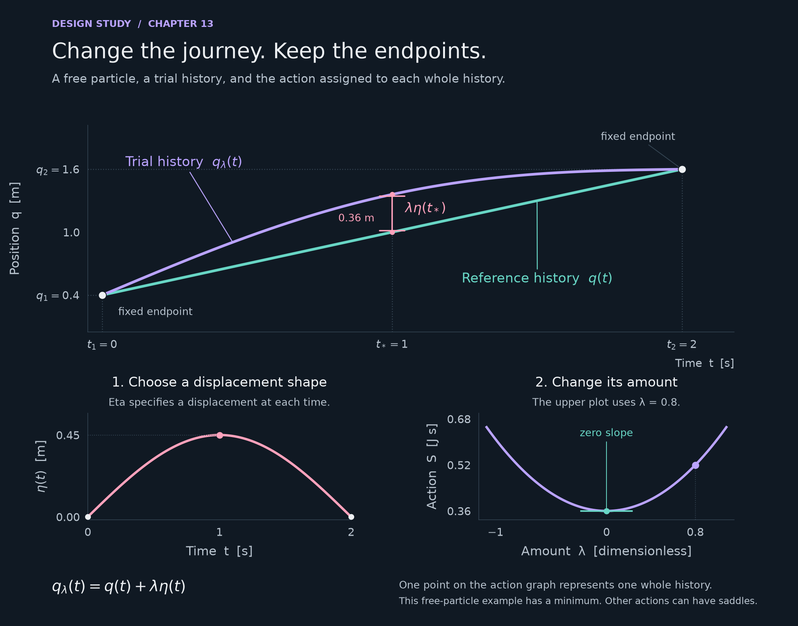

# A visual curriculum for general relativity

September 9, 2026 · Design and implementation plan · Baseline: `d637715`

**Status:** this document records an audit and proposes the next development program. The experiences below are not implemented by this document. Earlier layout and rendering repairs remain useful, but they do not resolve the teaching problems described here.

An original [annotated action study](review-evidence/2026-09-09/visual-development/action-study.svg) accompanies the plan. It demonstrates the proposed labeling and linked comparisons in a static figure; it is not the finished interactive lesson.

The book needs pictures that carry the explanation. At present, many sections explain a construction in symbols, finish the calculation, and only then offer a visual. A reader who needed the picture to understand the construction has already been left behind. Adding more demonstrations at the ends of sections would preserve that problem.

The central change is to build the exposition and the visual together. Start with something the reader can observe. Give them one meaningful action and a prediction to make. Show what changes, what stays the same, and how to measure the difference. Introduce the notation as a name for something now visible. Return to the same scene for the derivation and for a harder example.

The project should have a small number of substantial, connected visual experiences, supported by carefully annotated still figures. A scene earns its place by explaining something that the surrounding prose cannot explain as well on its own.

## 1. What the current book actually does

The [placement inventory](review-evidence/2026-09-09/visual-development/placement.json) covers the default generated reading path in all 25 numbered chapters. The [audit script](../scripts/audit-visual-placement.mjs) makes the inventory reproducible. It counts displayed equation blocks before each visual, excluding equations inside the visual itself, explicitly hidden material, and closed disclosures. Legacy clock calculators are recorded separately. It is a document-order audit, not a browser visibility simulation or a measure of how difficult each equation is.

| Chapter | First visible illustration or experience | Displayed equation blocks before it | Teaching consequence |
|---|---|---:|---|
| 2 — Vectors, covectors, tensors | §2.4 | 22 | The first visual arrives after much of the component machinery. |
| 4 — Manifolds, maps, metrics | §4.1 | 7 | There are several experiences, but the polar-coordinate calculation still needs a picture of an actual polar grid. |
| 6 — Differentiating vector fields | §6.2 | 13 | The basis widget rotates arrows at one origin; it does not show a field at neighboring points. |
| 7 — Connection and parallel transport | §7.5 | 29 | There is no interactive experience. Its single default figure is largely equations arranged on a panel. |
| 8 — Curvature | §8.3 | 13 | The transport experience is useful material, but arrives after the reader needed it in Chapter 7. |
| 11 — Energy, momentum, stress | §11.1 | 7 | The only figure is a matrix of labels. Nothing actually flows through a surface. |
| 13 — Variational calculus | §13.1 | 7 | The only figure follows the variational derivation and omits essential labels. |
| 15 — Symmetry and conservation | §15.4 | 29 | A geometric subject reaches its first picture very late. |
| 16 — Observational tests | §16.4 | 20 | Existing deflection and orbit material does not show how a lens produces an image. |
| 18 — Gravitational waves | §18.4 | 27 | The detector picture should motivate the calculation much earlier. |
| 21 — Forms and Cartan geometry | §21.5 | 38 | This particularly visual subject has only one default static figure. |

These are not isolated omissions. The build currently places many illustrations at section ends. In [build-site.mjs](../scripts/build-site.mjs), the stated policy is that a picture follows the explanation of its quantities. [lesson-placement.mjs](../scripts/lesson-placement.mjs) supports section-start and section-end placement, while section illustrations generally follow the section's exposition. That was intended to avoid unexplained symbols; it also prevents a picture from helping explain those symbols.

The solution is not to move a fully symbolic widget above its prerequisites. The opening state must use ordinary language and familiar objects. Later states reveal the quantities and equations that the opening state has prepared.

### Specific defects the redesign must resolve

- **Action notation disagrees across media.** The prose uses `q`, `λ`, and `η`; the figure uses `x`, `ε`, and `η`. The curves and endpoint times are not directly labeled. There is no marked displacement between curves. The symbol is *eta*, a displacement function, rather than *theta*, an angle; the diagram gives the reader little help discovering that distinction.
- **The stress-energy figure uses different labels from the text.** Its energy-flux and momentum-density labels are transposed relative to the manuscript, and it uses `σ` where the manuscript uses `Π`. Symmetry makes the corresponding numerical entries equal in this context, but changing the indexing story between prose and figure obscures what a row or column means.
- **Several diagrams are symbolic summaries rather than geometric explanations.** The connection-cancellation panel is a clear example. Typesetting a formula inside a figure does not supply the missing mental picture.
- **Existing visual checks cannot detect a missing explanation.** [check-figures.mjs](../scripts/check-figures.mjs) checks clipping, overlaps, crossing strokes, and covered labels. A diagram can pass while omitting every endpoint label the student needs.
- **Earlier reviews are not completion evidence.** [visualization-audit.md](visualization-audit.md) already identified substantial gaps. [figure-aesthetic-review-01-20.md](figure-aesthetic-review-01-20.md) treated the action figure's uncluttered shape as a strength. This plan supersedes that verdict on teaching adequacy, while preserving the useful layout work.

This review includes manuscript and implementation inspection, the placement inventory, and rendered inspection of the action, connection-cancellation, and stress-energy figures. It does not claim an exhaustive camera-state review of every demonstration or observed learning outcomes from students.

## 2. A consistent way to teach with the visuals

Each major experience should support this sequence, with prose between the steps:

1. **Observe.** A short, annotated scene with one unfamiliar idea at most.
2. **Predict.** A concrete choice: what will move, change direction, cross a boundary, or remain equal?
3. **Try it.** One control causes one legible change. The reader can pause and inspect it.
4. **Compare.** Put the relevant alternatives in the same frame or in synchronized views.
5. **Name and calculate.** Introduce the symbols attached to the visible objects, then derive the relationship.
6. **Transfer.** Change the situation enough that repeating the last sentence is insufficient.

This is a teaching pattern, not six compulsory tabs. A reader should not need to operate a dashboard to read a chapter. The default state should already explain something, and the text should remain coherent if the reader never presses Play.

Use 2D when it makes the relationship easier to see: polar grids, field differences, action histories, and lens maps. Use 3D when depth is part of the idea: tangent planes, transport on surfaces, flux through differently oriented faces, and a camera looking through curved spacetime. A 3D view should usually have a simpler companion view in which measurements are unambiguous.

Depth should come from the same model. A beginner sees a carried arrow; a returning student sees the differential equation; an advanced reader inspects frame transformations, numerical error, and limits of the model. These should not become three contradictory accounts of the subject.

## 3. The connected geometry sequence

### Experience A — Give a point two addresses

**Placement:** introduce the polar grid before the calculation in §4.5; reuse its point and basis in §6.1. Preserve the existing manifold experience for the distinction between a surface and a chart, but avoid making the reader learn two unrelated interfaces for coordinates.

**First minute.** Show a point on a flat plane, an ordinary square grid, and a marked origin. Turn on concentric circles and radial spokes without moving the point. Draw the distance from the origin and the angular arc. The reader can now see what `r` and `θ` measure before seeing a metric.

**Construction.** Drag the point. Display both addresses, with units. A radial move and an angular move receive separate short animations. At the point, show the two directions in which those moves start. Increase the radius while making the same small angular change: the traveled arc becomes longer. Only then introduce `ds² = dr² + r² dθ²` and highlight each contribution on the actual displacement.

**Necessary comparison.** Switch between unit arrows and coordinate basis arrows. The angular coordinate vector has length `r`; the unit angular vector has length one. Label that difference explicitly. A normalized quiver must not erase the fact the lesson is trying to teach. The origin is visibly special: angle and the polar basis are undefined there, although the plane itself is perfectly regular.

**Extension.** Deform a small coordinate rectangle into its physical patch and measure area. This prepares the determinant and volume element. In Chapter 2, reuse the same changes of labels to compare vectors with covectors; covectors appear as labeled level sets whose crossings evaluate a vector.

**Evidence required:** Cartesian and polar coordinates refer to the same point; finite arc lengths approach the metric prediction; coordinate and unit basis conversions agree; no invented curvature appears when merely changing coordinates.

### Experience B — A field is an arrow at every point

**Placement:** a small field introduction with flux in Chapter 0, then a substantial experience before the product-rule derivation in §6.1.

Begin with a calm field of eastward arrows. Add sparse moving markers. Explain that the arrows show velocity *at positions*, while the markers follow the motion. Then offer expansion, rotation, and shear. These are deliberately chosen contrasts, not a large menu of decorative vector fields.

Turn on the polar grid from Experience A. The eastward arrows remain parallel in the plane, while their radial and angular components change from point to point. Select two nearby positions and show their local frames. Copy both physical arrows into a common comparison inset and subtract them. The answer is zero even though the component readouts changed.

Next display the component-change contribution and the basis-change contribution as a head-to-tail vector construction. In the uniform field they cancel. In the expanding or rotating field they do not. Vary the separation and let the reader watch a finite comparison approach a directional derivative. The symbols in the product rule now name pieces of a construction the reader can point to.

For the unit polar frame, an eastward unit vector has components `(cos θ, −sin θ)`. In the coordinate basis its angular component is `−sin θ/r`. The interface must identify which basis is active; showing these two representations without that distinction would recreate the original prerequisite problem.

For divergence, place a small box in the field and count net outward flux. Compare uniform through-flow with expansion: many particles can cross a box even when its divergence is zero. Show the polar area factors on an annular sector before introducing the coordinate divergence formula. For unsteady examples, distinguish streamlines at an instant from particle histories; initially use steady examples where that extra distinction is unnecessary.

**Advanced return:** introduce transport back to the starting tangent space, then the limit

\[
\nabla_X V=\lim_{h\to0}\frac{P_{\gamma(h)\to p}V(\gamma(h))-V(p)}{h},
\quad \gamma(0)=p,\quad\dot\gamma(0)=X.
\]

`P` must first be shown as the comparison operation, not presented as another unexplained symbol. This creates the reason to study a connection in Chapter 7.

**Evidence required:** a constant Cartesian field has zero covariant derivative in polar coordinates; radial expansion has the correct nonzero divergence; rigid rotation and simple shear have zero divergence; results converge with point separation. A beginner should be able to explain why changing components alone does not prove that the physical arrow changes.

### Experience C — Carry a direction, then close a loop

**Placement:** continuous transport opens §7.1; loop comparison opens Chapter 8. The existing staged sphere transport provides reusable mathematics, but its four discrete states are not enough for this experience.

Start on a plane. Carry an arrow along a drawn path without turning it. Bend the plane into a cylinder and show its unrolled companion view. The surface looks bent in 3D, yet its local intrinsic geometry remains flat. This is a powerful early distinction between bending in the picture and intrinsic curvature.

Move to a sphere. Keep an arrow tangent while moving its base point. Offer a slowly advancing path slider and a small view of the tangent plane. Show which part of an ambient change points out of the surface and which part lies within it. The Levi-Civita transport rule has zero tangential change; it does not keep the arrow fixed in the surrounding 3D space.

For a surface with unit normal `n`, the induced transport equation can be written `dV/ds = −(V·dn/ds)n`. Teach that construction before exposing connection coefficients. Explain later that a general connection is a choice of comparison rule, and that metric compatibility and zero torsion select the connection used in ordinary metric GR. The surface example is Riemannian; it is a bridge to, not a substitute for, Lorentzian spacetime geometry.

**The central comparison.** Start two arrows together. Carry them along different routes to the same endpoint. Put their final arrows in one tangent-plane inset. Then join the routes into a closed loop. Shade the enclosed region and show a signed return angle. Reverse the route; shrink the loop; compare plane, cylinder, and sphere. The camera must not provide the apparent rotation being measured.

Use a spherical octant bounded by great-circle arcs as an exact reference: its transport rotation has magnitude 90°. Continuous transport along each arc should be visible. On a sphere of radius `R`, connect a small loop's rotation to its physical area and Gaussian curvature `1/R²`. When changing `R`, distinguish holding physical area fixed from holding angular size fixed.

**Advanced return.** Compare the two orders of small displacements to construct `R(X,Y)V`, including orientation and sign convention. Distinguish local curvature from global holonomy on noncontractible loops. Later, use a separate example to distinguish an anholonomic frame's Lie bracket from torsion. A commutator picture must not quietly teach that all noncommuting frame directions imply torsion.

**Evidence required:** tangency and length preservation; inner-product preservation for two transported vectors; reversed transport undoes the original; exact great-circle results agree with numerical integration; plane and cylinder contractible loops return with zero intrinsic rotation; small-loop error converges. Simple projection and renormalization may be a convergent numerical method, but must not be advertised as exact finite transport.

## 4. A fluid laboratory that builds stress-energy from measurements

**Placement:** begin Chapter 11 with the moving material and a probe volume, before displaying the matrix. The user has clarified that the intended simulation is **fluid or particle flow**, not a photon-first simulation.

This experience needs two connected physical representations. They answer different questions and must be labeled accordingly.

### First representation: particles crossing a surface

Show actual modeled particles with momenta, a movable small volume, and selectable faces. Begin by measuring energy inside the volume. Then light up crossings through one face. Each crossing carries energy and momentum; briefly show its contribution before it enters a running tally. Changing the measured momentum component changes the tally, not the particle trajectory.

Build these observations in order:

1. **Bulk flow:** matter crosses the face and carries momentum along its motion.
2. **No average flow, nonzero pressure:** equal opposing particle populations have zero mean momentum but a positive normal momentum flux. This is the essential surprise.
3. **Anisotropy and shear:** compare different directional populations and an oblique flow. Sideways momentum can cross a face even though its normal points in another direction.
4. **The matrix:** select a spatial row by selecting the direction crossed; select a column by selecting the energy or momentum component carried. Assemble entries from these measurements. The time row records the corresponding densities.

Use the manuscript's convention throughout: the first index is the transport direction and the second is the quantity transported. Use `Π` for spatial momentum flux. Labels must distinguish pressure as momentum flux from the opposite sign of compressive mechanical Cauchy stress.

The initial microscopic kernel can use collisionless particles with prepared distributions and periodic boundaries. That is a transparent kinetic model, not a claim to simulate collisions, viscosity, or equilibration. For a local inertial volume `V`, its instantaneous particle estimate is

\[
T^{\mu\nu}=\frac{c}{V}\sum_a\frac{p_a^\mu p_a^\nu}{p_a^0},
\qquad p_a^0=E_a/c.
\]

Thus `T⁰⁰ = ΣE/V` and `Tⁱʲ = Σvᵢpⱼ/V`. Compare the instantaneous estimate with a signed crossing estimate over a stated area and time window. Finite particle counts produce fluctuations; the interface should show averaging time and particle count rather than silently smoothing the disagreement away. The tally and the picture must come from the same particles.

### Second representation: flowing fluid, pressure, and shear

Show a fluid layer between moving plates, with velocity arrows, sparse dye markers, and a stress probe. Use an exact laminar Couette-flow model first. The linear velocity profile makes shear measurable; a linked traction diagram shows neighboring layers exchanging tangential momentum. Then use an exact pressure-driven channel profile to show a pressure gradient balanced by viscosity.

These continuum scenes are a second deliverable within the fluid experience, not a cosmetic overlay on collisionless particles. Dye markers trace bulk flow; they are not molecules. Stress comes from the stated continuum model. In the nonrelativistic limit, distinguish advective momentum flux `ρvᵢvⱼ`, pressure `pδᵢⱼ`, and the viscous contribution `−τᵢⱼ`. Define the stress convention before displaying signs.

An editable obstacle flow would be a further development using a validated finite-volume fluid solver. It should not be required to explain the tensor, and a visually attractive solver is not sufficient evidence that its stress measurements are correct. Its boundary conditions, pressure reference, discretization, and conservation error would need inspection controls.

### Relativistic return

After the physical entries are familiar, change the observer and compare tensor components. Transform an analytically specified homogeneous tensor with the Lorentz transformation. Do not obtain a boosted density by changing particle velocities while keeping the same box and simultaneity slice; that would omit precisely the relativistic issue the chapter must explain.

Connect dust and the perfect fluid to the observed patterns. Later extensions can show kinetic moments, the fluid rest frame, anisotropic stress, and energy conditions. An isotropic photon gas is a useful optional extension, with three-dimensional directions required for `p = ε/3`; it is not the primary scene requested here.

**Evidence required:** energy and momentum balance in the particle model, the zero-flow/nonzero-pressure example, tensor symmetry under the chosen assumptions, units for every tally, agreement of long-time crossing and ensemble estimates, Couette and channel-flow analytic solutions, and the correct boosted perfect-fluid energy density. A learner should be able to point to one off-diagonal entry and describe an experiment that measures it.

## 5. Stationary action as a comparison of whole histories

**Placement:** a short fixed-endpoint history comparison supports Chapter 5; the complete experience opens §13.1, before differentiating the action. Chapter 14 reuses the boundary view.

This study shows one selected state of the first example below. The [generator](../scripts/visual-studies/action-study.py) checks fixed endpoints and compares numerical action integration with the analytic result for five positive, zero, and negative variation amounts. Its exported image was inspected and revised to clear labels from plotted curves. Responsive interactive layouts, the action-density view, and the saddle example remain proposed work.

Use **`q`, `λ`, and `η` consistently**, preserving the manuscript's existing convention. Introduce `η` aloud and in text as “eta: the shape of the proposed displacement.” Explain that `λ` controls its amount. The current figure's `ε` disappears when that notation is reconciled. No angle is involved in this construction.

The central plot needs direct labels for:

- Time `t`, position `q`, and their units.
- Endpoint times `t₁`, `t₂`, their axis projections, and fixed positions `q₁`, `q₂`.
- Reference history `q(t)` and trial history `qλ(t)` on the curves themselves.
- A selected time `t*` and the actual vertical displacement `λη(t*)` between the curves.
- The displacement profile `η(t)` in a linked inset, including its zero endpoint values.
- The dimensionless amount `λ` on its control, separate from the time cursor.

Do not require hover to reveal these labels. Moving `λ` changes a candidate history; advancing the time cursor samples that history. These are different actions and should have visibly different controls. All candidate histories connect the same endpoint data, but most do not obey the equation of motion.

### First example: a free particle

Take `m = 1 kg`, `t₁ = 0 s`, `t₂ = 2 s`, `q₁ = 0.4 m`, `q₂ = 1.6 m`, and a displacement profile `η(t) = 0.45 m sin(πt/2 s)`. The straight reference history is `q(t) = 0.4 m + (0.6 m/s)t`.

The linked views show the history, its velocity, the action density `L = m q̇²/2`, and the resulting number `S`. With duration `T` and profile amplitude `A`,

\[
S[q_\lambda]=S[q]+\frac{mA^2\pi^2}{4T}\lambda^2,
\qquad S[q]=0.36\ \mathrm{J\,s}.
\]

For these values the quadratic coefficient is approximately `0.24982 J s`. The reader can compare small positive and negative changes: the first-order slope vanishes at the reference history. Here the action is a minimum; that conclusion is tied to this model and its fixed endpoint conditions.

### Second example: stationary does not always mean minimum

Use a harmonic oscillator with reference history `q = 0`, fixed zero endpoints, and two allowed sine profiles. For dimensionless amplitudes `a,b`,

\[
q_{a,b}=A[a\sin(\pi t/T)+b\sin(2\pi t/T)],
\]
\[
S[q_{a,b}]=\frac{mA^2T}{4}
\left[\left(\frac{\pi^2}{T^2}-\omega^2\right)a^2+
\left(\frac{4\pi^2}{T^2}-\omega^2\right)b^2\right].
\]

Choosing `ω = 1 s⁻¹` and `T = 4 s` makes one coefficient negative and the other positive. Show the two one-dimensional cuts before revealing a saddle surface. Label that surface carefully: each point represents an entire candidate history; its height is action, not physical elevation or potential energy.

A single variation slider cannot establish stationarity against every possible variation. After these examples, let the reader move a localized bump along a trial history. Link the action response to the Euler–Lagrange residual. That construction prepares the fundamental lemma rather than simply announcing it.

**Evidence required:** direct curve and endpoint labels survive all supported sizes; the finite variation displacement matches the bracket; numerical action integration matches analytic values and converges; the two oscillator directions have opposite second variations; endpoint positions remain fixed even when endpoint slopes change. The learner should distinguish a displacement function, its amplitude, a time sample, and a whole history.

## 6. Light as both a path and an image

### Experience F — Build a gravitational lens

**Placement:** a qualitative source–lens–observer encounter introduces the optical question early in Chapter 16; the quantitative view develops in §16.4.

Show a source, a mass, and an observer in a labeled geometric view. Beside it, show the observer's sky. Move an extended source across alignment and let the reader see multiple images, arcs, and a ring emerge. Select an image point to highlight the corresponding ray and source point. A bent line alone cannot teach image formation.

Begin with a point-mass thin lens in the weak-field regime. Show the source angle, image angle, impact parameter, lens distance, source distance, and deflection where they are defined. The angular lens equation and the physical bend angle are different quantities; the diagram must not use one label for both.

In the aligned one-dimensional angular form, `β = θ − θE²/θ`. A later two-dimensional source map makes extended images possible. Explain the approximations before applying the model. The ray construction, image positions, magnification, and time-delay comparisons must share the same model. Avoid a pre-drawn decorative 3D curve next to independently calculated image positions.

**Evidence required:** zero mass gives no deflection; image positions satisfy the lens equation; alignment has the correct Einstein radius; far from the lens the deflection approaches `4GM/(bc²)`; numerical image mapping preserves surface brightness under the stated optical assumptions. Finite source size and sampling must keep the alignment view meaningful.

### Experience G — An observer near a black hole

**Placement:** Chapter 17, after identifying the Schwarzschild model and before asking the reader to interpret an embedding picture as an account of light.

Provide two tightly linked views: a schematic spatial view of selected null rays and the actual rendered sky of a specified observer. Selecting a sky pixel reveals its ray. The reader discovers escape, capture, strong bending, and repeated near-orbits by following a ray that contributes to the image.

In the schematic, distinguish the horizon at `r = 2GM/c²`, photon sphere at `3GM/c²`, and Schwarzschild ISCO at `6GM/c²`. The distant critical impact parameter is `3√3 GM/c²`; the apparent shadow is not a photograph of a sphere of radius `2GM/c²`. For a nearby observer its angular size also depends on position and motion.

Start with a nonrotating black hole and a supported static observer outside the horizon. Clearly identify that observer. Horizon crossing belongs to a later freely falling observer model, with regular coordinates and the corresponding local frame. A coordinate singularity must not masquerade as light freezing or a rendering failure.

An accretion disk can make the optical geometry striking, but it adds emission and frequency-shift assumptions. Offer a simple labeled background grid first so the lens mapping is inspectable. Add the disk only with a stated model. The spatial embedding diagram remains useful for its own purpose; light rays should not be drawn as if they were rolling down that surface.

Use a double-precision CPU geodesic integrator as an independently checked reference for selected rays. Investigate a GPU lookup or beam-tracing renderer for the sky. [Eric Bruneton's implementation](https://ebruneton.github.io/black_hole_shader/) is a particularly relevant technical reference: it is a real-time Schwarzschild renderer, not a Kerr implementation. Evaluate numerical accuracy, data size, device support, and licensing before adopting code or data.

**Evidence required:** null-constraint error, critical capture behavior, weak-deflection agreement, selected CPU/GPU ray comparisons, explicit observer-frame transformation, and convergence near demanding rays. Frequency and intensity transformations require their own checks if shown. Rotating black holes are a separate advanced milestone; changing a disk's rotation does not implement Kerr spacetime.

## 7. Coverage across the rest of the book

This is a coverage map, not a quota of new widgets. Reuse an experience when returning to the same physical construction. A well-placed static sequence can be better than an unnecessary simulation.

| Chapter | Visual explanation to establish early | Later comparison or extension |
|---|---|---|
| 0 | Zoom into local linear prediction; arrows and a flux box | Finite-step error and a genuine source versus through-flow |
| 1 | Falling observer, scale reading, nearby falling bodies | Local weightlessness versus tidal separation |
| 2 | Arrows, covector level sets, deformation of a small parallelogram | Basis/dual-basis changes with an unchanged contraction |
| 3 | Events, clocks, light signals, and a common meeting | Linked observer coordinates and invariant elapsed time |
| 4 | Cartesian/polar grids and a measured small displacement | Chart overlap, tangent plane, area element, coordinate singularity |
| 5 | Carry a tangent forward to build a geodesic | Path versus parameter; accelerated coordinates |
| 6 | A vector field at neighboring points | Component change versus basis change; net flux |
| 7 | Plane, cylinder, sphere transport | The comparison rule and its coefficients |
| 8 | Two routes and a closed loop | Area scaling, orientation, curvature operator |
| 9 | A small transported/accelerated family, with shared scales | Trace and shape change; Ricci and Weyl roles under stated conditions |
| 10 | Nearby freely falling particles | Tidal eigenvectors and measured relative acceleration |
| 11 | Particles and fluid crossing selected faces | Density, pressure, shear, and changing observer |
| 12 | Relate matter measurements to curvature measurements | Explain contractions and trace reversal with concrete examples, not a tensor-name poster |
| 13 | Fixed-endpoint trial histories | Action slope, localized variations, and saddle behavior |
| 14 | Boundary value held fixed while boundary slope changes | Why integrations by parts create boundary terms; metric/volume variation |
| 15 | Move a small measuring experiment along a symmetry flow | Conserved Killing energy versus locally measured energy |
| 16 | Source, lens, observer, and sky image | Weak deflection, image formation, clock and orbit measurements |
| 17 | Observer's sky linked to selected null rays | Horizons, photon sphere, optical appearance, then Kerr |
| 18 | A detector with light exchanged along its arms | Polarizations and measured light travel times before gauge machinery |
| 19 | Galaxies, comoving markers, and traveling light | Recenter the view; compare proper/comoving distance and redshift |
| 20 | A foliation, local clocks, and spatial labels | Lapse/shift versus physical change; constraints with a specified toy model |
| 21 | Covector level sets, oriented area, and cancellation of interior edges | Wedge product, exterior derivative, Stokes, coframes, connection forms |
| 22 | A bundle of future-directed light rays with area marks | Expansion, caustics, and the two null expansions of a trapped surface |
| 23 | Resolve a field at different scales | Effective operators and validity limits; label quantum model assumptions |
| 24 | A guided investigation using the existing measurement tools | Reproducible calculations with assumptions and error checks |

Appendices and symbol help should link back to the precise construction that introduced a quantity. Advanced notation should open a useful explanation, not merely expand an acronym or display an equivalent formula.

## 8. Art direction and annotation requirements

The common style should be quiet enough for a student to follow a changing quantity: clear silhouettes, restrained depth cues, sparse grids, readable mathematical labels, and one emphasized relationship at a time. Beauty comes from the visible structure of the idea as much as from materials or lighting.

Every scene needs an annotation specification. For each teaching state, record the required entities, what each label means, its units, its geometric anchor, and its fallback when the anchor is occluded. Test the *presence* of required labels as well as their layout.

Examples of non-negotiable annotations:

| Scene | Required anchors |
|---|---|
| Polar grid | Origin, selected point, radius segment, angle arc, radial/angular directions |
| Field comparison | Both sample positions, frames, transport/comparison direction, subtraction result |
| Transport | Start, endpoint, path direction, current tangent plane, original and returned arrows |
| Fluid | Probe volume, selected face normal, transported component, area/time window, units |
| Action | Both endpoint times and positions, both curve names, displacement bracket, profile and amplitude |
| Lensing | Source, lens, observer, impact parameter, distinct bend and sky angles, linked image point |
| Black hole | Observer and model, horizon/photon-sphere distinction, ray direction, coordinate versus measured quantities |

Labels should sit beside the thing they name, with short leaders where necessary. Essential measurements get a stable 2D inset if a 3D orbit can hide them. Use restrained label-layout hysteresis so small camera motions do not make labels jump. Do not shrink an entire diagram until its text becomes unreadable; simplify and stack views on a phone.

Use color plus shape, line style, or direct naming. Reserve dashes for a defined meaning, such as genuinely hidden geometry or a comparison state. A fixed dashed half-circle is not an acceptable substitute for visibility calculations. Camera motion must not continuously refit a scene to its projected bounds. Closely coincident surface layers must not fight for depth.

Disclosures, legends, attribution, and model notes deserve the same spacing review as the main canvas. They are part of the experience, including their expanded bottom edges. Collapsed navigation must work with pointer travel, touch, and keyboard focus; transient hover alone cannot carry navigation or essential explanation.

## 9. Implementation structure and AI integration

Extend the existing code and lifecycle conventions rather than introducing a second application framework. Share models and interaction patterns where the physics is shared; preserve meaningful static fallbacks and current stable chapter anchors.

Each experience should expose:

- **A deterministic model:** state, units, parameters, equations, domain limits, numerical method, and derived measurements.
- **A teaching sequence:** named steps, prerequisite concepts, initial states, predictions, and reveal order.
- **Semantic scene objects:** selected point, vector, face, ray, path, or endpoint with a stable identity.
- **A renderer:** 2D/3D views, accessible controls, required annotations, static fallback, and lifecycle management.
- **A reproducible state record:** model version, parameter values, seed when needed, camera, selected object, and teaching step.

Replace the blanket section-end insertion policy with explicit editorial anchors for observation, construction, comparison, and derivation. Place the actual prose around those anchors. Moving an element earlier is not sufficient if its opening state still assumes all the later notation.

The AI should operate on that semantic state. If a learner selects a flux face, the tutor receives its normal, the chosen momentum component, the crossing measurements, and the active physical model. It can point to the relevant crossings, ask for a prediction, or change one parameter through a validated command. It should not infer the physics from an image of the canvas or invent values that the simulation does not produce.

Useful AI interactions include:

- “Show which part of my reasoning fails” by returning to the learner's exact comparison state.
- A sequence of hints that begins with the visible construction and reveals algebra only when needed.
- A counterexample generated within the model, such as pressure with zero average flow.
- A saved explanation linked to a replayable state, including the model's assumptions.

State-changing tutor actions need validation and Undo. The tutor must distinguish measured simulation output, analytic calculation, and conceptual explanation. Core reading and demonstrations remain usable without an AI account or network response. Tutor evaluation needs real model sessions with misconception cases; mocked responses and successful API calls do not establish teaching accuracy.

## 10. Release gates: what “finished” must mean

Each substantial experience ships with the surrounding manuscript rewrite. It is not complete when its canvas looks impressive in one screenshot.

1. **Teaching review:** every first-use symbol has an introduction; the intended comparison is visible; controls serve the stated learning question; the static reading path makes sense.
2. **Physics review:** documented assumptions and conventions, analytic reference cases, independent numerical checks where appropriate, and demonstrated convergence for numerical methods. A test that repeats the implementation's formula is insufficient evidence.
3. **Annotation review:** required semantic labels exist in each relevant state; no ambiguity about units, endpoints, frames, or what an axis means.
4. **Interaction review:** drag, keyboard, touch, pause, reset, re-entry, full supported camera motion, extreme control values, and disclosure spacing. No essential operation depends on hover.
5. **Display review:** phone, tablet, desktop, both themes, device pixel ratios 1 and 2, browser zoom, reduced motion, and context-loss/fallback behavior. Preserve readable labels and stable framing.
6. **Performance review:** measure startup and interaction latency on named devices. Provisional targets are a response within 100 ms for direct controls, smooth 60 fps on a representative desktop, and at least 30 fps for the active mobile scene. These are targets to test, not achieved claims. Defer expensive rendering and stop offscreen animation.
7. **Learning review:** have calculus-level readers predict an outcome, explain a visual correspondence, and solve a related unfamiliar case. Have a GR reviewer inspect the advanced interpretation. A small formative group can expose failures; it cannot justify broad claims of proven learning effectiveness.

For the first geometry sequence, useful transfer questions are: why do the components change in a constant field; why can a cylinder look bent without the loop effect seen on a sphere; what is being compared in a covariant derivative? For the fluid lab: how can pressure be nonzero with no average flow? For action: why does one flat action slope not test every possible variation?

The existing automated checks stay in place. New checks should target these failure modes, especially missing labels and inconsistent representations, rather than inflating a test count with implementation mirrors.

## 11. Order of work and reviewable increments

**Milestone 0 — Correct the visual contract.** Reconcile action and stress-energy notation; specify required labels; produce annotated storyboards; introduce editorial placement anchors. Repair defects where necessary, but do not call this the visual redevelopment.

**Milestone 1 — Complete one connected geometry journey.** Build the polar grid, field comparison, continuous transport, and loop comparison as one coherent sequence across Chapters 4, 6, 7, and 8. Revisit Chapters 0 and 2 only where their introductions are prerequisites. This is the best first substantial investment because later chapters rely on all of these ideas.

Deliver separate, traceable commits for the polar construction and prose; field model and comparison; transport model and prose; loop comparison; and integrated annotation/accessibility review. Push each verified increment, as requested. A model-only commit can be useful engineering progress, but the milestone is not complete until the reading experience works.

**Milestone 2 — Complete matter and action.** Build the particle crossing and continuum fluid scenes with their shared measurement language. Rebuild the action exposition and linked histories, including the stationary saddle example. These are independent teaching sequences and should receive independent physics and learning reviews.

**Milestone 3 — Complete observational optics.** Build the weak-lens geometry and image map first. Then prototype the Schwarzschild reference solver and sky renderer, validate their correspondence, and integrate the black-hole experience. Treat source-code adoption as a deliberate technical decision. Kerr follows only after the Schwarzschild milestone is sound.

**Milestone 4 — Finish the visual reading path.** Apply the coverage map to the remaining chapters, prioritizing Chapters 15, 18, and 21 because their first pictures arrive particularly late. Reuse established constructions and add original figures where interaction would not improve the explanation.

**Milestone 5 — Integrate and evaluate the tutor.** The model/state interface begins with Milestone 1; the deeper AI interactions ship only after the relevant deterministic models and teaching sequences are stable. Run adversarial misconception sessions and novice walkthroughs, then revise the experience based on observed failures.

Do not attach a confident completion date before the geometry and optical prototypes establish their scope. Track completed teaching experiences and unresolved review findings. Another long inventory should not be mistaken for progress on the reader's experience.

## 12. References and how to use them

These references inform distinct design decisions. Study their explanations and implement original course-specific work. A public demonstration is not automatically permission to copy its code, textures, or illustrations.

| Reference | What it contributes to this plan | Limits and adoption decision |
|---|---|---|
| [Feynman Lectures, II.19](https://www.feynmanlectures.caltech.edu/II_19.html) | Candidate paths, the displacement function, and the transition from finite comparisons to local variations | Use the sequence as a teaching reference; make original diagrams with the book's notation. |
| [Bartosz Ciechanowski, Airfoil](https://ciechanow.ski/airfoil/) | Coordinated flow views: arrows, moving markers, histories, and microscopic versus bulk motion | Particularly relevant to the clarified fluid request. Code and assets require their own license review before reuse. |
| [3Blue1Brown, Divergence and curl](https://www.3blue1brown.com/lessons/divergence-and-curl/) | A reference lesson centered on seeing vector fields and local flow | The lesson page was located; this audit does not claim a frame-by-frame review of its video. |
| [Keenan Crane, Discrete Differential Geometry](https://www.cs.cmu.edu/~kmcrane/Projects/DDG/paper.pdf), §8.3 | Tangent-vector comparison, transport, and holonomy, including discrete constructions | Surface geometry supports the intuition; explicitly bridge to Lorentzian geometry. |
| [Geometry Collective, geometry-processing-js](https://geometrycollective.github.io/geometry-processing-js/) | A candidate reference for advanced discrete geometry algorithms and browser implementation | Its project describes an MIT license. Check the exact adopted files and dependencies; do not import an entire legacy stack for analytic plane/sphere scenes. |
| [Eric Bruneton, black-hole shader](https://ebruneton.github.io/black_hole_shader/) and [source](https://github.com/ebruneton/black_hole_shader) | A serious real-time Schwarzschild rendering reference with precomputed beam tracing | The repository declares BSD-3-Clause. Check assets and dependencies separately; validate adopted calculations against the reference solver. |
| [Kraus and Zahn, Space Time Travel](https://www.spacetimetravel.org/) and [light-deflection teaching sequence](https://www.spacetimetravel.org/geod22) | Geometric constructions and observation-centered relativity teaching | Useful for the distinction between paths, models, and observed images. Do not equate spatial embedding geodesics with spacetime null rays. |
| [Penrose, The Road to Reality — publisher description](https://www.penguin.co.uk/books/357292/the-road-to-reality-by-penrose-roger/9780099440680) | The user's reference for sustained diagrammatic mathematical exposition | The publisher confirms the illustrated character of the book. Its full contents were not supplied or reviewed here; do not claim a page-by-page comparison or reproduce its drawings. |

The standard to carry forward is concrete: a student should be able to point to the thing a symbol describes, change it deliberately, and predict what happens next. The advanced derivation should deepen that experience rather than be the price of admission to it.
